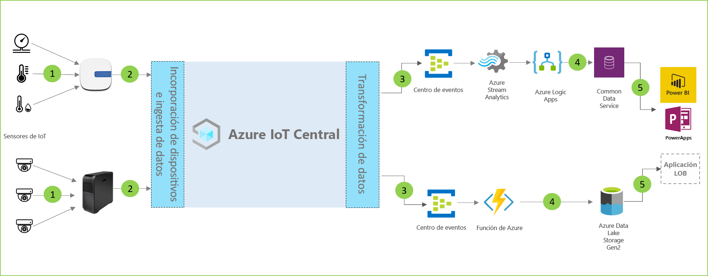

# Arquitectura de análisis en tienda

Las soluciones de análisis en tienda permiten supervisar diversas condiciones dentro del entorno de comercio minorista. Estas soluciones se pueden compilar mediante una de las plantillas de aplicación de IoT Central y la arquitectura siguiente como guía.

- Conjunto de sensores de IoT que envían datos de telemetría a un dispositivo de puerta de enlace
- Dispositivos de puerta de enlace que envían telemetría y conclusiones agregadas a IoT Central
- Exportación continua de datos al servicio de Azure que se quiera para su manipulación
- Los datos se pueden estructurar en el formato que se quiera y enviarse a un servicio de almacenamiento
- Las aplicaciones empresariales pueden consultar datos y generar conclusiones que impulsen las operaciones comerciales
 
Echemos un vistazo a los componentes clave que generalmente desempeñan un papel en una solución de análisis en tienda.

## Sensores de supervisión del estado

Una solución de IoT comienza con un conjunto de sensores que capturan señales significativas desde dentro de un entorno de comercio minorista. Se refleja en diferentes tipos de sensores en el extremo izquierdo del diagrama de arquitectura anterior.

## Dispositivos de puerta de enlace

Muchos sensores de IoT pueden alimentar señales sin procesar directamente en la nube o en un dispositivo de puerta de enlace situado cerca de ellas. El dispositivo de puerta de enlace realiza la agregación de datos en el perímetro antes de enviar conclusiones de resumen a una aplicación de IoT Central. Los dispositivos de puerta de enlace también son responsables de la retransmisión de operaciones de comando y control a los dispositivos de sensor cuando proceda. 

## Aplicación de IoT Central

La aplicación de Azure IoT Central ingiere datos de distintos tipos sensores de IoT, así como dispositivos de puerta de enlace, en el entorno de comercio minorista y genera un conjunto de conclusiones significativas.

Azure IoT Central también ofrece una experiencia personalizada para el operador de tienda que le permite supervisar y administrar de forma remota los dispositivos de infraestructura.

## Transformación de datos
Puede configurarse la aplicación de Azure IoT Central dentro de una solución para exportar conclusiones sin procesar o agregadas a un conjunto de servicios de plataforma como servicio (PaaS) de Azure que pueden realizar manipulación de datos y enriquecer estas conclusiones antes de colocarlas en una aplicación empresarial. 

## Aplicación empresarial
Los datos de IoT se pueden usar para potenciar diferentes tipos de aplicaciones empresariales implementadas en un entorno minorista. El administrador o un miembro del personal de la tienda minorista pueden usar estas aplicaciones para visualizar información empresariales y tomar medidas significativas en tiempo real. Para obtener información sobre cómo crear un panel de Power BI en tiempo real para el equipo comercial, consulte el [tutorial](./tutorial-in-store-analytics-create-app-pnp.md).

## Pasos siguientes
* Empiece a trabajar con las plantillas de aplicación [Análisis en tienda: finalización de la compra](https://aka.ms/checkouttemplate) y [Análisis en tienda: supervisión de condiciones](https://aka.ms/conditiontemplate). 
* Eche un vistazo al [tutorial completo](https://aka.ms/storeanalytics-tutorial) que le guía en la compilación de una solución que usa una de las plantillas de la aplicación In-Store Analytics.
