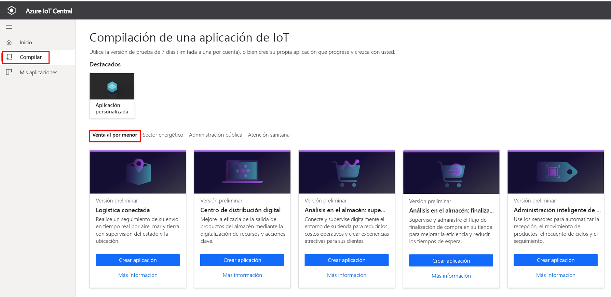
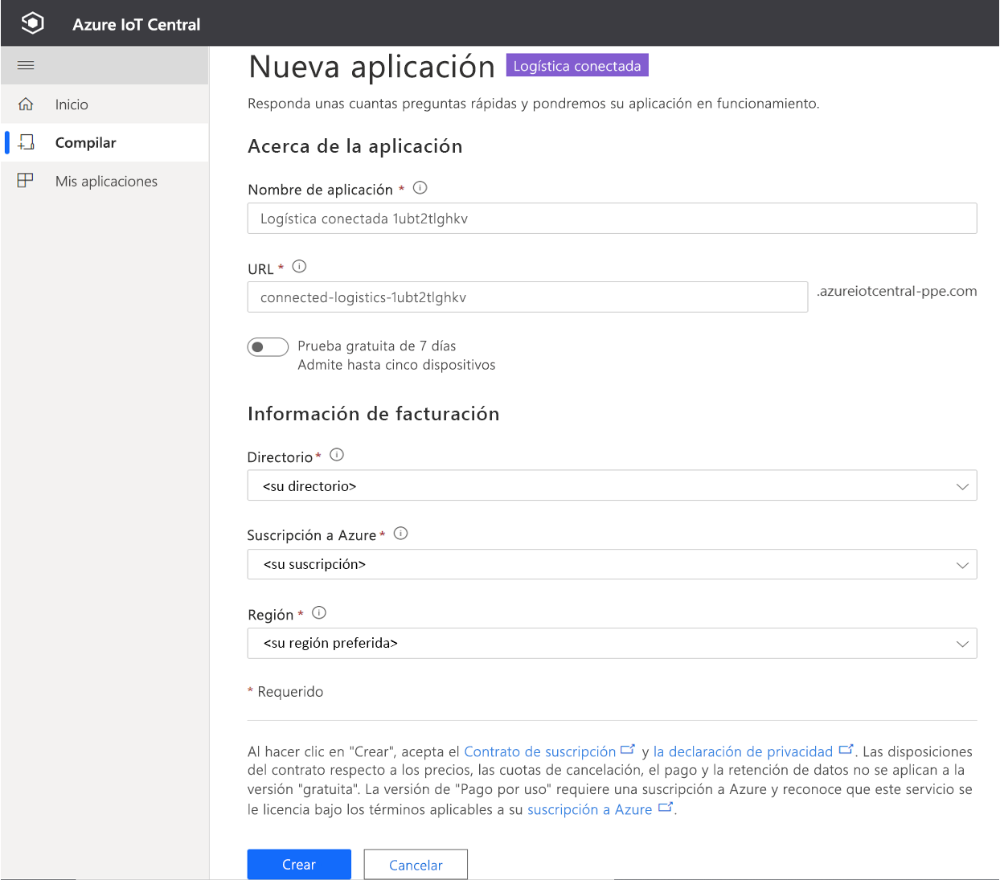
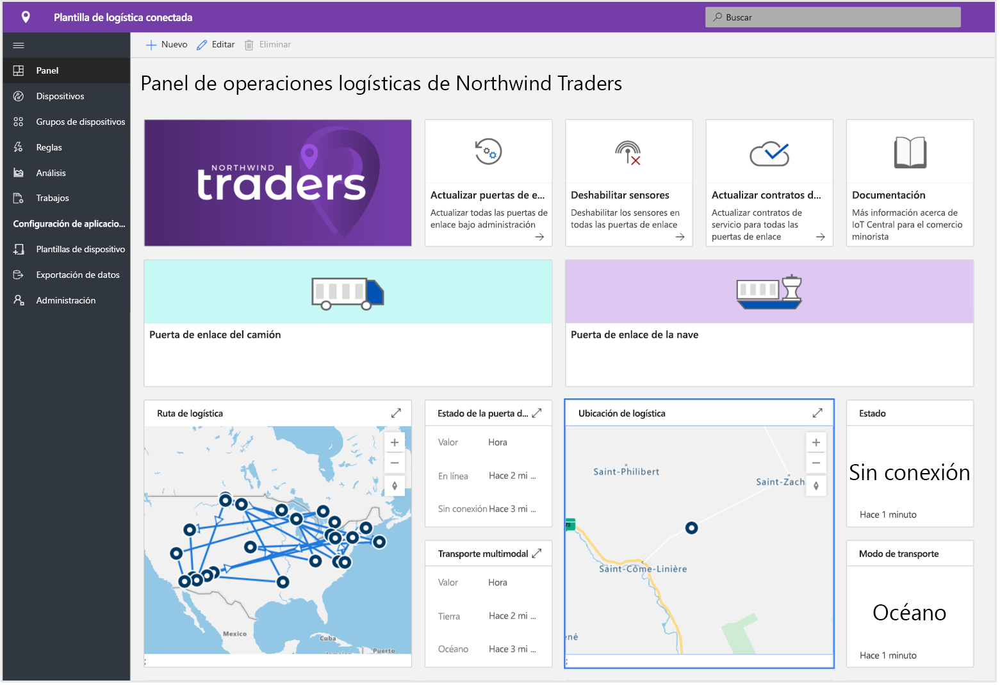
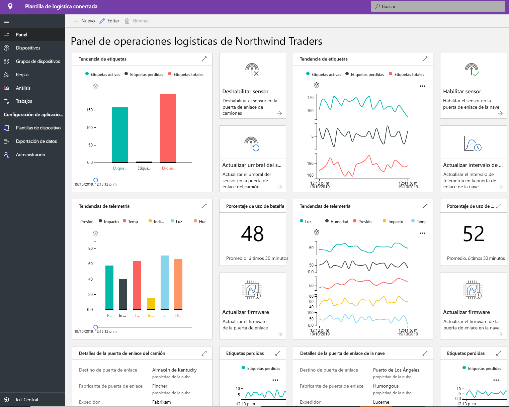
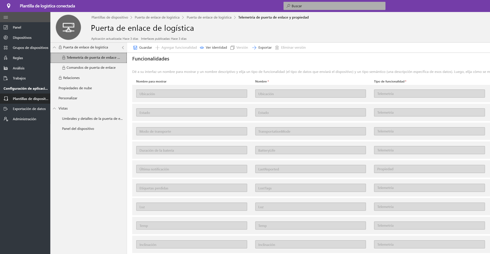
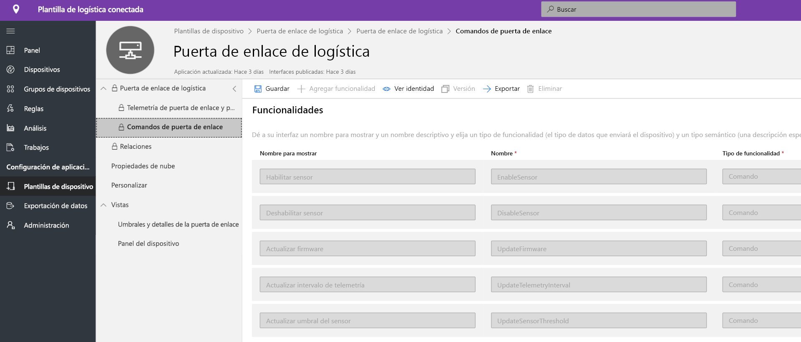
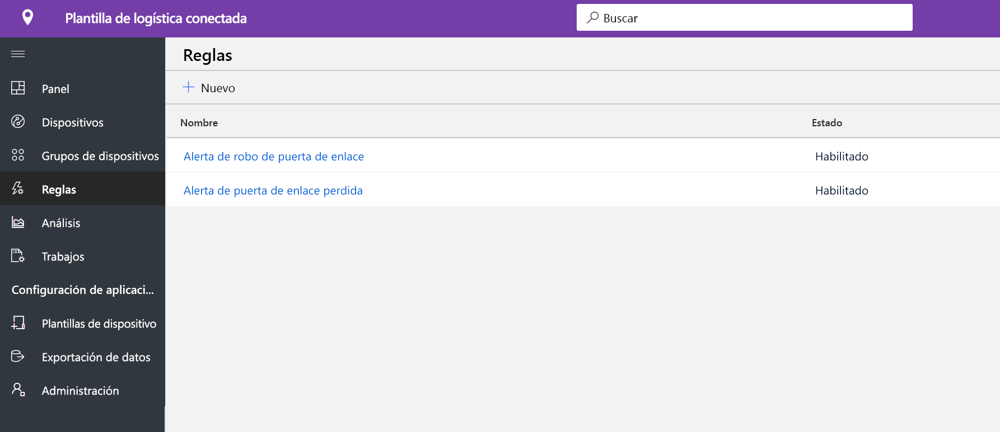
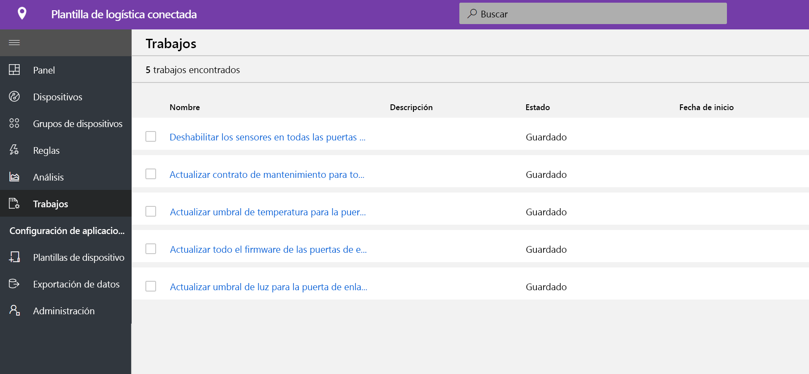
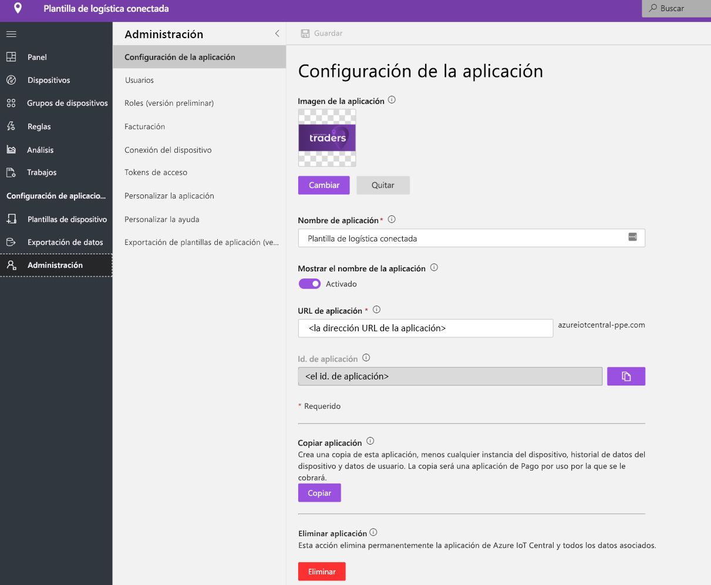

# Tutorial: implementación y recorrido por la plantilla de aplicación de logística conectada

En este tutorial se muestra cómo implementar una plantilla de aplicación de **Connected Logistics** de IoT Central. Aprenderá cómo implementar la plantilla, qué elementos se incluyen de fábrica y qué podría hacer a continuación.

En este tutorial, aprenderá a:

* Creación de una aplicación de logística conectada.
* Recorrido por la aplicación. 

## Prerequisites

* No se necesitan requisitos previos específicos para implementar esta aplicación.
* Se recomienda tener una suscripción de Azure, aunque puede probar las opciones sin ella.

## Creación de una plantilla de aplicación de logística conectada

Puede crear una aplicación mediante los pasos siguientes.

1. Vaya al sitio web del administrador de aplicaciones de Azure IoT Central. Seleccione **Crear** en la barra de navegación de la izquierda y, a continuación, haga clic en la pestaña **Venta al por menor**.

    > [!div class="mx-imgBorder"]
    > 

2. Seleccione **Create app** (crear aplicación) en **Connected Logistics Application**.

3. **Crear aplicación** abrirá el formulario de Nueva aplicación y rellenará los detalles solicitados como se muestra a continuación.
   * **Nombre de la aplicación**: puede usar el nombre sugerido predeterminado o escribir el nombre descriptivo de la aplicación.
   * **URL**: puede usar la dirección URL predeterminada sugerida o escribir una dirección URL única, descriptiva y fácil de recordar. Después, se recomienda la configuración predeterminada si ya tiene una suscripción a Azure. Puede empezar con un plan de precios de evaluación gratuita de siete días y elegir convertirlo a un plan de precios estándar en cualquier momento antes de que expire la evaluación gratuita.
   * **Información de facturación**: Los detalles del directorio, la suscripción a Azure y la región son necesarios para aprovisionar los recursos.
   * **Crear**: Seleccione Crear en la parte inferior de la página para implementar la aplicación.

    > [!div class="mx-imgBorder"]
    > 

    > [!div class="mx-imgBorder"]
    > 

## Recorrido por la aplicación. 

## Panel

Después de implementar correctamente la plantilla de la aplicación, el panel predeterminado es un portal centrado en el operador de logísticas conectadas. Northwind Traders es un proveedor de logística ficticio que administra la flota de carga en el mar y en la tierra. En este panel, se mostrarán dos puertas de enlace diferentes que proporcionan datos de telemetría sobre los envíos junto con comandos, trabajos y acciones asociadas que puede realizar. Este panel está preconfigurado para mostrar la actividad crítica de las operaciones de dispositivo de logística.
El panel se divide lógicamente entre dos operaciones diferentes de administración de dispositivos de la puerta de enlace. 
   * La ruta de logística para el envío por camión y los datos de ubicación del envío por el mar son elementos esenciales para todo el transporte multimodal
   * Visualización del estado de la puerta de enlace e información pertinente. 

> [!div class="mx-imgBorder"]
> 

   * Puede supervisar fácilmente el número total de puertas de enlace, así como las etiquetas activas y desconocidas.
   * Puede realizar operaciones de administración de dispositivos, como actualizar el firmware, deshabilitar el sensor, habilitar el sensor, actualizar el umbral del sensor, actualizar los intervalos de telemetría y actualizar los contratos del servicio de dispositivo.
   * Visualización del consumo de batería del dispositivo

> [!div class="mx-imgBorder"]
> 

## Plantilla de dispositivo

Haga clic en la pestaña Plantillas de dispositivo y verá el modelo de funcionalidad de la puerta de enlace. Un modelo de funcionalidad está estructurado en torno a dos interfaces diferentes **Telemetría y propiedad de puerta de enlace** y **Comandos de puerta de enlace**.

**Telemetría y propiedades de puerta de enlace**: esta interfaz representa toda la telemetría relacionada con los sensores, la ubicación y la información del dispositivo, así como las funcionalidades de las propiedades del dispositivo gemelo, tales como los umbrales de sensor y los intervalos de actualización.

> [!div class="mx-imgBorder"]
> 

**Comandos de puerta de enlace**: esta interfaz organiza todas las funciones de comando de la puerta de enlace.

> [!div class="mx-imgBorder"]
> 

## Reglas
Seleccione la pestaña Reglas para ver dos reglas diferentes que existen en esta plantilla de aplicación. Estas reglas se configuran para enviar notificaciones por correo electrónico a los operadores para realizar más investigaciones.
 
**Alerta de robo de puerta de enlace**: Esta regla se desencadena cuando los sensores detectan luz de forma inesperada durante el recorrido. Los operadores deben recibir una notificación lo más pronto posible para investigar posibles robos.
 
**Puerta de enlace sin respuesta**: Esta regla se desencadenará si la puerta de enlace no se comunica con la nube durante un período prolongado. La puerta de enlace podría no responder porque está en modo de batería baja, ha perdido la conectividad o debido al estado del dispositivo.

> [!div class="mx-imgBorder"]
> 

## Trabajos
Seleccione la pestaña Trabajos para ver cinco trabajos diferentes que existen como parte de esta plantilla de aplicación:

> [!div class="mx-imgBorder"]
> 

Puede usar la característica de trabajos para realizar operaciones en toda la solución. Aquí los trabajos usan los comandos de dispositivo y la funcionalidad de gemelos para realizar tareas como la deshabilitación de sensores específicos en todas las puertas de enlace o la modificación del umbral del sensor según el modo y la ruta de envío. 
   * Se trata de una operación estándar para deshabilitar los sensores de choques durante los envíos por mar a fin de ahorrar batería o reducir el umbral de temperatura durante el transporte de la cadena de frío. 
 
   * Los trabajos le permiten realizar operaciones en todo el sistema, como actualizar el firmware en las puertas de enlace o actualizar el contrato de servicio para mantenerse al día en las actividades de mantenimiento.

## Limpieza de recursos
Si no va a seguir usando esta aplicación, elimine la plantilla de la aplicación. Para ello, vaya a **Administración** > **Configuración de la aplicación** y haga clic en **Eliminar**.

> [!div class="mx-imgBorder"]
> 

## Pasos siguientes
* Más información sobre el [concepto de logística conectada](./architecture-connected-logistics-pnp.md).
* Más información sobre otras [plantillas de venta minorista de IoT Central](./overview-iot-central-retail-pnp.md).
* Más información acerca de la [introducción a IoT Central](../core/overview-iot-central.md).
