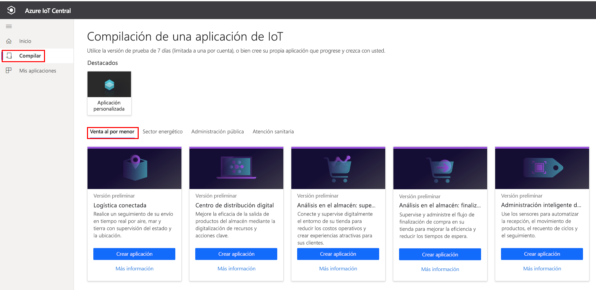
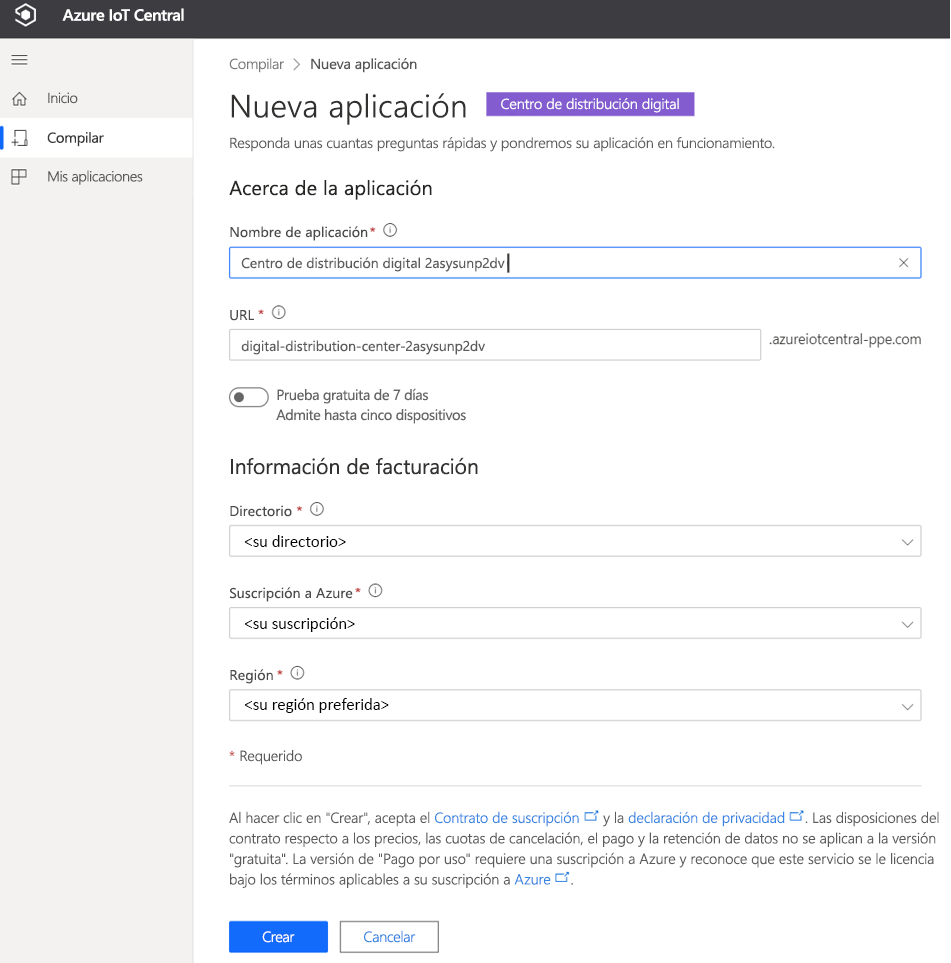
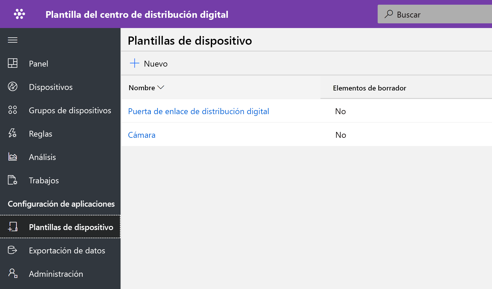
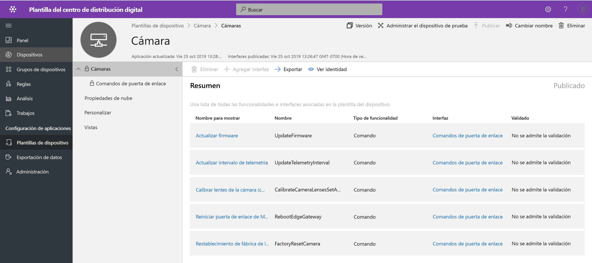
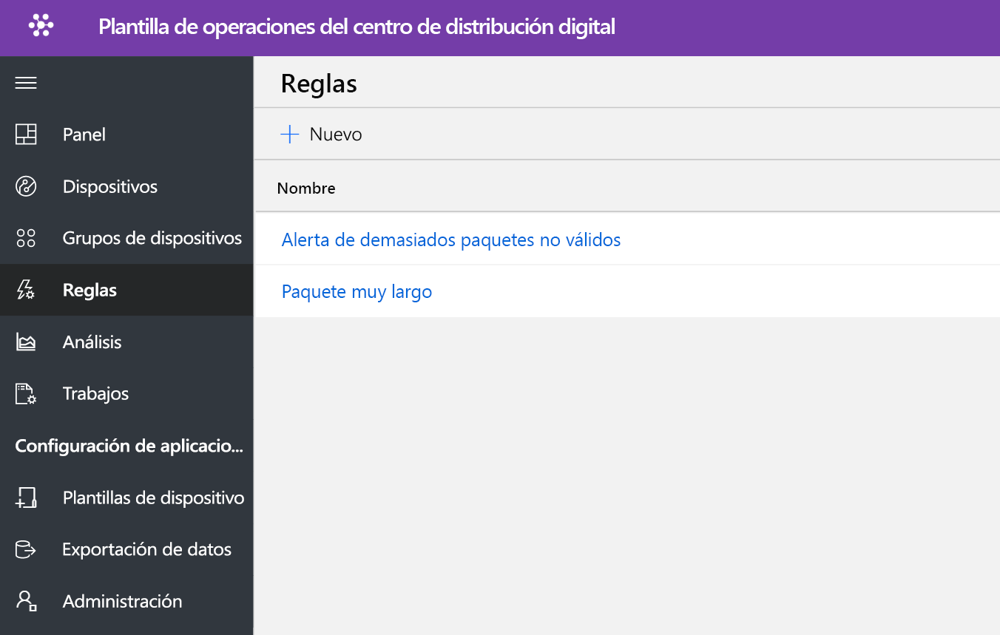
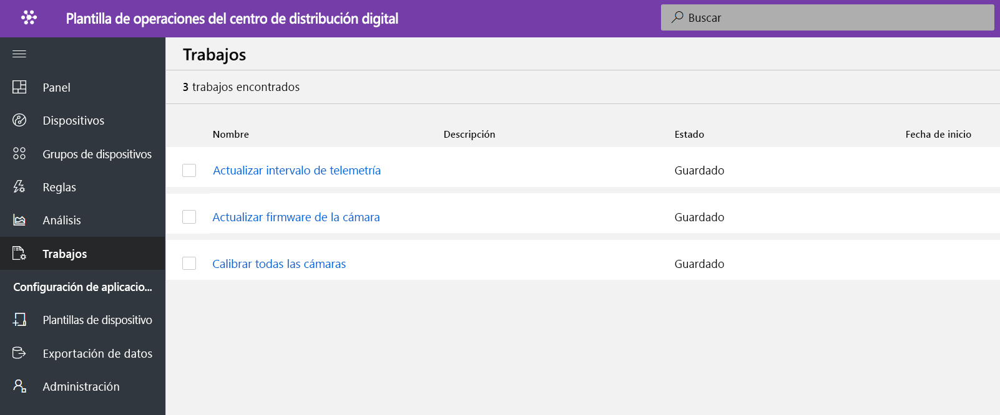
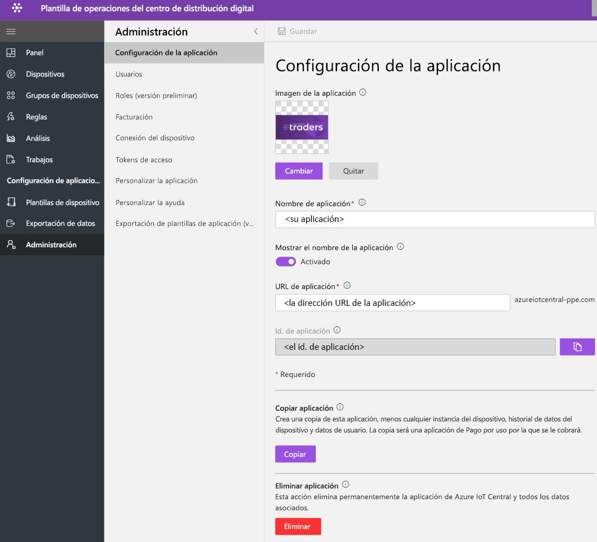

# Tutorial: implementación y recorrido por la plantilla de aplicación del centro de distribución digital

En este tutorial se muestra cómo implementar una plantilla de aplicación de **digital distribution center** de IoT Central. Aprenderá cómo implementar la plantilla, qué elementos se incluyen de fábrica y qué podría hacer a continuación.

En este tutorial, aprenderá lo siguiente: 
* Creación de una aplicación del centro de distribución digital. 
* Recorrido por la aplicación. 

## Prerequisites
* No se necesitan requisitos previos específicos para implementar esta aplicación.
* Se recomienda tener una suscripción de Azure, aunque puede probar las opciones sin ella.

## Creación de una plantilla de aplicación del centro de distribución digital

Puede crear una aplicación mediante los pasos siguientes.

1. Vaya al sitio web del administrador de aplicaciones de Azure IoT Central. Seleccione **Crear** en la barra de navegación de la izquierda y, a continuación, haga clic en la pestaña **Venta al por menor**.

    > [!div class="mx-imgBorder"]
    > 

2. Seleccione la pestaña **Venta al por menor** y seleccione **Crear aplicación** en la aplicación **Centro de distribución digital**.

3. **Crear aplicación** abrirá el formulario de Nueva aplicación y rellenará los detalles solicitados como se muestra a continuación.
   **Nombre de la aplicación**: puede usar el nombre sugerido predeterminado o escribir el nombre descriptivo de la aplicación.
   **URL**: puede usar la dirección URL predeterminada sugerida o escribir una dirección URL única, descriptiva y fácil de recordar. Después, se recomienda la configuración predeterminada si ya tiene una suscripción a Azure. Puede empezar con un plan de precios de evaluación gratuita de siete días y elegir convertirlo a un plan de precios estándar en cualquier momento antes de que expire la evaluación gratuita.
   **Información de facturación**: Los detalles del directorio, la suscripción a Azure y la región son necesarios para aprovisionar los recursos.
   **Crear**: Seleccione Crear en la parte inferior de la página para implementar la aplicación.

    > [!div class="mx-imgBorder"]
    > 

    > [!div class="mx-imgBorder"]
    > 

## Recorrido por el panel de la aplicación 

Después de implementar correctamente la plantilla de la aplicación, el panel predeterminado es un portal centrado en el operador del centro de distribución. Northwind Traders es un proveedor de soluciones para centros de distribución ficticio que administra sistemas de cintas transportadoras. 

En este panel, se mostrará una puerta de enlace y una cámara que actúa como dispositivo de IoT. La puerta de enlace proporciona datos de telemetría sobre paquetes; por ejemplo, si son válidos, no válidos, no identificados y su tamaño, junto con propiedades asociadas de dispositivo gemelo. Todos los comandos de nivel inferior se ejecutan en dispositivos IoT, como una cámara. Este panel está preconfigurado para mostrar la actividad crítica de las operaciones de dispositivo del centro de distribución.

El panel está organizado lógicamente para mostrar las funcionalidades de administración de la puerta de enlace de Azure IoT y el dispositivo de IoT.  
   * Puede realizar tareas de control y organización de la puerta de enlace.
   * Administre todas las cámaras que forman parte de la solución. 

> [!div class="mx-imgBorder"]
> 

## Plantilla de dispositivo

Haga clic en la pestaña Plantillas de dispositivo y verá el modelo de funcionalidad de la puerta de enlace. Un modelo de funcionalidad está estructurado en torno a dos interfaces diferentes, la **cámara** y la **puerta de enlace de distribución digital**.

> [!div class="mx-imgBorder"]
> 

**Cámara**: esta interfaz organiza todas las funciones de comando específicas de la cámara. 

> [!div class="mx-imgBorder"]
> 

**Puerta de enlace de distribución digital**: esta interfaz representa todos los datos de telemetría procedentes de la cámara, las propiedades de dispositivos gemelos definidas en la nube y la información de la puerta de enlace.

> [!div class="mx-imgBorder"]
> 

## Comandos de puerta de enlace
Esta interfaz organiza todas las funciones de comando de la puerta de enlace.

> [!div class="mx-imgBorder"]
> 

## Reglas
Seleccione la pestaña Reglas para ver dos reglas diferentes que existen en esta plantilla de aplicación. Estas reglas se configuran para enviar notificaciones por correo electrónico a los operadores para realizar más investigaciones.

 **Too many invalid packages alert** (demasiadas alertas de paquetes no válidos): esta regla se desencadena cuando la cámara detecta un número elevado de paquetes no válidos que fluyen a través del sistema de cintas transportadoras.
 
**Large package** (paquete grande): esta regla se desencadenará si la cámara detecta un paquete grande del que no se puede inspeccionar la calidad. 

> [!div class="mx-imgBorder"]
> 

## Trabajos
Seleccione la pestaña Trabajos para ver cinco trabajos diferentes que existen como parte de esta plantilla de aplicación: Puede aprovechar la característica de trabajos para realizar operaciones en toda la solución. Aquí los trabajos del centro de distribución digital usan los comandos de dispositivo y la funcionalidad de gemelo para realizar tareas como las siguientes.
   * Calibrar la cámara antes de iniciar la detección de paquetes. 
   * Actualizar periódicamente el firmware de la cámara.
   * Modificar el intervalo de los datos de telemetría para administrar la carga de datos.

> [!div class="mx-imgBorder"]
> 

## Limpieza de recursos
Si no va a seguir usando esta aplicación, elimine la plantilla de la aplicación. Para ello, vaya a **Administración** > **Configuración de la aplicación** y haga clic en **Eliminar**.

> [!div class="mx-imgBorder"]
> 

## Pasos siguientes
* Más información sobre el [concepto del centro de distribución digital](./architecture-digital-distribution-center-pnp.md) de la arquitectura de la solución del centro de distribución digital.
* Más información sobre otras [plantillas de venta minorista de IoT Central](./overview-iot-central-retail-pnp.md).
* Para obtener más información acerca de IoT Central, consulte [Introducción a IoT Central](../core/overview-iot-central.md).
