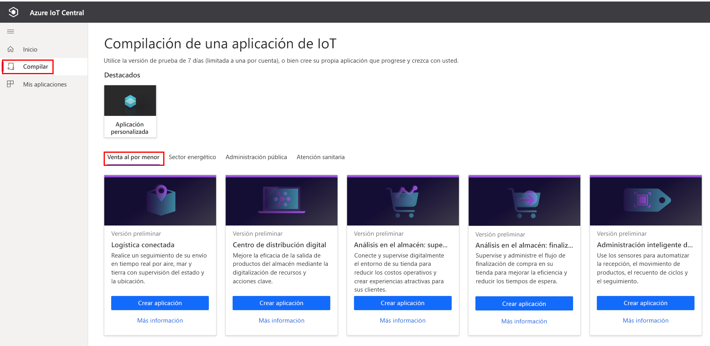
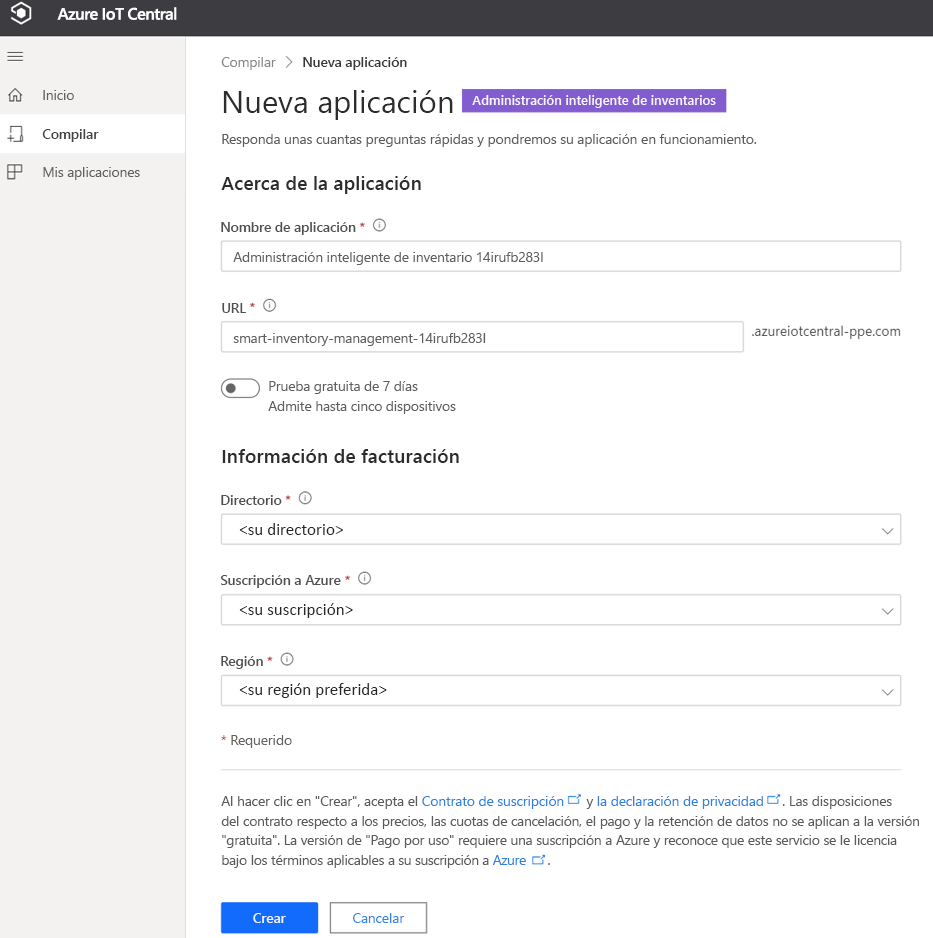
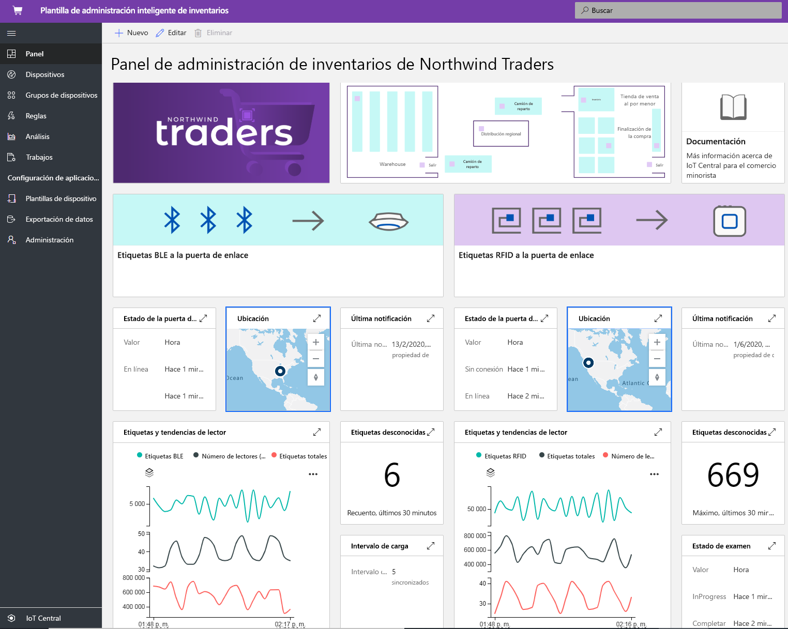
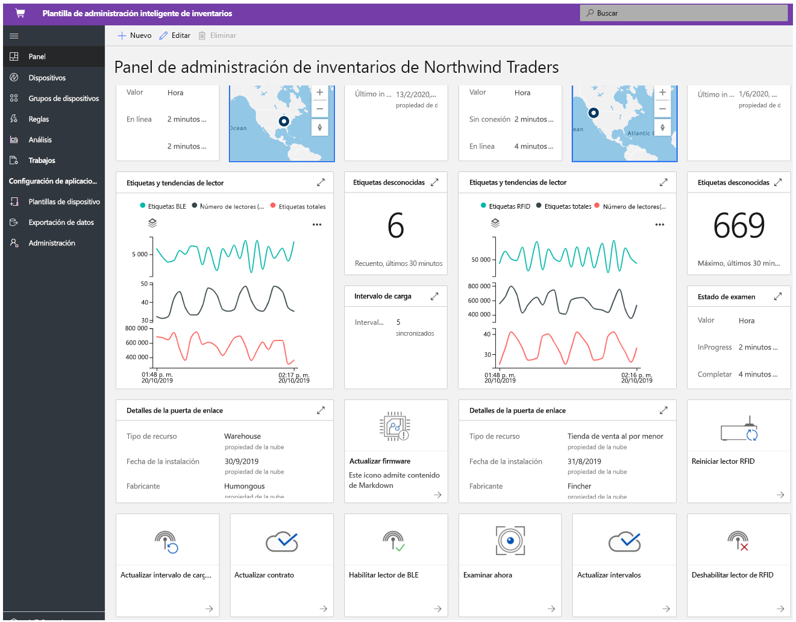
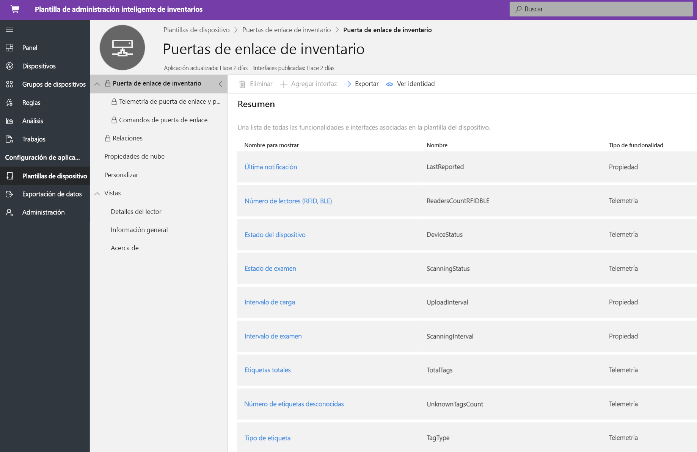
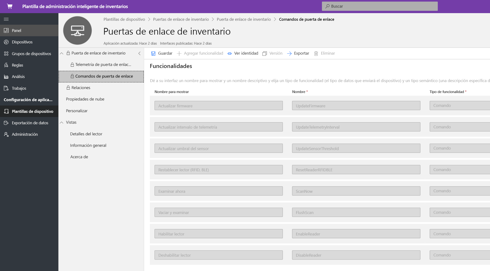
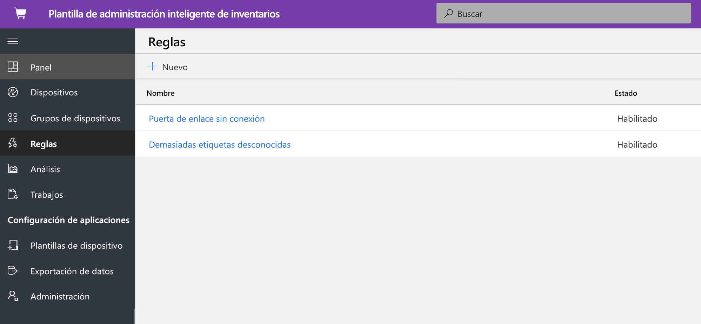
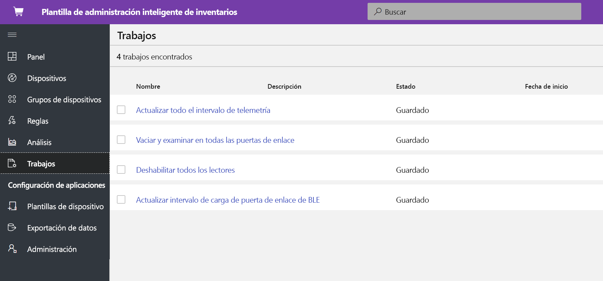
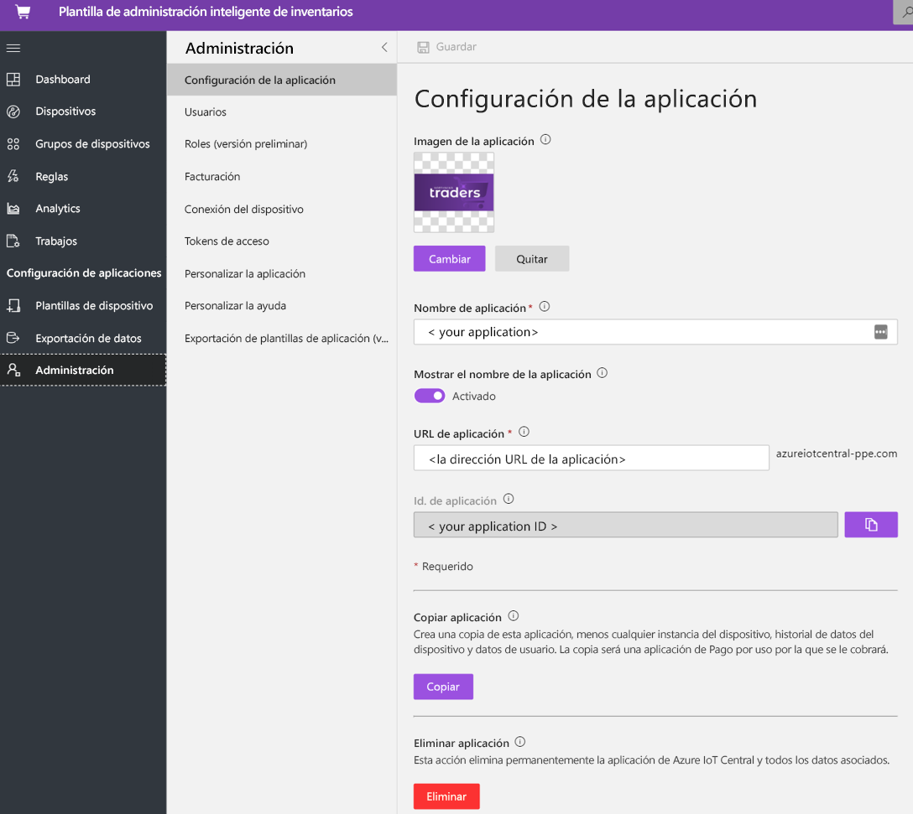

# Tutorial: implementación y recorrido de la plantilla de aplicación de administración inteligente

En este tutorial se muestra cómo implementar una plantilla de aplicación de **Smart Inventory Management** de IoT Central. Aprenderá cómo implementar la plantilla, qué elementos se incluyen de fábrica y qué podría hacer a continuación.

En este tutorial, aprenderá lo siguiente: 
* Creación de una aplicación de administración inteligente de inventario. 
* Recorrido por la aplicación. 

## Prerequisites

* No se necesitan requisitos previos específicos para implementar esta aplicación.
* Se recomienda tener una suscripción de Azure, aunque puede probar las opciones sin ella.

## Creación de una plantilla de aplicación de administración inteligente de inventario.

Puede crear una aplicación mediante los pasos siguientes.

1. Vaya al sitio web del administrador de aplicaciones de Azure IoT Central. Seleccione **Crear** en la barra de navegación de la izquierda y, a continuación, haga clic en la pestaña **Venta al por menor**.

    > [!div class="mx-imgBorder"]
    > 

2. Seleccione la pestaña **Venta al por menor** y, después, seleccione **Crear aplicación** en **Administración inteligente de inventarios**

3. **Crear aplicación** abrirá el formulario de Nueva aplicación y rellenará los detalles solicitados como se muestra a continuación.
   **Nombre de la aplicación**: puede usar el nombre sugerido predeterminado o escribir el nombre descriptivo de la aplicación.
   **URL**: puede usar la dirección URL predeterminada sugerida o escribir una dirección URL única, descriptiva y fácil de recordar. Después, se recomienda la configuración predeterminada si ya tiene una suscripción a Azure. Puede empezar con un plan de precios de evaluación gratuita de siete días y elegir convertirlo a un plan de precios estándar en cualquier momento antes de que expire la evaluación gratuita.
   **Información de facturación**: Los detalles del directorio, la suscripción a Azure y la región son necesarios para aprovisionar los recursos.
   **Crear**: Seleccione Crear en la parte inferior de la página para implementar la aplicación.

    > [!div class="mx-imgBorder"]
    > 

    > [!div class="mx-imgBorder"]
    > 

## Recorrido por la aplicación. 

### Panel 

Después de implementar correctamente la plantilla de la aplicación, el panel predeterminado es un portal centrado en la administración inteligente de inventarios. Northwind Traders es un proveedor ficticio de inventarios inteligentes que administra el almacenamiento con Bluetooth de baja energía (BLE) y la tienda de venta minorista con la identificación por radiofrecuencia (RFID). En este panel, se mostrarán dos puertas de enlace diferentes que proporcionan datos de telemetría sobre el inventario, junto con comandos, trabajos y acciones asociadas que puede realizar. Este panel está preconfigurado para mostrar la actividad crítica de las operaciones de administración inteligente del inventario.
El panel se divide lógicamente entre dos operaciones diferentes de administración de dispositivos de la puerta de enlace. 
   * El almacén se implementa con una puerta de enlace BLE fija y etiquetas BLE en los palés para realizar un seguimiento y localizar el inventario en instalaciones más grandes.
   * La tienda de venta minorista está implementada con una puerta de enlace RFID fija y etiquetas RFID en un nivel de elemento individual para realizar el seguimiento y localizar las existencias en un punto de venta.
   * Visualización de la ubicación de la puerta de enlace, el estado y los detalles relacionados. 

> [!div class="mx-imgBorder"]
> 

   * Puede supervisar fácilmente el número total de puertas de enlace, así como las etiquetas activas y desconocidas.
   * Puede realizar operaciones de administración de dispositivos, como actualizar el firmware, deshabilitar el sensor, habilitar el sensor, actualizar el umbral del sensor, actualizar los intervalos de telemetría y actualizar los contratos del servicio de dispositivo.
   * Los dispositivos de puerta de enlace pueden realizar la administración de inventario a petición con un análisis completo o incremental.

> [!div class="mx-imgBorder"]
> 

## Plantilla de dispositivo
Haga clic en la pestaña Plantillas de dispositivo y verá el modelo de funcionalidad de la puerta de enlace. Un modelo de funcionalidad está estructurado en torno a dos interfaces diferentes **Telemetría y propiedad de puerta de enlace** y **Comandos de puerta de enlace**.

**Telemetría y propiedades de puerta de enlace**: esta interfaz representa todos los datos de telemetría relacionados con los sensores, la ubicación y la información del dispositivo, así como las funcionalidades de las propiedades de dispositivo gemelo, tales como los umbrales de puerta de enlace y los intervalos de actualización.

> [!div class="mx-imgBorder"]
> 

**Comandos de puerta de enlace**: esta interfaz organiza todas las funciones de comando de la puerta de enlace.

> [!div class="mx-imgBorder"]
> 

## Reglas
Seleccione la pestaña Reglas para ver dos reglas diferentes que existen en esta plantilla de aplicación. Estas reglas se configuran para enviar notificaciones por correo electrónico a los operadores para realizar más investigaciones.

**Puerta de enlace sin conexión**: Esta regla se desencadenará si la puerta de enlace no se comunica con la nube durante un período prolongado. La puerta de enlace podría no responder porque está en modo de batería baja, ha perdido la conectividad o debido al estado del dispositivo.

**Etiquetas desconocidas**: Es fundamental realizar el seguimiento de todas las etiquetas RFID y BLE asociadas a un recurso. Si la puerta de enlace detecta demasiadas etiquetas desconocidas, es un claro indicador de que hay problemas de sincronización con las aplicaciones que generan etiquetas.

> [!div class="mx-imgBorder"]
> 

## Trabajos
Seleccione la pestaña Trabajos para ver cinco trabajos diferentes que existen como parte de esta plantilla de aplicación: Puede aprovechar la característica de trabajos para realizar operaciones en toda la solución. Aquí los trabajos de administración del inventario usan los comandos del dispositivo y la funcionalidad de gemelo para realizar tareas como:
   * Deshabilitación de los lectores en todas las puertas de enlace.
   * Modificación del umbral de telemetría intermedio. 
   * Realización de un análisis de inventario a petición en toda la solución.

> [!div class="mx-imgBorder"]
> 

## Limpieza de recursos

Si no va a seguir usando esta aplicación, elimine la plantilla de la aplicación. Para ello, vaya a **Administración** > **Configuración de la aplicación** y haga clic en **Eliminar**.

> [!div class="mx-imgBorder"]
> 

## Pasos siguientes
* Más información sobre el [concepto de administración inteligente del inventario](./architecture-smart-inventory-management-pnp.md).
* Más información sobre otras [plantillas de venta minorista de IoT Central](./overview-iot-central-retail-pnp.md).
* Para obtener más información acerca de IoT Central, consulte [Introducción a IoT Central](../core/overview-iot-central.md).
