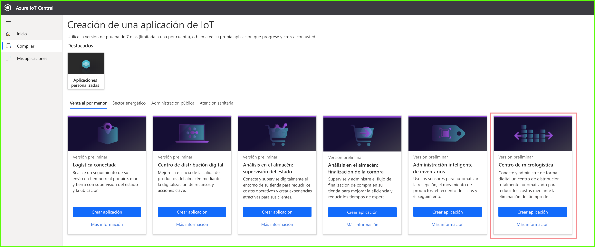
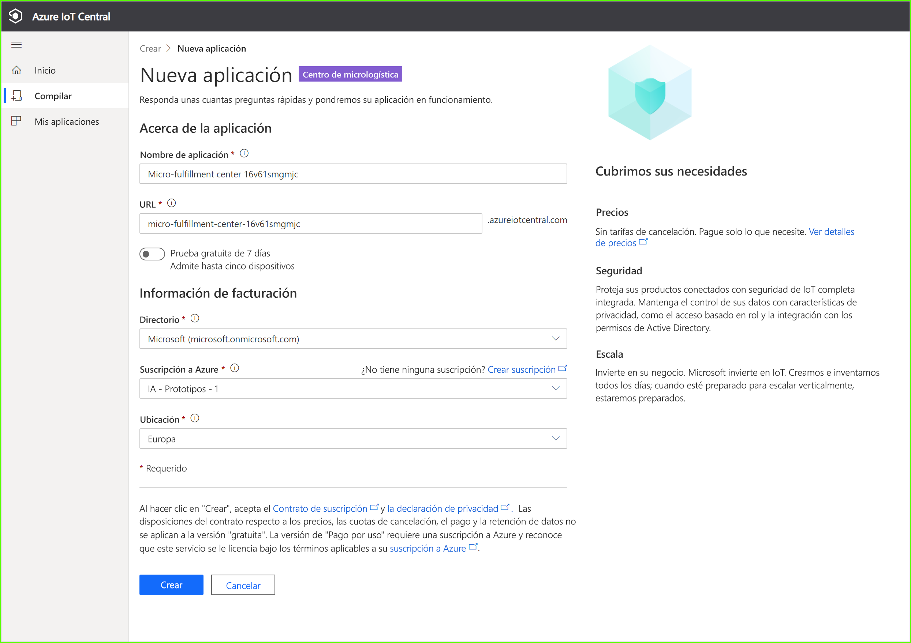
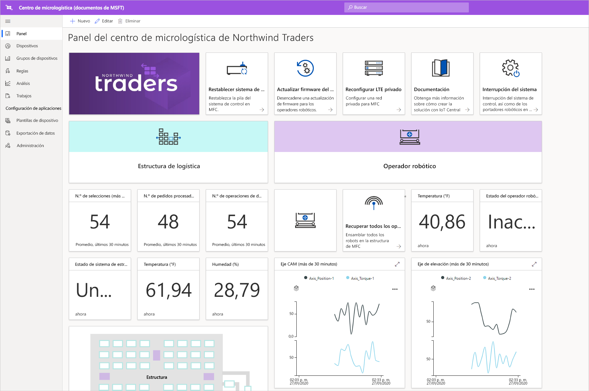
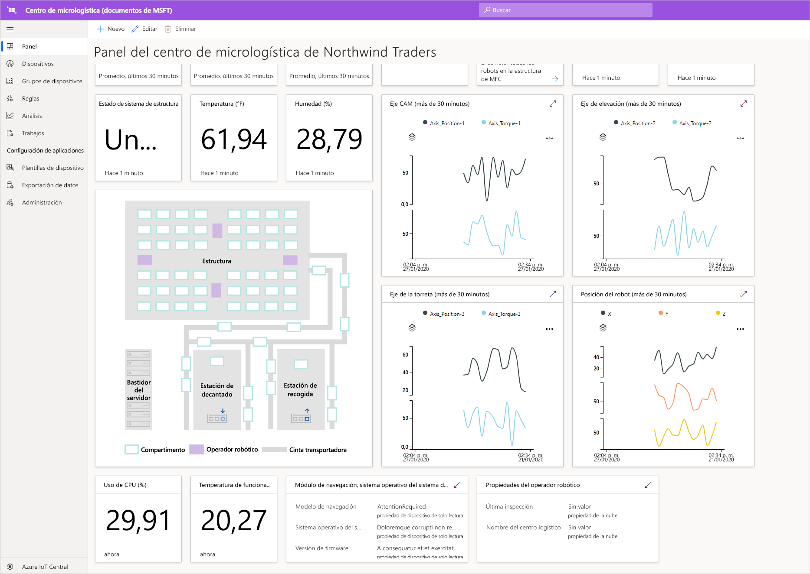
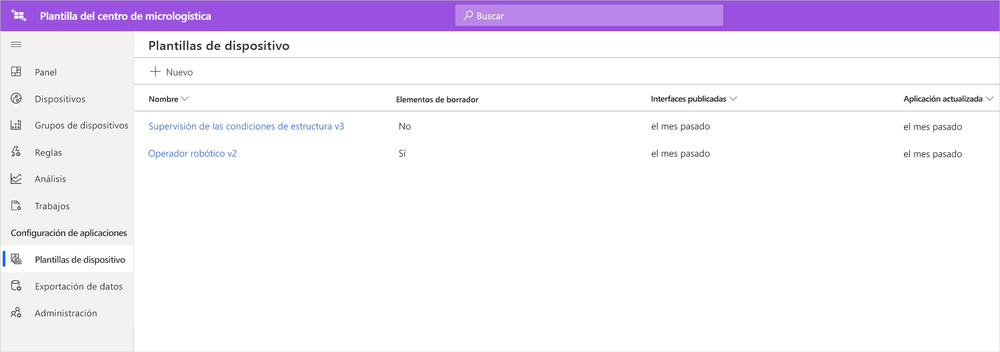
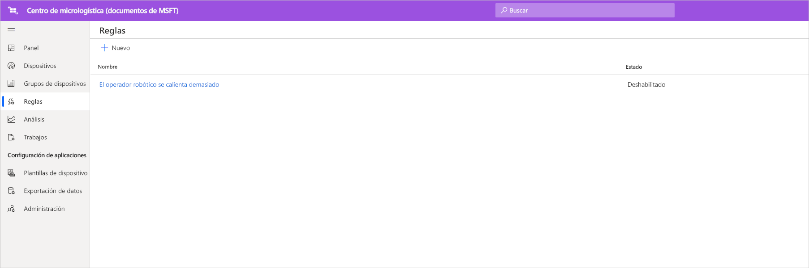
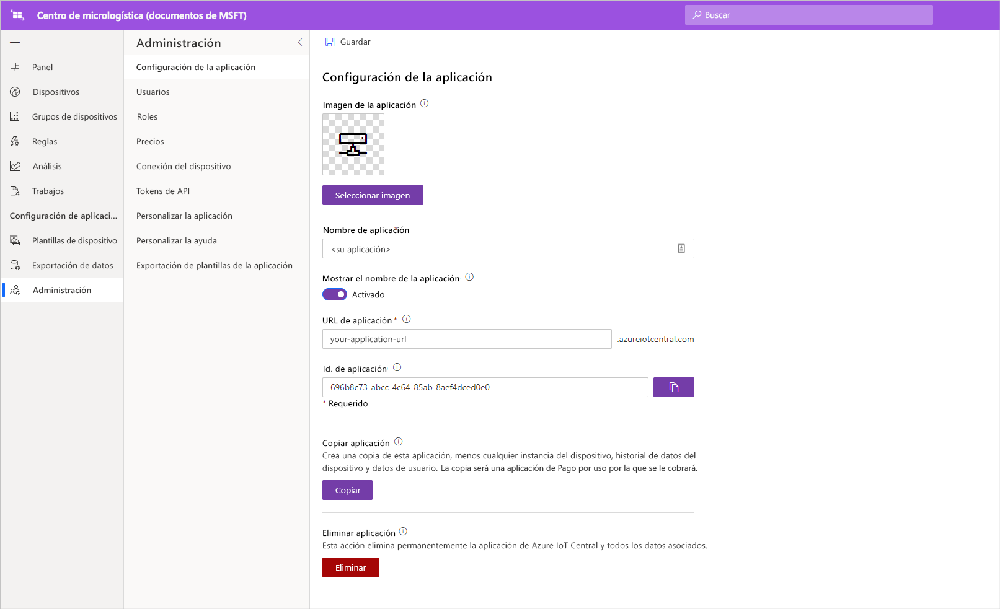

# Tutorial: Implementación y recorrido por una plantilla de aplicación del centro de micrologística

En este tutorial, se usa la plantilla de aplicación del centro de micrologística para Azure IoT Central para crear una solución para el comercio minorista. Aprenderá a implementar la plantilla, conocerá los elementos que incluyen y qué puede hacer a continuación.

## Prerrequisitos
Para completar esta serie de tutoriales, necesitará una suscripción de Azure. Opcionalmente, puede usar una evaluación gratuita de 7 días. Si no tiene una suscripción de Azure, puede crear una en la [página de suscripción a Azure](https://aka.ms/createazuresubscription).

## Crear una aplicación 
En esta sección, creará una nueva aplicación de Azure IoT Central a partir de una plantilla. Usará esta aplicación a lo largo de la serie de tutoriales para crear una solución completa.

Para crear una nueva aplicación de Azure IoT Central:

1. Vaya al sitio web del [administrador de aplicaciones de Azure IoT Central](https://aka.ms/iotcentral).
1. Si tiene una suscripción a Azure, inicie sesión con las credenciales que usa para acceder a ella. De lo contrario, inicie sesión mediante una cuenta Microsoft:

   

1. Para empezar a crear una nueva aplicación de Azure IoT Central, seleccione **New Application** (Nueva aplicación).

1. Seleccione **Retail** (Comercio minorista).  En la página de comercio minorista se muestran varias plantillas de aplicación de venta al por menor.

Para crear una nueva aplicación del centro de micrologística que usa las características de la versión preliminar:  
1. Seleccione la plantilla de aplicación **Micro-fulfillment center** (Centro de micrologística). Esta plantilla incluye plantillas de dispositivo para todos los dispositivos usados en el tutorial. La plantilla también proporciona un panel de operador para la supervisión tanto de las condiciones del centro de logística, como de los operadores robóticos. 

    
    
1. Opcionalmente, elija un valor descriptivo para **Application name** (Nombre de la aplicación). La plantilla de la aplicación se basa en la compañía ficticia Northwind Traders. 

    >[!NOTE]
    >Aunque use un nombre de aplicación descriptivo, debe usar un valor único para la dirección URL de la aplicación.

1. Si tiene una suscripción de Azure, escriba el directorio, la suscripción de Azure y la región. Si no la tiene, puede habilitar la evaluación gratuita de 7 días y completar la información de contacto necesaria.  

    Para más información sobre los directorios y las suscripciones, consulte el inicio rápido [Creación de una aplicación](../preview/quick-deploy-iot-central.md).

1. Seleccione **Crear**.

    

## Recorrido por la aplicación. 

Después de implementar correctamente la plantilla de aplicación, verá al **panel del centro de micrologística de Northwind Traders**. Northwind Traders es un minorista ficticio que tiene un centro de micrologística que se administrando en esta aplicación de Azure IoT Central. En este panel de operador, se ve información y datos de telemetría de los dispositivos de esta plantilla junto con un conjunto de comandos, trabajos y acciones que se pueden realizar. El panel se divide lógicamente en dos secciones. A la izquierda, es posible supervisar las condiciones del entorno dentro de la estructura logística y, a la derecha, se puede supervisar el estado de un operador robótico dentro de la instalación.  

Desde el panel se puede:
   * Consultar los datos de telemetría de dispositivos, como el número de recogidas, el número de pedidos procesados y propiedades como el estado del sistema de la estructura.  
   * Ver el plan de la planta y la ubicación de los operadores robóticos en la estructura logística.
   * Desencadenar comandos, como restablecer el sistema de control, actualizar el firmware del operador y volver a configurar la red.

     
   * Vea un ejemplo del panel que los operadores pueden usar para supervisar las condiciones del centro logístico. 
   * Supervise el estado de las cargas que se ejecutan en el dispositivo de puerta de enlace del centro logístico.    

     

## Plantilla de dispositivo
Si seleccione la pestaña de plantillas de dispositivos, verá que hay dos tipos de dispositivo diferentes que forman parte de la plantilla: 
   * **Operador robótico**: esta plantilla de dispositivo representa la definición de un operador robótico en funcionamiento que se ha implementado en la estructura logística y realiza las operaciones adecuadas de almacenamiento y recuperación. Si selecciona la plantilla, verá que el robot envía datos del dispositivo, como la temperatura y la posición del eje, y propiedades, como el estado del operador robótico. 
   * **Supervisión de las condiciones de estructura**: esta plantilla de dispositivo representa una recopilación de dispositivos que permite supervisar la condición del entorno, así como el dispositivo de puerta de enlace que hospeda varias cargas de trabajo perimetrales para potenciar el centro de micrologística. El dispositivo envía datos de telemetría, como la temperatura, el número de recogidas y el número de pedidos. También envía información sobre el estado y el estado de las cargas de trabajo de proceso que se ejecutan en el entorno. 

     

Si selecciona la pestaña del grupo dispositivos, también verá que estas plantillas de dispositivo crean automáticamente grupos de dispositivos.

## Reglas
En la pestaña **Rules** (Reglas), se ve una regla de ejemplo que existe en la plantilla de aplicación para supervisar las condiciones de temperatura del operador robótico. Esta regla se puede usar para avisar al operador si un robot específico de la instalación se está sobrecalentando y se debe desconectar para mantenimiento. 

Use la regla de ejemplo como inspiración para definir las reglas más adecuadas para sus funciones empresariales.

## Limpieza de recursos

Si no va a seguir usando esta aplicación, elimine la plantilla. Vaya a **Administration** > **Application settings** (Administración > Configuración de la aplicación) y seleccione **Delete** (Eliminar).

## Pasos siguientes
* Más información acerca de la [arquitectura de la solución del centro de micrologística](./architecture-micro-fulfillment-center-pnp.md).
* Más información sobre otras [plantillas para minoristas de Azure IoT Central](./overview-iot-central-retail-pnp.md).
* Lea la [introducción a Azure IoT Central](../preview/overview-iot-central.md).
