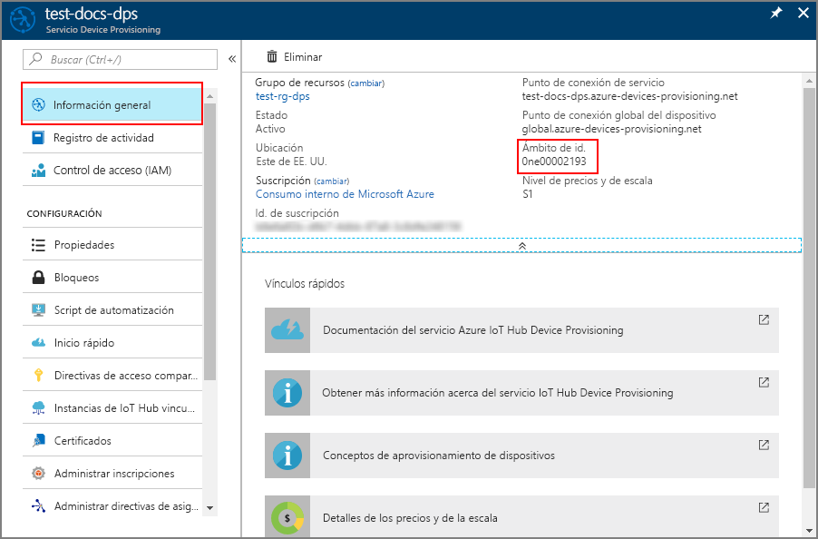

# <a name="how-to-provision-legacy-devices-using-symmetric-keys"></a>Aprovisionamiento de dispositivos antiguos mediante claves simétricas


Un problema habitual con muchos dispositivos antiguos es que a menudo tienen una identidad que está compuesta de un solo fragmento de información. Esta información de identidad suele ser una dirección MAC o un número de serie. Puede que los dispositivos antiguos no tengan un certificado, un módulo de plataforma segura o cualquier otra característica de seguridad que se pueda usar para identificar de forma segura al dispositivo. Device Provisioning Service de IoT Hub incluye la atestación de clave simétrica. La atestación de clave simétrica se puede usar para identificar un dispositivo basándose en información como la dirección MAC o un número de serie.

Si puede instalar fácilmente un [módulo de seguridad de hardware (HSM)](concepts-security.md#hardware-security-module) y un certificado, ese puede ser un mejor enfoque para identificar y aprovisionar los dispositivos. Esto se debe a que este enfoque le permite omitir la actualización del código implementado en todos los dispositivos y no tendría ninguna clave secreta insertada en la imagen del dispositivo.

En este artículo se da por supuesto que ni un HSM ni un certificado son viables. No obstante, se supone que tiene algún método para actualizar el código del dispositivo para que use Device Provisioning Service para aprovisionar estos dispositivos. 

En este artículo también se da por supuesto que la actualización del dispositivo tiene lugar en un entorno seguro para impedir el acceso no autorizado a la clave maestra de grupo o la clave de dispositivo derivada.

Este artículo está orientado a una estación de trabajo basada en Windows. No obstante, también puede realizar los procedimientos en Linux. Para obtener un ejemplo de Linux, consulte [Cómo aprovisionar para varios inquilinos](how-to-provision-multitenant.md).


## <a name="overview"></a>Información general

Se definirá un identificador de registro único para cada dispositivo basándose en la información que identifica ese dispositivo. Por ejemplo, la dirección MAC o un número de serie.

Un grupo de inscripción que usa [atestación de clave simétrica](concepts-symmetric-key-attestation.md) se creará con Device Provisioning Service. El grupo de inscripción incluirá una clave maestra de grupo. Esa clave maestra se utilizará para obtener un hash de cada identificador de registro único para generar una clave de dispositivo única para cada dispositivo. El dispositivo usará esa clave de dispositivo derivada con su identificador de registro único para realizar la atestación con Device Provisioning Service y su asignación a una instancia de IoT Hub.

El código de dispositivo que se muestra en este artículo seguirá el mismo patrón que el de [Inicio rápido: Aprovisionamiento de un dispositivo simulado con claves simétricas](quick-create-simulated-device-symm-key.md). El código simulará un dispositivo mediante un ejemplo del [SDK de Azure IoT para C](https://github.com/Azure/azure-iot-sdk-c). El dispositivo simulado realizará la atestación con un grupo de inscripciones en lugar de con una inscripción individual como se mostró en la guía de inicio rápido.

[!INCLUDE [quickstarts-free-trial-note](../../includes/quickstarts-free-trial-note.md)]


## <a name="prerequisites"></a>Requisitos previos

* Finalización de la guía de inicio rápido [Configuración de Azure IoT Hub Device Provisioning Service con Azure Portal](./quick-setup-auto-provision.md).
* Visual Studio 2015 o [Visual Studio 2017](https://www.visualstudio.com/vs/) con la carga de trabajo de [desarrollo de escritorio con C++](https://www.visualstudio.com/vs/support/selecting-workloads-visual-studio-2017/) habilitada.
* Tener instalada la versión más reciente de [Git](https://git-scm.com/download/).


## <a name="prepare-an-azure-iot-c-sdk-development-environment"></a>Preparación de un entorno de desarrollo del SDK de Azure IoT para C

En esta sección, preparará un entorno de desarrollo para compilar el [SDK de Azure IoT para C](https://github.com/Azure/azure-iot-sdk-c). 

El SDK incluye el código de ejemplo para el dispositivo simulado. Este dispositivo simulado tratará de aprovisionarse durante la secuencia de arranque del dispositivo.

1. Descargue el [sistema de compilación CMake](https://cmake.org/download/).

    **Antes** de comenzar la instalación de `CMake`, es importante que los requisitos previos de Visual Studio (Visual Studio y la carga de trabajo de desarrollo de escritorio con C++) estén instalados en la máquina. Una vez que los requisitos previos están en su lugar, y se ha comprobado la descarga, instale el sistema de compilación de CMake.

2. Abra un símbolo del sistema o el shell de Bash de Git. Ejecute el siguiente comando para clonar el repositorio de GitHub del SDK de Azure IoT para C:
    
    ```cmd/sh
    git clone https://github.com/Azure/azure-iot-sdk-c.git --recursive
    ```
    Esta operación puede tardar varios minutos en completarse.


3. Cree un subdirectorio `cmake` en el directorio raíz del repositorio de Git y vaya a esa carpeta. 

    ```cmd/sh
    cd azure-iot-sdk-c
    mkdir cmake
    cd cmake
    ```

4. Ejecute el siguiente comando para compilar una versión del SDK específica para su plataforma de cliente de desarrollo. Se generará una solución de Visual Studio para el dispositivo simulado en el directorio `cmake`. 

    ```cmd
    cmake -Dhsm_type_symm_key:BOOL=ON -Duse_prov_client:BOOL=ON  ..
    ```
    
    Si `cmake` no encuentra el compilador de C++, es posible que obtenga errores de compilación durante la ejecución del comando anterior. Si sucede, intente ejecutar este comando en el [símbolo del sistema de Visual Studio](https://docs.microsoft.com/dotnet/framework/tools/developer-command-prompt-for-vs). 

    Una vez realizada la compilación, las últimas líneas de salida tendrán un aspecto similar al siguiente:

    ```cmd/sh
    $ cmake -Dhsm_type_symm_key:BOOL=ON -Duse_prov_client:BOOL=ON  ..
    -- Building for: Visual Studio 15 2017
    -- Selecting Windows SDK version 10.0.16299.0 to target Windows 10.0.17134.
    -- The C compiler identification is MSVC 19.12.25835.0
    -- The CXX compiler identification is MSVC 19.12.25835.0

    ...

    -- Configuring done
    -- Generating done
    -- Build files have been written to: E:/IoT Testing/azure-iot-sdk-c/cmake
    ```


## <a name="create-a-symmetric-key-enrollment-group"></a>Crear un grupo de inscripción de clave simétrica

1. Inicie sesión en [Azure Portal](https://portal.azure.com) y abra la instancia de Device Provisioning Service.

2. Seleccione la pestaña **Administrar inscripciones** y, luego, haga clic en el botón **Agregar grupo de inscripciones**, situado en la parte superior de la página. 

3. En **Agregar grupo de inscripciones**, escriba la siguiente información y haga clic en el botón **Guardar**.

   - **Nombre de grupo**: escriba **mylegacydevices**.

   - **Tipo de atestación**: seleccione **Clave simétrica**.

   - **Generar claves automáticamente**: Active esta casilla.

   - **Seleccione cómo desea asignar los dispositivos a los centros**: Seleccione **Configuración estática** para poder realizar la asignación a un centro concreto.

   - **Seleccione los centros de IoT a los que se puede asignar este grupo**: Seleccione uno de los centros.

     

4. Una vez guardada la inscripción, la **clave principal** y la **clave secundaria** se generarán y se agregarán a la entrada de la inscripción. El grupo de inscripción de la clave simétrica aparece como **mylegacydevices** en la columna *Nombre del grupo* de la pestaña *Grupos de inscripción*. 

    Abra la inscripción y copie el valor de su **clave principal** generada. Esta clave es la clave maestra de grupo.


## <a name="choose-a-unique-registration-id-for-the-device"></a>Elección de un identificador de registro único para el dispositivo

Se debe definir un identificador de registro único para identificar cada dispositivo. Puede usar la dirección MAC, el número de serie o cualquier otra información única del dispositivo. 

En este ejemplo se usa una combinación de una dirección MAC y un número de serie que forman la siguiente cadena de un identificador de registro.

```
sn-007-888-abc-mac-a1-b2-c3-d4-e5-f6
```

Cree un identificador de registro único para el dispositivo. Solo se pueden usar caracteres alfanuméricos en minúsculas y guiones ("-").


## <a name="derive-a-device-key"></a>Derivación de una clave de dispositivo 

Para generar la clave del dispositivo, use la clave maestra del grupo para calcular un [HMAC-SHA256](https://wikipedia.org/wiki/HMAC) del identificador de registro único del dispositivo y convierta el resultado en formato Base64.

No incluya la clave maestra del grupo en el código del dispositivo.


#### <a name="linux-workstations"></a>Estaciones de trabajo de Linux

Si utiliza una estación de trabajo de Linux, puede usar openssl para generar la clave de dispositivo derivada tal y como se muestra en el ejemplo siguiente.

Reemplace el valor de **KEY** por el de la **clave principal** que ha apuntado anteriormente.

Reemplace el valor de **REG_ID** por el identificador del registro.

```bash
KEY=8isrFI1sGsIlvvFSSFRiMfCNzv21fjbE/+ah/lSh3lF8e2YG1Te7w1KpZhJFFXJrqYKi9yegxkqIChbqOS9Egw==
REG_ID=sn-007-888-abc-mac-a1-b2-c3-d4-e5-f6

keybytes=$(echo $KEY | base64 --decode | xxd -p -u -c 1000)
echo -n $REG_ID | openssl sha256 -mac HMAC -macopt hexkey:$keybytes -binary | base64
```

```bash
Jsm0lyGpjaVYVP2g3FnmnmG9dI/9qU24wNoykUmermc=
```


#### <a name="windows-based-workstations"></a>Estaciones de trabajo basadas en Windows

Si utiliza una estación de trabajo basada en Windows, puede usar PowerShell para generar las claves de dispositivo derivadas tal y como se muestra en el ejemplo siguiente.

Reemplace el valor de **KEY** por el de la **clave principal** que ha apuntado anteriormente.

Reemplace el valor de **REG_ID** por el identificador del registro.

```powershell
$KEY='8isrFI1sGsIlvvFSSFRiMfCNzv21fjbE/+ah/lSh3lF8e2YG1Te7w1KpZhJFFXJrqYKi9yegxkqIChbqOS9Egw=='
$REG_ID='sn-007-888-abc-mac-a1-b2-c3-d4-e5-f6'

$hmacsha256 = New-Object System.Security.Cryptography.HMACSHA256
$hmacsha256.key = [Convert]::FromBase64String($KEY)
$sig = $hmacsha256.ComputeHash([Text.Encoding]::ASCII.GetBytes($REG_ID))
$derivedkey = [Convert]::ToBase64String($sig)
echo "`n$derivedkey`n"
```

```powershell
Jsm0lyGpjaVYVP2g3FnmnmG9dI/9qU24wNoykUmermc=
```


El dispositivo usará la clave de dispositivo derivada con el identificador de registro único para realizar la atestación de clave simétrica con el grupo de inscripción durante el aprovisionamiento.


## <a name="create-a-device-image-to-provision"></a>Creación de una imagen de dispositivo para aprovisionar

En esta sección, actualizará el ejemplo de aprovisionamiento denominado **prov\_dev\_client\_sample** que está ubicado en el SDK de Azure IoT para C que ha configurado anteriormente. 

El código de ejemplo simula una secuencia de arranque de dispositivo que envía la solicitud de aprovisionamiento a la instancia de Device Provisioning Service. La secuencia de arranque hará que se reconozca y se asigne el dispositivo al centro de IoT que configuró en el grupo de inscripción.

1. En Azure Portal, seleccione la pestaña **Información general** para su servicio Device Provisioning y anote el valor de **_Ámbito de id_**.

     

2. En Visual Studio, abra el archivo de solución **azure_iot_sdks.sln** que se ha generado anteriormente al ejecutar CMake. El archivo de solución debe estar en la siguiente ubicación:

    ```
    \azure-iot-sdk-c\cmake\azure_iot_sdks.sln
    ```

3. En la ventana del *Explorador de soluciones* de Visual Studio, desplácese hasta la carpeta **Aprovisionar\_Ejemplos**. Expanda el proyecto de ejemplo denominado **prov\_dev\_client\_sample**. Expanda **Archivos de código fuente** y abra **prov\_dev\_cliente\_sample.c**.

4. Busque la constante `id_scope` y reemplace el valor por el valor de **Ámbito de id.** que copió anteriormente. 

    ```c
    static const char* id_scope = "0ne00002193";
    ```

5. Busque la definición de la función `main()` en el mismo archivo. Asegúrese de que la variable `hsm_type` está establecida en `SECURE_DEVICE_TYPE_SYMMETRIC_KEY`, tal como se muestra a continuación:

    ```c
    SECURE_DEVICE_TYPE hsm_type;
    //hsm_type = SECURE_DEVICE_TYPE_TPM;
    //hsm_type = SECURE_DEVICE_TYPE_X509;
    hsm_type = SECURE_DEVICE_TYPE_SYMMETRIC_KEY;
    ```

6. Encuentre la llamada a `prov_dev_set_symmetric_key_info()` en **prov\_dev\_client\_sample.c** que se marcó como comentario.

    ```c
    // Set the symmetric key if using they auth type
    //prov_dev_set_symmetric_key_info("<symm_registration_id>", "<symmetric_Key>");
    ```

    Quite la marca del comentario en la llamada de la función y reemplace los valores de marcador de posición (incluidos los corchetes angulares) por el identificador de registro único del dispositivo y la clave de dispositivo derivada que ha generado antes.

    ```c
    // Set the symmetric key if using they auth type
    prov_dev_set_symmetric_key_info("sn-007-888-abc-mac-a1-b2-c3-d4-e5-f6", "Jsm0lyGpjaVYVP2g3FnmnmG9dI/9qU24wNoykUmermc=");
    ```
   
    Guarde el archivo.

7. Haga clic con el botón derecho en el proyecto **prov\_dev\_client\_sample** y seleccione **Set as Startup Project** (Establecer como proyecto de inicio). 

8. En el menú de Visual Studio, seleccione **Depurar** > **Iniciar sin depurar** para ejecutar la solución. En la solicitud para volver a compilar el proyecto, haga clic en **Sí** para recompilar el proyecto antes de ejecutarlo.

    La salida siguiente es un ejemplo de arranque correcto del dispositivo simulado y su conexión a la instancia del servicio de aprovisionamiento para que se asigne a un IoT Hub:

    ```cmd
    Provisioning API Version: 1.2.8

    Registering Device

    Provisioning Status: PROV_DEVICE_REG_STATUS_CONNECTED
    Provisioning Status: PROV_DEVICE_REG_STATUS_ASSIGNING
    Provisioning Status: PROV_DEVICE_REG_STATUS_ASSIGNING

    Registration Information received from service: 
    test-docs-hub.azure-devices.net, deviceId: sn-007-888-abc-mac-a1-b2-c3-d4-e5-f6

    Press enter key to exit:
    ```

9. En el portal, vaya al centro de IoT al que se ha asignado el dispositivo simulado y haga clic en la pestaña **Dispositivos IoT**. Si el dispositivo simulado se aprovisiona correctamente en el centro, su identificador de dispositivo aparecerá en la hoja **Dispositivos de IoT** con el *ESTADO* **habilitado**. Puede que tenga que hacer clic en el botón **Actualizar** en la parte superior. 

     


## <a name="security-concerns"></a>Problemas de seguridad

Tenga en cuenta que esto deja la clave de dispositivo derivada incluida como parte de la imagen, lo cual no es un procedimiento recomendado de seguridad. Este es uno de los motivos por los que la seguridad y la facilidad de uso pueden estar contrapuestos. 


## <a name="next-steps"></a>Pasos siguientes

* Para obtener más Reprovisioning, vea [reaprovisionamiento conceptos de dispositivo de IoT Hub](concepts-device-reprovision.md) 
* [Inicio rápido: Aprovisionamiento de un dispositivo simulado con claves simétricas](quick-create-simulated-device-symm-key.md)
* Para obtener información más Desaprovisionamiento de usuarios, consulte [Desaprovisionamiento de dispositivos que automática aprovisionados](how-to-unprovision-devices.md) 


