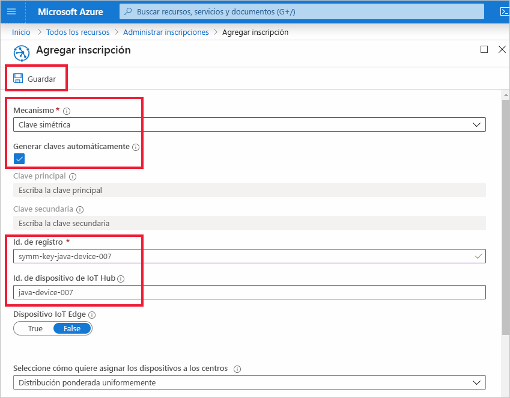
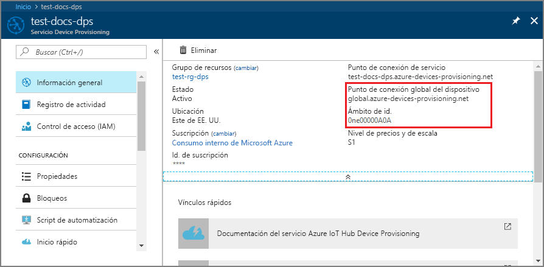
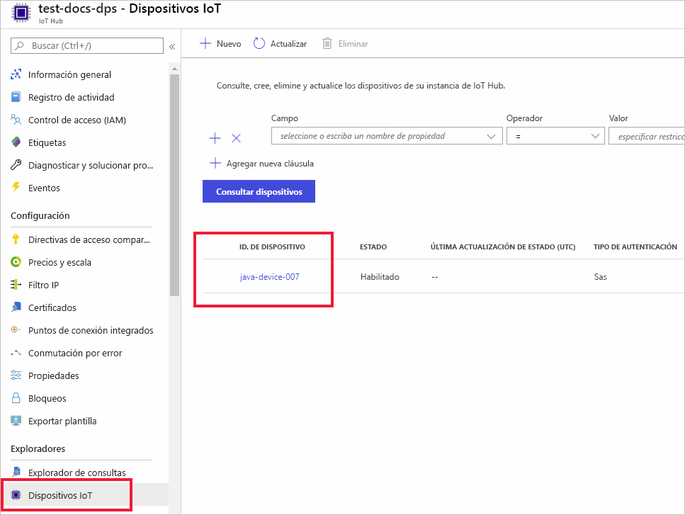

# <a name="quickstart-provision-a-simulated-device-with-symmetric-keys"></a>Inicio rápido: Aprovisionamiento de un dispositivo simulado con claves simétricas

En esta guía de inicio rápido, obtendrá información sobre cómo crear y ejecutar un simulador de dispositivos en una máquina de desarrollo Windows. Configurará este dispositivo simulado para utilizar una clave simétrica a fin de autenticarse con una instancia del Device Provisioning Service y recibir la asignación a un centro de IoT. Se usará código de ejemplo del [SDK para Java de IoT de Microsoft Azure](https://github.com/Azure/azure-iot-sdk-java) para simular una secuencia de arranque para el dispositivo que inicia el aprovisionamiento. El dispositivo se reconocerá en función de una inscripción individual en una instancia del servicio DPS y se asignará a un centro de IoT.

Aunque en este artículo se muestra el aprovisionamiento con una inscripción individual, puede usar grupos de inscripción. Hay algunas diferencias al usar los grupos de inscripción. Por ejemplo, debe usar una clave de dispositivo derivada con un identificador de registro único para el dispositivo. Aunque los grupos de inscripción de clave simétrica no se limitan a los dispositivos heredados, en [Cómo aprovisionar dispositivos heredados con la atestación de clave simétrica](how-to-legacy-device-symm-key.md) se proporciona un ejemplo de grupo de inscripción. Para obtener más información, consulte [Inscripciones de grupo para la atestación de clave simétrica](concepts-symmetric-key-attestation.md#group-enrollments).

Si no está familiarizado con el proceso de aprovisionamiento automático, revise los [conceptos sobre aprovisionamiento automático](concepts-auto-provisioning.md). 

Además, asegúrese de completar los pasos descritos en [Configuración del servicio Azure IoT Hub Device Provisioning con Azure Portal](./quick-setup-auto-provision.md) antes de continuar con este inicio rápido. Para seguir esta guía de inicio rápido, ya debe haber creado la instancia del Device Provisioning Service.

Este artículo está orientado a una estación de trabajo basada en Windows. No obstante, también puede realizar los procedimientos en Linux. Para obtener un ejemplo de Linux, consulte [Cómo aprovisionar para varios inquilinos](how-to-provision-multitenant.md).


[!INCLUDE [quickstarts-free-trial-note](../../includes/quickstarts-free-trial-note.md)]


## <a name="prerequisites"></a>Prerequisites

* Asegúrese de que tiene [Java SE Development Kit 8](https://aka.ms/azure-jdks) instalado en su máquina.

* Descargue e instale [Maven](https://maven.apache.org/install.html).

* Tener instalada la versión más reciente de [Git](https://git-scm.com/download/).

<a id="setupdevbox"></a>

## <a name="prepare-the-java-sdk-environment"></a>Preparación del entorno del SDK de Java 

1. Asegúrese de que Git está instalado en la máquina y se ha agregado a las variables de entorno accesibles desde la ventana de comandos. Consulte las [herramientas de cliente de Git de Software Freedom Conservancy](https://git-scm.com/download/) para instalar la versión más reciente de las herramientas `git`, lo que incluye **Git Bash**, la aplicación de línea de comandos que puede usar para interactuar con su repositorio de Git local. 

2. Abra un símbolo del sistema. Clone el repositorio GitHub para el ejemplo de código de simulación de dispositivo:
    
    ```cmd/sh
    git clone https://github.com/Azure/azure-iot-sdk-java.git --recursive
    ```
3. Vaya al directorio `azure-iot-sdk-java` raíz y compile el proyecto para descargar todos los paquetes necesarios.
   
   ```cmd/sh
   cd azure-iot-sdk-java
   mvn install -DskipTests=true
   ```

## <a name="create-a-device-enrollment"></a>Creación de una inscripción de dispositivos

1. Inicie sesión en [Azure Portal](https://portal.azure.com), seleccione el botón **Todos los recursos** situado en el menú izquierdo y abra la instancia de Device Provisioning Service (DPS).

2. Seleccione la pestaña **Administrar inscripciones** y, después, seleccione el botón **Agregar inscripción individual** de la parte superior. 

3. En el panel **Agregar inscripción**, escriba la siguiente información y presione el botón **Guardar**.

   - **Mecanismo**: Seleccione **Clave simétrica** como el *mecanismo* de atestación de identidad.

   - **Generar claves automáticamente**: Active esta casilla.

   - **Identificador de registro**: Escriba un identificador de registro para identificar la inscripción. Use únicamente caracteres alfanuméricos en minúsculas y guiones (“-”). Por ejemplo, **symm-key-java-device-007**.

   - **Id. de dispositivo IoT Hub:** Escriba un identificador de dispositivo. Por ejemplo, **java-device-007**.

     

4. Cuando haya guardado la inscripción, se generarán la **clave principal** y la **clave secundaria**, y se agregarán a la entrada de la inscripción. La inscripción del dispositivo con clave simétrica se muestra como **symm-key-java-device-007** en la columna *Identificador de registro* de la pestaña *Inscripciones individuales*. 

    Abra la inscripción y copie el valor de su **clave principal** generada. Usará este valor de clave y el **identificador de registro** más adelante al actualizar el código Java para el dispositivo.


<a id="firstbootsequence"></a>

## <a name="simulate-device-boot-sequence"></a>Simulación de la secuencia de arranque del dispositivo

En esta sección, actualizará el código de ejemplo del dispositivo para enviar la secuencia de arranque del dispositivo a la instancia de DSP. Esta secuencia de arranque hará que el dispositivo se reconozca, se autentique y se asigne a un centro de IoT vinculado a la instancia de DPS.

1. En la el menú Device Provisioning Service, seleccione **Overview** (Introducción) y tome nota de los campos _ID Scope_ (Ámbito de id.) y _Provisioning Service Global Endpoint_ (Punto de conexión global del Servicio de aprovisionamiento).

    

2. Abra el código de ejemplo del dispositivo Java para editarlo. La ruta de acceso completa al código de ejemplo del dispositivo es:

    `azure-iot-sdk-java/provisioning/provisioning-samples/provisioning-symmetrickey-sample/src/main/java/samples/com/microsoft/azure/sdk/iot/ProvisioningSymmetricKeySampleSample.java`

   - Agregue los valores de _ID Scope_ (Ámbito de id.) y _Provisioning Service Global Endpoint_ (Punto de conexión global del servicio de aprovisionamiento). Incluya también la clave simétrica principal y el identificador de registro que eligió para la inscripción individual. Guarde los cambios. 

      ```java
        private static final String SCOPE_ID = "[Your scope ID here]";
        private static final String GLOBAL_ENDPOINT = "[Your Provisioning Service Global Endpoint here]";
        private static final String SYMMETRIC_KEY = "[Enter your Symmetric Key here]";
        private static final String REGISTRATION_ID = "[Enter your Registration ID here]";
      ```

3. Abra el símbolo del sistema para la compilación. Vaya a la carpeta del proyecto de ejemplo de aprovisionamiento del repositorio del SDK de Java.

    ```cmd/sh
    cd azure-iot-sdk-java/provisioning/provisioning-samples/provisioning-symmetrickey-sample
    ```

4. Cree el ejemplo y después vaya a la carpeta `target` y ejecute el archivo .jar que ha creado.

    ```cmd/sh
    mvn clean install
    cd target
    java -jar ./provisioning-symmetrickey-sample-{version}-with-deps.jar
    ```

5. La salida esperada debe tener una apariencia similar a la siguiente:

    ```cmd/sh
      Starting...
      Beginning setup.
      Waiting for Provisioning Service to register
      IotHUb Uri : <Your DPS Service Name>.azure-devices.net
      Device ID : java-device-007
      Sending message from device to IoT Hub...
      Press any key to exit...
      Message received! Response status: OK_EMPTY
    ```

6. En Azure Portal, vaya a la instancia de IoT Hub vinculada a su servicio de aprovisionamiento y abra la hoja **Device Explorer**. Después del aprovisionamiento correcto del dispositivo de la clave simétrica en el centro, su identificador de dispositivo aparece en la hoja **Explorador de dispositivos** con el *ESTADO***Habilitado**.  Es posible que deba presionar el botón **Actualizar** de la parte superior si ha abierto la hoja antes de ejecutar la aplicación de ejemplo del dispositivo. 

     

> [!NOTE]
> Si ha cambiado el valor predeterminado de *Estado inicial del dispositivo gemelo* en la entrada de inscripción para el dispositivo, el dispositivo puede extraer el estado gemelo deseado desde el centro y actuar en consecuencia. Para más información, consulte [Información y uso de dispositivos gemelos en IoT Hub](../iot-hub/iot-hub-devguide-device-twins.md).
>


## <a name="clean-up-resources"></a>Limpieza de recursos

Si planea seguir trabajando con el ejemplo de cliente de dispositivo y explorándolo, no limpie los recursos que se crean en este inicio rápido. Si no va a continuar, use el siguiente comando para eliminar todos los recursos que se han creado en este inicio rápido.

1. Cierre la ventana de salida de ejemplo del cliente del dispositivo en su máquina.
1. En el menú de la izquierda de Azure Portal, seleccione **Todos los recursos** y seleccione Device Provisioning Service. Abra **Administrar inscripciones** en servicio y, después, seleccione la pestaña **Inscripciones individuales**. Active la casilla situada junto al campo *ID. DE REGISTRO* del dispositivo que ha inscrito en este inicio rápido y presione el botón **Eliminar** situado en la parte superior del panel. 
1. En el menú de la izquierda de Azure Portal, seleccione **Todos los recursos** y después su centro de IoT. Abra **Dispositivos IoT** en su centro, active la casilla que hay junto al campo *ID DE DISPOSITIVO* del dispositivo que registró en este inicio rápido y, luego, presione el botón **Eliminar** situado en la parte superior del panel.

## <a name="next-steps"></a>Pasos siguientes

En este inicio rápido, ha creado un dispositivo simulado en una máquina Windows y lo ha aprovisionado en IoT Hub mediante una clave simétrica con Azure IoT Hub Device Provisioning Service en el portal. Para aprender a inscribir un dispositivo mediante programación, vaya al inicio rápido para la inscripción de dispositivos X.509 mediante programación. 

> [!div class="nextstepaction"]
> [Inicio rápido de Azure: Inscripción de dispositivos X.509 en Azure IoT Hub Device Provisioning Service](quick-enroll-device-x509-java.md)
