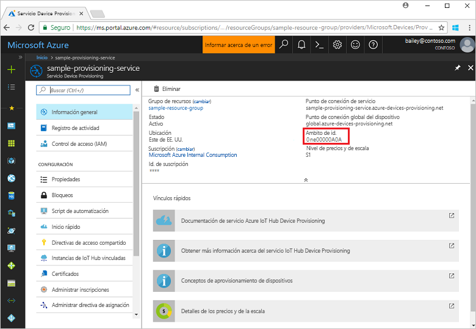
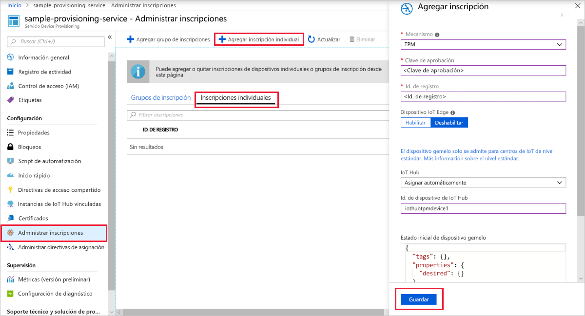
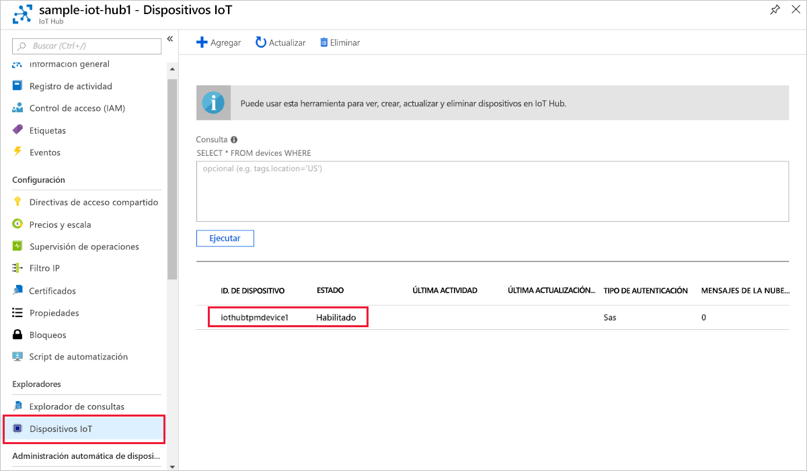

# <a name="quickstart-create-and-provision-a-simulated-tpm-device-using-c-device-sdk-for-iot-hub-device-provisioning-service"></a>Inicio rápido: Creación y aprovisionamiento de un dispositivo de TPM simulado mediante el SDK de dispositivos C# para el servicio Azure IoT Hub Device Provisioning

[!INCLUDE [iot-dps-selector-quick-create-simulated-device-tpm](../../includes/iot-dps-selector-quick-create-simulated-device-tpm.md)]

Estos pasos muestra cómo usar los [ejemplos de Azure IoT para C#](https://github.com/Azure-Samples/azure-iot-samples-csharp) para simular un dispositivo de TPM en un equipo de desarrollo con el sistema operativo Windows. El ejemplo también conecta el dispositivo simulado a una instancia de IoT Hub mediante el servicio Device Provisioning. 

El código de ejemplo utiliza el simulador de TPM de Windows como [módulo de seguridad de hardware (HSM)](https://azure.microsoft.com/blog/azure-iot-supports-new-security-hardware-to-strengthen-iot-security/) del dispositivo. 

Si no está familiarizado con el proceso de aprovisionamiento automático, no olvide revisar los [Conceptos sobre aprovisionamiento automático](concepts-auto-provisioning.md). Asegúrese de completar los pasos descritos en [Configuración del servicio Azure IoT Hub Device Provisioning con Azure Portal](./quick-setup-auto-provision.md) antes de continuar. 

Azure IoT Hub Device Provisioning Service admite dos tipos de inscripciones:

- [Grupos de inscripción](concepts-service.md#enrollment-group): usados para inscribir varios dispositivos relacionados.
- [Inscripciones individuales](concepts-service.md#individual-enrollment): usadas para inscribir un solo dispositivo.

En este artículo se mostrarán las inscripciones individuales.

[!INCLUDE [IoT Device Provisioning Service basic](../../includes/iot-dps-basic.md)]

<a id="setupdevbox"></a>
## <a name="prepare-the-development-environment"></a>Preparación del entorno de desarrollo 

1. Asegúrese de que tiene el [SDK de .Net Core 2.1 o posterior](https://www.microsoft.com/net/download/windows) instalado en la máquina. 

1. Asegúrese de que `git` está instalado en su máquina y se agrega a las variables de entorno accesibles para la ventana de comandos. Consulte las [herramientas de cliente de Git de Software Freedom Conservancy](https://git-scm.com/download/) para instalar la versión más reciente de las herramientas `git`, lo que incluye **Git Bash**, la aplicación de línea de comandos que puede usar para interactuar con su repositorio de Git local. 

1. Abra un símbolo del sistema o Git Bash. Clone el repositorio de GitHub de los ejemplos de Azure IoT para C#:

    ```cmd
    git clone https://github.com/Azure-Samples/azure-iot-samples-csharp.git
    ```

## <a name="provision-the-simulated-device"></a>Aprovisionamiento del dispositivo simulado

1. Inicie sesión en el Portal de Azure. Seleccione el botón **Todos los recursos** en el menú de la izquierda y abra Device Provisioning Service. En la hoja **Información general**, anote el valor de **_Ámbito de id_** .

     

1. En un símbolo del sistema, cambie los directorios al directorio del proyecto del ejemplo de aprovisionamiento de dispositivo de TPM.

    ```cmd
    cd .\azure-iot-samples-csharp\provisioning\Samples\device\TpmSample
    ```

1. Escriba el siguiente comando para compilar y ejecutar el ejemplo de aprovisionamiento de dispositivo de TPM. Reemplace el valor de `<IDScope>` por el ámbito de id. de su servicio de aprovisionamiento. 

    ```cmd
    dotnet run <IDScope>
    ```

    Este comando iniciará el simulador de chip de TPM en un símbolo del sistema independiente. En Windows, es posible que encuentre una alerta de seguridad de Windows que le pregunte si desea permitir que Simulator. exe se comunique en redes públicas. Para los fines de este ejemplo, puede cancelar la solicitud.

1. La ventana de comandos original muestra la **_clave de aprobación_** , el **_identificador de registro_** y un **_identificador de dispositivo_** sugerido, ya que son necesarios para la inscripción del dispositivo. Anote estos valores. Usará estos valores para crear una inscripción individual en la instancia del servicio Device Provisioning. 
   > [!NOTE]
   > No confunda la ventana que contiene la salida del comando con la ventana que contiene la salida desde el simulador de TPM. Es posible que tenga que seleccionar la ventana de comandos original para pasarla al primer plano.

     

1. En Azure Portal, en el menú de Device Provisioning Service, seleccione **Administrar inscripciones**. Seleccione la pestaña **Inscripciones individuales** y seleccione el botón **Agregar inscripción individual** en la parte superior. 

1. En el panel **Agregar inscripción**, escriba la siguiente información:
   - Seleccione **TPM** como *Mecanismo* de atestación de identidad.
   - Escriba los valores de *Id. de registro* y *Clave de aprobación* del dispositivo de TPM que anotó anteriormente.
   - Seleccione un centro de IoT vinculado con el servicio de aprovisionamiento.
   - De forma opcional, puede proporcionar la siguiente información:
       - Escriba un *identificador de dispositivo* único (puede usar el que se sugiere o especificar el suyo propio). Asegúrese de evitar datos confidenciales al asignar nombre al dispositivo. Si decide escribir un nombre, se usará en su lugar el identificador de registro para identificar el dispositivo.
       - Actualice el **Estado inicial del dispositivo gemelo** con la configuración inicial deseada para el dispositivo.
   - Una vez completado, presione el botón **Guardar**. 

       

   Al inscribir el dispositivo correctamente, el *id. del registro* del dispositivo aparecerá en la lista de la pestaña *Individual Enrollments* (Inscripciones individuales). 

1. Presione *Entrar* en la ventana de comandos (el que muestra la **_clave de aprobación_** , el **_identificador de registro_** y un **_identificador de dispositivo_** sugerido) para la inscripción del dispositivo simulado. Tenga en cuenta los mensajes que simulan el arranque del dispositivo y la conexión al servicio Device Provisioning para obtener la información del centro de IoT. 

1. Compruebe que el dispositivo se haya aprovisionado. Si el dispositivo simulado se aprovisiona correctamente en el centro de IoT vinculado con su servicio de aprovisionamiento, el identificador del dispositivo aparece en la hoja **Dispositivos IoT** del centro. 

     

    Si ha cambiado el valor predeterminado de *Estado inicial del dispositivo gemelo* en la entrada de inscripción para el dispositivo, el dispositivo puede extraer el estado gemelo deseado desde el centro y actuar en consecuencia. Para más información, consulte [Información y uso de dispositivos gemelos en IoT Hub](../iot-hub/iot-hub-devguide-device-twins.md).

## <a name="clean-up-resources"></a>Limpieza de recursos

Si planea seguir trabajando con el ejemplo de cliente de dispositivo y explorándolo, no limpie los recursos que se crean en este inicio rápido. Si no va a continuar, use el siguiente comando para eliminar todos los recursos que se han creado en este inicio rápido.

1. Cierre la ventana de salida de ejemplo del cliente del dispositivo en su máquina.
1. Cierre la ventana del simulador de TPM en su máquina.
1. En el menú de la izquierda de Azure Portal, seleccione **Todos los recursos** y seleccione Device Provisioning Service. En la parte superior de la hoja **Información general**, presione **Eliminar** en la parte superior del panel.  
1. En el menú de la izquierda de Azure Portal, seleccione **Todos los recursos** y después su centro de IoT. En la parte superior de la hoja **Información general**, presione **Eliminar** en la parte superior del panel.  

## <a name="next-steps"></a>Pasos siguientes

En este inicio rápido, ha creado un dispositivo de TPM simulado en su máquina y lo ha aprovisionado con IoT Hub mediante Azure IoT Hub Device Provisioning Service. Para obtener información sobre cómo inscribir un dispositivo de TPM mediante programación, siga la guía de inicio rápido para la inscripción de un dispositivo de TPM mediante programación. 

> [!div class="nextstepaction"]
> [Inicio rápido de Azure: Inscripción de dispositivos de TPM en Azure IoT Hub Device Provisioning Service](quick-enroll-device-tpm-csharp.md)
