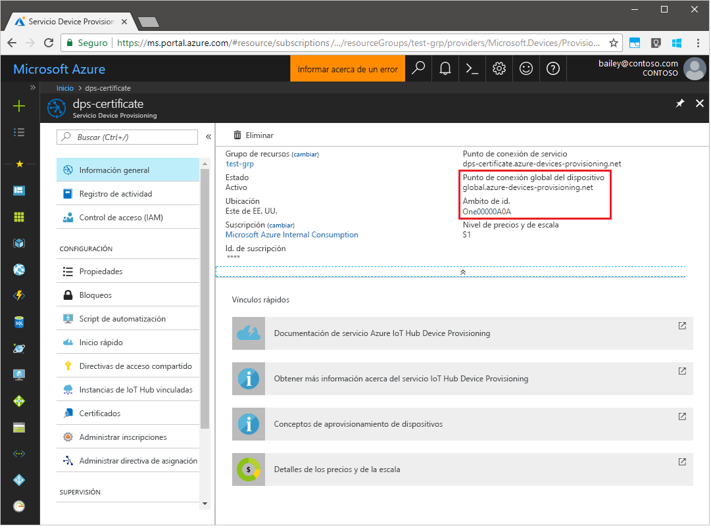
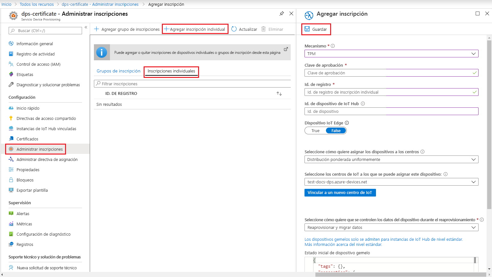
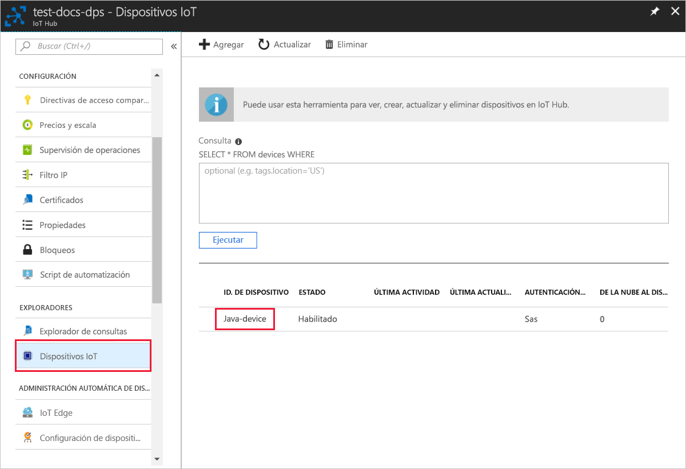

# <a name="quickstart-create-and-provision-a-simulated-tpm-device-using-java-device-sdk-for-azure-iot-hub-device-provisioning-service"></a>Inicio rápido: Creación y aprovisionamiento de un dispositivo de TPM simulado mediante el SDK de dispositivos Java para el servicio Azure IoT Hub Device Provisioning

[!INCLUDE [iot-dps-selector-quick-create-simulated-device-tpm](../../includes/iot-dps-selector-quick-create-simulated-device-tpm.md)]

En este inicio rápido se creará un dispositivo IoT simulado en un equipo Windows. El dispositivo simulado incluye un simulador de TPM como módulo de seguridad de hardware (HSM). Use el código de ejemplo de Java del dispositivo para conectar este dispositivo simulado con su centro de IoT mediante una inscripción individual con el servicio de aprovisionamiento de dispositivos.

## <a name="prerequisites"></a>Prerrequisitos

- Revisión de [Conceptos de aprovisionamiento automático](concepts-auto-provisioning.md).
- Finalización de [Configuración de Azure IoT Hub Device Provisioning Service con Azure Portal](./quick-setup-auto-provision.md).
- Una cuenta de Azure con una suscripción activa. [cree una de forma gratuita](https://azure.microsoft.com/free/?ref=microsoft.com&utm_source=microsoft.com&utm_medium=docs&utm_campaign=visualstudio).
- [Java SE Development Kit 8](https://aka.ms/azure-jdks).
- [Maven](https://maven.apache.org/install.html).
- [Git](https://git-scm.com/download/).

[!INCLUDE [IoT Device Provisioning Service basic](../../includes/iot-dps-basic.md)]

## <a name="prepare-the-environment"></a>Preparación del entorno 

1. Asegúrese de que tiene [Java SE Development Kit 8](https://aka.ms/azure-jdks) instalado en su máquina.

1. Descargue e instale [Maven](https://maven.apache.org/install.html).

1. Asegúrese de que `git` está instalado en su máquina y se agrega a las variables de entorno accesibles para la ventana de comandos. Consulte las [herramientas de cliente de Git de Software Freedom Conservancy](https://git-scm.com/download/) para instalar la versión más reciente de las herramientas `git`, lo que incluye **Git Bash**, la aplicación de línea de comandos que puede usar para interactuar con su repositorio de Git local. 

1. Abra un símbolo del sistema. Clone el repositorio GitHub para el ejemplo de código de simulación de dispositivo.
    
    ```cmd/sh
    git clone https://github.com/Azure/azure-iot-sdk-java.git --recursive
    ```

1. Ejecute el simulador de [TPM](https://docs.microsoft.com/windows/device-security/tpm/trusted-platform-module-overview) para que sea el [HSM](https://azure.microsoft.com/blog/azure-iot-supports-new-security-hardware-to-strengthen-iot-security/) para el dispositivo simulado. Haga clic en **Permitir acceso** para permitir cambios en la configuración del _Firewall de Windows_. Atiende en un socket en los puertos 2321 y 2322. No cierre esta ventana; debe mantener este simulador ejecutándose hasta el final de esta guía de inicio rápido. 

    ```cmd/sh
    .\azure-iot-sdk-java\provisioning\provisioning-tools\tpm-simulator\Simulator.exe
    ```

    

1. En un símbolo del sistema independiente, vaya a la carpeta raíz y compile las dependencias de ejemplo.

    ```cmd/sh
    cd azure-iot-sdk-java
    mvn install -DskipTests=true
    ```

1. Navegue hasta la carpeta de ejemplos.

    ```cmd/sh
    cd provisioning/provisioning-samples/provisioning-tpm-sample
    ```

1. Inicie sesión en Azure Portal, seleccione el botón **Todos los recursos** en el menú de la izquierda y abra Device Provisioning Service. Anote los valores de _Ámbito de id._ y _Provisioning Service Global Endpoint_ (Punto de conexión global del servicio de aprovisionamiento).

    

1. Edite el archivo `src/main/java/samples/com/microsoft/azure/sdk/iot/ProvisioningTpmSample.java` para que incluya el _Ámbito de id._ y el _Provisioning Service Global Endpoint_ (Punto de conexión global del Servicio de aprovisionamiento) tal y como se indicó antes.  

    ```java
    private static final String idScope = "[Your ID scope here]";
    private static final String globalEndpoint = "[Your Provisioning Service Global Endpoint here]";
    private static final ProvisioningDeviceClientTransportProtocol PROVISIONING_DEVICE_CLIENT_TRANSPORT_PROTOCOL = ProvisioningDeviceClientTransportProtocol.HTTPS;
    ```
    Guarde el archivo.

1. Use los siguientes comandos para compilar el proyecto, vaya a la carpeta de destino y ejecute el archivo. jar que se ha creado. Reemplace el marcador de posición `version` por su versión de Java.

    ```cmd/sh
    mvn clean install
    cd target
    java -jar ./provisioning-tpm-sample-{version}-with-deps.jar
    ```

1. El programa inicia la ejecución. Anote los valores de _Clave de aprobación_ e _Id. de registro_ de la sección siguiente y deje el programa ejecutándose.

    
    

## <a name="create-a-device-enrollment-entry"></a>Creación de una entrada de inscripción de dispositivo

Azure IoT Hub Device Provisioning Service admite dos tipos de inscripciones:

- [Grupos de inscripción](concepts-service.md#enrollment-group): usados para inscribir varios dispositivos relacionados.
- [Inscripciones individuales](concepts-service.md#individual-enrollment): usadas para inscribir un solo dispositivo.

En este artículo se muestran las inscripciones individuales.

1. Inicie sesión en Azure Portal, seleccione el botón **Todos los recursos** en el menú de la izquierda y abra Device Provisioning Service.

1. En el menú de Device Provisioning Service, seleccione **Administrar inscripciones**. Seleccione la pestaña **Inscripciones individuales** y seleccione el botón **Agregar inscripción individual** de la parte superior. 

1. En el panel **Agregar inscripción**, escriba la siguiente información:
   - Seleccione **TPM** como *Mecanismo* de atestación de identidad.
   - Escriba los valores de *Id. de registro* y *Clave de aprobación* del dispositivo de TPM que anotó anteriormente.
   - Seleccione un centro de IoT vinculado con el servicio de aprovisionamiento.
   - De forma opcional, puede proporcionar la siguiente información:
       - Escriba un *identificador de dispositivo* único. Asegúrese de evitar datos confidenciales al asignar nombre al dispositivo. Si decide escribir un nombre, se usará en su lugar el identificador de registro para identificar el dispositivo.
       - Actualice el **Estado inicial del dispositivo gemelo** con la configuración inicial deseada para el dispositivo.
   - Una vez completado, presione el botón **Guardar**. 

       

   Al inscribir el dispositivo correctamente, el valor de *Id. de registro* del dispositivo aparece en la lista de la pestaña *Inscripciones individuales*. 


## <a name="simulate-the-device"></a>Simulación del dispositivo

1. En la ventana de comandos que ejecuta el código de ejemplo de Java en la máquina, presione *Entrar* para seguir ejecutando la aplicación. Tenga en cuenta los mensajes que simulan el arranque del dispositivo y la conexión al servicio Device Provisioning para obtener la información del centro de IoT.  

    

1. Si el dispositivo simulado se aprovisiona correctamente en el centro de IoT vinculado con su servicio de aprovisionamiento, el identificador del dispositivo aparece en la hoja **Dispositivos IoT** del centro.

     

    Si ha cambiado el valor predeterminado de *Estado inicial del dispositivo gemelo* en la entrada de inscripción para el dispositivo, el dispositivo puede extraer el estado gemelo deseado desde el centro y actuar en consecuencia. Para más información, consulte [Información y uso de dispositivos gemelos en IoT Hub](../iot-hub/iot-hub-devguide-device-twins.md).


## <a name="clean-up-resources"></a>Limpieza de recursos

Si planea seguir trabajando con el ejemplo de cliente de dispositivo y explorándolo, no limpie los recursos que se crean en este inicio rápido. Si no va a continuar, use el siguiente comando para eliminar todos los recursos que se han creado en este inicio rápido.

1. Cierre la ventana de salida de ejemplo del cliente del dispositivo en su máquina.
1. Cierre la ventana del simulador de TPM en su máquina.
1. En el menú de la izquierda de Azure Portal, seleccione **Todos los recursos** y seleccione Device Provisioning Service. Abra la hoja **Administrar inscripciones** de su servicio y, después, seleccione la pestaña **Inscripciones individuales**. Active la casilla situada junto al campo *ID. DE REGISTRO* del dispositivo que ha inscrito en este inicio rápido y presione el botón **Eliminar** situado en la parte superior del panel. 
1. En el menú de la izquierda de Azure Portal, seleccione **Todos los recursos** y después su centro de IoT. Abra la hoja **Dispositivos IoT** de su centro, active la casilla junto al *identificador de dispositivo* del dispositivo que registró en este inicio rápido y, luego, presione el botón **Eliminar** situado en la parte superior del panel.

## <a name="next-steps"></a>Pasos siguientes

En este inicio rápido, ha creado un dispositivo de TPM simulado en su máquina y lo ha aprovisionado con IoT Hub mediante Azure IoT Hub Device Provisioning Service. Para obtener información sobre cómo inscribir un dispositivo de TPM mediante programación, siga la guía de inicio rápido para la inscripción de un dispositivo de TPM mediante programación. 

> [!div class="nextstepaction"]
> [Inicio rápido de Azure: Inscripción de dispositivos de TPM en Azure IoT Hub Device Provisioning Service](quick-enroll-device-tpm-java.md)
