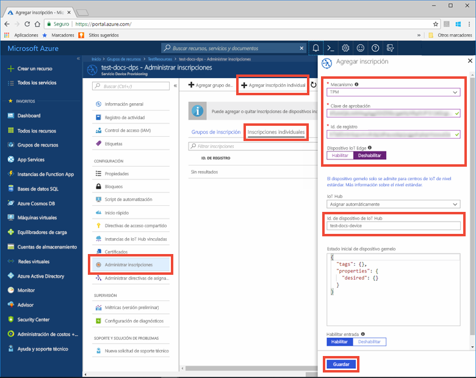
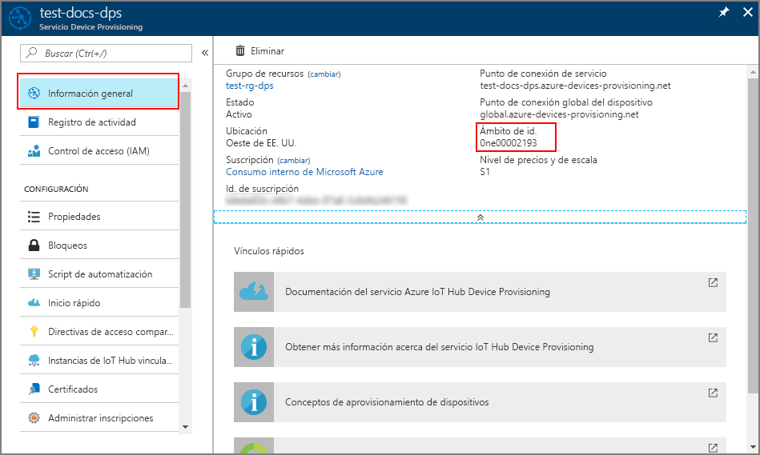
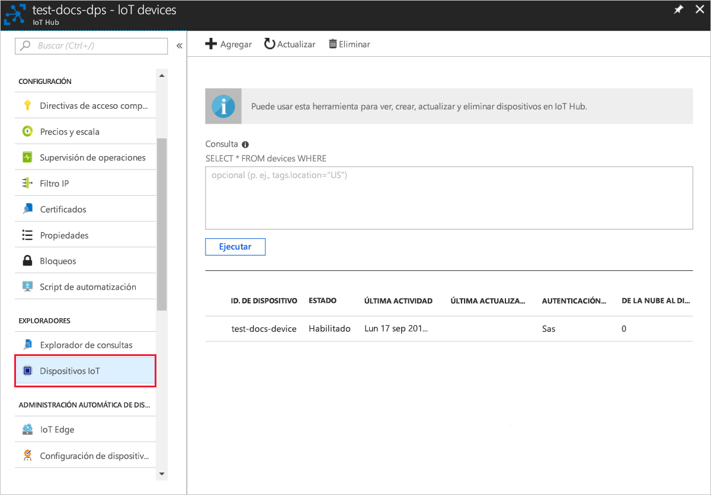

# <a name="quickstart-create-and-provision-a-simulated-tpm-device-using-nodejs-device-sdk-for-iot-hub-device-provisioning-service"></a>Inicio rápido: Creación y aprovisionamiento de un dispositivo de TPM simulado mediante el SDK de dispositivos Python para el servicio IoT Hub Device Provisioning

[!INCLUDE [iot-dps-selector-quick-create-simulated-device-tpm](../../includes/iot-dps-selector-quick-create-simulated-device-tpm.md)]

En este inicio rápido se creará un dispositivo IoT simulado en un equipo Windows. El dispositivo simulado incluye un simulador de TPM como módulo de seguridad de hardware (HSM). Use el código de ejemplo de Node.js del dispositivo para conectar este dispositivo simulado con su centro de IoT mediante una inscripción individual con el servicio de aprovisionamiento de dispositivos.

## <a name="prerequisites"></a>Prerrequisitos

- Revisión de [Conceptos de aprovisionamiento automático](concepts-auto-provisioning.md).
- Finalización de [Configuración de Azure IoT Hub Device Provisioning Service con Azure Portal](./quick-setup-auto-provision.md).
- Una cuenta de Azure con una suscripción activa. [cree una de forma gratuita](https://azure.microsoft.com/free/?ref=microsoft.com&utm_source=microsoft.com&utm_medium=docs&utm_campaign=visualstudio).
- [Node.js v4.0+](https://nodejs.org).
- [Git](https://git-scm.com/download/).

[!INCLUDE [IoT Device Provisioning Service basic](../../includes/iot-dps-basic.md)]

## <a name="prepare-the-environment"></a>Preparación del entorno 

1. Asegúrese de que tiene [Node.js v4.0 o posterior](https://nodejs.org) instalado en su máquina.

1. Asegúrese de que `git` está instalado en su máquina y se agrega a las variables de entorno accesibles para la ventana de comandos. Consulte las [herramientas de cliente de Git de Software Freedom Conservancy](https://git-scm.com/download/) para instalar la versión más reciente de las herramientas `git`, lo que incluye **Git Bash**, la aplicación de línea de comandos que puede usar para interactuar con su repositorio de Git local. 


## <a name="simulate-a-tpm-device"></a>Simulación del dispositivo de TPM

1. Abra un símbolo del sistema o Git Bash. Clone el `azure-utpm-c` repositorio de GitHub:
    
    ```cmd/sh
    git clone https://github.com/Azure/azure-utpm-c.git --recursive
    ```

1. Vaya a la carpeta raíz de GitHub y ejecute el simulador de [TPM](https://docs.microsoft.com/windows/device-security/tpm/trusted-platform-module-overview) para que sea el [HSM](https://azure.microsoft.com/blog/azure-iot-supports-new-security-hardware-to-strengthen-iot-security/) para el dispositivo simulado. Atiende en un socket en los puertos 2321 y 2322. No cierre esta ventana de comandos; el simulador debe seguir en funcionamiento hasta el final de la guía: 

    ```cmd/sh
    .\azure-utpm-c\tools\tpm_simulator\Simulator.exe
    ```

1. Cree una nueva carpeta vacía denominada **registerdevice**. En la carpeta **registerdevice**, cree un archivo package.json escribiendo el siguiente comando en el símbolo del sistema. Asegúrese de que responde a todas las preguntas que realiza `npm` o acepte los valores predeterminados si le convienen:
   
    ```cmd/sh
    npm init
    ```

1. Instale los siguientes paquetes precursores:

    ```cmd/sh
    npm install node-gyp -g
    npm install ffi -g
    ```

    > [!NOTE]
    > Hay algunos problemas conocidos al instalar los paquetes anteriores. Para resolver estos problemas, ejecute `npm install --global --production windows-build-tools` desde un símbolo del sistema en modo **Ejecutar como administrador**, ejecute `SET VCTargetsPath=C:\Program Files (x86)\MSBuild\Microsoft.Cpp\v4.0\V140` después de reemplazar la ruta de acceso por la versión instalada y, luego, vuelva a ejecutar los comandos de la instalación anterior.
    >

1. Instale los siguientes paquetes que contienen los componentes utilizados durante el registro:

   - un cliente de seguridad que funciona con TPM: `azure-iot-security-tpm`
   - un transporte para que el dispositivo se conecte al servicio Device Provisioning: `azure-iot-provisioning-device-http` o `azure-iot-provisioning-device-amqp`
   - un cliente que use el transporte y el cliente de seguridad: `azure-iot-provisioning-device`

     Una vez que el dispositivo esté registrado, puede utilizar los paquetes habituales de cliente de dispositivos de IoT Hub para conectar el dispositivo con las credenciales que proporcionan durante el registro. Necesitará:

   - el cliente de dispositivo: `azure-iot-device`
   - un transporte: `azure-iot-device-amqp`, `azure-iot-device-mqtt` o `azure-iot-device-http`
   - el cliente de seguridad que ya ha instalado: `azure-iot-security-tpm`

     > [!NOTE]
     > En los ejemplos siguientes se usan los transportes `azure-iot-provisioning-device-http` y `azure-iot-device-mqtt`.
     > 

     Para instalar todos estos paquetes a la vez, ejecute el comando siguiente en el símbolo del sistema en la carpeta **registerdevice**:

       ```cmd/sh
       npm install --save azure-iot-device azure-iot-device-mqtt azure-iot-security-tpm azure-iot-provisioning-device-http azure-iot-provisioning-device
       ```

1. Con un editor de texto, cree un nuevo archivo, **ExtractDevice.js**, en la carpeta **registerdevice**.

1. Agregue las siguientes instrucciones `require` al principio del archivo **ExtractDevice.js** :
   
    ```
    'use strict';

    var tpmSecurity = require('azure-iot-security-tpm');
    var tssJs = require("tss.js");

    var myTpm = new tpmSecurity.TpmSecurityClient(undefined, new tssJs.Tpm(true));
    ```

1. Agregue la siguiente función para implementar el método:
   
    ```
    myTpm.getEndorsementKey(function(err, endorsementKey) {
      if (err) {
        console.log('The error returned from get key is: ' + err);
      } else {
        console.log('the endorsement key is: ' + endorsementKey.toString('base64'));
        myTpm.getRegistrationId((getRegistrationIdError, registrationId) => {
          if (getRegistrationIdError) {
            console.log('The error returned from get registration id is: ' + getRegistrationIdError);
          } else {
            console.log('The Registration Id is: ' + registrationId);
            process.exit();
          }
        });
      }
    });
    ```

1. Guarde y cierre el archivo **ExtractDevice.js**. Ejecución del ejemplo:

    ```cmd/sh
    node ExtractDevice.js
    ```

1. La ventana de salida muestra los valores de **_Clave de aprobación_** e **_Id. de registro_** necesarios para la inscripción del dispositivo. Anote estos valores. 


## <a name="create-a-device-entry"></a>Creación de una entrada del dispositivo

Azure IoT Hub Device Provisioning Service admite dos tipos de inscripciones:

- [Grupos de inscripción](concepts-service.md#enrollment-group): usados para inscribir varios dispositivos relacionados.
- [Inscripciones individuales](concepts-service.md#individual-enrollment): usadas para inscribir un solo dispositivo.

En este artículo se muestran las inscripciones individuales.

1. Inicie sesión en Azure Portal, seleccione el botón **Todos los recursos** en el menú de la izquierda y abra Device Provisioning Service.

1. En el menú de Device Provisioning Service, seleccione **Administrar inscripciones**. Seleccione la pestaña **Inscripciones individuales** y seleccione el botón **Agregar inscripción individual** de la parte superior. 

1. En el panel **Agregar inscripción**, escriba la siguiente información:
   - Seleccione **TPM** como *Mecanismo* de atestación de identidad.
   - Escriba los valores de *Id. de registro* y *Clave de aprobación* del dispositivo de TPM que anotó anteriormente.
   - Seleccione un centro de IoT vinculado con el servicio de aprovisionamiento.
   - De forma opcional, puede proporcionar la siguiente información:
       - Escriba un *identificador de dispositivo* único. Asegúrese de evitar datos confidenciales al asignar nombre al dispositivo. Si decide escribir un nombre, se usará en su lugar el identificador de registro para identificar el dispositivo.
       - Actualice el **Estado inicial del dispositivo gemelo** con la configuración inicial deseada para el dispositivo.
   - Una vez completado, presione el botón **Guardar**. 

       

   Al inscribir el dispositivo correctamente, el valor de *Id. de registro* del dispositivo aparece en la lista de la pestaña *Inscripciones individuales*. 


## <a name="register-the-device"></a>Registro del dispositivo

1. En Azure Portal, seleccione la hoja **Información general** de Device Provisioning Service y anote los valores de **_Punto de conexión global del dispositivo_** y **_Ámbito de id_** .

     

1. Con un editor de texto, cree un nuevo archivo, **RegisterDevice.js**, en la carpeta **registerdevice**.

1. Agregue las siguientes instrucciones `require` al principio del archivo **RegisterDevice.js** :
   
    ```
    'use strict';

    var ProvisioningTransport = require('azure-iot-provisioning-device-http').Http;
    var iotHubTransport = require('azure-iot-device-mqtt').Mqtt;
    var Client = require('azure-iot-device').Client;
    var Message = require('azure-iot-device').Message;
    var tpmSecurity = require('azure-iot-security-tpm');
    var ProvisioningDeviceClient = require('azure-iot-provisioning-device').ProvisioningDeviceClient;
    ```

    > [!NOTE]
    > El **SDK de IoT de Azure para Node.js** admite protocolos adicionales, como _AMQP_, _AMQP WS_ y _MQTT WS_.  Para ver más ejemplos, consulte [Samples for the Azure IoT Device Provisioning Service SDK for Node.js](https://github.com/Azure/azure-iot-sdk-node/tree/master/provisioning/device/samples) (Ejemplos del SDK de servicio de aprovisionamiento de dispositivos de Azure IoT para Node.js).
    > 

1. Agregue las variables **globalDeviceEndpoint** e **idScope** y úselas para crear una instancia de **ProvisioningDeviceClient**. Reemplace **{globalDeviceEndpoint}** e **{idScope}** por los valores de **_Punto de conexión global del dispositivo_**  y **_Ámbito de id_** del **paso 1**:
   
    ```
    var provisioningHost = '{globalDeviceEndpoint}';
    var idScope = '{idScope}';

    var tssJs = require("tss.js");
    var securityClient = new tpmSecurity.TpmSecurityClient('', new tssJs.Tpm(true));
    // if using non-simulated device, replace the above line with following:
    //var securityClient = new tpmSecurity.TpmSecurityClient();

    var provisioningClient = ProvisioningDeviceClient.create(provisioningHost, idScope, new ProvisioningTransport(), securityClient);
    ```

1. Agregue la siguiente función para implementar el método en el dispositivo:
   
    ```
    provisioningClient.register(function(err, result) {
      if (err) {
        console.log("error registering device: " + err);
      } else {
        console.log('registration succeeded');
        console.log('assigned hub=' + result.registrationState.assignedHub);
        console.log('deviceId=' + result.registrationState.deviceId);
        var tpmAuthenticationProvider = tpmSecurity.TpmAuthenticationProvider.fromTpmSecurityClient(result.registrationState.deviceId, result.registrationState.assignedHub, securityClient);
        var hubClient = Client.fromAuthenticationProvider(tpmAuthenticationProvider, iotHubTransport);

        var connectCallback = function (err) {
          if (err) {
            console.error('Could not connect: ' + err.message);
          } else {
            console.log('Client connected');
            var message = new Message('Hello world');
            hubClient.sendEvent(message, printResultFor('send'));
          }
        };

        hubClient.open(connectCallback);

        function printResultFor(op) {
          return function printResult(err, res) {
            if (err) console.log(op + ' error: ' + err.toString());
            if (res) console.log(op + ' status: ' + res.constructor.name);
            process.exit(1);
          };
        }
      }
    });
    ```

1. Guarde el archivo **RegisterDevice.js** y ciérrelo. Ejecución del ejemplo:

    ```cmd/sh
    node RegisterDevice.js
    ```

1. Tenga en cuenta los mensajes que simulan el arranque del dispositivo y la conexión al servicio Device Provisioning para obtener la información del centro de IoT. Si el dispositivo simulado se aprovisiona correctamente en el centro de IoT vinculado con su servicio de aprovisionamiento, el identificador del dispositivo aparece en la hoja **Dispositivos IoT** del centro. 

     

    Si ha cambiado el valor predeterminado de *Estado inicial del dispositivo gemelo* en la entrada de inscripción para el dispositivo, el dispositivo puede extraer el estado gemelo deseado desde el centro y actuar en consecuencia. Para más información, consulte [Información y uso de dispositivos gemelos en IoT Hub](../iot-hub/iot-hub-devguide-device-twins.md)


## <a name="clean-up-resources"></a>Limpieza de recursos

Si planea seguir trabajando con el ejemplo de cliente de dispositivo y explorándolo, no limpie los recursos que se crean en este inicio rápido. Si no va a continuar, use el siguiente comando para eliminar todos los recursos que se han creado en este inicio rápido.

1. Cierre la ventana de salida de ejemplo del cliente del dispositivo en su máquina.
1. Cierre la ventana del simulador de TPM en su máquina.
1. En el menú de la izquierda de Azure Portal, seleccione **Todos los recursos** y seleccione Device Provisioning Service. Abra la hoja **Administrar inscripciones** de su servicio y, después, seleccione la pestaña **Inscripciones individuales**. Active la casilla situada junto al campo *ID. DE REGISTRO* del dispositivo que ha inscrito en este inicio rápido y presione el botón **Eliminar** situado en la parte superior del panel. 
1. En el menú de la izquierda de Azure Portal, seleccione **Todos los recursos** y después su centro de IoT. Abra la hoja **Dispositivos IoT** de su centro, active la casilla junto al *identificador de dispositivo* del dispositivo que registró en este inicio rápido y, luego, presione el botón **Eliminar** situado en la parte superior del panel.


## <a name="next-steps"></a>Pasos siguientes

En este inicio rápido, ha creado un dispositivo de TPM simulado en su máquina y lo ha aprovisionado con IoT Hub mediante Azure IoT Hub Device Provisioning Service. Para obtener información sobre cómo inscribir un dispositivo de TPM mediante programación, siga la guía de inicio rápido para la inscripción de un dispositivo de TPM mediante programación. 

> [!div class="nextstepaction"]
> [Inicio rápido de Azure: Inscripción de dispositivos de TPM en Azure IoT Hub Device Provisioning Service](quick-enroll-device-tpm-node.md)
