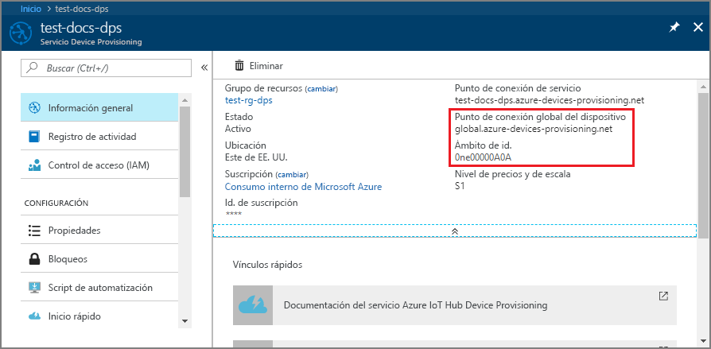
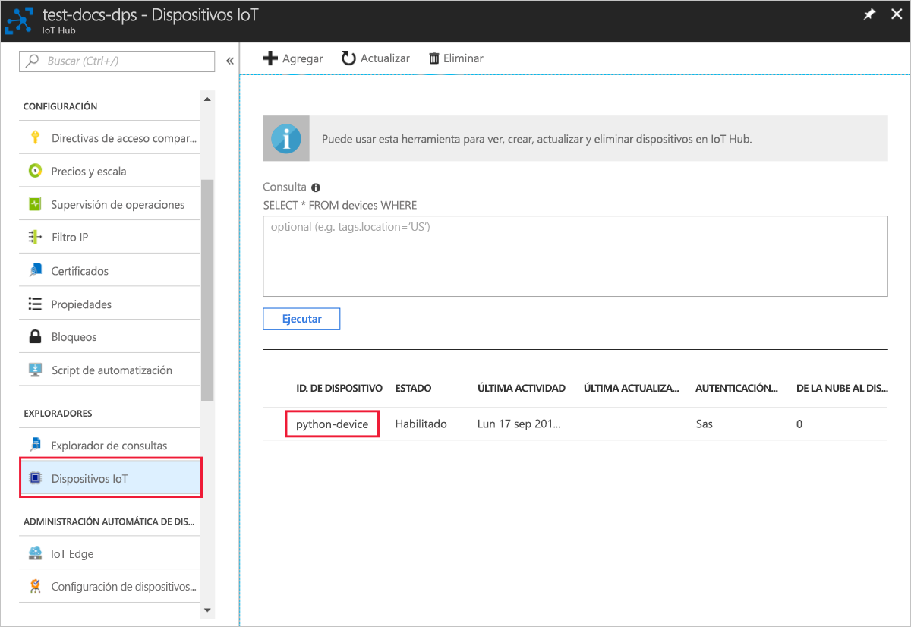

# <a name="quickstart-create-and-provision-a-simulated-tpm-device-using-python-device-sdk-for-iot-hub-device-provisioning-service"></a>Inicio rápido: Creación y aprovisionamiento de un dispositivo TPM simulado mediante el SDK de dispositivos Python para el servicio IoT Hub Device Provisioning

[!INCLUDE [iot-dps-selector-quick-create-simulated-device-tpm](../../includes/iot-dps-selector-quick-create-simulated-device-tpm.md)]

En este inicio rápido se creará un dispositivo IoT simulado en un equipo Windows. El dispositivo simulado incluye un simulador de TPM como módulo de seguridad de hardware (HSM). Use el código de ejemplo de Python del dispositivo para conectar este dispositivo simulado con su centro de IoT mediante una inscripción individual con el servicio de aprovisionamiento de dispositivos.

## <a name="prerequisites"></a>Prerrequisitos

- Revisión de [Conceptos de aprovisionamiento automático](concepts-auto-provisioning.md).
- Finalización de [Configuración de Azure IoT Hub Device Provisioning Service con Azure Portal](./quick-setup-auto-provision.md).
- Una cuenta de Azure con una suscripción activa. [cree una de forma gratuita](https://azure.microsoft.com/free/?ref=microsoft.com&utm_source=microsoft.com&utm_medium=docs&utm_campaign=visualstudio).
- [Visual Studio 2015+](https://visualstudio.microsoft.com/vs/) con desarrollo para el escritorio con C++.
- [Sistema de compilación de CMake](https://cmake.org/download/).
- [Git](https://git-scm.com/download/).

> [!IMPORTANT]
> Este artículo solo se aplica al SDK de Python v1 en desuso. El dispositivo y los clientes del servicio para IoT Hub Device Provisioning Service aún no están disponibles en la versión 2. Actualmente, el equipo está haciendo todo lo posible para incorporar la versión 2 a la paridad de características.

[!INCLUDE [IoT Device Provisioning Service basic](../../includes/iot-dps-basic.md)]

## <a name="prepare-the-environment"></a>Preparación del entorno 

1. Asegúrese de que ha instalado [Visual Studio](https://visualstudio.microsoft.com/vs/) 2015 o posterior, con la carga de trabajo "Desarrollo para el escritorio con C++" habilitada para la instalación de Visual Studio.

1. Descargue e instale el [sistema de compilación CMake](https://cmake.org/download/).

1. Asegúrese de que `git` está instalado en su máquina y se agrega a las variables de entorno accesibles para la ventana de comandos. Consulte las [herramientas de cliente de Git de Software Freedom Conservancy](https://git-scm.com/download/) para instalar la versión más reciente de las herramientas `git`, lo que incluye **Git Bash**, la aplicación de línea de comandos que puede usar para interactuar con su repositorio de Git local. 

1. Abra un símbolo del sistema o Git Bash. Clone el repositorio GitHub para el ejemplo de código de simulación de dispositivo:
    
    ```cmd/sh
    git clone --single-branch --branch v1-deprecated https://github.com/Azure/azure-iot-sdk-python.git --recursive
    ```

1. Cree una carpeta en su copia local de este repositorio GitHub para el proceso de compilación de CMake. 

    ```cmd/sh
    cd azure-iot-sdk-python/c
    mkdir cmake
    cd cmake
    ```

1. El ejemplo de código utiliza un simulador de Windows TPM. Ejecute el siguiente comando para habilitar la autenticación de token SAS. También genera una solución de Visual Studio para el dispositivo simulado.

    ```cmd/sh
    cmake -Duse_prov_client:BOOL=ON -Duse_tpm_simulator:BOOL=ON ..
    ```

1. En un símbolo del sistema independiente, vaya a la carpeta del simulador de TPM y ejecute el simulador de [TPM](https://docs.microsoft.com/windows/device-security/tpm/trusted-platform-module-overview) para que sea el [HSM](https://azure.microsoft.com/blog/azure-iot-supports-new-security-hardware-to-strengthen-iot-security/) para el dispositivo simulado. Haga clic en **Permitir acceso**. Atiende en un socket en los puertos 2321 y 2322. No cierre esta ventana de comandos; la ejecución del no debe interrumpirse hasta el final de esta guía de inicio rápido. 

    ```cmd/sh
    .\azure-iot-sdk-python\c\provisioning_client\deps\utpm\tools\tpm_simulator\Simulator.exe
    ```

    


## <a name="create-a-device-enrollment-entry"></a>Creación de una entrada de inscripción de dispositivo

Azure IoT Hub Device Provisioning Service admite dos tipos de inscripciones:

- [Grupos de inscripción](concepts-service.md#enrollment-group): usados para inscribir varios dispositivos relacionados.
- [Inscripciones individuales](concepts-service.md#individual-enrollment): usadas para inscribir un solo dispositivo.

En este artículo se muestran las inscripciones individuales.

1. Abra la solución generada en la carpeta *cmake* denominada `azure_iot_sdks.sln` y compílela en Visual Studio.

1. Haga clic con el botón derecho en el proyecto **tpm_device_provision** y seleccione **Establecer como proyecto de inicio**. Ejecute la solución. La ventana de salida muestra los valores de **_Clave de aprobación_** e **_Id. de registro_** necesarios para la inscripción del dispositivo. Anote estos valores. 

    

1. Inicie sesión en Azure Portal, seleccione el botón **Todos los recursos** en el menú de la izquierda y abra Device Provisioning Service.

1. En el menú de Device Provisioning Service, seleccione **Administrar inscripciones**. Seleccione la pestaña **Inscripciones individuales** y seleccione el botón **Agregar inscripción individual** de la parte superior. 

1. En el panel **Agregar inscripción**, escriba la siguiente información:
   - Seleccione **TPM** como *Mecanismo* de atestación de identidad.
   - Escriba los valores de *Id. de registro* y *Clave de aprobación* del dispositivo de TPM que anotó anteriormente.
   - Seleccione un centro de IoT vinculado con el servicio de aprovisionamiento.
   - De forma opcional, puede proporcionar la siguiente información:
       - Escriba un *identificador de dispositivo* único. Asegúrese de evitar datos confidenciales al asignar nombre al dispositivo. Si decide escribir un nombre, se usará en su lugar el identificador de registro para identificar el dispositivo.
       - Actualice el **Estado inicial del dispositivo gemelo** con la configuración inicial deseada para el dispositivo.
   - Una vez completado, presione el botón **Guardar**. 

       

   Al inscribir el dispositivo correctamente, el *id. del registro* del dispositivo aparecerá en la lista de la pestaña *Individual Enrollments* (Inscripciones individuales). 


## <a name="simulate-the-device"></a>Simulación del dispositivo

1. Descargue e instale [Python 2.x o 3.x](https://www.python.org/downloads/). Asegúrese de usar la instalación de 32 bits o 64 bits en función del programa de instalación. Cuando se le solicite durante la instalación, asegúrese de agregar Python a las variables de entorno específicas de la plataforma.
    - Si usa el sistema operativo Windows, puede que necesite el [paquete redistribuible de Visual C++](https://support.microsoft.com/help/2977003/the-latest-supported-visual-c-downloads) para permitir el uso de archivos DLL nativos de Python.

1. Siga [estas instrucciones](https://github.com/Azure/azure-iot-sdk-python/blob/v1-deprecated/doc/python-devbox-setup.md) para compilar los paquetes de Python.

   > [!NOTE]
   > Si ejecuta `build_client.cmd`, asegúrese de usar la marca `--use-tpm-simulator`.
   > 
   > [!NOTE]
   > Si usa `pip`, asegúrese de instalar también el paquete `azure-iot-provisioning-device-client`. Tenga en cuenta que los paquetes de PIP publicados utilizan el TPM real y no el simulador. Para usar el simulador, debe compilar desde el código fuente mediante la marca `--use-tpm-simulator`.

1. Navegue hasta la carpeta de ejemplos.

    ```cmd/sh
    cd azure-iot-sdk-python/provisioning_device_client/samples
    ```

1. Con el IDE de Python, edite el script de Python llamado **provisioning\_device\_client\_sample.py**. Modifique las variables *GLOBAL\_PROV\_URI* e *ID\_SCOPE* con los valores que se han indicado anteriormente. Asegúrese también de que *SECURITY\_DEVICE\_TYPE* está establecido en `ProvisioningSecurityDeviceType.TPM`

    ```python
    GLOBAL_PROV_URI = "{globalServiceEndpoint}"
    ID_SCOPE = "{idScope}"
    SECURITY_DEVICE_TYPE = ProvisioningSecurityDeviceType.TPM
    PROTOCOL = ProvisioningTransportProvider.HTTP
    ```

    

1. Ejecute el ejemplo. 

    ```cmd/sh
    python provisioning_device_client_sample.py
    ```

1. Tenga en cuenta los mensajes que simulan el arranque del dispositivo y la conexión al servicio Device Provisioning para obtener la información del centro de IoT. 

    

1. Si el dispositivo simulado se aprovisiona correctamente en el centro de IoT vinculado con su servicio de aprovisionamiento, el identificador del dispositivo aparece en la hoja **Dispositivos IoT** del centro.

     

    Si ha cambiado el valor predeterminado de *Estado inicial del dispositivo gemelo* en la entrada de inscripción para el dispositivo, el dispositivo puede extraer el estado gemelo deseado desde el centro y actuar en consecuencia. Para más información, consulte [Información y uso de dispositivos gemelos en IoT Hub](../iot-hub/iot-hub-devguide-device-twins.md)


## <a name="clean-up-resources"></a>Limpieza de recursos

Si planea seguir trabajando con el ejemplo de cliente de dispositivo y explorándolo, no limpie los recursos que se crean en este inicio rápido. Si no va a continuar, use el siguiente comando para eliminar todos los recursos que se han creado en este inicio rápido.

1. Cierre la ventana de salida de ejemplo del cliente del dispositivo en su máquina.
1. Cierre la ventana del simulador de TPM en su máquina.
1. En el menú de la izquierda de Azure Portal, seleccione **Todos los recursos** y seleccione Device Provisioning Service. Abra la hoja **Administrar inscripciones** de su servicio y, después, seleccione la pestaña **Inscripciones individuales**. Active la casilla situada junto al campo *ID. DE REGISTRO* del dispositivo que ha inscrito en este inicio rápido y presione el botón **Eliminar** situado en la parte superior del panel. 
1. En el menú de la izquierda de Azure Portal, seleccione **Todos los recursos** y después su centro de IoT. Abra la hoja **Dispositivos IoT** de su centro, active la casilla junto al *identificador de dispositivo* del dispositivo que registró en este inicio rápido y, luego, presione el botón **Eliminar** situado en la parte superior del panel.

## <a name="next-steps"></a>Pasos siguientes

En este inicio rápido, ha creado un dispositivo de TPM simulado en su máquina y lo ha aprovisionado con IoT Hub mediante Azure IoT Hub Device Provisioning Service. Para obtener información sobre cómo inscribir un dispositivo de TPM mediante programación, siga la guía de inicio rápido para la inscripción de un dispositivo de TPM mediante programación. 

> [!div class="nextstepaction"]
> [Inicio rápido de Azure: Inscripción de dispositivos de TPM en Azure IoT Hub Device Provisioning Service](quick-enroll-device-tpm-python.md)
