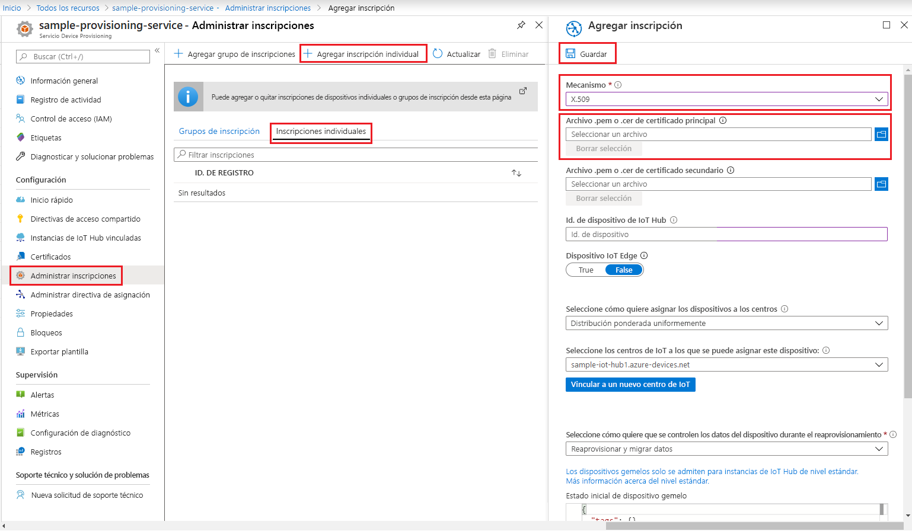
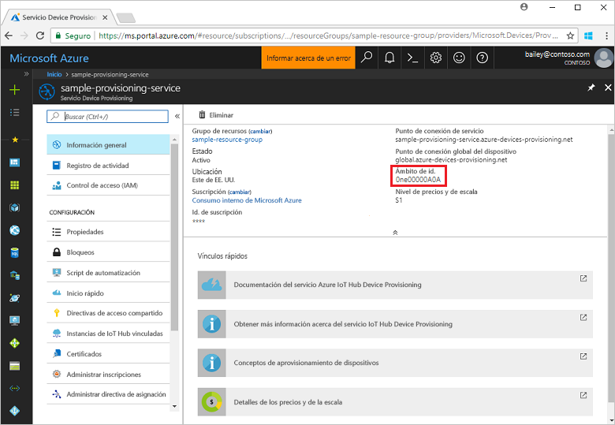
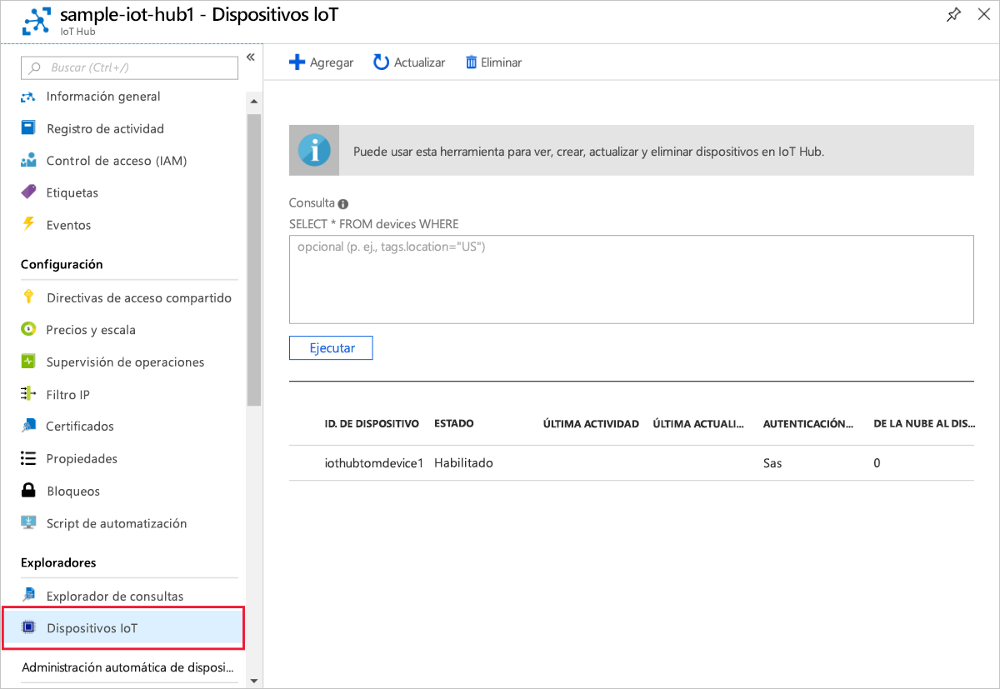

# <a name="create-and-provision-a-simulated-x509-device-using-c-device-sdk-for-iot-hub-device-provisioning-service"></a>Creación y aprovisionamiento de un dispositivo X.509 simulado mediante el SDK de dispositivos C# para el servicio IoT Hub Device Provisioning
[!INCLUDE [iot-dps-selector-quick-create-simulated-device-x509](../../includes/iot-dps-selector-quick-create-simulated-device-x509.md)]

Estos pasos muestra cómo usar los [ejemplos de Azure IoT para C#](https://github.com/Azure-Samples/azure-iot-samples-csharp) para simular un dispositivo X.509 en un equipo de desarrollo con el sistema operativo Windows. El ejemplo también conecta el dispositivo simulado a una instancia de IoT Hub mediante el servicio Device Provisioning.

Si no está familiarizado con el proceso de aprovisionamiento automático, no olvide revisar los [Conceptos sobre aprovisionamiento automático](concepts-auto-provisioning.md). Asegúrese de completar los pasos descritos en [Configuración del servicio Azure IoT Hub Device Provisioning con Azure Portal](./quick-setup-auto-provision.md) antes de continuar. 

Azure IoT Hub Device Provisioning Service admite dos tipos de inscripciones:
- [Grupos de inscripción](concepts-service.md#enrollment-group): usados para inscribir varios dispositivos relacionados.
- [Inscripciones individuales](concepts-service.md#individual-enrollment): usadas para inscribir un solo dispositivo.

En este artículo se mostrarán las inscripciones individuales.

[!INCLUDE [IoT Device Provisioning Service basic](../../includes/iot-dps-basic.md)]

<a id="setupdevbox"></a>
## <a name="prepare-the-development-environment"></a>Preparación del entorno de desarrollo 

1. Asegúrese de que tiene el [SDK de .Net Core 2.1 o posterior](https://www.microsoft.com/net/download/windows) instalado en la máquina. 

1. Asegúrese de que `git` está instalado en su máquina y se agrega a las variables de entorno accesibles para la ventana de comandos. Consulte las [herramientas de cliente de Git de Software Freedom Conservancy](https://git-scm.com/download/) para instalar la versión más reciente de las herramientas `git`, lo que incluye **Git Bash**, la aplicación de línea de comandos que puede usar para interactuar con su repositorio de Git local. 

1. Abra un símbolo del sistema o Git Bash. Clone el repositorio de GitHub de los ejemplos de Azure IoT para C#:
    
    ```cmd
    git clone https://github.com/Azure-Samples/azure-iot-samples-csharp.git
    ```

## <a name="create-a-self-signed-x509-device-certificate-and-individual-enrollment-entry"></a>Creación de un certificado de dispositivo X.509 autofirmado y una entrada de inscripción individual

En esta sección, usará un certificado X.509 autofirmado, así que es importante tener en cuenta lo siguiente:

* Los certificados autofirmados son solo para la realización de pruebas, no se deben usar en producción.
* La fecha de expiración predeterminada de un certificado autofirmado es de un año.

Usará el código de ejemplo de [Provisioning Device Client Sample - X.509 Attestation](https://github.com/Azure-Samples/azure-iot-samples-csharp/tree/master/provisioning/Samples/device/X509Sample) (Ejemplo de cliente de dispositivo de aprovisionamiento: atestación X.509) para crear el certificado que se usará con la entrada de inscripción individual en el dispositivo simulado.


1. En un símbolo del sistema, cambie los directorios al directorio del proyecto del ejemplo de Device Provisioning X.509.

    ```cmd
    cd .\azure-iot-samples-csharp\provisioning\Samples\device\X509Sample
    ```

2. El código de ejemplo está configurado para usar los certificados X.509 almacenados en un archivo con formato PKCS12 protegido con contraseña (certificate.pfx). Además, necesita un archivo de certificado de clave pública (certificate.cer) para crear una inscripción individual más adelante en esta guía de inicio rápido. Para generar un certificado autofirmado y los archivos .cer y .pfx asociados, ejecute el siguiente comando:

    ```cmd
    powershell .\GenerateTestCertificate.ps1
    ```

3. El script le pide una contraseña PFX. Recuerde esta contraseña, que deberá usar al ejecutar el ejemplo.

      


4. Inicie sesión en Azure Portal, haga clic en el botón **Todos los recursos** del menú izquierdo y abra el servicio de aprovisionamiento.

5. En la hoja de resumen del servicio Device Provisioning, seleccione **Manage enrollments** (Administrar inscripciones). Seleccione la pestaña **Inscripciones individuales** y haga clic en el botón **Agregar inscripción individual** de la parte superior. 

6. En el panel **Agregar inscripción**, escriba la siguiente información:
   - Seleccione **X.509** como *Mecanismo* de atestación de identidad.
   - En el *Archivo .pem o .cer de certificado principal*, haga clic en *Seleccionar un archivo* para seleccionar el archivo de certificado **certificate.cer** creado en los pasos anteriores.
   - Deje el valor de **Id. de dispositivo** en blanco. El dispositivo se aprovisionará con su id. de dispositivo establecido en el nombre común en el certificado X.509, **iothubx509device1**. También será el nombre usado para el id. de registro de la entrada de inscripción individual. 
   - De forma opcional, puede proporcionar la siguiente información:
       - Seleccione un centro de IoT vinculado con el servicio de aprovisionamiento.
       - Actualice el **Estado inicial del dispositivo gemelo** con la configuración inicial deseada para el dispositivo.
   - Una vez completado, haga clic en el botón **Guardar**. 

     [](./media/quick-create-simulated-device-x509-csharp/device-enrollment.png#lightbox)
    
   Al realizar la inscripción correctamente, la entrada de la inscripción X.509 aparece como **iothubx509device1** en la columna *Id. de registro* de la pestaña *Inscripciones individuales*. 

## <a name="provision-the-simulated-device"></a>Aprovisionamiento del dispositivo simulado

1. Desde la hoja **Información general** de su servicio de aprovisionamiento, anote el valor de **_Ámbito de id._**

     


2. Escriba el siguiente comando para compilar y ejecutar el ejemplo de aprovisionamiento de dispositivo X.509. Reemplace el valor de `<IDScope>` por el ámbito de id. de su servicio de aprovisionamiento. 

    ```cmd
    dotnet run <IDScope>
    ```

3. Cuando se le solicite, escriba la contraseña del archivo PFX que creó anteriormente. Tenga en cuenta los mensajes que simulan el arranque del dispositivo y la conexión al servicio Device Provisioning para obtener la información del centro de IoT. 

     

4. Compruebe que el dispositivo se haya aprovisionado. Si se aprovisiona correctamente el dispositivo simulado para la instancia de IoT Hub vinculada con el servicio de aprovisionamiento, el id. de dispositivo se muestra en la hoja **IoT Devices** (Dispositivos IoT) del centro. 

     

    Si ha cambiado el valor predeterminado de *Estado inicial del dispositivo gemelo* en la entrada de inscripción para el dispositivo, el dispositivo puede extraer el estado gemelo deseado desde el centro y actuar en consecuencia. Para más información, consulte [Información y uso de dispositivos gemelos en IoT Hub](../iot-hub/iot-hub-devguide-device-twins.md)


## <a name="clean-up-resources"></a>Limpieza de recursos

Si piensa seguir trabajando con el ejemplo de cliente de dispositivo y explorándolo, no limpie los recursos que se crean en esta guía de inicio rápido. Si no va a continuar, use el siguiente comando para eliminar todos los recursos creados.

1. Cierre la ventana de salida de ejemplo del cliente del dispositivo en su máquina.
1. Cierre la ventana del simulador de TPM en su máquina.
1. Desde el menú de la izquierda en Azure Portal, haga clic en **Todos los recursos** y seleccione el servicio Device Provisioning. En la parte superior de la hoja **Todos los recursos**, haga clic en **Eliminar**.  
1. Desde el menú de la izquierda en Azure Portal, haga clic en **Todos los recursos** y seleccione su centro de IoT. En la parte superior de la hoja **Todos los recursos**, haga clic en **Eliminar**.  

## <a name="next-steps"></a>Pasos siguientes

En esta guía de inicio rápido, creó un dispositivo simulado X.509 en su máquina Windows y lo aprovisionó con IoT Hub mediante el servicio Azure IoT Hub Device Provisioning en el portal. Para obtener información sobre cómo inscribir el dispositivo X.509 mediante programación, siga la guía de inicio rápido para la inscripción de dispositivos X.509 mediante programación. 

> [!div class="nextstepaction"]
> [Guía de inicio rápido de Azure: Inscripción de dispositivos X.509 al servicio Azure IoT Hub Device Provisioning](quick-enroll-device-x509-csharp.md)
