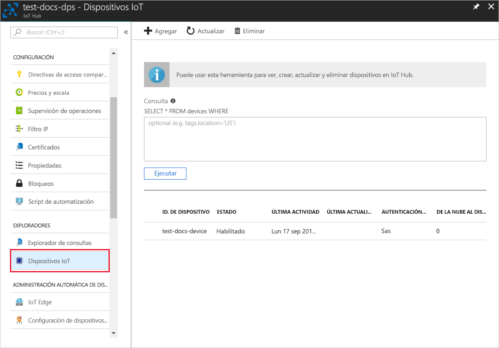

# <a name="quickstart-create-and-provision-an-x509-simulated-device-using-nodejs-device-sdk-for-iot-hub-device-provisioning-service"></a>Inicio rápido: Creación y aprovisionamiento de un dispositivo X.509 simulado mediante el SDK de dispositivos Node.js para el servicio IoT Hub Device Provisioning

[!INCLUDE [iot-dps-selector-quick-create-simulated-device-x509](../../includes/iot-dps-selector-quick-create-simulated-device-x509.md)]

En este inicio rápido se crea un dispositivo simulado X.509 en un equipo Windows. Use el código de ejemplo de Node.js del dispositivo para conectar este dispositivo simulado con su centro de IoT mediante una inscripción individual con el servicio de aprovisionamiento de dispositivos.

## <a name="prerequisites"></a>Prerrequisitos

- Revisión de [Conceptos de aprovisionamiento automático](concepts-auto-provisioning.md).
- Finalización de [Configuración de Azure IoT Hub Device Provisioning Service con Azure Portal](./quick-setup-auto-provision.md).
- Una cuenta de Azure con una suscripción activa. [cree una de forma gratuita](https://azure.microsoft.com/free/?ref=microsoft.com&utm_source=microsoft.com&utm_medium=docs&utm_campaign=visualstudio).
- [Node.js v4.0+](https://nodejs.org).
- [Git](https://git-scm.com/download/).
- [OpenSSL](https://www.openssl.org/).

[!INCLUDE [IoT Device Provisioning Service basic](../../includes/iot-dps-basic.md)]

## <a name="prepare-the-environment"></a>Preparación del entorno 

1. Complete los pasos descritos en [Setup IoT Hub Device Provisioning Service with the Azure portal](./quick-setup-auto-provision.md) (Configuración del servicio Azure IoT Hub Device Provisioning con Azure Portal) antes de continuar.

2. Asegúrese de que tiene [Node.js v4.0 o posterior](https://nodejs.org) instalado en su máquina.

3. Asegúrese de que [Git](https://git-scm.com/download/) está instalado en su máquina y se agrega a las variables de entorno accesibles para la ventana de comandos. 

4. Asegúrese de que [OpenSSL](https://www.openssl.org/) está instalado en su máquina y se agrega a las variables de entorno accesibles para la ventana de comandos. Esta biblioteca se puede compilar e instalar desde el origen o descargarse e instalarse desde el sitio web de un [tercero](https://wiki.openssl.org/index.php/Binaries) como [este](https://sourceforge.net/projects/openssl/). 

    > [!NOTE]
    > Si ya ha creado los certificados X.509 _raíz_, _intermedio_ u _hoja_, puede omitir este paso y todos los siguientes relativos a la generación de certificados.
    >

## <a name="create-a-self-signed-x509-device-certificate-and-individual-enrollment-entry"></a>Creación de un certificado de dispositivo X.509 autofirmado y una entrada de inscripción individual

En esta sección, usará un certificado X.509 autofirmado, así que es importante tener en cuenta lo siguiente:

* Los certificados autofirmados son solo para la realización de pruebas, no se deben usar en producción.
* La fecha de expiración predeterminada de un certificado autofirmado es de un año.

Usará código de ejemplo del [SDK para Node.js de Azure IoT](https://github.com/Azure/azure-iot-sdk-node.git) para crear el certificado que se usará con la entrada de inscripción individual en el dispositivo simulado.

Azure IoT Hub Device Provisioning Service admite dos tipos de inscripciones:

- [Grupos de inscripción](concepts-service.md#enrollment-group): usados para inscribir varios dispositivos relacionados.
- [Inscripciones individuales](concepts-service.md#individual-enrollment): usadas para inscribir un solo dispositivo.

En este artículo se muestran las inscripciones individuales.

1. Abra un símbolo del sistema. Clone el repositorio de GitHub para el código de ejemplo:
    
    ```cmd/sh
    git clone https://github.com/Azure/azure-iot-sdk-node.git --recursive
    ```

2. Vaya hasta el script de generación de certificados y compílelo. 

    ```cmd/sh
    cd azure-iot-sdk-node/provisioning/tools
    npm install
    ```

3. Cree el certificado X.509 _de hoja_ mediante la ejecución del script con su propio _nombre-de-certificado_. El nombre común del certificado hoja se convierte en el [identificador del registro](https://docs.microsoft.com/azure/iot-dps/concepts-device#registration-id), así que asegúrese de usar solo minúsculas, números y guiones.

    ```cmd/sh
    node create_test_cert.js device {certificate-name}
    ```

4. Inicie sesión en [Azure Portal](https://portal.azure.com), seleccione el botón **Todos los recursos** situado en el menú izquierdo y abra la instancia de Device Provisioning Service.

5. En el menú de Device Provisioning Service, seleccione **Administrar inscripciones**. Seleccione la pestaña **Inscripciones individuales** y seleccione el botón **Agregar inscripción individual** de la parte superior. 

6. En el panel **Agregar inscripción**, escriba la siguiente información:
   - Seleccione **X.509** como *Mecanismo* de atestación de identidad.
   - En el *Archivo .pem o .cer de certificado principal*, elija *Seleccionar un archivo* para seleccionar el archivo de certificado **{certificate-name}_cert.pem** creado en los pasos anteriores.  
   - De forma opcional, puede proporcionar la siguiente información:
     - Seleccione un centro de IoT vinculado con el servicio de aprovisionamiento.
     - Escriba un identificador de dispositivo único. Asegúrese de evitar datos confidenciales al asignar nombre al dispositivo. 
     - Actualice el **Estado inicial del dispositivo gemelo** con la configuración inicial deseada para el dispositivo.
     - Una vez completado, presione el botón **Guardar**. 

     [](./media/quick-create-simulated-device-x509-node/device-enrollment.png#lightbox)

     Al inscribir el dispositivo correctamente, el dispositivo X.509 aparece como **{nombredelcertificado}** en la columna *Id. de registro* de la pestaña *Inscripciones individuales*. Anote este valor para más adelante.

## <a name="simulate-the-device"></a>Simulación del dispositivo

El [SDK de dispositivo de Node.js de Azure IoT Hub](https://github.com/Azure/azure-iot-sdk-node) proporciona una manera sencilla de simular un dispositivo. Para más información, consulte los [Conceptos de dispositivos](https://docs.microsoft.com/azure/iot-dps/concepts-device).

1. En Azure Portal, seleccione la hoja **Información general** de Device Provisioning Service y anote los valores de **_Punto de conexión global del dispositivo_** y **_Ámbito de id_** .

     

2. Copie el _certificado_ y la _clave_ en la carpeta de ejemplo.

    ```cmd/sh
    copy .\{certificate-name}_cert.pem ..\device\samples\{certificate-name}_cert.pem
    copy .\{certificate-name}_key.pem ..\device\samples\{certificate-name}_key.pem
    ```

3. Vaya al script de prueba de dispositivo y compile el proyecto. 

    ```cmd/sh
    cd ..\device\samples
    npm install
    ```

4. Edite el archivo **register\_x509.js**. Guarde el archivo después de realizar los cambios siguientes.
    - Reemplace `provisioning host` con el **_punto de conexión de dispositivo global_** que anotó en el **paso 1** anterior.
    - Reemplace `id scope` por el **_ámbito de id._** que anotó en el **paso 1** anterior. 
    - Reemplace `registration id` por el **_Identificador de registro_** que anotó en la sección anterior.
    - Reemplace `cert filename` y `key filename` con los archivos que copió en el **paso 2** anterior. 

5. Ejecute el script y verifique que el dispositivo se aprovisione correctamente.

    ```cmd/sh
    node register_x509.js
    ```   

6. En el portal, vaya al centro de IoT vinculado a su servicio de aprovisionamiento y abra la hoja **Dispositivos IoT**. Si el dispositivo X.509 simulado se ha aprovisionado correctamente en el centro, su identificador de dispositivo aparecerá en la hoja **Dispositivos IoT** y en *ESTADO* aparecerá el valor **Habilitado**. Es posible que deba presionar el botón **Actualizar** de la parte superior si ha abierto la hoja antes de ejecutar la aplicación de ejemplo del dispositivo. 

     

    Si ha cambiado el valor predeterminado de *Estado inicial del dispositivo gemelo* en la entrada de inscripción para el dispositivo, el dispositivo puede extraer el estado gemelo deseado desde el centro y actuar en consecuencia. Para más información, consulte [Información y uso de dispositivos gemelos en IoT Hub](../iot-hub/iot-hub-devguide-device-twins.md).


## <a name="clean-up-resources"></a>Limpieza de recursos

Si planea seguir trabajando con el ejemplo de cliente de dispositivo y explorándolo, no limpie los recursos que se crean en este inicio rápido. Si no va a continuar, use el siguiente comando para eliminar todos los recursos que se han creado en este inicio rápido.

1. Cierre la ventana de salida de ejemplo del cliente del dispositivo en su máquina.
2. En el menú de la izquierda de Azure Portal, seleccione **Todos los recursos** y seleccione Device Provisioning Service. Abra la hoja **Administrar inscripciones** de su servicio y, después, seleccione la pestaña **Inscripciones individuales**. Active la casilla situada junto al campo *ID. DE REGISTRO* del dispositivo que ha inscrito en este inicio rápido y presione el botón **Eliminar** situado en la parte superior del panel. 
3. En el menú de la izquierda de Azure Portal, seleccione **Todos los recursos** y después su centro de IoT. Abra la hoja **Dispositivos IoT** de su centro, active la casilla junto al *identificador de dispositivo* del dispositivo que registró en este inicio rápido y, luego, presione el botón **Eliminar** situado en la parte superior del panel.


## <a name="next-steps"></a>Pasos siguientes

En este inicio rápido ha creado un dispositivo simulado X.509 y lo ha aprovisionado en su centro de IoT mediante Azure IoT Hub Device Provisioning Service en el portal. Para aprender a inscribir un dispositivo X.509 mediante programación, pase al inicio rápido para la inscripción de dispositivos X.509 mediante programación. 

> [!div class="nextstepaction"]
> [Inicio rápido de Azure: Inscripción de dispositivos X.509 en Azure IoT Hub Device Provisioning Service](quick-enroll-device-x509-node.md)
