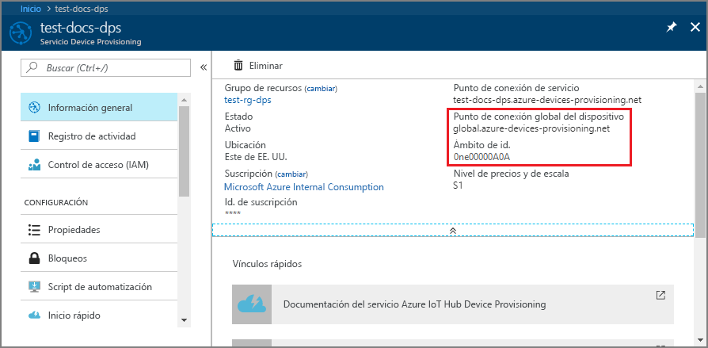
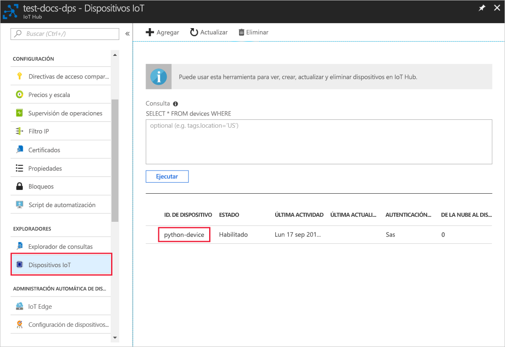

# <a name="quickstart-create-and-provision-a-simulated-x509-device-using-python-device-sdk-for-iot-hub-device-provisioning-service"></a>Inicio rápido: Creación y aprovisionamiento de un dispositivo X.509 simulado mediante el SDK de dispositivos Python para el servicio IoT Hub Device Provisioning

[!INCLUDE [iot-dps-selector-quick-create-simulated-device-x509](../../includes/iot-dps-selector-quick-create-simulated-device-x509.md)]

En este inicio rápido se crea un dispositivo simulado X.509 en un equipo Windows. Use el código de ejemplo de Python del dispositivo para conectar este dispositivo simulado con su centro de IoT mediante una inscripción individual con el servicio de aprovisionamiento de dispositivos.

## <a name="prerequisites"></a>Prerrequisitos

- Revisión de [Conceptos de aprovisionamiento automático](concepts-auto-provisioning.md).
- Finalización de [Configuración de Azure IoT Hub Device Provisioning Service con Azure Portal](./quick-setup-auto-provision.md).
- Una cuenta de Azure con una suscripción activa. [cree una de forma gratuita](https://azure.microsoft.com/free/?ref=microsoft.com&utm_source=microsoft.com&utm_medium=docs&utm_campaign=visualstudio).
- [Visual Studio 2015+](https://visualstudio.microsoft.com/vs/) con desarrollo para el escritorio con C++.
- [Sistema de compilación de CMake](https://cmake.org/download/).
- [Git](https://git-scm.com/download/).

> [!IMPORTANT]
> Este artículo solo se aplica al SDK de Python v1 en desuso. El dispositivo y los clientes del servicio para IoT Hub Device Provisioning Service aún no están disponibles en la versión 2. Actualmente, el equipo está haciendo todo lo posible para incorporar la versión 2 a la paridad de características.

[!INCLUDE [IoT Device Provisioning Service basic](../../includes/iot-dps-basic.md)]

## <a name="prepare-the-environment"></a>Preparación del entorno 

1. Asegúrese de que ha instalado [Visual Studio](https://visualstudio.microsoft.com/vs/) 2015 o posterior, con la carga de trabajo "Desarrollo para el escritorio con C++" habilitada para la instalación de Visual Studio.

2. Descargue e instale el [sistema de compilación CMake](https://cmake.org/download/).

3. Asegúrese de que `git` está instalado en su máquina y se agrega a las variables de entorno accesibles para la ventana de comandos. Consulte las [herramientas de cliente de Git de Software Freedom Conservancy](https://git-scm.com/download/) para instalar la versión más reciente de las herramientas `git`, lo que incluye **Git Bash**, la aplicación de línea de comandos que puede usar para interactuar con su repositorio de Git local. 

4. Abra un símbolo del sistema o Git Bash. Clone el repositorio GitHub para el ejemplo de código de simulación de dispositivo.
    
    ```cmd/sh
    git clone https://github.com/Azure/azure-iot-sdk-python.git --recursive
    ```

5. Cree una carpeta en su copia local de este repositorio GitHub para el proceso de compilación de CMake. 

    ```cmd/sh
    cd azure-iot-sdk-python/c
    mkdir cmake
    cd cmake
    ```

6. Ejecute el siguiente comando para crear la solución de Visual Studio para el cliente de aprovisionamiento.

    ```cmd/sh
    cmake -Duse_prov_client:BOOL=ON ..
    ```


## <a name="create-a-self-signed-x509-device-certificate-and-individual-enrollment-entry"></a>Creación de un certificado de dispositivo X.509 autofirmado y una entrada de inscripción individual

En esta sección se usa un certificado X.509 autofirmado. Es importante tener en cuenta los siguientes puntos:

* Los certificados autofirmados son solo para la realización de pruebas, no se deben usar en producción.
* La fecha de expiración predeterminada de un certificado autofirmado es de un año.

Usará código de ejemplo del SDK para C de Azure IoT para crear el certificado que se usará con la entrada de inscripción individual en el dispositivo simulado.

Azure IoT Hub Device Provisioning Service admite dos tipos de inscripciones:

- [Grupos de inscripción](concepts-service.md#enrollment-group): usados para inscribir varios dispositivos relacionados.
- [Inscripciones individuales](concepts-service.md#individual-enrollment): usadas para inscribir un solo dispositivo.

En este artículo se muestran las inscripciones individuales.

1. Abra la solución generada en la carpeta *cmake* denominada `azure_iot_sdks.sln` y compílela en Visual Studio.

2. Haga clic con el botón derecho en el proyecto **dice\_device\_enrollment** en la carpeta **Provision\_Tools** y seleccione **Establecer como proyecto de inicio**. Ejecute la solución. 

3. En la ventana de salida, escriba `i` para la inscripción individual cuando se le solicite. La ventana de salida muestra un certificado X.509 generado localmente para el dispositivo simulado. 
    
    Copie el primer certificado en el Portapapeles. Comience por la primera aparición de:
    
        -----BEGIN CERTIFICATE----- 
        
    Termine de copiar tras la primera aparición de:
    
        -----END CERTIFICATE-----
        
    Asegúrese de incluir también esas dos líneas. 

    
 
4. Cree un archivo denominado **_X509testcertificate.pem_** en su equipo de Windows, ábralo en el editor que desee y copie el contenido del portapapeles en este archivo. Guarde el archivo. 

5. Inicie sesión en Azure Portal, seleccione el botón **Todos los recursos** del menú de la izquierda y abra el servicio de aprovisionamiento.

6. En el menú de Device Provisioning Service, seleccione **Administrar inscripciones**. Seleccione la pestaña **Inscripciones individuales** y seleccione el botón **Agregar inscripción individual** de la parte superior. 

7. En el panel **Agregar inscripción**, escriba la siguiente información:
   - Seleccione **X.509** como *Mecanismo* de atestación de identidad.
   - En el *Archivo .pem o .cer de certificado principal*, elija *Seleccionar un archivo* para seleccionar el archivo de certificado **X509testcertificate.pem** creado en los pasos anteriores.
   - De forma opcional, puede proporcionar la siguiente información:
     - Seleccione un centro de IoT vinculado con el servicio de aprovisionamiento.
     - Escriba un identificador de dispositivo único. Asegúrese de evitar datos confidenciales al asignar nombre al dispositivo. 
     - Actualice el **Estado inicial del dispositivo gemelo** con la configuración inicial deseada para el dispositivo.
   - Una vez completado, presione el botón **Guardar**. 

     [](./media/python-quick-create-simulated-device-x509/device-enrollment.png#lightbox)

   Al inscribir el dispositivo correctamente, el dispositivo X.509 aparece como **riot-device-cert** en la columna *Identificador de registro* de la pestaña *Inscripciones individuales*. 

## <a name="simulate-the-device"></a>Simulación del dispositivo

1. En el menú de Device Provisioning Service, seleccione **Información general**. Anote los valores _Ámbito de id._ y _Punto de conexión del servicio global_.

    

2. Descargue e instale [Python 2.x o 3.x](https://www.python.org/downloads/). Asegúrese de usar la instalación de 32 bits o 64 bits en función del programa de instalación. Cuando se le solicite durante la instalación, asegúrese de agregar Python a las variables de entorno específicas de la plataforma. Si usa Python 2.x, puede que necesite [instalar o actualizar *pip*, el sistema de administración de paquetes de Python](https://pip.pypa.io/en/stable/installing/).
    
    > [!NOTE] 
    > Si usa Windows, instale también [Visual C++ Redistributable para Visual Studio 2015](https://support.microsoft.com/help/2977003/the-latest-supported-visual-c-downloads). Los paquetes de pip requieren el paquete redistribuible para cargar y ejecutar los archivos DLL de C.

3. Siga [estas instrucciones](https://github.com/Azure/azure-iot-sdk-python/blob/v1-deprecated/doc/python-devbox-setup.md) para compilar los paquetes de Python.

   > [!NOTE]
   > Si usa `pip`, asegúrese de instalar también el paquete `azure-iot-provisioning-device-client`.

4. Navegue hasta la carpeta de ejemplos.

    ```cmd/sh
    cd azure-iot-sdk-python/provisioning_device_client/samples
    ```

5. Con el IDE de Python, edite el script de Python llamado **provisioning\_device\_client\_sample.py**. Modifique las variables _GLOBAL\_PROV\_URI_ y _ID\_SCOPE_ a los valores que se han indicado anteriormente.

    ```python
    GLOBAL_PROV_URI = "{globalServiceEndpoint}"
    ID_SCOPE = "{idScope}"
    SECURITY_DEVICE_TYPE = ProvisioningSecurityDeviceType.X509
    PROTOCOL = ProvisioningTransportProvider.HTTP
    ```

6. Ejecute el ejemplo. 

    ```cmd/sh
    python provisioning_device_client_sample.py
    ```

7. La aplicación se conectará, inscribirá el dispositivo y mostrará un mensaje indicando que la inscripción se realizó correctamente.

    

8. En el portal, navegue hasta IoT Hub vinculado a su servicio de aprovisionamiento y abra la hoja **Device Explorer**. En el aprovisionamiento correcto del dispositivo simulado X.509 con el Hub, su identificador de dispositivo aparece en la hoja **Device Explorer** con el *ESTADO***habilitado**. Es posible que deba presionar el botón **Actualizar** de la parte superior si ha abierto la hoja antes de ejecutar la aplicación de ejemplo del dispositivo. 

     

> [!NOTE]
> Si ha cambiado el valor predeterminado de *Estado inicial del dispositivo gemelo* en la entrada de inscripción para el dispositivo, el dispositivo puede extraer el estado gemelo deseado desde el centro y actuar en consecuencia. Para más información, consulte [Información y uso de dispositivos gemelos en IoT Hub](../iot-hub/iot-hub-devguide-device-twins.md).
>

## <a name="clean-up-resources"></a>Limpieza de recursos

Si planea seguir trabajando con el ejemplo de cliente de dispositivo y explorándolo, no limpie los recursos que se crean en este inicio rápido. Si no va a continuar, use el siguiente comando para eliminar todos los recursos que se han creado en este inicio rápido.

1. Cierre la ventana de salida de ejemplo del cliente del dispositivo en su máquina.
2. En el menú de la izquierda de Azure Portal, seleccione **Todos los recursos** y seleccione Device Provisioning Service. Abra la hoja **Administrar inscripciones** de su servicio y, después, seleccione la pestaña **Inscripciones individuales**. Active la casilla situada junto al campo *ID. DE REGISTRO* del dispositivo que ha inscrito en este inicio rápido y presione el botón **Eliminar** situado en la parte superior del panel. 
3. En el menú de la izquierda de Azure Portal, seleccione **Todos los recursos** y después su centro de IoT. Abra la hoja **Dispositivos IoT** de su centro, active la casilla junto al *identificador de dispositivo* del dispositivo que registró en este inicio rápido y, luego, presione el botón **Eliminar** situado en la parte superior del panel.

## <a name="next-steps"></a>Pasos siguientes

En este inicio rápido, ha creado un dispositivo simulado X.509 en una máquina Windows y lo ha aprovisionado en un centro de IoT mediante IoT Hub Device Provisioning Service en el portal. Para aprender a inscribir un dispositivo X.509 mediante programación, pase al inicio rápido para la inscripción de dispositivos X.509 mediante programación. 

> [!div class="nextstepaction"]
> [Inicio rápido de Azure: Inscripción de dispositivos X.509 en Azure IoT Hub Device Provisioning Service](quick-enroll-device-x509-python.md)
