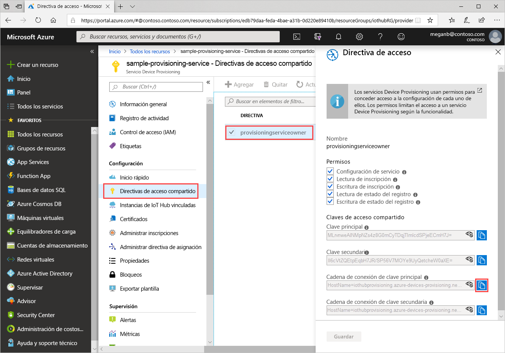
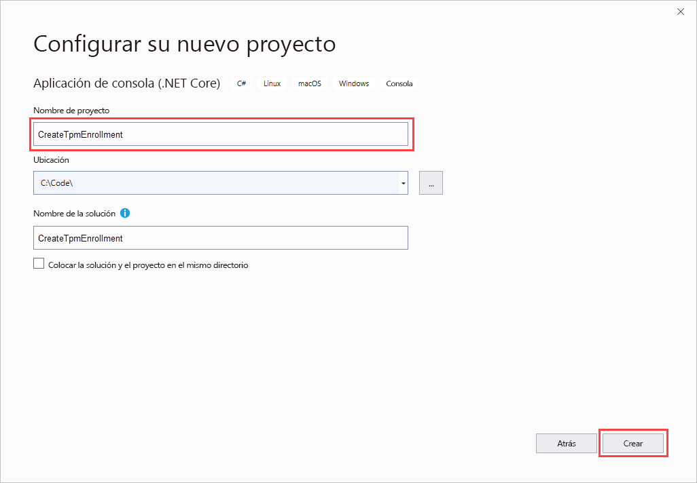
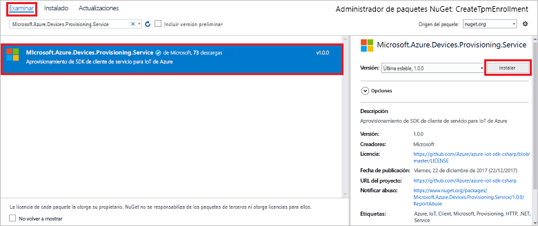
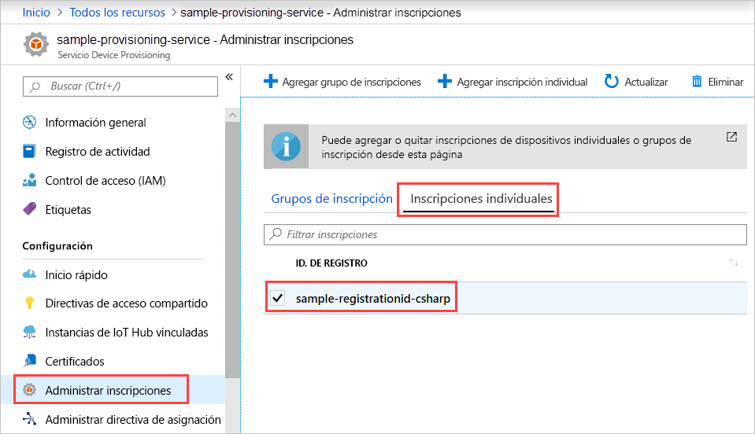

# <a name="enroll-tpm-device-to-iot-hub-device-provisioning-service-using-c-service-sdk"></a>Inscripción de un dispositivo de TPM al servicio Azure IoT Hub Device Provisioning mediante el SDK del servicio de C#

[!INCLUDE [iot-dps-selector-quick-enroll-device-tpm](../../includes/iot-dps-selector-quick-enroll-device-tpm.md)]

En este artículo se muestra cómo crear una inscripción individual para un dispositivo de TPM mediante programación en Azure IoT Hub Device Provisioning Service mediante el [SDK del servicio de C#](https://github.com/Azure/azure-iot-sdk-csharp) y una aplicación de ejemplo de NET Core en C#. Si lo desea, puede inscribir un dispositivo de TPM simulado en el servicio de aprovisionamiento mediante esta entrada de inscripción individual. Aunque estos pasos funcionan en equipos Windows y Linux, en este artículo se usa un equipo de desarrollo de Windows.

## <a name="prepare-the-development-environment"></a>Preparación del entorno de desarrollo

1. Compruebe que tiene [Visual Studio 2019](https://www.visualstudio.com/vs/) instalado localmente en el equipo.

1. Compruebe que tiene el [SDK de .NET Core](https://www.microsoft.com/net/download/windows) instalado en el equipo.

1. Complete los pasos descritos en [Configuración de Azure IoT Hub Device Provisioning Service con Azure Portal](./quick-setup-auto-provision.md) antes de continuar.

1. (Opcional) Si quiere inscribir un dispositivo simulado al final de este inicio rápido, siga el procedimiento descrito en [Creación y aprovisionamiento de un dispositivo de TPM simulado mediante el SDK de dispositivos C#](quick-create-simulated-device-tpm-csharp.md) hasta el paso donde obtiene una clave de aprobación para el dispositivo. Guarde la clave de aprobación, el identificador del registro y, opcionalmente, el identificador del dispositivo, ya que los necesitará más adelante en este inicio rápido.

   > [!NOTE]
   > No siga los pasos para crear una inscripción individual mediante Azure Portal.

## <a name="get-the-connection-string-for-your-provisioning-service"></a>Obtención de la cadena de conexión para el servicio de aprovisionamiento

En el ejemplo de esta guía de inicio rápido, necesitará la cadena de conexión del servicio de aprovisionamiento.

1. Inicie sesión en Azure Portal, seleccione **Todos los recursos** y abra la instancia de Device Provisioning Service.

1. Elija **Directivas de acceso compartido** y, a continuación, seleccione la directiva de acceso que quiere usar para abrir sus propiedades. En **Directiva de acceso**, copie y guarde la cadena de conexión de la clave principal.

    

## <a name="create-the-individual-enrollment-sample"></a>Creación del ejemplo de inscripción individual

En esta sección se muestra cómo crear una aplicación de consola de .NET Core que agrega una inscripción individual para un dispositivo de TPM al servicio de aprovisionamiento. Con algunas modificaciones, también puede seguir estos pasos para crear una aplicación de consola de [Windows IoT Core](https://developer.microsoft.com/en-us/windows/iot) para agregar la inscripción individual. Para más información sobre el desarrollo con IoT Core, consulte la [documentación para desarrolladores de Windows IoT Core](https://docs.microsoft.com/windows/iot-core/).

1. Abra Visual Studio y seleccione **Crear un proyecto**. En **Crear un proyecto**, elija la plantilla de proyecto **Aplicación de consola (.NET Core)** para C# y seleccione **Siguiente**.

1. Asigne al proyecto el nombre *CreateTpmEnrollment* y seleccione **Crear**.

    

1. En el **Explorador de soluciones**, haga clic con el botón derecho en el proyecto **CreateTpmEnrollment** y, a continuación, seleccione **Administrar paquetes NuGet**.

1. En el **Administrador de paquetes NuGet**, seleccione **Examinar**, busque y elija **Microsoft.Azure.Devices.Provisioning.Service** y luego seleccione **Instalar**.

   

   Este paso descarga, instala y agrega una referencia al paquete NuGet del [SDK de cliente del servicio de aprovisionamiento de Azure IoT](https://www.nuget.org/packages/Microsoft.Azure.Devices.Provisioning.Service/) y sus dependencias.

1. Agregue las siguientes instrucciones `using` después de las demás instrucciones `using` en la parte superior de `Program.cs`:
  
   ```csharp
   using System.Threading.Tasks;
   using Microsoft.Azure.Devices.Provisioning.Service;
   ```

1. Agregue los siguientes campos a la clase `Program` y realice los cambios de la lista.

   ```csharp
   private static string ProvisioningConnectionString = "{Your provisioning service connection string}";
   private const string RegistrationId = "sample-registrationid-csharp";
   private const string TpmEndorsementKey =
       "AToAAQALAAMAsgAgg3GXZ0SEs/gakMyNRqXXJP1S124GUgtk8qHaGzMUaaoABgCAAEMAEAgAAAAAAAEAxsj2gUS" +
       "cTk1UjuioeTlfGYZrrimExB+bScH75adUMRIi2UOMxG1kw4y+9RW/IVoMl4e620VxZad0ARX2gUqVjYO7KPVt3d" +
       "yKhZS3dkcvfBisBhP1XH9B33VqHG9SHnbnQXdBUaCgKAfxome8UmBKfe+naTsE5fkvjb/do3/dD6l4sGBwFCnKR" +
       "dln4XpM03zLpoHFao8zOwt8l/uP3qUIxmCYv9A7m69Ms+5/pCkTu/rK4mRDsfhZ0QLfbzVI6zQFOKF/rwsfBtFe" +
       "WlWtcuJMKlXdD8TXWElTzgh7JS4qhFzreL0c1mI0GCj+Aws0usZh7dLIVPnlgZcBhgy1SSDQMQ==";
       
   // Optional parameters
   private const string OptionalDeviceId = "myCSharpDevice";
   private const ProvisioningStatus OptionalProvisioningStatus = ProvisioningStatus.Enabled;
   ```

   * Reemplace el valor del marcador de posición `ProvisioningConnectionString` por la cadena de conexión del servicio de aprovisionamiento para el que quiere crear la inscripción.

   * También puede cambiar el identificador de registro, la clave de aprobación, el identificador del dispositivo y el estado de aprovisionamiento.

   * Si usa este inicio rápido junto con el de [Creación y aprovisionamiento de un dispositivo de TPM simulado mediante el SDK de dispositivos C#](quick-create-simulated-device-tpm-csharp.md) para aprovisionar un dispositivo simulado, reemplace la clave de aprobación y el identificador de registro por los valores que anotó en ese inicio rápido. Puede reemplazar el identificador del dispositivo por el valor sugerido en ese inicio rápido, usar su propio valor o utilizar el valor predeterminado en este ejemplo.

1. Agregue el siguiente método a la clase `Program`.  Este código crea una entrada de inscripción individual y luego llama al método `CreateOrUpdateIndividualEnrollmentAsync` en `ProvisioningServiceClient` para agregar la inscripción individual al servicio de aprovisionamiento.

   ```csharp
   public static async Task RunSample()
   {
       Console.WriteLine("Starting sample...");

       using (ProvisioningServiceClient provisioningServiceClient =
               ProvisioningServiceClient.CreateFromConnectionString(ProvisioningConnectionString))
       {
           #region Create a new individualEnrollment config
           Console.WriteLine("\nCreating a new individualEnrollment...");
           Attestation attestation = new TpmAttestation(TpmEndorsementKey);
           IndividualEnrollment individualEnrollment =
                   new IndividualEnrollment(
                           RegistrationId,
                           attestation);

           // The following parameters are optional. Remove them if you don't need them.
           individualEnrollment.DeviceId = OptionalDeviceId;
           individualEnrollment.ProvisioningStatus = OptionalProvisioningStatus;
           #endregion

           #region Create the individualEnrollment
           Console.WriteLine("\nAdding new individualEnrollment...");
           IndividualEnrollment individualEnrollmentResult =
               await provisioningServiceClient.CreateOrUpdateIndividualEnrollmentAsync(individualEnrollment).ConfigureAwait(false);
           Console.WriteLine("\nIndividualEnrollment created with success.");
           Console.WriteLine(individualEnrollmentResult);
           #endregion
        
       }
   }
   ```

1. Por último, reemplace el cuerpo del método `Main` por las siguientes líneas:

   ```csharp
   RunSample().GetAwaiter().GetResult();
   Console.WriteLine("\nHit <Enter> to exit ...");
   Console.ReadLine();
   ```

1. Compile la solución.

## <a name="run-the-individual-enrollment-sample"></a>Ejecución del ejemplo de inscripción individual
  
Ejecute el ejemplo en Visual Studio para crear la inscripción individual para el dispositivo de TPM.

Tras una creación correcta, la ventana del símbolo del sistema muestra las propiedades de la inscripción individual nueva.

Puede comprobar que se ha creado la inscripción individual. En el resumen de Device Provisioning Service, seleccione **Administrar inscripciones** y, después, **Inscripciones individuales**. Verá una nueva entrada de inscripción que corresponde al identificador de registro usado en el ejemplo.



Seleccione la entrada para comprobar la clave de aprobación y otras propiedades de la entrada.

Si ha seguido los pasos descritos en el inicio rápido [Creación y aprovisionamiento de un dispositivo de TPM simulado mediante el SDK de dispositivos C#](quick-create-simulated-device-tpm-csharp.md), puede continuar con los pasos restantes de ese inicio rápido para inscribir el dispositivo simulado. No siga los pasos para crear una inscripción individual mediante Azure Portal.

## <a name="clean-up-resources"></a>Limpieza de recursos

Si tiene previsto explorar el ejemplo del servicio de C#, no elimine los recursos que se crearon con este inicio rápido. De lo contrario, use el siguiente comando para eliminar todos los recursos creados.

1. Cierre la ventana de salida de ejemplo de C# en el equipo.

1. Vaya a Device Provisioning Service en Azure Portal, seleccione **Administrar inscripciones** y, a continuación, seleccione la pestaña **Inscripciones individuales**. Seleccione el *identificador de registro* de la entrada de inscripción que creó en este inicio rápido y seleccione **Eliminar**.

1. Si ha seguido los pasos del inicio rápido [Creación y aprovisionamiento de un dispositivo de TPM simulado mediante el SDK de dispositivos C#](quick-create-simulated-device-tpm-csharp.md) para crear un dispositivo de TPM simulado, haga lo siguiente:

    1. Cierre la ventana del simulador de TPM y la ventana de salida de ejemplo para el dispositivo simulado.

    1. En Azure Portal, vaya a la instancia de IoT Hub donde se aprovisionó el dispositivo. En el menú **Exploradores**, seleccione **Dispositivos IoT**, seleccione la casilla situada junto al dispositivo y, por último, seleccione **Eliminar**.

## <a name="next-steps"></a>Pasos siguientes

En este inicio rápido, ha creado mediante programación una entrada de inscripción individual para un dispositivo de TPM. Opcionalmente, ha creado un dispositivo simulado de TPM en su equipo y lo ha aprovisionado con el centro de IoT mediante Azure IoT Hub Device Provisioning Service. Para más información acerca del aprovisionamiento de dispositivos, continúe con el tutorial para instalar el servicio Device Provisioning en Azure Portal.

> [!div class="nextstepaction"]
> [Tutoriales del servicio Azure IoT Hub Device Provisioning](./tutorial-set-up-cloud.md)
