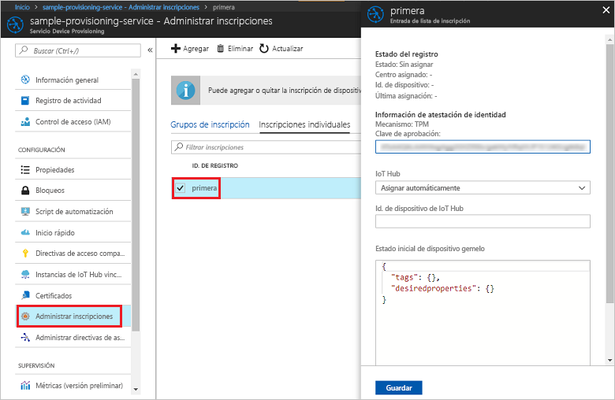

# <a name="quickstart-enroll-tpm-device-to-iot-hub-device-provisioning-service-using-nodejs-service-sdk"></a>Inicio rápido: Inscripción de un dispositivo de TPM al servicio IoT Hub Device Provisioning mediante el SDK del servicio de Node.js

[!INCLUDE [iot-dps-selector-quick-enroll-device-tpm](../../includes/iot-dps-selector-quick-enroll-device-tpm.md)]

En este inicio rápido se muestra cómo crear una inscripción individual para un dispositivo de TPM mediante programación en el servicio Azure IoT Hub Device Provisioning mediante el SDK del servicio de Node.js y una aplicación de ejemplo de Node.js. Si lo desea, puede inscribir un dispositivo de TPM simulado en el servicio de aprovisionamiento mediante esta entrada de inscripción individual.

## <a name="prerequisites"></a>Prerrequisitos

- Haber leído [Configuración de Azure IoT Hub Device Provisioning Service con Azure Portal](./quick-setup-auto-provision.md).
- Una cuenta de Azure con una suscripción activa. [cree una de forma gratuita](https://azure.microsoft.com/free/?ref=microsoft.com&utm_source=microsoft.com&utm_medium=docs&utm_campaign=visualstudio).
- [Node.js v4.0+](https://nodejs.org). En este inicio rápido se instala el [SDK de servicio de Node.js](https://github.com/Azure/azure-iot-sdk-node) siguiente.
- Clave de aprobación (opcional). Siga los pasos descritos en [Creación y aprovisionamiento de un dispositivo simulado](quick-create-simulated-device.md) hasta que obtenga la clave. No cree una inscripción individual mediante Azure Portal.

## <a name="create-the-individual-enrollment-sample"></a>Creación del ejemplo de inscripción individual 

 
1. Desde una ventana de comandos en la carpeta de trabajo, ejecute:
  
    ```cmd\sh
    npm install azure-iot-provisioning-service
    ```  

2. Con un editor de texto, cree un archivo **create_individual_enrollment.js** en la carpeta de trabajo. Agregue el siguiente código al archivo y guárdelo:

    ```
    'use strict';

    var provisioningServiceClient = require('azure-iot-provisioning-service').ProvisioningServiceClient;

    var serviceClient = provisioningServiceClient.fromConnectionString(process.argv[2]);
    var endorsementKey = process.argv[3];

    var enrollment = {
      registrationId: 'first',
      attestation: {
        type: 'tpm',
        tpm: {
          endorsementKey: endorsementKey
        }
      }
    };

    serviceClient.createOrUpdateIndividualEnrollment(enrollment, function(err, enrollmentResponse) {
      if (err) {
        console.log('error creating the individual enrollment: ' + err);
      } else {
        console.log("enrollment record returned: " + JSON.stringify(enrollmentResponse, null, 2));
      }
    });
    ```

## <a name="run-the-individual-enrollment-sample"></a>Ejecución del ejemplo de inscripción individual
  
1. Para ejecutar el ejemplo, necesita la cadena de conexión para el servicio de aprovisionamiento. 
    1. Inicie sesión en Azure Portal, seleccione el botón **Todos los recursos** en el menú de la izquierda y abra Device Provisioning Service. 
    2. Seleccione **Directivas de acceso compartido** y, después, seleccione la directiva de acceso que desea usar para abrir sus propiedades. En la ventana **Directiva de acceso**, copie y tome nota de la cadena de conexión de la clave principal. 

        


2. También se necesitará la clave de aprobación para el dispositivo. Si siguió la guía de inicio rápido [Creación y aprovisionamiento de un dispositivo simulado](quick-create-simulated-device.md) para crear un dispositivo de TPM simulado, use la clave que se creó para dicho dispositivo. En caso contrario, para crear una inscripción individual de ejemplo, puede usar la siguiente clave de aprobación proporcionada con el [SDK de servicio de Node.js](https://github.com/Azure/azure-iot-sdk-node):

    ```
    AToAAQALAAMAsgAgg3GXZ0SEs/gakMyNRqXXJP1S124GUgtk8qHaGzMUaaoABgCAAEMAEAgAAAAAAAEAxsj2gUScTk1UjuioeTlfGYZrrimExB+bScH75adUMRIi2UOMxG1kw4y+9RW/IVoMl4e620VxZad0ARX2gUqVjYO7KPVt3dyKhZS3dkcvfBisBhP1XH9B33VqHG9SHnbnQXdBUaCgKAfxome8UmBKfe+naTsE5fkvjb/do3/dD6l4sGBwFCnKRdln4XpM03zLpoHFao8zOwt8l/uP3qUIxmCYv9A7m69Ms+5/pCkTu/rK4mRDsfhZ0QLfbzVI6zQFOKF/rwsfBtFeWlWtcuJMKlXdD8TXWElTzgh7JS4qhFzreL0c1mI0GCj+Aws0usZh7dLIVPnlgZcBhgy1SSDQMQ==
    ```

3. Para crear una inscripción individual para el dispositivo de TPM, ejecute el comando siguiente (incluidas las comillas alrededor de los argumentos de comando):
 
     ```cmd\sh
     node create_individual_enrollment.js "<the connection string for your provisioning service>" "<endorsement key>"
     ```
 
3. Tras una creación correcta, la ventana de comandos muestra las propiedades de la inscripción individual nueva.

     

4. Compruebe que se haya creado una inscripción individual. En Azure Portal, en la hoja de resumen del servicio Device Provisioning, seleccione **Administrar inscripciones**. Seleccione la pestaña **Inscripciones individuales** y (*primero*) seleccione la entrada de inscripción nueva para comprobar la clave de aprobación y las otras propiedades de la entrada.

     
 
Ahora que creó una inscripción individual para un dispositivo de TPM, si quiere inscribir un dispositivo simulado, puede continuar con los pasos restantes de [Creación y aprovisionamiento de un dispositivo simulado](quick-create-simulated-device.md). Asegúrese de omitir los pasos que aparecen en ese inicio rápido para crear una inscripción individual mediante Azure Portal.

## <a name="clean-up-resources"></a>Limpieza de recursos
Si planea explorar los ejemplos del servicio de Node.js, no elimine los recursos que se han creado en este inicio rápido. Si no va a continuar, use el siguiente comando para eliminar todos los recursos que se han creado en este inicio rápido.

1. Cierre la ventana de salida de ejemplo de Node.js en su máquina.
1. Si creó un dispositivo de TPM simulado, cierre la ventana del simulador de TPM.
2. Vaya a Device Provisioning Service en Azure Portal, seleccione **Administrar inscripciones** y, a continuación, seleccione la pestaña **Inscripciones individuales**. Seleccione la casilla que se encuentra junto al *identificador de registro* de la entrada de inscripción que creó en este inicio rápido y presione el botón **Eliminar** de la parte superior de la hoja. 
 
## <a name="next-steps"></a>Pasos siguientes
En esta guía de inicio rápido, ha creado una entrada de inscripción individual mediante programación para un dispositivo de TPM y, opcionalmente, ha creado en una máquina un dispositivo de TPM simulado y lo ha aprovisionado en su centro de IoT mediante Azure IoT Hub Device Provisioning Service. Para más información acerca del aprovisionamiento de dispositivos, continúe con el tutorial para instalar el servicio Device Provisioning en Azure Portal. 
 
> [!div class="nextstepaction"]
> [Tutoriales del servicio Azure IoT Hub Device Provisioning](./tutorial-set-up-cloud.md)