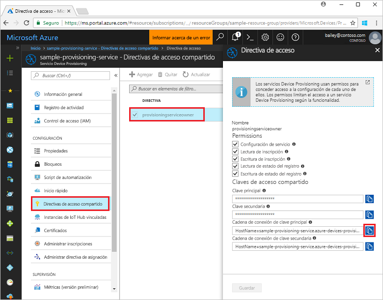
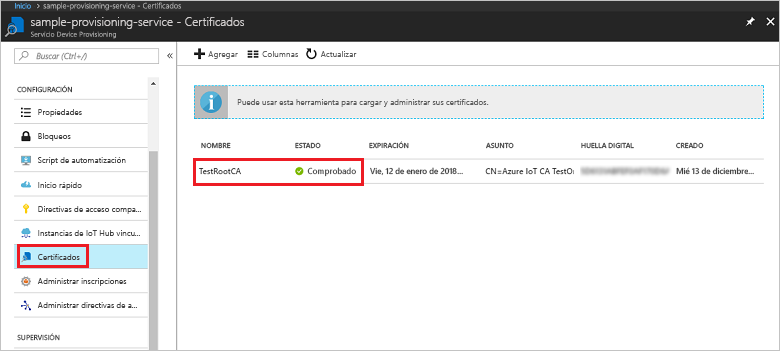
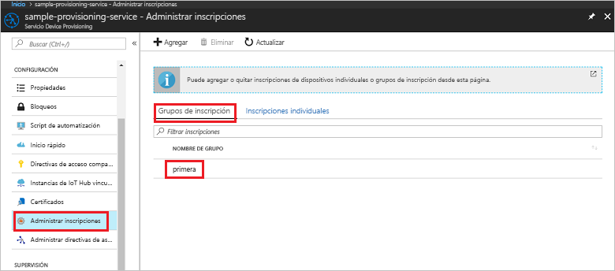

# <a name="quickstart-enroll-x509-devices-to-the-device-provisioning-service-using-nodejs"></a>Inicio rápido: Inscripción de dispositivos X.509 en el servicio Device Provisioning con Node.js

[!INCLUDE [iot-dps-selector-quick-enroll-device-x509](../../includes/iot-dps-selector-quick-enroll-device-x509.md)]

En este inicio rápido, usará Node.js para crear mediante programación un grupo de inscripción que use certificados CA X.509 intermedios o raíces de una entidad de certificación. El grupo de inscripción se crea mediante el SDK de IoT para Node.js y una aplicación Node.js de ejemplo.

## <a name="prerequisites"></a>Prerrequisitos

- Haber leído [Configuración de Azure IoT Hub Device Provisioning Service con Azure Portal](./quick-setup-auto-provision.md).
- Una cuenta de Azure con una suscripción activa. [cree una de forma gratuita](https://azure.microsoft.com/free/?ref=microsoft.com&utm_source=microsoft.com&utm_medium=docs&utm_campaign=visualstudio).
- [Node.js v4.0+](https://nodejs.org). En este inicio rápido se instala el [SDK de IoT para Node.js](https://github.com/Azure/azure-iot-sdk-node) siguiente.
- [Git](https://git-scm.com/download/).
- [SDK de Azure IoT](https://github.com/Azure/azure-iot-sdk-c).

## <a name="prepare-test-certificates"></a>Preparación de los certificados de prueba

En esta guía de inicio rápido debe tener un archivo .pem o .cer que contenga la porción pública de un certificado X.509 intermedio o raíz de entidad de certificación. Se debe cargar este certificado en el servicio de aprovisionamiento y que este lo compruebe.

Para más información sobre el uso de la infraestructura de clave pública (PKI) basada en certificados X.509 con Azure IoT Hub y el servicio Device Provisioning, consulte [Introducción a la seguridad mediante certificados de entidades de certificación X.509](https://docs.microsoft.com/azure/iot-hub/iot-hub-x509ca-overview).

El [SDK de Azure IoT para C](https://github.com/Azure/azure-iot-sdk-c) contiene herramientas de prueba que pueden ayudarle a crear una cadena de certificados X.509, cargar un certificado raíz o intermedio a partir de esa cadena y realizar la prueba de posesión con el servicio para comprobar el certificado. Los certificados creados con las herramientas del SDK están diseñados para su uso en las **pruebas de desarrollo únicamente**. Estos certificados **no se deben usar en producción**. Contienen contraseñas codificadas de forma rígida ("1234") que expiran después de 30 días. Para saber cómo obtener certificados adecuados para el código de producción, consulte [Cómo obtener un certificado de entidad de certificación X.509](https://docs.microsoft.com/azure/iot-hub/iot-hub-x509ca-overview#how-to-get-an-x509-ca-certificate) en la documentación de Azure IoT Hub.

Para usar estas herramientas de prueba para generar certificados, realice los pasos siguientes:
 
1. Busque el nombre de etiqueta de la [versión más reciente](https://github.com/Azure/azure-iot-sdk-c/releases/latest) del SDK de C de IoT de Azure.

2. Abra un símbolo del sistema o el shell de Git Bash y cambie a una carpeta de trabajo de la máquina. Ejecute los siguientes comandos para clonar la versión más reciente del repositorio de GitHub del [SDK de Azure IoT para C](https://github.com/Azure/azure-iot-sdk-c). Use la etiqueta que encontró en el paso anterior como valor del parámetro `-b`:

    ```cmd/sh
    git clone -b <release-tag> https://github.com/Azure/azure-iot-sdk-c.git
    cd azure-iot-sdk-c
    git submodule update --init
    ```

    Esta operación puede tardar varios minutos en completarse.

   Las herramientas de prueba se encuentran en el directorio *azure-iot-sdk-c/tools/CACertificates* del repositorio que clonó.

3. Siga los pasos descritos en [Managing test CA certificates for samples and tutorials](https://github.com/Azure/azure-iot-sdk-c/blob/master/tools/CACertificates/CACertificateOverview.md) (Administración de certificados de entidad de certificación de prueba para ejemplos y tutoriales). 


## <a name="create-the-enrollment-group-sample"></a>Crear el ejemplo del grupo de inscripción 

Azure IoT Hub Device Provisioning Service admite dos tipos de inscripciones:

- [Grupos de inscripción](concepts-service.md#enrollment-group): usados para inscribir varios dispositivos relacionados.
- [Inscripciones individuales](concepts-service.md#individual-enrollment): usadas para inscribir un solo dispositivo.

Un grupo de inscripción controla el acceso al servicio de aprovisionamiento de los dispositivos que comparten un certificado de firma común en su cadena de certificados. Para más información, consulte [Control del acceso de dispositivo al servicio de aprovisionamiento con certificados X.509](./concepts-security.md#controlling-device-access-to-the-provisioning-service-with-x509-certificates).
 
1. Desde una ventana de comandos en la carpeta de trabajo, ejecute:
  
     ```cmd\sh
     npm install azure-iot-provisioning-service
     ```  

2. Con un editor de texto, cree un archivo **create_enrollment_group.js** en la carpeta de trabajo. Agregue el siguiente código al archivo y guárdelo:

    ```
    'use strict';
    var fs = require('fs');

    var provisioningServiceClient = require('azure-iot-provisioning-service').ProvisioningServiceClient;

    var serviceClient = provisioningServiceClient.fromConnectionString(process.argv[2]);

    var enrollment = {
      enrollmentGroupId: 'first',
      attestation: {
        type: 'x509',
        x509: {
          signingCertificates: {
            primary: {
              certificate: fs.readFileSync(process.argv[3], 'utf-8').toString()
            }
          }
        }
      },
      provisioningStatus: 'disabled'
    };

    serviceClient.createOrUpdateEnrollmentGroup(enrollment, function(err, enrollmentResponse) {
      if (err) {
        console.log('error creating the group enrollment: ' + err);
      } else {
        console.log("enrollment record returned: " + JSON.stringify(enrollmentResponse, null, 2));
        enrollmentResponse.provisioningStatus = 'enabled';
        serviceClient.createOrUpdateEnrollmentGroup(enrollmentResponse, function(err, enrollmentResponse) {
          if (err) {
            console.log('error updating the group enrollment: ' + err);
          } else {
            console.log("updated enrollment record returned: " + JSON.stringify(enrollmentResponse, null, 2));
          }
        });
      }
    });
    ```

## <a name="run-the-enrollment-group-sample"></a>Ejecutar el ejemplo del grupo de inscripción
 
1. Para ejecutar el ejemplo, necesita la cadena de conexión para el servicio de aprovisionamiento. 
    1. Inicie sesión en Azure Portal, seleccione el botón **Todos los recursos** en el menú de la izquierda y abra Device Provisioning Service. 
    2. Haga clic en **Directivas de acceso compartido** y, a continuación, seleccione la directiva de acceso que quiere usar para abrir sus propiedades. En la ventana **Directiva de acceso**, copie y tome nota de la cadena de conexión de la clave principal. 

        


3. Como se indica en [Preparación de los certificados de prueba](quick-enroll-device-x509-node.md#prepare-test-certificates), necesita un archivo .pem que contenga un certificado de entidad emisora X.509 intermedio o raíz cargado y verificado previamente con su servicio de aprovisionamiento. Para comprobar que el certificado se ha cargado y verificado, en la página de resumen del servicio Device Provisioning de Azure Portal, seleccione **Certificados**. Busque el certificado que quiere usar para la inscripción de grupo y asegúrese de que su valor de estado sea *verificado*.

     

1. Para crear un [grupo de inscripción](concepts-service.md#enrollment-group) para su certificado, ejecute el comando siguiente (incluidas las comillas alrededor de los argumentos de comando):
 
     ```cmd\sh
     node create_enrollment_group.js "<the connection string for your provisioning service>" "<your certificate's .pem file>"
     ```
 
3. Tras una creación correcta, la ventana de comandos muestra las propiedades del grupo de inscripción nuevo.

     

4. Compruebe que se ha creado el grupo de inscripción. En Azure Portal, en la hoja de resumen del servicio Device Provisioning, seleccione **Administrar inscripciones**. Seleccione la pestaña **Grupos de inscripción** y compruebe que haya la nueva entrada de inscripción (*primera*).

     
 
## <a name="clean-up-resources"></a>Limpieza de recursos
Si planea explorar los ejemplos del servicio de Node.js, no elimine los recursos que se han creado en este inicio rápido. Si no va a continuar, use el siguiente procedimiento para eliminar todos los recursos de Azure creados con este inicio rápido.
 
1. Cierre la ventana de salida de ejemplo de Node.js en su máquina.
2. Vaya a Device Provisioning Service en Azure Portal, seleccione **Administrar inscripciones** y, a continuación, seleccione la pestaña **Grupos de inscripción**. Seleccione la casilla que se encuentra junto a *NOMBRE DE GRUPO* para ver los dispositivos X.509 que inscribió mediante este inicio rápido y presione el botón **Eliminar** situado en la parte superior del panel.    
3. Desde el servicio Device Provisioning en Azure Portal, seleccione **Certificados**, seleccione el certificado que cargó para este inicio rápido y presione el botón **Eliminar** situado en la parte superior de la ventana **Detalles del certificado**.  
 
## <a name="next-steps"></a>Pasos siguientes

En este inicio rápido, ha creado una inscripción de grupo para un certificado de entidad de certificación X.509 intermedio o raíz mediante el servicio Azure IoT Hub Device Provisioning. Para más información acerca del aprovisionamiento de dispositivos, continúe con el tutorial para instalar el servicio Device Provisioning en Azure Portal. 

Consulte también el [ejemplo de aprovisionamiento de dispositivos de Node.js](https://github.com/Azure/azure-iot-sdk-node/tree/master/provisioning/device/samples).
 
> [!div class="nextstepaction"]
> [Tutoriales del servicio Azure IoT Hub Device Provisioning](./tutorial-set-up-cloud.md)
