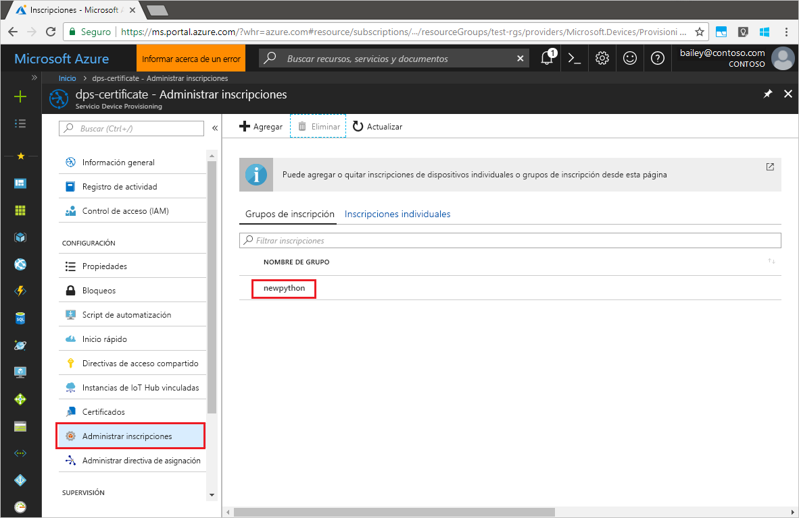

# <a name="quickstart-enroll-x509-devices-to-the-device-provisioning-service-using-python"></a>Inicio rápido: Inscripción de dispositivos X.509 en el servicio Device Provisioning con Python

[!INCLUDE [iot-dps-selector-quick-enroll-device-x509](../../includes/iot-dps-selector-quick-enroll-device-x509.md)]

En este inicio rápido, usará Python para crear mediante programación un grupo de inscripción que use certificados CA X.509 intermedios o raíces de una entidad de certificación. Un grupo de inscripción controla el acceso al servicio de aprovisionamiento de los dispositivos que comparten un certificado de firma común en su cadena de certificados. El grupo de inscripción se crea mediante el SDK del servicio de aprovisionamiento de Python y una aplicación Python de ejemplo.

## <a name="prerequisites"></a>Prerrequisitos

- Haber leído [Configuración de Azure IoT Hub Device Provisioning Service con Azure Portal](./quick-setup-auto-provision.md).
- Una cuenta de Azure con una suscripción activa. [cree una de forma gratuita](https://azure.microsoft.com/free/?ref=microsoft.com&utm_source=microsoft.com&utm_medium=docs&utm_campaign=visualstudio).
- [Python 2.x o 3.x](https://www.python.org/downloads/). Agregue Python a las variables de entorno específicas de la plataforma. En este inicio rápido se instala el [SDK del servicio de aprovisionamiento de Python](https://github.com/Azure/azure-iot-sdk-python/tree/v1-deprecated/provisioning_service_client) siguiente.
- [PIP](https://pip.pypa.io/en/stable/installing/), si no se incluye con la distribución de Python.
- [Git](https://git-scm.com/download/).

> [!IMPORTANT]
> Este artículo solo se aplica al SDK de Python v1 en desuso. El dispositivo y los clientes del servicio para IoT Hub Device Provisioning Service aún no están disponibles en la versión 2. Actualmente, el equipo está haciendo todo lo posible para incorporar la versión 2 a la paridad de características.

## <a name="prepare-test-certificates"></a>Preparación de los certificados de prueba

En esta guía de inicio rápido debe tener un archivo .pem o .cer que contenga la porción pública de un certificado X.509 intermedio o raíz de entidad de certificación. Se debe cargar este certificado en el servicio de aprovisionamiento y que este lo compruebe.

Para más información sobre el uso de la infraestructura de clave pública (PKI) basada en certificados X.509 con Azure IoT Hub y el servicio Device Provisioning, consulte [Introducción a la seguridad mediante certificados de entidades de certificación X.509](https://docs.microsoft.com/azure/iot-hub/iot-hub-x509ca-overview).

El [SDK de Azure IoT para C](https://github.com/Azure/azure-iot-sdk-c) contiene herramientas de prueba que pueden ayudarle a crear una cadena de certificados X.509, cargar un certificado raíz o intermedio a partir de esa cadena y realizar la prueba de posesión con el servicio para comprobar el certificado. Los certificados creados con las herramientas del SDK están diseñados para su uso en las **pruebas de desarrollo únicamente**. Estos certificados **no se deben usar en producción**. Contienen contraseñas codificadas de forma rígida ("1234") que expiran después de 30 días. Para saber cómo obtener certificados adecuados para el código de producción, consulte [Cómo obtener un certificado de entidad de certificación X.509](https://docs.microsoft.com/azure/iot-hub/iot-hub-x509ca-overview#how-to-get-an-x509-ca-certificate) en la documentación de Azure IoT Hub.

Para usar estas herramientas de prueba para generar certificados, realice los pasos siguientes:

1. Busque el nombre de etiqueta de la [versión más reciente](https://github.com/Azure/azure-iot-sdk-c/releases/latest) del SDK de C de IoT de Azure.

2. Abra un símbolo del sistema o el shell de Git Bash y cambie a una carpeta de trabajo de la máquina. Ejecute los siguientes comandos para clonar la versión más reciente del repositorio de GitHub del [SDK de Azure IoT para C](https://github.com/Azure/azure-iot-sdk-c). Use la etiqueta que encontró en el paso anterior como valor del parámetro `-b`:

    ```cmd/sh
    git clone -b <release-tag> https://github.com/Azure/azure-iot-sdk-c.git
    cd azure-iot-sdk-c
    git submodule update --init
    ```

    Esta operación puede tardar varios minutos en completarse.

   Las herramientas de prueba se encuentran en el directorio *azure-iot-sdk-c/tools/CACertificates* del repositorio que clonó.

3. Siga los pasos descritos en [Managing test CA certificates for samples and tutorials](https://github.com/Azure/azure-iot-sdk-c/blob/master/tools/CACertificates/CACertificateOverview.md) (Administración de certificados de entidad de certificación de prueba para ejemplos y tutoriales). 

## <a name="modify-the-python-sample-code"></a>Modificación del código de ejemplo de Python

En esta sección se muestra cómo agregar los detalles de aprovisionamiento del dispositivo X.509 al código de ejemplo. 

1. Con un editor de texto, cree un nuevo archivo **EnrollmentGroup.py**.

1. Agregue las siguientes instrucciones y variables `import` al principio del archivo **EnrollmentGroup.py**. Después, reemplace `dpsConnectionString` por la cadena de conexión que se encuentra en **Directivas de acceso compartido** en **Device Provisioning Service** de **Azure Portal**. Reemplace el marcador de posición de certificado por el certificado creado anteriormente en [Preparación de los certificados de prueba](quick-enroll-device-x509-python.md#prepare-test-certificates). Por último, cree un único `registrationid`, y asegúrese de que solo consta de caracteres alfanuméricos en minúsculas y guiones.  
   
    ```python
    from provisioningserviceclient import ProvisioningServiceClient
    from provisioningserviceclient.models import EnrollmentGroup, AttestationMechanism

    CONNECTION_STRING = "{dpsConnectionString}"

    SIGNING_CERT = """-----BEGIN CERTIFICATE-----
    XXXXXXXXXXXXXXXXXXXXXXXXXXXXXXXXXXXXXXXXXXXXXXXXXXXXXXXXXXXXXXXX
    XXXXXXXXXXXXXXXXXXXXXXXXXXXXXXXXXXXXXXXXXXXXXXXXXXXXXXXXXXXXXXXX
    XXXXXXXXXXXXXXXXXXXXXXXXXXXXXXXXXXXXXXXXXXXXXXXXXXXXXXXXXXXXXXXX
    XXXXXXXXXXXXXXXXXXXXXXXXXXXXXXXXXXXXXXXXXXXXXXXXXXXXXXXXXXXXXXXX
    XXXXXXXXXXXXXXXXXXXXXXXXXXXXXXXXXXXXXXXXXXXXXXXXXXXXXXXXXXXXXXXX
    XXXXXXXXXXXXXXXXXXXXXXXXXXXXXXXXXXXXXXXXXXXXXXXXXXXXXXXXXXXXXXXX
    XXXXXXXXXXXXXXXXXXXXXXXXXXXXXXXXXXXXXXXXXXXXXXXXXXXXXXXXXXXXXXXX
    XXXXXXXXXXXXXXXXXXXXXXXXXXXXXXXXXXXXXXXXXXXXXXXXXXXXXXXXXXXXXXXX
    XXXXXXXXXXXXXXXXXXXXXXXXXXXXXXXXXXXXXXXXXXXXXXXXXXXXXXXXXXXXXXXX
    XXXXXXXXXXXXXXXXXXXXXXXXXXXXXXXXXXXXXXXXXXXXXXXXXXXXXXXXXXXXXXXX
    XXXXXXXXXXXXXXXXXXXXXXXXXXXXXXXXXXXXXXXXXXXXXXXXXXXXXXXXXXXXXXXX
    XXXXXXXXXXXXXXXXXXXXXXXXXXXXXXXXXXXXXXXXXXXXXXXXXXXXXXXXXXXXXXXX
    XXXXXXXXXXXXXXXXXXXXXXXXXXXXXXXXXXXXXXXXXXXXXXXXXXXXXXXXXXXXXXXX
    XXXXXXXXXXXXXXXXXXXXXXXXXXXXXXXXXXXXXXXXXXXXXXXXXXXXXXXXXXXXXXXX
    XXXXXXXXXXXXXXXXXXXXXXXXXXXXXXXXXXXXXXXXXXXXXXXXXXXXXXXX
    -----END CERTIFICATE-----"""

    GROUP_ID = "{registrationid}"
    ```

1. Agregue la función y llamada de función siguientes para implementar la creación de inscripción de grupo:
   
    ```python
    def main():
        print ( "Initiating enrollment group creation..." )

        psc = ProvisioningServiceClient.create_from_connection_string(CONNECTION_STRING)
        att = AttestationMechanism.create_with_x509_signing_certs(SIGNING_CERT)
        eg = EnrollmentGroup.create(GROUP_ID, att)

        eg = psc.create_or_update(eg)
    
        print ( "Enrollment group created." )

    if __name__ == '__main__':
        main()
    ```

1. Guarde y cierre el archivo **EnrollmentGroup.py**.
 

## <a name="run-the-sample-group-enrollment"></a>Ejecución de la inscripción de grupo de ejemplo

Azure IoT Hub Device Provisioning Service admite dos tipos de inscripciones:

- [Grupos de inscripción](concepts-service.md#enrollment-group): usados para inscribir varios dispositivos relacionados.
- [Inscripciones individuales](concepts-service.md#individual-enrollment): usadas para inscribir un solo dispositivo.

La creación de inscripción individuales con el [SDK del servicio de aprovisionamiento de Python](https://github.com/Azure/azure-iot-sdk-python/tree/v1-deprecated/provisioning_service_client) es todavía un trabajo en curso. Para más información, consulte [Control del acceso de dispositivo al servicio de aprovisionamiento con certificados X.509](./concepts-security.md#controlling-device-access-to-the-provisioning-service-with-x509-certificates).

1. Abra un símbolo del sistema y ejecute el siguiente comando para instalar [azure-iot-provisioning-device-client](https://pypi.org/project/azure-iot-provisioning-device-client).

    ```cmd/sh
    pip install azure-iothub-provisioningserviceclient    
    ```

2. Abra el símbolo del sistema y ejecute el script.

    ```cmd/sh
    python EnrollmentGroup.py
    ```

3. Observe la salida para comprobar si la inscripción se realizó correctamente.

4. Vaya al servicio de aprovisionamiento en Azure Portal. Haga clic en **Administrar inscripciones**. Tenga en cuenta que el grupo de dispositivos X.509 aparecerá en la pestaña **Grupos de inscripción**, con el nombre `registrationid` creado anteriormente. 

      


## <a name="clean-up-resources"></a>Limpieza de recursos
Si planea explorar el ejemplo del servicio de Java, no elimine los recursos que se han creado en este inicio rápido. Si no va a continuar, use el siguiente comando para eliminar todos los recursos que se han creado en este inicio rápido.

1. Cierre la ventana de salida de ejemplo de Java en su máquina.
1. Cierre la ventana de la herramienta para _generar certificados X.509_ en su máquina.
1. Vaya a Device Provisioning Service en Azure Portal, seleccione **Administrar inscripciones** y, a continuación, seleccione la pestaña **Grupos de inscripción**. Seleccione la casilla que se encuentra junto a *NOMBRE DE GRUPO* para ver los dispositivos X.509 que inscribió mediante este inicio rápido y presione el botón **Eliminar** situado en la parte superior del panel.    


## <a name="next-steps"></a>Pasos siguientes
En este inicio rápido, ha inscrito un grupo de dispositivos X.509 simulados en Device Provisioning Service. Para más información acerca del aprovisionamiento de dispositivos, continúe con el tutorial para instalar el servicio Device Provisioning en Azure Portal. 

> [!div class="nextstepaction"]
> [Tutoriales del servicio Azure IoT Hub Device Provisioning](./tutorial-set-up-cloud.md)
