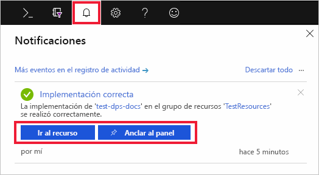
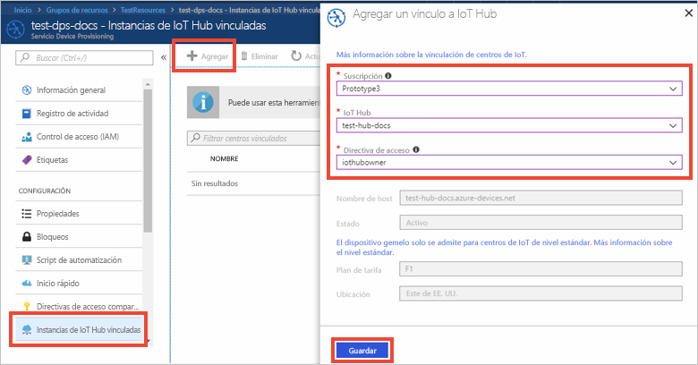

# Configuración de Azure IoT Hub Device Provisioning Service con Azure Portal

Estos pasos le enseñan a configurar los recursos de nube de Azure en el portal para el aprovisionamiento de los dispositivos. Este artículo incluye los pasos para crear un centro de IoT y un nuevo servicio Azure IoT Hub Device Provisioning, y para vincular los dos servicios. 

Si no tiene una suscripción a Azure, cree una [cuenta gratuita](https://azure.microsoft.com/free/?WT.mc_id=A261C142F) antes de empezar.

## Crear un centro de IoT

[!INCLUDE [iot-hub-include-create-hub](../../includes/iot-hub-include-create-hub.md)]

## Creación de una nueva instancia para el servicio Azure IoT Hub Device Provisioning

1. Haga clic en el botón **Crear un recurso** de la esquina superior izquierda de Azure Portal.

2. *Busque en Marketplace* el **servicio Device Provisioning**. Seleccione **Servicio IoT Hub Device Provisioning** y haga clic en el botón **Crear**. 

3. Proporcione la siguiente información para la nueva instancia del servicio Device Provisioning y haga clic en **Crear**.

    * **Nombre:** proporcione un nombre único para la nueva instancia del servicio Device Provisioning. Si el nombre que escribe está disponible, aparece una marca de verificación verde.
    * **Suscripción:** elija la suscripción que quiere usar para crear esta instancia del servicio Device Provisioning.
    * **Grupo de recursos:** este campo le permite crear un nuevo grupo de recursos o elegir uno existente para que contenga la nueva instancia. Elija el mismo grupo de recursos que contenga el centro de Iot que creó anteriormente, por ejemplo, **TestResources**. Al colocar juntos todos los recursos relacionados en un grupo, puede administrarlos juntos también. Por ejemplo, si elimina el grupo de recursos también se eliminarán todos los recursos que contiene. Para más información, consulte [Administración de grupos de recursos de Azure Resource Manager](../azure-resource-manager/manage-resource-groups-portal.md).
    * **Ubicación:** seleccione la ubicación más cercana a sus dispositivos.

        

4. Haga clic en el botón de notificación para supervisar la creación de la instancia del recurso. Una vez implementado el servicio correctamente, haga clic en **Anclar al panel** y en **Ir al recurso**.

    

## Vínculo del centro de IoT y el servicio Device Provisioning

En esta sección, agregará una configuración para la instancia del servicio Device Provisioning. Esta configuración establece el centro de IoT para el que los dispositivos se aprovisionarán.

1. Haga clic en el botón **Todos los recursos** en el menú izquierdo de Azure Portal. Seleccione la instancia del servicio Device Provisioning que creó en la sección anterior.  

2. En la hoja de resumen del servicio Device Provisioning, seleccione **Linked IoT hubs** (Centros de IoT vinculados). Haga clic en el botón **+ Agregar** que aparece en la parte superior. 

3. En la página **Agregar un vínculo a IoT Hub**, proporcione la siguiente información para vincular la nueva instancia del servicio Device Provisioning al centro de IoT. A continuación, haga clic en **Guardar**. 

    * **Suscripción:** seleccione la suscripción que contenga el centro de IoT que desee vincular a la nueva instancia del servicio Device Provisioning.
    * **IoT Hub:** seleccione el centro de IoT para vincular con la nueva instancia del servicio Device Provisioning.
    * **Directiva de acceso:** seleccione **iothubowner** como las credenciales para establecer el vínculo con el centro de IoT.  

        

3. Ahora debería ver el centro seleccionado en la hoja **Linked IoT hubs** (Centros de IoT vinculados). Puede que deba hacer clic en **Actualizar** para mostrar **Instancias de IoT Hub vinculadas**.

## Limpieza de recursos

Otras guías de inicio rápido de esta colección se basan en los valores de esta. Si tiene previsto seguir trabajando con las siguientes guías de inicio rápido o tutoriales, no elimine los recursos creados en esta guía de inicio rápido. Si no tiene previsto continuar, siga estos pasos para eliminar todos los recursos creados en esta guía de inicio rápido en Azure Portal.

1. Desde el menú de la izquierda en Azure Portal, haga clic en **Todos los recursos** y seleccione el servicio Device Provisioning. En la parte superior de la hoja **Todos los recursos**, haga clic en **Eliminar**.  
2. Desde el menú de la izquierda en Azure Portal, haga clic en **Todos los recursos** y seleccione su centro de IoT. En la parte superior de la hoja **Todos los recursos**, haga clic en **Eliminar**.  

## Pasos siguientes

En esta guía de inicio rápido, ha implementado un centro de IoT y una instancia del servicio Device Provisioning, y ha vinculado los dos recursos. Para aprender a usar esta configuración para aprovisionar un dispositivo simulado, siga la guía de inicio rápido que permite crear un dispositivo simulado.

> [!div class="nextstepaction"]
> [Guía de inicio rápido para crear el dispositivo simulado](./quick-create-simulated-device.md)
