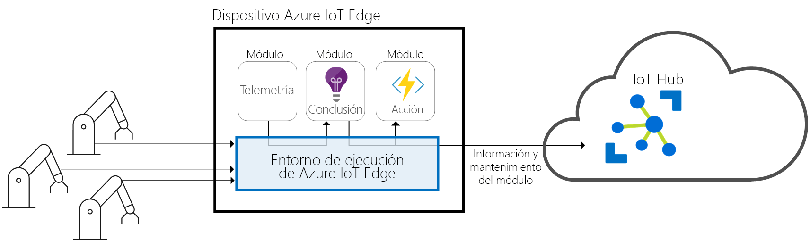
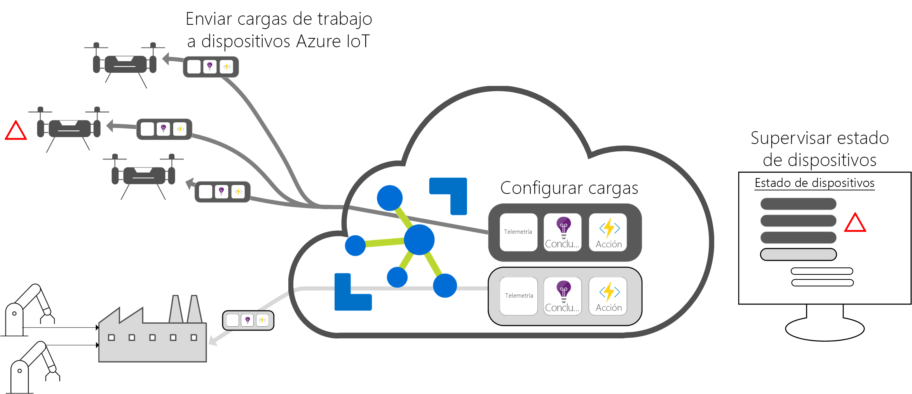

# ¿Qué es Azure IoT Edge?

Azure IoT Edge mueve el análisis en la nube y lógica de negocios personalizada a los dispositivos para que su organización pueda centrarse en la información empresarial en lugar de en la administración de los datos. Escale horizontalmente la solución de IoT mediante el empaquetado de la lógica de negocios en contenedores estándar y, después, podrá implementar esos contenedores en cualquiera de los dispositivos y supervisarlo todo desde la nube. 

Los análisis son un valor añadido empresarial para las soluciones de IoT, pero no es necesario que todos los análisis estén en la nube. Si quiere responder a emergencias lo antes posible, puede ejecutar las cargas de trabajo de detección de anomalías en el borde. Si quiere reducir los costos de ancho de banda y evitar la transferencia de terabytes de datos sin procesar, puede limpiar y agregar los datos localmente y enviar solo la información a la nube para su análisis. 

Azure IoT Edge está formado por tres componentes:
* Los **módulos de IoT Edge** son contenedores que ejecutan servicios de Azure, de terceros o código propio del usuario. Se implementan en los dispositivos de IoT Edge y se ejecutan en ellos. 
* El **entorno en tiempo de ejecución de IoT Edge** se ejecuta en todos los dispositivos de IoT Edge y administra los módulos que se implementan en cada dispositivo. 
* Una **interfaz basada en la nube** permite supervisar y administrar los dispositivos de IoT Edge de forma remota.

>[!NOTE]
>Azure IoT Edge está disponible en el nivel gratuito y estándar de IoT Hub. El nivel gratuito está pensado únicamente para pruebas y evaluación. Para más información acerca de los niveles básico y estándar, consulte el artículo sobre [cómo elegir el nivel de IoT Hub correcto](../iot-hub/iot-hub-scaling.md).

## Módulos de IoT Edge

Los módulos de IoT Edge son unidades de ejecución implementadas como contenedores compatibles con Docker, que ejecutan la lógica de negocios en los dispositivos perimetrales. Se pueden configurar varios módulos para que se comuniquen entre sí al crear una canalización de procesamiento de datos. Puede desarrollar módulos personalizados o empaquetar determinados servicios de Azure en módulos que proporcionen información sin conexión y en el dispositivo perimetral. 

### Inteligencia artificial perimetral

Azure IoT Edge permite implementar el procesamiento de eventos complejos, el aprendizaje automático, el reconocimiento de imágenes y otros tipos de inteligencia artificial de gran valor sin necesidad de escribirla internamente. Los servicios de Azure, como Azure Functions, Azure Stream Analytics y Azure Machine Learning, se pueden ejecutar de manera local mediante Azure IoT Edge. Sin embargo, esto no se limita únicamente a los servicios de Azure. Cualquier persona puede crear módulos de inteligencia artificial y ponerlos a disposición de la comunidad mediante Azure Marketplace. 

### Traiga su propio código

Cuando desee implementar su propio código en los dispositivos, Azure IoT Edge también lo admite. Azure IoT Edge aplica el mismo modelo de programación que los demás servicios de IoT de Azure. El mismo código se puede ejecutar en un dispositivo o en la nube. Azure IoT Edge es compatible con Windows y Linux, por lo que podrá codificar para la plataforma de su elección. Admite Java, .NET Core 2.0, Node.js, C y Python, por lo que los desarrolladores pueden crear código en un lenguaje que ya conozcan y usar la lógica de negocios existente.

## Entorno de tiempo de ejecución de IoT Edge

El entorno de tiempo de ejecución de Azure IoT Edge permite lógica de la nube y personalizada en dispositivos de IoT Edge. Se encuentra en el dispositivo de IoT Edge y realiza operaciones de administración y comunicación. El entorno de tiempo de ejecución realiza varias funciones:

* Instalación y actualización de las cargas de trabajo en el dispositivo.
* Mantenimiento de los estándares de seguridad de Azure IoT Edge en el dispositivo.
* Garantía de que los módulos de IoT Edge están siempre en ejecución.
* Notificación del mantenimiento del módulo a la nube para la supervisión remota.
* Administración de la comunicación entre los dispositivos hoja descendentes y un dispositivo IoT Edge, entre los módulos de un dispositivo IoT Edge y entre un dispositivo IoT Edge y la nube.

La manera de usar los dispositivos de Azure IoT Edge es decisión suya. El entorno en tiempo de ejecución se utiliza a menudo para implementar inteligencia artificial en puertas de enlace que agregan y procesan datos de otros dispositivos locales, pero este modelo de implementación es solo una de las opciones disponibles. 

El entorno de tiempo de ejecución de Azure IoT Edge se ejecuta en un gran conjunto de dispositivos de IoT para habilitar el su uso de numerosas maneras distintas. Admite los sistemas operativos Windows y Linux y abstrae los detalles del hardware. Use un dispositivo más pequeño que un Raspberry Pi 3 si no procesa muchos datos o utilice un servidor industrial para ejecutar cargas de trabajo que consumen numerosos recursos.

## Interfaz en la nube de IoT Edge

Es difícil administrar el ciclo de vida de software de millones de dispositivos de IoT que, con frecuencia, tienen marcas y modelos diferentes o están geográficamente dispersos. Las cargas de trabajo se crean y configuran para un determinado tipo de dispositivo, se implementan en todos los dispositivos y se supervisan para detectar los comportamientos incorrectos de los dispositivos. Estas actividades no se pueden realizar en cada dispositivo y deben realizarse a escala.

Azure IoT Edge se integra perfectamente con los aceleradores de soluciones de IoT de Azure para conseguir un plan de control que se adapte a las necesidades de la solución. Los servicios en la nube le permiten:

* Crear y configurar una carga de trabajo que se ejecute en un tipo específico de dispositivo.
* Enviar una carga de trabajo a un conjunto de dispositivos.
* Supervisar las cargas de trabajo que se ejecutan en los dispositivos de campo.

## Pasos siguientes

Pruebe estos conceptos al [implementar IoT Edge en un dispositivo simulado](quickstart.md).