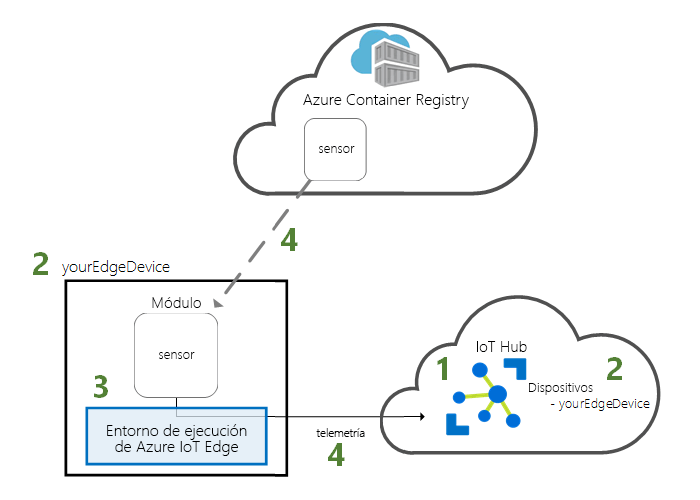
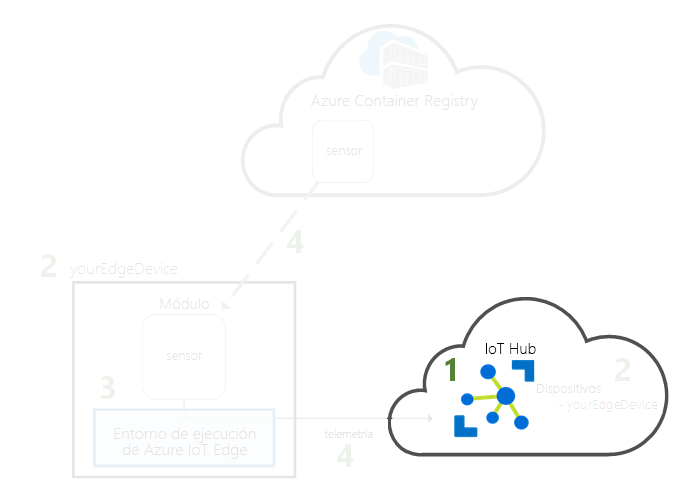
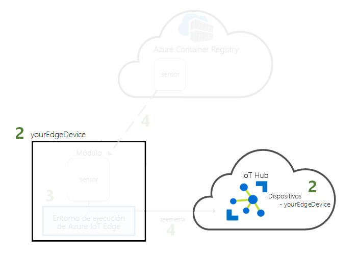
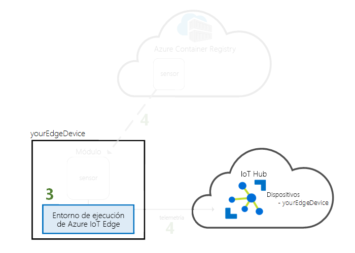
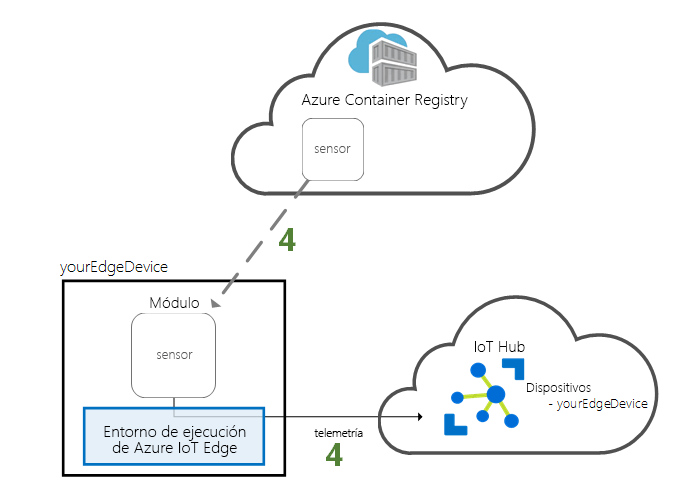

# <a name="quickstart-deploy-your-first-iot-edge-module-to-a-linux-x64-device"></a>Guía de inicio rápido: Implementación del primer módulo de IoT Edge en un dispositivo Linux x64

Azure IoT Edge traslada la eficacia de la nube a los dispositivos de Internet de las cosas. En esta guía de inicio rápido, aprenda a usar la interfaz de nube para implementar código creado previamente de manera remota en un dispositivo IoT Edge.

En esta guía de inicio rápido, aprenderá a hacer lo siguiente:

1. Cree un centro de IoT Hub.
2. Registre un dispositivo IoT Edge en su instancia de IoT Hub.
3. Instale e inicie el entorno de ejecución de Azure IoT Edge en el dispositivo.
4. Implemente un módulo de manera remota en un dispositivo IoT Edge.



Esta guía de inicio rápido convierte su equipo o maquina virtual Linux en un dispositivo IoT Edge. Después, puede implementar un módulo desde Azure Portal en el dispositivo. El módulo que se implementa en esta guía de inicio rápido es un sensor simulado que genera datos de temperatura, humedad y presión. Los otros tutoriales de Azure IoT Edge se basan en el trabajo que se realiza aquí mediante la implementación de módulos que analizan los datos simulados para obtener información empresarial.

Si no tiene una suscripción activa a Azure, cree una [cuenta gratuita](https://azure.microsoft.com/free) antes de comenzar.

[!INCLUDE [cloud-shell-try-it.md](../../includes/cloud-shell-try-it.md)]

Usará la CLI de Azure para completar muchos de los pasos de esta guía de inicio rápido; además, Azure IoT cuenta con una extensión para habilitar funcionalidad adicional. 

Agregue la extensión de Azure IoT a la instancia de Cloud Shell.

   ```azurecli-interactive
   az extension add --name azure-cli-iot-ext
   ```

## <a name="prerequisites"></a>Requisitos previos

Recursos en la nube: 

* Un grupo de recursos para administrar todos los recursos que se van a usar en esta guía de inicio rápido. 

   ```azurecli-interactive
   az group create --name IoTEdgeResources --location westus2
   ```

Dispositivo de IoT Edge:

* Una máquina virtual o dispositivo de Linux que actúa como dispositivo de IoT Edge. Se recomienda utilizar la instancia que proporciona Microsoft de [Azure IoT Edge en la máquina virtual Ubuntu](https://azuremarketplace.microsoft.com/en-us/marketplace/apps/microsoft_iot_edge.iot_edge_vm_ubuntu), que preinstala todo lo necesario para ejecutar IoT Edge en un dispositivo. Cree esta máquina virtual con el comando siguiente:

   ```azurecli-interactive
   az vm create --resource-group IoTEdgeResources --name EdgeVM --image microsoft_iot_edge:iot_edge_vm_ubuntu:ubuntu_1604_edgeruntimeonly:latest --admin-username azureuser --generate-ssh-keys --size Standard_DS1_v2
   ```

   La nueva máquina virtual puede tardar unos minutos en crearse e iniciarse. 

   Cuando cree una nueva máquina virtual, tome nota del valor de **publicIpAddress**, que se proporciona como parte de la salida del comando create. Utilice esta dirección IP pública para conectarse a la máquina virtual más adelante en la guía de inicio rápido.

* Si prefiere ejecutar el entorno de ejecución de Azure IoT Edge en su sistema local, siga las instrucciones en [Instalar el entorno de ejecución de Azure IoT Edge en Linux (x64)](how-to-install-iot-edge-linux.md).

* Si desea usar un dispositivo basado en ARM32, como Raspberry Pi, siga las instrucciones de [Instalación del entorno de ejecución de Azure IoT Edge en Linux (ARM32v7/armhf)](how-to-install-iot-edge-linux-arm.md).

## <a name="create-an-iot-hub"></a>Crear un centro de IoT

Para empezar el inicio rápido, cree un centro de IoT con la CLI de Azure.



El nivel gratuito de IoT Hub funciona para esta guía de inicio rápido. Si ha usado IoT Hub en el pasado y ya tiene un centro gratis creado, puede usar ese centro de IoT. Cada suscripción no puede tener más de un centro de IoT gratuito. 

El código siguiente crea un centro **F1** gratis en el grupo de recursos **IoTEdgeResources**. Reemplace *{hub_name}* por un nombre único para el centro de IoT.

   ```azurecli-interactive
   az iot hub create --resource-group IoTEdgeResources --name {hub_name} --sku F1 
   ```

   Si se produce un error porque ya hay un centro gratis en la suscripción, cambie la SKU a **S1**. Si recibe un error que le indica que el nombre de IoT Hub no está disponible, significa que alguien más ya tiene un centro con ese nombre. Pruebe con uno nuevo. 

## <a name="register-an-iot-edge-device"></a>Registro de un dispositivo de IoT Edge

Registre un dispositivo de IoT Edge con la instancia de IoT Hub recién creada.



Cree una identidad para el dispositivo de IoT Edge, con el fin de que pueda comunicarse con su centro de IoT. La identidad del dispositivo reside en la nube, y se usa una cadena de conexión de dispositivo única para asociar un dispositivo físico a una identidad de dispositivo. 

Dado que los dispositivos de IoT Edge se comportan y se pueden administrar de manera diferente a los dispositivos de IoT típicos, declare que esta identidad es para un dispositivo de IoT Edge con la marca `--edge-enabled`. 

1. En Azure Cloud Shell, escriba el comando siguiente para crear un dispositivo denominado **myEdgeDevice** en el centro.

   ```azurecli-interactive
   az iot hub device-identity create --hub-name {hub_name} --device-id myEdgeDevice --edge-enabled
   ```

   Si recibe un error acerca de las claves de directiva de iothubowner, asegúrese de que Cloud Shell está ejecutando la versión más reciente de la extensión azure-cli-iot-ext. 

2. Recupere la cadena de conexión del dispositivo, que vincula el dispositivo físico con su identidad en IoT Hub. 

   ```azurecli-interactive
   az iot hub device-identity show-connection-string --device-id myEdgeDevice --hub-name {hub_name}
   ```

3. Copie la cadena de conexión desde la salida JSON y guárdela. Este valor se usará para configurar el runtime de IoT Edge en la sección siguiente.

   

## <a name="configure-your-iot-edge-device"></a>Configuración de un dispositivo de IoT Edge

Inicie el entorno de ejecución de Azure IoT Edge en el dispositivo de IoT Edge. 



El runtime de IoT Edge se implementa en todos los dispositivos de IoT Edge. Tiene tres componentes. El **demonio de seguridad de IoT Edge** se inicia cada vez que se inicia un dispositivo perimetral y arranca el dispositivo mediante el inicio del agente de IoT Edge. El **agente de IoT Edge** facilita la implementación y supervisión de los módulos en el dispositivo IoT Edge, incluido el centro de IoT Edge. El **centro de IoT Edge** administra las comunicaciones entre los módulos del dispositivo de IoT Edge y entre el dispositivo y la instancia de IoT Hub. 

Durante la configuración del entorno en tiempo de ejecución, tendrá que proporcionar una cadena de conexión del dispositivo. Use la cadena que recuperó de la CLI de Azure. Esta cadena asocia el dispositivo físico con la identidad del dispositivo IoT Edge en Azure. 

### <a name="set-the-connection-string-on-the-iot-edge-device"></a>Establecimiento de la cadena de conexión en el dispositivo IoT Edge

Si usa Azure IoT Edge en la máquina virtual Ubuntu que se recomendó en los requisitos previos, el dispositivo ya tiene instalado el entorno de ejecución de Azure IoT Edge. Solo tiene que configurar el dispositivo con la cadena de conexión de dispositivo que recuperó en la sección anterior. Esta operación se puede hacer de forma remota, sin tener que conectarse a la máquina virtual. Ejecute el siguiente comando, pero reemplace **{device_connection_string}** por su propia cadena. 

   ```azurecli-interactive
   az vm run-command invoke -g IoTEdgeResources -n EdgeVM --command-id RunShellScript --script '/etc/iotedge/configedge.sh "{device_connection_string}"'
   ```

Si ejecuta IoT Edge en un equipo local o en un dispositivo ARM32, necesita instalar el entorno de ejecución de Azure IoT Edge y sus requisitos previos en el dispositivo. Siga las instrucciones de [Instalación del entorno de ejecución de Azure IoT Edge en Linux (x64)](how-to-install-iot-edge-linux.md) o [Instalar el entorno de ejecución de Azure IoT Edge en Linux (ARM32v7/armhf)](how-to-install-iot-edge-linux-arm.md) y vuelva a este inicio rápido. 

### <a name="view-the-iot-edge-runtime-status"></a>Visualización del estado del entorno de ejecución de Azure IoT Edge

El resto de los comandos de este inicio rápido tienen lugar en el propio dispositivo de IoT Edge, con el fin de que pueda ver lo que sucede en el dispositivo. Si usa una máquina virtual, conéctese a ella ahora mediante la dirección IP pública que generó el comando de creación. También puede encontrar la dirección IP pública en la página de información general de la máquina virtual en Azure Portal. Use el siguiente comando para conectarse a la máquina virtual. Reemplace **{azureuser}** si ha usado un nombre de usuario que no sea el que se sugiere en los requisitos previos. Reemplace **{publicIpAddress}** por la dirección de su máquina. 

   ```azurecli-interactive
   ssh azureuser@{publicIpAddress}
   ```

Compruebe que el runtime se ha instalado y configurado correctamente en el dispositivo de IoT Edge. 

>[!TIP]
>Necesita privilegios elevados para ejecutar comandos `iotedge`. Cuando cierre la sesión en su máquina y la inicie de nuevo por primera vez después de instalar el entorno de ejecución de IoT Edge, sus permisos se actualizarán automáticamente. Hasta entonces, use **sudo** delante de los comandos. 

1. Compruebe que el demonio de seguridad de Edge se ejecuta como un servicio del sistema.

   ```bash
   sudo systemctl status iotedge
   ```

   

2. Si necesita solucionar problemas del servicio, recupere los registros del servicio. 

   ```bash
   journalctl -u iotedge
   ```

3. Vea los módulos que se ejecutan en el dispositivo. 

   ```bash
   sudo iotedge list
   ```

   

El dispositivo de IoT Edge está ya configurado. Está preparado para ejecutar módulos implementados en la nube. 

## <a name="deploy-a-module"></a>Implementación de un módulo

Administre el dispositivo Azure IoT Edge desde la nube para implementar un módulo que enviará datos de telemetría a IoT Hub.


[!INCLUDE [iot-edge-deploy-module](../../includes/iot-edge-deploy-module.md)]

## <a name="view-generated-data"></a>Visualización de datos generados

En esta guía de inicio rápido, ha creado un nuevo dispositivo de IoT Edge y ha instalado el runtime de IoT Edge en él. Luego, ha usado Azure Portal para implementar un módulo de IoT Edge para que se ejecute en el dispositivo sin tener que realizar cambios en el propio dispositivo. 

En este caso, el módulo que ha insertado crea los datos de ejemplo que puede usar para las pruebas. El módulo del sensor de temperatura simulado genera datos de entorno que se pueden utilizar con fines de prueba más tarde. El sensor simulado está supervisando una máquina y el entorno alrededor de esta. Por ejemplo, este sensor podría estar en una sala de servidores, en una fábrica o en un aerogenerador. El mensaje incluye la temperatura y la humedad ambiental, la temperatura y la presión de la máquina, y una marca de tiempo. Los tutoriales de IoT Edge usan los datos creados por este módulo como datos de prueba con fines de análisis.

Abra de nuevo el símbolo del sistema en su dispositivo IoT Edge, o utilice la conexión SSH de la CLI de Azure. Confirme que el módulo implementado desde la nube se está ejecutando en el dispositivo IoT Edge:

   ```bash
   sudo iotedge list
   ```

   

Vea los mensajes que se envían desde el módulo del sensor de temperatura:

   ```bash
   sudo iotedge logs SimulatedTemperatureSensor -f
   ```

   >[!TIP]
   >Los comandos de IoT Edge distinguen mayúsculas de minúsculas en los nombres de los módulos.

   

También puede ver los mensajes que llegan a su centro de IoT mediante el uso de la [extensión de Azure IoT Hub Toolkit para Visual Studio Code](https://marketplace.visualstudio.com/items?itemName=vsciot-vscode.azure-iot-toolkit) (anteriormente, extensión de Azure IoT Tookit). 

## <a name="clean-up-resources"></a>Limpieza de recursos

Si desea continuar con los tutoriales de IoT Edge, puede usar el dispositivo que ha registrado y configurado en esta guía de inicio rápido. De lo contrario, puede eliminar los recursos de Azure que ha creado y quitar el entorno de ejecución de Azure IoT Edge del dispositivo.

### <a name="delete-azure-resources"></a>Eliminación de recursos de Azure

Si ha creado una máquina virtual y un centro de IoT en un nuevo grupo de recursos, puede eliminar dicho grupo y todos los recursos asociados. Vuelva a comprobar el contenido del grupo de recursos para asegurarse de que no haya nada que desee conservar. Si no desea eliminar todo el grupo, puede eliminar recursos individuales en su lugar.

Quite el grupo **IoTEdgeResources**.

   ```azurecli-interactive
   az group delete --name IoTEdgeResources 
   ```

### <a name="remove-the-iot-edge-runtime"></a>Eliminación del entorno de ejecución de Azure IoT Edge

Si desea quitar las instalaciones desde su dispositivo, use los siguientes comandos.  

Quite el entorno de ejecución de Azure IoT Edge.

   ```bash
   sudo apt-get remove --purge iotedge
   ```

Quite el entorno de ejecución del contenedor.

   ```bash
   sudo apt-get remove --purge moby-cli
   sudo apt-get remove --purge moby-engine
   ```

## <a name="next-steps"></a>Pasos siguientes

Esta guía de inicio rápido es el requisito previo para todos los demás tutoriales de IoT Edge. Puede continuar con cualquiera de los demás tutoriales para obtener información acerca de la forma en que Azure IoT Edge puede ayudarle a transformar estos datos en información empresarial en el perímetro.

> [!div class="nextstepaction"]
> [Filtrado de los datos del sensor mediante una función de Azure](tutorial-deploy-function.md)
