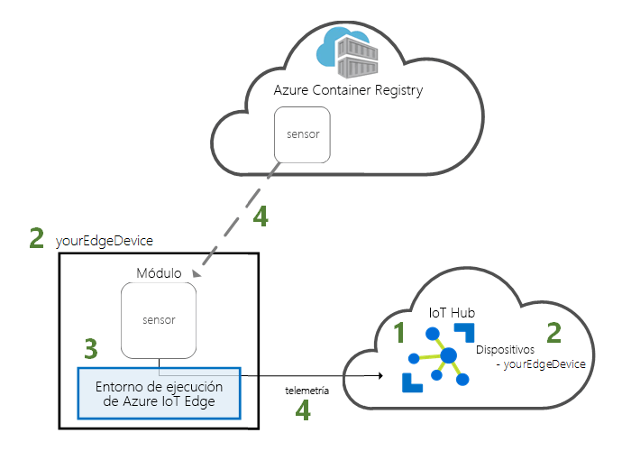
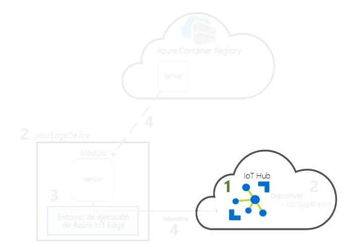
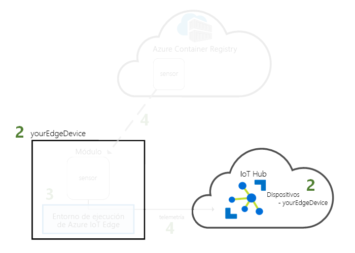
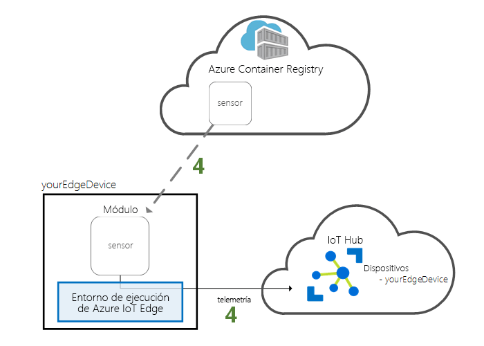

# <a name="quickstart-deploy-your-first-iot-edge-module-to-a-virtual-windows-device"></a>Inicio rápido: Implementación del primer módulo de IoT Edge en un dispositivo Windows virtual

Pruebe Azure IoT Edge mediante la implementación de código en contenedor en un dispositivo IoT Edge virtual. IoT Edge permite administrar de forma remota el código de los dispositivos para que pueda enviar más cargas de trabajo al perímetro. Para este inicio rápido, se recomienda usar una máquina virtual de Azure para el dispositivo IoT Edge. Con una máquina virtual, podrá crear rápidamente una máquina de pruebas, instalar los requisitos previos y, después, eliminarla cuando haya terminado.

En esta guía de inicio rápido, aprenderá a hacer lo siguiente:

1. Cree un Centro de IoT.
2. Registre un dispositivo IoT Edge en su instancia de IoT Hub.
3. Instale e inicie el entorno de ejecución de IoT Edge en el dispositivo virtual.
4. Implemente un módulo de forma remota en un dispositivo IoT Edge y envíe telemetría a IoT Hub.



Este inicio rápido le guiará en el proceso de creación de una máquina virtual Windows y de su configuración para que sea un dispositivo de IoT Edge. Después, puede implementar un módulo desde Azure Portal en el dispositivo. El módulo que se implementa en esta guía de inicio rápido es un sensor simulado que genera datos de temperatura, humedad y presión. Los otros tutoriales de Azure IoT Edge se basan en el trabajo que se realiza aquí mediante la implementación de módulos que analizan los datos simulados para obtener información empresarial.

Si no tiene una suscripción activa a Azure, cree una [cuenta gratuita](https://azure.microsoft.com/free) antes de comenzar.

[!INCLUDE [cloud-shell-try-it.md](../../includes/cloud-shell-try-it.md)]

Use la CLI de Azure para completar muchos de los pasos de este inicio rápido. IoT de Azure tiene una extensión que habilita una funcionalidad adicional.

Agregue la extensión de Azure IoT a la instancia de Cloud Shell.

   ```azurecli-interactive
   az extension add --name azure-cli-iot-ext
   ```

## <a name="prerequisites"></a>Prerequisites

Recursos en la nube:

* Un grupo de recursos para administrar todos los recursos que se van a usar en esta guía de inicio rápido.

   ```azurecli-interactive
   az group create --name IoTEdgeResources --location westus2
   ```

Dispositivo de IoT Edge:

* Una máquina virtual Windows que actúe como dispositivo de IoT Edge. Esta máquina virtual se puede crear mediante el comando siguiente, y hay que reemplazar `{password}` por una contraseña segura:

  ```azurecli-interactive
  az vm create --resource-group IoTEdgeResources --name EdgeVM --image MicrosoftWindowsDesktop:Windows-10:rs5-pro:latest --admin-username azureuser --admin-password {password} --size Standard_DS1_v2
  ```

  La nueva máquina virtual puede tardar unos minutos en crearse e iniciarse. A continuación, puede descargar un archivo RDP para su uso al conectarse a la máquina virtual:

  1. Vaya a la nueva máquina virtual Windows en Azure Portal.
  1. Seleccione **Conectar**.
  1. En la pestaña **RDP**, seleccione **Descargar archivo RDP**.

  Abra este archivo con Conexión a Escritorio remoto para conectarse a la máquina virtual Windows mediante el nombre de administrador y la contraseña que especificó con el comando `az vm create`.

> [!NOTE]
> En esta guía de inicio rápido se usa una máquina virtual de Escritorio de Windows por motivos de simplicidad. Para obtener información sobre qué sistemas operativos Windows están disponibles con carácter general para escenarios de producción, vea [Sistemas compatibles con Azure IoT Edge](support.md).
>
> Si está listo para configurar su propio dispositivo Windows para IoT Edge, incluidos dispositivos que ejecutan IoT Core, siga los pasos descritos en [Instalación del entorno de ejecución de Azure IoT Edge en Windows](how-to-install-iot-edge-windows.md).

## <a name="create-an-iot-hub"></a>Crear un centro de IoT

Para empezar el inicio rápido, cree un centro de IoT con la CLI de Azure.



El nivel gratuito de IoT Hub funciona para esta guía de inicio rápido. Si ha usado IoT Hub en el pasado y ya tiene un centro gratis creado, puede usar ese centro de IoT. Cada suscripción no puede tener más de un centro de IoT gratuito.

El código siguiente crea un centro **F1** gratis en el grupo de recursos `IoTEdgeResources`. Reemplace `{hub_name}` por un nombre único para su centro de IoT.

   ```azurecli-interactive
   az iot hub create --resource-group IoTEdgeResources --name {hub_name} --sku F1 --partition-count 2
   ```

   Si se produce un error porque ya hay un centro gratis en la suscripción, cambie la SKU a **S1**. Si recibe un error que le indica que el nombre de IoT Hub no está disponible, significa que alguien más ya tiene un centro con ese nombre. Pruebe con uno nuevo.

## <a name="register-an-iot-edge-device"></a>Registro de un dispositivo de IoT Edge

Registre un dispositivo de IoT Edge con la instancia de IoT Hub recién creada.


Cree una identidad para el dispositivo simulado, con el fin de que pueda comunicarse con su centro de IoT. La identidad del dispositivo reside en la nube, y se usa una cadena de conexión de dispositivo única para asociar un dispositivo físico a una identidad de dispositivo.

Dado que los dispositivos de IoT Edge se comportan y se pueden administrar de manera diferente a los dispositivos de IoT típicos, declare que esta identidad es para un dispositivo de IoT Edge con la marca `--edge-enabled`.

1. En Azure Cloud Shell, escriba el comando siguiente para crear un dispositivo denominado **myEdgeDevice** en el centro.

   ```azurecli-interactive
   az iot hub device-identity create --device-id myEdgeDevice --hub-name {hub_name} --edge-enabled
   ```

   Si recibe un error acerca de las claves de directiva de iothubowner, asegúrese de que Cloud Shell está ejecutando la versión más reciente de la extensión azure-cli-iot-ext.

2. Recupere la cadena de conexión del dispositivo, que vincula el dispositivo físico con su identidad en IoT Hub.

   ```azurecli-interactive
   az iot hub device-identity show-connection-string --device-id myEdgeDevice --hub-name {hub_name}
   ```

3. Copie el valor de la clave `connectionString` desde la salida JSON y guárdelo. Este valor es la cadena de conexión del dispositivo. Esta cadena de conexión se usará para configurar el entorno de ejecución de IoT Edge en la sección siguiente.

   

## <a name="install-and-start-the-iot-edge-runtime"></a>Instale e inicie el runtime de IoT Edge

Instale el entorno de ejecución de Azure IoT Edge en el dispositivo IoT Edge y configúrelo con una cadena de conexión del dispositivo.


El runtime de IoT Edge se implementa en todos los dispositivos de IoT Edge. Tiene tres componentes. El **demonio de seguridad de IoT Edge** se inicia cada vez que se inicia un dispositivo IoT Edge y arranca el dispositivo mediante el inicio del agente de este. El **agente de IoT Edge** administra la implementación y supervisión de los módulos en el dispositivo IoT Edge, incluido el centro de IoT Edge. El **centro de IoT Edge** administra las comunicaciones entre los módulos del dispositivo IoT Edge y entre el dispositivo y la instancia de IoT Hub.

El script de instalación también incluye un motor de contenedor denominado Moby que administra las imágenes de contenedor del dispositivo IoT Edge.

Durante la instalación en tiempo de ejecución, se le pedirá una cadena de conexión del dispositivo. Use la cadena que recuperó de la CLI de Azure. Esta cadena asocia el dispositivo físico con la identidad del dispositivo IoT Edge en Azure.

### <a name="connect-to-your-iot-edge-device"></a>Conexión al dispositivo IoT Edge

Todos los pasos descritos en esta sección tienen lugar en el dispositivo de IoT Edge, por lo que deberá conectarse a esa máquina virtual a través del escritorio remoto.

### <a name="install-and-configure-the-iot-edge-service"></a>Instalación y configuración del servicio IoT Edge

Use PowerShell para descargar e instalar el entorno de ejecución de IoT Edge. Use la cadena de conexión de dispositivo que recuperó de IoT Hub para configurar el dispositivo.

1. Si aún no la tiene, siga los pasos de [Registro de un nuevo dispositivo Azure IoT Edge desde Azure Portal](how-to-register-device.md) para registrar el dispositivo y recuperar la cadena de conexión de dicho dispositivo.

2. En la máquina virtual, ejecute PowerShell como administrador.

   >[!NOTE]
   >Use una sesión de AMD64 de PowerShell para instalar IoT Edge, no PowerShell (x86). Si no está seguro de qué tipo de sesión usa, ejecute el comando siguiente:
   >
   >```powershell
   >(Get-Process -Id $PID).StartInfo.EnvironmentVariables["PROCESSOR_ARCHITECTURE"]
   >```

3. El comando **Deploy-IoTEdge** comprueba si la máquina Windows tiene una versión compatible, activa la característica de contenedores, descarga el runtime de Moby y, después, descarga el runtime de IoT Edge.

   ```powershell
   . {Invoke-WebRequest -useb aka.ms/iotedge-win} | Invoke-Expression; `
   Deploy-IoTEdge -ContainerOs Windows
   ```

4. El equipo puede reiniciarse automáticamente. Si el comando Deploy-IoTEdge le pide que reinicie, hágalo ahora.

5. Vuelva a ejecutar PowerShell como administrador.

6. El comando **Initialize-IoTEdge** configura el entorno de ejecución de Azure IoT Edge en el equipo. El comportamiento predeterminado del comando es el aprovisionamiento manual con contenedores de Windows.

   ```powershell
   . {Invoke-WebRequest -useb aka.ms/iotedge-win} | Invoke-Expression; `
   Initialize-IoTEdge -ContainerOs Windows
   ```

7. Cuando se le pida una **DeviceConnectionString**, proporcione la cadena que ha copiado en la sección anterior. No incluya comillas para la cadena de conexión.

### <a name="view-the-iot-edge-runtime-status"></a>Visualización del estado del entorno de ejecución de Azure IoT Edge

Compruebe que el entorno de ejecución se ha instalado y configurado correctamente.

1. Compruebe el estado del servicio IoT Edge.

   ```powershell
   Get-Service iotedge
   ```

2. Si necesita solucionar problemas del servicio, recupere los registros del servicio.

   ```powershell
   . {Invoke-WebRequest -useb aka.ms/iotedge-win} | Invoke-Expression; Get-IoTEdgeLog
   ```

3. Vea todos los módulos que se ejecutan en el dispositivo IoT Edge. Como el servicio se acaba de iniciar por primera vez, solo verá la ejecución del módulo **edgeAgent**. El módulo edgeAgent se ejecuta de forma predeterminada y le ayuda a instalar e iniciar todos los módulos adicionales que implemente en el dispositivo.

    ```powershell
    iotedge list
    ```

   

Puede que tarde unos minutos en completarse la instalación y en que se inicie el módulo de agente de IoT Edge.

El dispositivo de IoT Edge está ya configurado. Está preparado para ejecutar módulos implementados en la nube.

## <a name="deploy-a-module"></a>Implementación de un módulo

Administre el dispositivo Azure IoT Edge desde la nube para implementar un módulo que envía datos de telemetría a IoT Hub.


[!INCLUDE [iot-edge-deploy-module](../../includes/iot-edge-deploy-module.md)]

## <a name="view-generated-data"></a>Visualización de datos generados

En este inicio rápido, ha registrado un nuevo dispositivo de IoT Edge y ha instalado el entorno de ejecución de IoT Edge en él. Luego, ha usado Azure Portal para implementar un módulo de IoT Edge para que se ejecute en el dispositivo sin tener que realizar cambios en el propio dispositivo.

En este caso, el módulo que ha insertado crea los datos de ejemplo que puede usar para las pruebas. El módulo del sensor de temperatura simulado genera datos de entorno que se pueden utilizar con fines de prueba más tarde. El sensor simulado está supervisando una máquina y el entorno alrededor de esta. Por ejemplo, este sensor podría estar en una sala de servidores, en una fábrica o en un aerogenerador. El mensaje incluye la temperatura y la humedad ambiental, la temperatura y la presión de la máquina, y una marca de tiempo. Los tutoriales de IoT Edge usan los datos creados por este módulo como datos de prueba con fines de análisis.

Confirme que el módulo implementado desde la nube se está ejecutando en el dispositivo IoT Edge.

```powershell
iotedge list
```

   

Vea los mensajes que se envían desde el módulo de sensor de temperatura a la nube.

```powershell
iotedge logs SimulatedTemperatureSensor -f
```

   >[!TIP]
   >Los comandos de IoT Edge distinguen mayúsculas de minúsculas en los nombres de los módulos.

   

También puede ver los mensajes que llegan a su centro de IoT mediante la [extensión de Azure IoT Hub para Visual Studio Code](https://marketplace.visualstudio.com/items?itemName=vsciot-vscode.azure-iot-toolkit).

## <a name="clean-up-resources"></a>Limpieza de recursos

Si desea continuar con los tutoriales de IoT Edge, puede usar el dispositivo que ha registrado y configurado en esta guía de inicio rápido. En caso contrario, puede eliminar los recursos de Azure que creó para evitar gastos.

Si ha creado una máquina virtual y un centro de IoT en un nuevo grupo de recursos, puede eliminar dicho grupo y todos los recursos asociados. Vuelva a comprobar el contenido del grupo de recursos para asegurarse de que no haya nada que desee conservar. Si no desea eliminar todo el grupo, puede eliminar recursos individuales en su lugar.

Quite el grupo **IoTEdgeResources**.

```azurecli-interactive
az group delete --name IoTEdgeResources
```

## <a name="next-steps"></a>Pasos siguientes

En esta guía de inicio rápido, ha creado un dispositivo IoT Edge y ha usado la interfaz en la nube de Azure IoT Edge para implementar el código en el dispositivo. Ahora tiene un dispositivo de prueba que genera datos sin procesar acerca de su entorno.

El siguiente paso es configurar el entorno de desarrollo local para que pueda empezar a crear módulos de IoT Edge que ejecutan la lógica de negocios.

> [!div class="nextstepaction"]
> [Empezar a desarrollar módulos de IoT Edge para dispositivos Windows](tutorial-develop-for-windows.md)
