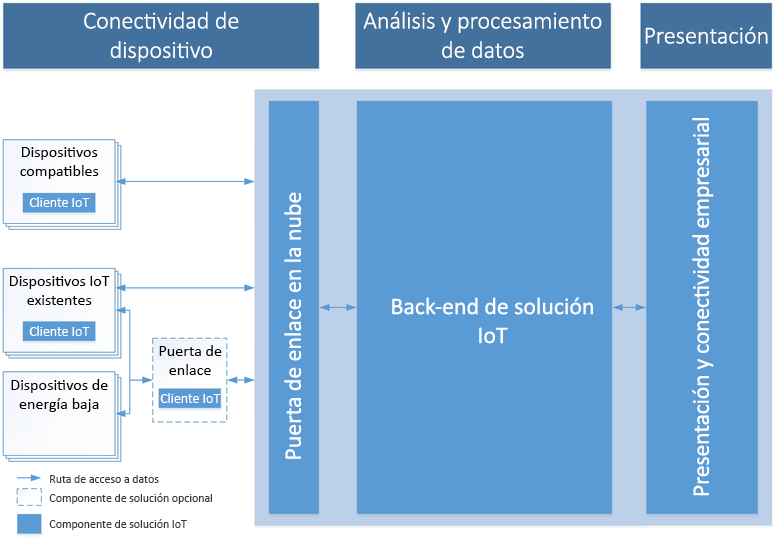

# Introducción a Azure e Internet de las cosas

IoT de Azure consta de tres áreas de tecnologías y soluciones: soluciones, servicios de plataforma y perímetro; diseñadas para facilitar el desarrollo de un extremo a otro de la aplicación de IoT. Para comenzar, en este artículo se describen las características comunes de una solución de IoT en la nube, seguidas de una introducción de cómo IoT de Azure aborda los desafíos de los proyectos de IoT, y por qué se debe considerar la adopción IoT de Azure.

## Arquitectura de solución IoT

Las soluciones de IoT típicas requieren comunicación bidireccional segura entre dispositivos, posiblemente millones, y un back-end de soluciones. Por ejemplo, una solución puede usar un análisis predictivo y automatizado para obtener información del flujo de eventos del dispositivo a la nube. 

El diagrama siguiente muestra los elementos clave de una arquitectura típica de solución de IoT. El diagrama es independiente de los detalles de implementación específicos, como los servicios de Azure utilizados y los sistemas operativos de los dispositivos. En esta arquitectura, los dispositivos de IoT recopilan datos que luego envían a una puerta de enlace en la nube. La puerta de enlace de nube hace que los datos estén disponibles para el procesamiento por otros servicios back-end. Estos servicios de back-end proporcionan datos para:

* Otras aplicaciones de línea de negocio.
* Operadores humanos a través de un panel u otro dispositivo de presentación.

> [!NOTE]
> Para ver un análisis detallado de la arquitectura de IoT, consulte [Microsoft Azure IoT Reference Architecture](https://aka.ms/iotrefarchitecture) (Arquitectura de referencia de IoT de Microsoft Azure).

### Conectividad de dispositivos

En una arquitectura de la solución de IoT, los dispositivos suelen enviar telemetría a la nube para el almacenamiento y el procesamiento. Por ejemplo, en un escenario de mantenimiento predictivo, el back-end de la solución podría usar el flujo de datos del sensor para determinar el momento en el que una bomba determinada necesita mantenimiento. Los dispositivos también pueden recibir y responder a los mensajes de nube a dispositivo mediante la lectura de mensajes desde un punto de conexión en la nube. En el mismo ejemplo, el back-end de la solución podría enviar mensajes a otras bombas del centro de bombeo para empezar a redirigir flujos justo antes del inicio del mantenimiento. Con este procedimiento se garantiza que el ingeniero de mantenimiento puede empezar en cuanto llegue.

La conexión segura de dispositivos y la confiabilidad suele ser el mayor reto de las soluciones de IoT. Esto se debe a que los dispositivos de IoT tienen características diferentes de otros clientes, como los exploradores y las aplicaciones para dispositivos móviles. En concreto, los dispositivos de IoT:

* A menudo son sistemas insertados sin operador humano (a diferencia de un teléfono).
* Se pueden implementar en ubicaciones remotas, donde el acceso físico resulta costoso.
* Es posible que solo sean accesibles a través del back-end de soluciones. No hay ninguna otra manera de interactuar con el dispositivo.
* Es posible que tengan limitaciones de recursos de procesamiento y alimentación.
* Es posible que tengan conectividad de red intermitente, lenta o costosa.
* Es posible que necesiten usar protocolos de aplicación propios, personalizados o específicos de determinados sectores.
* Pueden crearse mediante un amplio conjunto de plataformas populares de hardware y software.

Además de las restricciones anteriores, cualquier solución de IoT también debe ser escalable, segura y confiable.

En función del protocolo de comunicación y la disponibilidad de la red, los dispositivos se pueden comunicar con la nube tanto directamente como a través de una puerta de enlace intermedia. Las arquitecturas de IoT suelen tener una combinación de estos dos patrones de comunicación.

### Procesamiento de datos y análisis

En las soluciones de IoT modernas, el procesamiento de datos se produce en la nube o en el dispositivo. El procesamiento en el dispositivo se conoce como *informática perimetral*. La elección de dónde procesar los datos depende de factores como:

* Las restricciones de red. Un ancho de banda limitado entre los dispositivos y la nube motiva el procesamiento perimetral.
* El tiempo de respuesta. Si hay un requisito para actuar en un dispositivo casi en tiempo real, puede ser mejor procesar la respuesta en el propio dispositivo. Por ejemplo, un brazo robotizado que deba detenerse en caso de emergencia.
* Un entorno reglamentario. Algunos datos no se pueden enviar a la nube.

En general, el procesamiento de datos tanto en el perímetro como en la nube es una combinación de las siguientes funcionalidades:

* Recepción de la telemetría a escala de los dispositivos y determinación de cómo procesar y almacenar esos datos.
* Análisis de la telemetría para proporcionar información detallada, ya sea en tiempo real o después de que se produzcan los hechos.
* Envío de comandos de la nube o un dispositivo de puerta de enlace a un dispositivo específico.

Además, un back-end de IoT en la nube proporciona:

* Funcionalidades de registro de dispositivos que le permiten:
    * Aprovisionar dispositivos.
    * Controlar los dispositivos que tienen permiso para conectarse a la infraestructura.
* Administración de los dispositivos para controlar el estado de los dispositivos y supervisar sus actividades.

Por ejemplo, en el escenario de mantenimiento predictivo, el back-end en la nube almacena datos de telemetría históricos. La solución utiliza estos datos para identificar posibles comportamientos anómalos en bombas concretas antes de que causen un problema real. Mediante el análisis de los datos, identifica que la solución preventiva va a devolver un comando al dispositivo para emprender una acción correctiva. Este proceso genera un bucle de realimentación automatizado entre el dispositivo y la nube que aumenta en gran medida la eficacia de la solución.

### Presentación y conectividad empresarial

El nivel de presentación y conectividad empresarial permite a los usuarios finales interactuar con la solución de IoT y con los dispositivos. Permite a los usuarios ver y analizar los datos recopilados desde sus dispositivos. Estas vistas pueden adoptar la forma de paneles o informes de BI que pueden mostrar tanto datos históricos como datos prácticamente en tiempo real. Por ejemplo, un operador puede comprobar el estado de un centro de bombeo determinado y ver las alertas generadas por el sistema. Esta capa también permite la integración del back-end de la solución de IoT con las aplicaciones de línea de negocio existentes para conectarse con los procesos o flujos de trabajo empresariales. Por ejemplo, una solución de mantenimiento predictivo puede integrarse con un sistema de programación que reserve la visita a un centro de bombeo para un ingeniero cuando identifique una bomba que necesite mantenimiento.

## ¿Por qué IoT de Azure?

IoT de Azure simplifica la complejidad de los proyectos de IoT y soluciona los desafíos, como la seguridad, la incompatibilidad de infraestructuras y el ajuste de escala de la solución de IoT. Este es el procedimiento:

### Agile

Acelere su incorporación a Internet de las cosas.

* Escalado: empiece por poco, crezca hasta cualquier tamaño, desde cualquier lugar y en todas partes: millones de dispositivos, terabytes de datos, en la mayoría de las regiones del mundo.

* Abierto: use lo que tiene o modernícese con vistas al futuro mediante la conexión a cualquier dispositivo, software o servicio.

* Híbrido: compile según sus necesidades mediante la implementación de la solución de IoT en el perímetro, en la nube, o en cualquier combinación.

* Ritmo: implemente con mayor rapidez, acelere el tiempo de comercialización y manténgase a la vanguardia de la competencia con el líder en aceleradores de soluciones y el ritmo de innovación de IoT.

### Completo

Logre un mayor impacto para su empresa.

* Completo: Microsoft es el único proveedor de soluciones de IoT con una plataforma completa que va desde dispositivos hasta a la nube, pasando por macrodatos, análisis avanzados y servicios administrados.

* Partner para el éxito: aproveche la eficacia del ecosistema de partners más grande del mundo, y dé vida a la línea de negocios y la tecnología en todos los sectores y todo el mundo.

* Orientado a datos: IoT gira en torno a los datos, y las mejores soluciones de IoT reúnen todas las herramientas que necesita para almacenar, interpretar, transformar, analizar y presentar los datos al usuario correcto, en el lugar correcto y en el momento correcto.

* Centrado en los dispositivos: Microsoft IoT le permite conectar cualquier cosa, desde equipos ya existentes hasta un gran ecosistema de hardware certificado, y la capacidad de crear sus propios dispositivos en todos los sistemas perimetrales, móviles e incrustados.

### Protección

Resuelva lo más difícil de IoT, la seguridad.

* Capacidad: con Microsoft IoT, puede aunar su visión con la tecnología, las prácticas recomendadas y las funcionalidades para resolver lo más difícil de IoT: la seguridad.

* Respuesta: proteja los datos de IoT y administre los riesgos con la administración de identidades y accesos, la protección de amenazas e información, y la administración de seguridad.

* Tranquilidad: garantice la seguridad de la información confidencial en dispositivos, software, aplicaciones y servicios en la nube, así como en entornos locales.

* Cumplimiento: Microsoft ha liderado el sector para establecer requisitos de seguridad que cumplan con un amplio conjunto de estándares internacionales y específicos del sector para dispositivos, datos y servicios de IoT.

## Pasos siguientes

Explore las siguientes áreas de tecnologías y soluciones.

**Soluciones**

* [Aceleradores de soluciones de IoT](/azure/iot-suite)
* [IoT Central](/azure/iot-central)

**Servicios de plataforma**

* [IoT Hub](/azure/iot-hub)
* [Servicio IoT Hub Device Provisioning](/azure/iot-dps)
* [Azure Maps](/azure/azure-maps/)
* [Time Series Insights](/azure/time-series-insights)

**Edge**

* [Introducción a IoT Edge](/azure/iot-edge)
* [Qué es IoT Edge](/azure/how-iot-edge-works)
