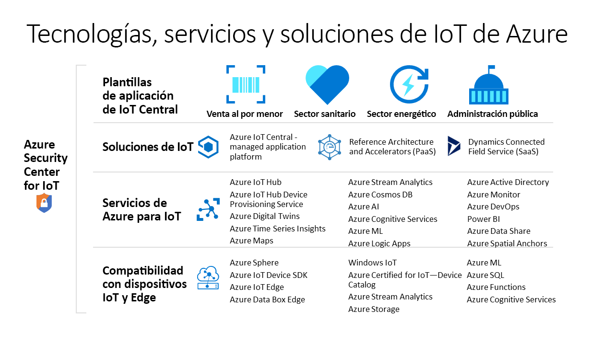

# Tecnologías y servicios de Azure para crear soluciones de IoT

Las tecnologías y los servicios de IoT de Azure ofrecen opciones para crear una amplia variedad de soluciones de IoT que permitan la transformación digital de cualquier organización. Por ejemplo, puede:

- Use [Azure IoT Central](https://apps.azureiotcentral.com), que es una plataforma administrada de aplicaciones de IoT, para compilar e implementar soluciones de IoT seguras de nivel empresarial. IoT Central incluye una colección de plantillas de aplicación específicas de un sector, como el de venta al por menor y el de asistencia sanitaria, para acelerar el proceso de desarrollo de la solución.
- Extienda la base del código fuente abierto de un [acelerador de soluciones](https://www.azureiotsolutions.com) de IoT de Azure para implementar un escenario de IoT común, como la supervisión remota o el mantenimiento predictivo.
- Use los servicios de la plataforma IoT de Azure, como [Azure IoT Hub](../iot-hub/about-iot-hub.md), y los [SDK de dispositivo IoT de Azure](../iot-hub/iot-hub-devguide-sdks.md) para crear una solución de IoT personalizada desde cero.

## Azure IoT Central

La [plataforma de aplicaciones IoT Central ](https://apps.azureiotcentral.com) reduce la carga y el costo del desarrollo, administración y mantenimiento de soluciones de IoT de nivel empresarial. La interfaz de usuario web personalizable de IoT Central permite supervisar las condiciones del dispositivo, crear reglas y administrar millones de dispositivos y sus datos a lo largo de su ciclo de vida. La superficie de la API en IoT Central proporciona acceso mediante programación para configurar una solución de IoT e interactuar con ella.

Azure IoT Central es una plataforma de aplicaciones totalmente administrada que se puede usar para crear soluciones de IoT personalizadas. IoT Central utiliza plantillas de aplicación para crear soluciones. Hay plantillas para soluciones genéricas y también para sectores específicos como el energético, el de atención sanitaria, el de administración pública y el de venta al por menor. Las plantillas de aplicación de IoT Central permiten implementar en cuestión de minutos una aplicación de IoT Central que, posteriormente, se puede personalizar con temas, paneles y vistas.

Elija dispositivos en el [catálogo de dispositivos Azure Certified for IoT](https://catalog.azureiotsolutions.com) para conectarse rápidamente a una solución. Use la interfaz de usuario web de IoT Central para supervisar y administrar los dispositivos, con el fin de mantenerlos en buen estado y conectados. Use conectores y API para integrar la aplicación de IoT Central con otras aplicaciones empresariales.

Al ser una plataforma de aplicaciones totalmente administrada, IoT Central tiene un modelo de precios sencillo y predecible.

## Aceleradores de soluciones de IoT de Azure

Los [aceleradores de soluciones de IoT de Azure](https://www.azureiotsolutions.com) son una colección de soluciones de nivel empresarial personalizables. Puede implementar estas soluciones tal cual, o bien se puede desarrollar una solución de IoT personalizada con el código fuente de Java o .NET de código abierto.

Los aceleradores de soluciones de IoT de Azure proporcionan un alto nivel de control sobre cualquier solución de IoT. Los aceleradores de soluciones incluyen soluciones precompiladas para escenarios de IoT comunes que se pueden implementar en una suscripción de Azure en cuestión de minutos. Estos escenarios incluyen:

  - Supervisión remota
  - Fábrica conectada
  - Mantenimiento predictivo
  - Simulación de dispositivos

La base del código fuente abierto para todos los aceleradores de soluciones está disponible en GitHub. Descargue el código para personalizar un acelerador de la solución, con el fin de que satisfaga sus requisitos específicos de IoT.

Los aceleradores de soluciones usan servicios de Azure, como Azure IoT Hub y Azure Storage, que debe administrar en su suscripción de Azure.

## Soluciones personalizadas

Para compilar una solución de IoT desde cero, o ampliar una solución creada mediante IoT Central o un acelerador de soluciones, use uno o varios de los siguientes servicios y tecnologías de IoT de Azure:

### Dispositivos

Desarrolle sus dispositivos de IoT mediante uno de los [kits de inicio de IoT de Azure](https://catalog.azureiotsolutions.com/kits) o elija el dispositivo que desee usar en el [catálogo de dispositivos Azure Certified for IoT](https://catalog.azureiotsolutions.com). Implemente el código insertado mediante los [SDK de dispositivo](../iot-hub/iot-hub-devguide-sdks.md) de código abierto. Los SDK de dispositivo admiten varios sistemas operativos, como Linux, Windows y sistemas operativos en tiempo real. Hay SDK para varios lenguajes de programación, como [C](https://github.com/Azure/azure-iot-sdk-c), [Node.js](https://github.com/Azure/azure-iot-sdk-node), [Java](https://github.com/Azure/azure-iot-sdk-java), [.NET](https://github.com/Azure/azure-iot-sdk-csharp) y [Python](https://github.com/Azure/azure-iot-sdk-python).

Puede simplificar aún más la forma de crear el código insertado para los dispositivos mediante el servicio [IoT Plug and Play, versión preliminar](../iot-pnp/overview-iot-plug-and-play.md). IoT Plug and Play permite a los desarrolladores de soluciones integrar dispositivos en sus soluciones sin necesidad de escribir código integrado. En el centro de IoT Plug and Play se encuentra un esquema de _modelo de funcionalidades de dispositivo_ que describe esas funcionalidades. Use el modelo de funcionalidad del dispositivo para generar un código del dispositivo insertado y configurar una solución basada en la nube, como una aplicación de IoT Central.

[Azure IoT Edge](../iot-edge/about-iot-edge.md) permite descargar en los dispositivos partes de una carga de trabajo de IoT de los servicios en la nube de Azure. IoT Edge puede reducir la latencia de una solución, reducir la cantidad de datos que los dispositivos intercambian con la nube y habilitar escenarios sin conexión. Los dispositivos IoT Edge se pueden administrar desde IoT Central y algunos aceleradores de soluciones.

[Azure Sphere](https://docs.microsoft.com/azure-sphere/product-overview/what-is-azure-sphere) es una plataforma de aplicaciones segura y de alto nivel con características integradas de comunicación y seguridad para dispositivos conectados a Internet. Incluye una unidad de microcontroladores protegida, un sistema operativo basado en Linux personalizado y un servicio de seguridad basado en la nube que ofrece una seguridad renovable y continua.

### Conectividad en la nube

El servicio [Azure IoT Hub](../iot-hub/about-iot-hub.md) permite una comunicación bidireccional confiable y segura entre millones de dispositivos IoT y una solución basada en la nube. [Azure IoT Hub Device Provisioning](../iot-dps/about-iot-dps.md) es un servicio asistente para IoT Hub. El servicio ofrece aprovisionamiento Just-In-Time sin interacción de dispositivos a la instancia correcta de IoT Hub sin necesidad de intervención humana. Estas funcionalidades permiten a los clientes aprovisionar millones de dispositivos de forma segura y escalable.

IoT Hub es un componente básico de los aceleradores de soluciones que se puede usar para cumplir los desafíos de implementación de IoT, como:

* La administración y la conectividad de los dispositivos de gran volumen.
* La ingesta de telemetría de gran volumen.
* El comando y el control de dispositivos.
* El cumplimiento de la seguridad de los dispositivos.

### Eliminación de la separación entre los mundos físico y digital

[Azure Digital Twins](../digital-twins/about-digital-twins.md) es un servicio de IoT que permite modelar un entorno físico. Usa un grafo de inteligencia espacial para modelar las relaciones entre personas, espacios y dispositivos. Al correlacionar los datos de los mundos digital y físico, se pueden crear soluciones dependientes del contexto.

IoT Central usa gemelos digitales para sincronizar los dispositivos y datos del mundo real con los modelos digitales que permiten a los usuarios supervisar y administrar esos dispositivos conectados.

### Datos y análisis

Los dispositivos de IoT suelen generar grandes cantidades de datos de series temporales, como las lecturas de temperatura de los sensores. [Azure Time Series Insights](../time-series-insights/time-series-insights-overview.md) puede conectarse a una instancia de IoT Hub, leer el flujo de datos de telemetría de los dispositivos, almacenar esos datos y permitirle consultarlos y visualizarlos.

[Azure Maps](/azure/azure-maps) es una colección de servicios geoespaciales que emplea datos de mapas recientes para proporcionar un contexto geográfico preciso a las aplicaciones web y móviles. Para compilar las aplicaciones, puede usar una API REST, un control de JavaScript basado en web o un Android SDK.

## Pasos siguientes

Para disfrutar de una experiencia práctica, pruebe uno de los inicios rápidos:

- [Creación de una aplicación de Azure IoT Central](../iot-central/core/quick-deploy-iot-central.md)
- [Send telemetry from a device to an IoT hub](../iot-hub/quickstart-send-telemetry-cli.md) (Envío de telemetría de un dispositivo a IoT Hub)
- [Prueba de una solución de supervisión remota basada en la nube](../iot-accelerators/quickstart-remote-monitoring-deploy.md)
