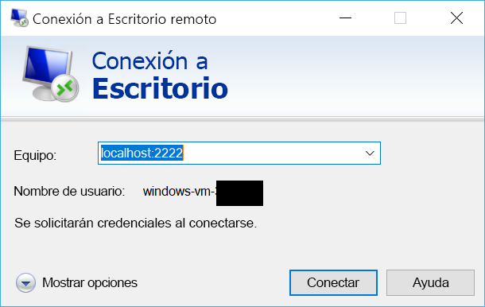

# <a name="quickstart-sshrdp-over-iot-hub-device-streams-using-c-proxy-applications-preview"></a>Inicio rápido: SSH/RDP mediante flujos de dispositivo de IoT Hub con aplicaciones proxy de C# (versión preliminar)

[!INCLUDE [iot-hub-quickstarts-4-selector](../../includes/iot-hub-quickstarts-4-selector.md)]

[Los flujos de dispositivo de IoT Hub](./iot-hub-device-streams-overview.md) permiten que las aplicaciones de servicio y de dispositivo se comuniquen de forma segura y apta para el firewall. En este artículo de inicio rápido se trabaja con dos programas de C# que habilitan el envío de tráfico de SSH y RDP mediante un flujo de dispositivo a IoT Hub. Consulte [esta página](./iot-hub-device-streams-overview.md#local-proxy-sample-for-ssh-or-rdp) para información general de la configuración.

Primero describiremos la configuración de SSH (con el puerto 22). A continuación, describiremos cómo modificar la configuración del puerto para RDP. Puesto que los flujos de dispositivo son independientes del protocolo y de la aplicación, se puede modificar el mismo ejemplo (se suelen cambiar los puertos de comunicación) para dar cabida a otros tipos de tráfico de la aplicación.

## <a name="how-it-works"></a>¿Cómo funciona?

En la siguiente ilustración se muestra la configuración de cómo los programas de proxy locales de dispositivo y de servicio de este ejemplo permiten la conectividad de un extremo a otro entre el cliente SSH y el demonio de SSH. En este caso se supone que el demonio se está ejecutando en el mismo dispositivo que el proxy de dispositivo local.


1. El proxy local de servicio se conecta a IoT Hub e inicia un flujo de dispositivo al dispositivo de destino.

2. El proxy local de dispositivo completa el protocolo de enlace de iniciación del flujo y establece un túnel de streaming de un extremo a otro hasta el lado del servicio mediante el punto de conexión de streaming de IoT Hub.

3. El proxy local de dispositivo se conecta al demonio SSH (SSHD) que escucha en el puerto 22 del dispositivo (esto se puede configurar, como se describe [a continuación](#run-the-device-side-application)).

4. El proxy local de servicio espera nuevas conexiones SSH del usuario mediante la escucha en un puerto designado que, en este caso, es el puerto `2222` (esto también se puede configurar, como se describe [a continuación](#run-the-service-side-application)). Cuando el usuario se conecta a través del cliente de SSH, el túnel permite el intercambio de tráfico de la aplicación entre los programas cliente y servidor de SSH.

> [!NOTE]
> El tráfico de SSH que se envía en el flujo de dispositivo se canaliza mediante el punto de conexión de streaming de IoT Hub en lugar de enviarse directamente entre el servicio y el dispositivo. Este escenario proporciona [estas ventajas](./iot-hub-device-streams-overview.md#benefits).

[!INCLUDE [cloud-shell-try-it.md](../../includes/cloud-shell-try-it.md)]

Si no tiene una suscripción a Azure, cree una [cuenta gratuita](https://azure.microsoft.com/free/?WT.mc_id=A261C142F) antes de empezar.

## <a name="prerequisites"></a>Requisitos previos

Las dos aplicaciones de ejemplo que se ejecutan en este inicio rápido se escriben con C#. Necesita el SDK de .NET Core 2.1.0 o una versión posterior en el equipo de desarrollo.

Puede descargar el SDK de .NET Core para varias plataformas desde [.NET](https://www.microsoft.com/net/download/all).

Puede verificar la versión actual de C# en el equipo de desarrollo con el comando siguiente:

```
dotnet --version
```

Descargue el proyecto de C# de muestra de https://github.com/Azure-Samples/azure-iot-samples-csharp/archive/master.zip y extraiga el archivo ZIP.


## <a name="create-an-iot-hub"></a>Crear un centro de IoT

[!INCLUDE [iot-hub-include-create-hub](../../includes/iot-hub-include-create-hub-device-streams.md)]

## <a name="register-a-device"></a>Registrar un dispositivo

Debe registrar un dispositivo con IoT Hub antes de poder conectarlo. En esta guía de inicio rápido, usará Azure Cloud Shell para registrar un dispositivo simulado.

1. Ejecute los siguientes comandos en Azure Cloud Shell para agregar la extensión de la CLI de IoT Hub y para crear la identidad del dispositivo. 

   **YourIoTHubName**: reemplace este marcador de posición por el nombre elegido para el centro de IoT.

   **MyDevice**: nombre que se da al dispositivo registrado. Use MyCDevice tal como se muestra. Si elige otro nombre para el dispositivo, tendrá que usarlo en todo el artículo y actualizar el nombre del dispositivo en las aplicaciones de ejemplo antes de ejecutarlas.

    ```azurecli-interactive
    az extension add --name azure-cli-iot-ext
    az iot hub device-identity create --hub-name YourIoTHubName --device-id MyDevice
    ```

2. Ejecute los siguientes comandos en Azure Cloud Shell para obtener la _cadena de conexión del dispositivo_ que acaba de registrar:

   **YourIoTHubName**: reemplace este marcador de posición por el nombre elegido para el centro de IoT.

    ```azurecli-interactive
    az iot hub device-identity show-connection-string --hub-name YourIoTHubName --device-id MyDevice --output table
    ```

    Anote la cadena de conexión del dispositivo, que se parecerá a la del siguiente ejemplo:

   `HostName={YourIoTHubName}.azure-devices.net;DeviceId=MyDevice;SharedAccessKey={YourSharedAccessKey}`

    Usará este valor más adelante en este inicio rápido.

3. También necesita la _cadena de conexión de servicio_ de su centro de IoT para que la aplicación del lado del servicio pueda conectarse al centro de IoT y establecer el flujo de dispositivo. El siguiente comando recupera este valor para el centro de IoT:

   **YourIoTHubName**: reemplace este marcador de posición por el nombre elegido para el centro de IoT.

    ```azurecli-interactive
    az iot hub show-connection-string --policy-name service --hub-name YourIoTHubName
    ```

    Tome nota del valor devuelto, que es similar a este:

   `"HostName={YourIoTHubName}.azure-devices.net;SharedAccessKeyName=service;SharedAccessKey={YourSharedAccessKey}"`
    

## <a name="ssh-to-a-device-via-device-streams"></a>Conexión mediante SSH a un dispositivo mediante flujos de dispositivo

### <a name="run-the-service-side-proxy"></a>Ejecución del proxy del lado del servicio

Vaya a `device-streams-proxy/service` en la carpeta del proyecto descomprimida. Necesitará tener a mano la siguiente información:

| Nombre de parámetro | Valor del parámetro |
|----------------|-----------------|
| `IotHubConnectionString` | La cadena de conexión del servicio de la instancia de IoT Hub. |
| `DeviceId` | El identificador del dispositivo que creó anteriormente. |
| `Port` | Un puerto local de conexión para el cliente de SSH. En este ejemplo se usa el puerto `2222`,pero se puede cambiar a números cualesquiera. |

Compile y ejecute el código de la siguiente forma:

```
cd ./iot-hub/Quickstarts/device-streams-proxy/service/

# Build the application
dotnet build

# Run the application
# In Linux/MacOS
dotnet run $serviceConnectionString MyDevice 2222

# In Windows
dotnet run %serviceConnectionString% MyDevice 2222
```

### <a name="run-the-device-local-proxy"></a>Ejecución del proxy de dispositivo local

Vaya a `device-streams-proxy/device` en la carpeta del proyecto descomprimida. Necesitará tener a mano la siguiente información:

| Nombre de parámetro | Valor del parámetro |
|----------------|-----------------|
| `DeviceConnectionString` | La cadena de conexión del dispositivo que creó anteriormente. |
| `RemoteHostName` | La dirección IP del servidor SSH (sería `localhost` si se ejecuta en la misma dirección IP del proxy de dispositivo local). |
| `RemotePort` | El puerto usado por el protocolo de aplicación (de forma predeterminada, sería el puerto 22 para SSH).  |

Compile y ejecute el código de la siguiente forma:

```
cd ./iot-hub/Quickstarts/device-streams-proxy/device/

# Build the application
dotnet build

# Run the application
# In Linux/MacOS
dotnet run $DeviceConnectionString localhost 22

# In Windows
dotnet run %DeviceConnectionString% localhost 22
```

Ahora utilice el programa cliente de SSH y conéctese al proxy local de servicio en el puerto `2222` (en lugar de directamente al demonio de SSH). 

```
ssh <username>@localhost -p 2222
```

En este momento, se mostrará el aviso de inicio de sesión de SSH para que escriba sus credenciales.

Salida de la consola en el lado del servicio (el proxy local de servicio escucha en el puerto 2222): 

Salida de la consola en el proxy local de dispositivo que conecta con el demonio de SSH en <code>IP_address:22</code>: 

Salida de la consola del programa cliente de SSH (el cliente de SSH se comunica con el demonio de SSH mediante la conexión al puerto 22 en el que escucha el proxy local de servicio): 

## <a name="rdp-to-a-device-via-device-streams"></a>Conexión mediante RDP a un dispositivo mediante flujos de dispositivo

La configuración para RDP es muy similar a la de SSH (descrita anteriormente). Básicamente, se necesita usar la dirección IP de destino de RDP y el puerto 3389 en su lugar, y el cliente de RDP (en lugar del de SSH).

### <a name="run-the-service-side-application"></a>Ejecución de la aplicación del lado del servicio

Vaya a `device-streams-proxy/service` en la carpeta del proyecto descomprimida. Necesitará tener a mano la siguiente información:

| Nombre de parámetro | Valor del parámetro |
|----------------|-----------------|
| `IotHubConnectionString` | La cadena de conexión del servicio de la instancia de IoT Hub. |
| `DeviceId` | El identificador del dispositivo que creó anteriormente. |
| `Port` | Un puerto local de conexión para el cliente de SSH. En este ejemplo se usa el puerto `2222`,pero se puede cambiar a números cualesquiera. |

Compile y ejecute el código de la siguiente forma:

```
cd ./iot-hub/Quickstarts/device-streams-proxy/service/

# Build the application
dotnet build

# Run the application
# In Linux/MacOS
dotnet run $serviceConnectionString MyDevice 2222

# In Windows
dotnet run %serviceConnectionString% MyDevice 2222
```

### <a name="run-the-device-side-application"></a>Ejecución de la aplicación del lado del dispositivo

Vaya a `device-streams-proxy/device` en la carpeta del proyecto descomprimida. Necesitará tener a mano la siguiente información:

| Nombre de parámetro | Valor del parámetro |
|----------------|-----------------|
| `DeviceConnectionString` | La cadena de conexión del dispositivo que creó anteriormente. |
| `RemoteHostName` | La dirección IP del servidor RDP (sería `localhost` si se ejecuta en la misma dirección IP del proxy de dispositivo local). |
| `RemotePort` | El puerto usado por el protocolo de aplicación (de forma predeterminada, sería el puerto 3389 para RDP).  |

Compile y ejecute el código de la siguiente forma:

```
cd ./iot-hub/Quickstarts/device-streams-proxy/device

# Run the application
# In Linux/MacOS
dotnet run $DeviceConnectionString localhost 3389

# In Windows
dotnet run %DeviceConnectionString% localhost 3389
```

Ahora utilice el programa cliente de RDP y conéctese al proxy local de servicio en el puerto `2222` (un puerto cualquiera disponible que eligió antes).



## <a name="clean-up-resources"></a>Limpieza de recursos

[!INCLUDE [iot-hub-quickstarts-clean-up-resources](../../includes/iot-hub-quickstarts-clean-up-resources-device-streams.md)]

## <a name="next-steps"></a>Pasos siguientes

En este inicio rápido, ha configurado un centro de IoT, ha registrado un dispositivo, ha implementado un programa de proxy local de servicio y de dispositivo local para establecer un flujo de dispositivo mediante IoT Hub, y ha usado los servidores proxy para tunelizar el tráfico de SSH o RDP. El mismo paradigma se acomoda a otros protocolos de cliente/servidor (donde el servidor se ejecuta en el dispositivo, como un demonio de SSH).

Use los siguientes vínculos para más información sobre los flujos de dispositivo:

> [!div class="nextstepaction"]
> [Introducción a los flujos de dispositivo](./iot-hub-device-streams-overview.md)
