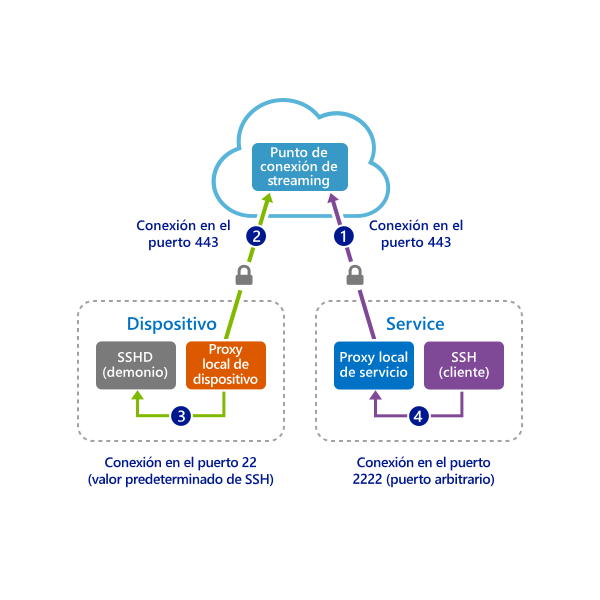
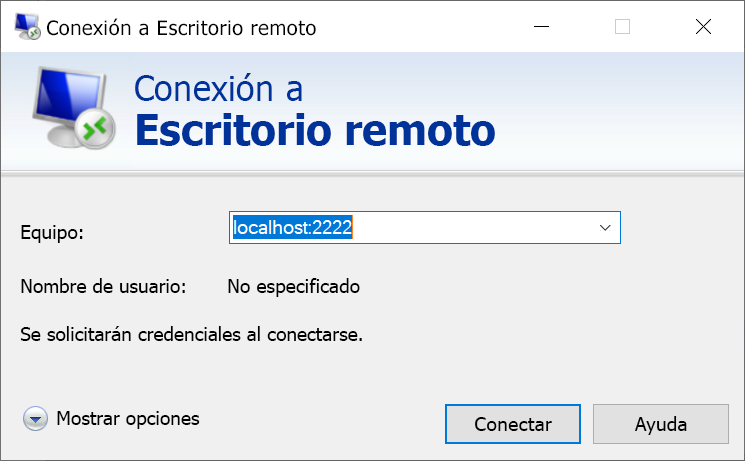

# <a name="quickstart-enable-ssh-and-rdp-over-an-iot-hub-device-stream-by-using-a-c-proxy-application-preview"></a>Inicio rápido: Habilitar SSH y RDP mediante un flujo de dispositivo de IoT Hub con una aplicación proxy en C# (versión preliminar)

[!INCLUDE [iot-hub-quickstarts-4-selector](../../includes/iot-hub-quickstarts-4-selector.md)]

Microsoft Azure IoT Hub actualmente admite flujos de dispositivos como una [versión preliminar](https://azure.microsoft.com/support/legal/preview-supplemental-terms/).

[Los flujos de dispositivo de IoT Hub](iot-hub-device-streams-overview.md) permiten que las aplicaciones de servicio y de dispositivo se comuniquen de forma segura y apta para el firewall. En este inicio rápido se trabaja con dos aplicaciones de C# que habilitan el tráfico de la aplicación cliente-servidor (como Secure Shell [SSH] y Protocolo de escritorio remoto [RDP]) para su envío mediante un flujo de dispositivo establecido con IoT Hub. Consulte [Ejemplo de aplicación proxy local para SSH o RDP](iot-hub-device-streams-overview.md#local-proxy-sample-for-ssh-or-rdp) para una introducción sobre la instalación.

En este artículo se describe primero la configuración de SSH (mediante el puerto 22) y, a continuación, se describe cómo modificar este puerto para RDP. Como los flujos de dispositivos son independientes del protocolo y de la aplicación, se puede modificar el mismo ejemplo para dar cabida a otros tipos de tráfico de la aplicación. Esta modificación solo conlleva normalmente el cambio del puerto de comunicación al puerto que usa la aplicación deseada.

## <a name="how-it-works"></a>Funcionamiento

En la siguiente ilustración se muestra cómo configurar las aplicaciones de proxy local de dispositivo y local de servicio del ejemplo para permitir la conectividad de un extremo a otro entre los procesos de cliente y demonio de SSH. En este caso se supone que el demonio se está ejecutando en el mismo dispositivo que la aplicación de proxy de dispositivo local.



1. La aplicación de proxy local de servicio se conecta a IoT Hub e inicia un flujo de dispositivo al dispositivo de destino.

1. La aplicación de proxy local de dispositivo completa el protocolo de enlace de iniciación del flujo y establece un túnel de streaming de un extremo a otro hasta el lado del servicio mediante el punto de conexión de streaming de IoT Hub.

1. La aplicación de proxy local de dispositivo se conecta al demonio SSH que escucha en el puerto 22 del dispositivo. Esta configuración se puede modificar como se indica en la sección "Ejecución de la aplicación de proxy local de dispositivo".

1. La aplicación de proxy local de servicio espera nuevas conexiones SSH de un usuario mediante la escucha en un puerto designado que, en este caso, es el puerto 2222. Esta configuración se puede modificar como se indica en la sección "Ejecución de la aplicación de proxy local de servicio". Cuando el usuario se conecta a través del cliente de SSH, el túnel permite que el tráfico de la aplicación de SSH se transfiera entre las aplicaciones cliente y servidor de SSH.

> [!NOTE]
> El tráfico de SSH que se envía en un flujo de dispositivo se tuneliza mediante el punto de conexión de streaming de IoT Hub en lugar de enviarse directamente entre el servicio y el dispositivo. Para más información, consulte las [ventajas que aporta el uso de los flujos de dispositivo de IoT Hub](iot-hub-device-streams-overview.md#benefits).

[!INCLUDE [cloud-shell-try-it.md](../../includes/cloud-shell-try-it.md)]

Si no tiene una suscripción a Azure, cree una [cuenta gratuita](https://azure.microsoft.com/free/?WT.mc_id=A261C142F) antes de empezar.

## <a name="prerequisites"></a>Prerrequisitos

* La versión preliminar de los flujos de dispositivo solo se admite en este momento en instancias de IoT Hub creadas en las siguientes regiones:

  * Centro de EE. UU.
  * EUAP del centro de EE. UU.
  * Sudeste de Asia
  * Norte de Europa

* Las dos aplicaciones de ejemplo que se ejecutan en este inicio rápido se escriben en C#. Necesita el SDK de .NET Core 2.1.0 o una versión posterior en la máquina de desarrollo.

  Puede descargar el [SDK de .NET Core para varias plataformas desde .NET](https://www.microsoft.com/net/download/all).

* Verifique la versión actual de C# en la máquina de desarrollo con el comando siguiente:

    ```
    dotnet --version
    ```

* Ejecute el siguiente comando para agregar la extensión IoT de Azure para la CLI de Azure a la instancia de Cloud Shell. La extensión IOT agrega comandos específicos de IoT Hub, IoT Edge e IoT Device Provisioning Service (DPS) a la CLI de Azure.

   ```azurecli-interactive
   az extension add --name azure-iot
   ```

   ```azurecli-interactive
   az extension add --name azure-iot
   ```
[!INCLUDE [iot-hub-cli-version-info](../../includes/iot-hub-cli-version-info.md)]

* [Descargue los ejemplos de C# de Azure IoT](https://github.com/Azure-Samples/azure-iot-samples-csharp/archive/master.zip) y extraiga el archivo ZIP.

* Una cuenta de usuario y credenciales válidas en el dispositivo (Windows o Linux) que se usan para autenticar al usuario.

## <a name="create-an-iot-hub"></a>Crear un centro de IoT

[!INCLUDE [iot-hub-include-create-hub](../../includes/iot-hub-include-create-hub.md)]

## <a name="register-a-device"></a>Registrar un dispositivo

Debe registrar un dispositivo con IoT Hub antes de poder conectarlo. En este inicio rápido, usará Azure Cloud Shell para registrar un dispositivo simulado.

1. Ejecute el siguiente comando en Cloud Shell para crear la identidad del dispositivo:

   > [!NOTE]
   > * Reemplace el marcador de posición *YourIoTHubName* por el nombre que eligió para su centro de IoT.
   > * Para el nombre del dispositivo que va a registrar se recomienda usar *MyDevice* , tal como se muestra. Si elige otro nombre para el dispositivo, úselo en todo el artículo y actualice el nombre del dispositivo en las aplicaciones de ejemplo antes de ejecutarlas.

    ```azurecli-interactive
    az iot hub device-identity create --hub-name {YourIoTHubName} --device-id MyDevice
    ```

1. Ejecute los siguientes comandos en Cloud Shell para obtener la *cadena de conexión del dispositivo* que acaba de registrar:

   > [!NOTE]
   > Reemplace el marcador de posición *YourIoTHubName* por el nombre que eligió para su centro de IoT.

    ```azurecli-interactive
    az iot hub device-identity show-connection-string --hub-name {YourIoTHubName} --device-id MyDevice --output table
    ```

    Anote la cadena de conexión del dispositivo devuelta para usarla más adelante en este inicio rápido. Debe ser similar al ejemplo siguiente:

   `HostName={YourIoTHubName}.azure-devices.net;DeviceId=MyDevice;SharedAccessKey={YourSharedAccessKey}`

1. También necesita la *cadena de conexión de servicio* de su centro de IoT para que la aplicación del lado del servicio pueda conectarse al centro de IoT y establecer el flujo de dispositivo. El siguiente comando recupera este valor para el centro de IoT:

   > [!NOTE]
   > Reemplace el marcador de posición *YourIoTHubName* por el nombre que eligió para su centro de IoT.

    ```azurecli-interactive
    az iot hub show-connection-string --policy-name service --name {YourIoTHubName} --output table
    ```

    Anote la cadena de conexión del servicio devuelta para usarla más adelante en este inicio rápido. Debe ser similar al ejemplo siguiente:

   `"HostName={YourIoTHubName}.azure-devices.net;SharedAccessKeyName=service;SharedAccessKey={YourSharedAccessKey}"`

## <a name="ssh-to-a-device-via-device-streams"></a>Conexión mediante SSH a un dispositivo mediante flujos de dispositivo

En esta sección, establece una secuencia de un extremo a otro para tunelizar el tráfico SSH.

### <a name="run-the-device-local-proxy-application"></a>Ejecución de la aplicación de proxy local de dispositivo

En una ventana de terminal local, vaya al directorio `device-streams-proxy/device` de la carpeta del proyecto descomprimida. Tenga la siguiente información a mano:

| Nombre de argumento | Valor de argumento |
|----------------|-----------------|
| `DeviceConnectionString` | La cadena de conexión del dispositivo que creó anteriormente. |
| `targetServiceHostName` | La dirección IP donde escucha el servidor SSH. La dirección será `localhost` si se trata de la misma dirección IP en la que se ejecuta la aplicación de proxy de dispositivo local. |
| `targetServicePort` | El puerto que usa el protocolo de aplicación (de forma predeterminada, es el puerto 22 para SSH).  |

Compile y ejecute el código con los siguientes comandos:

```
cd ./iot-hub/Quickstarts/device-streams-proxy/device/

# Build the application
dotnet build

# Run the application
# In Linux or macOS
dotnet run ${DeviceConnectionString} localhost 22

# In Windows
dotnet run {DeviceConnectionString} localhost 22
```

### <a name="run-the-service-local-proxy-application"></a>Ejecución de la aplicación de proxy local de servicio

En otra ventana de terminal local, vaya a `iot-hub/quickstarts/device-streams-proxy/service` la carpeta del proyecto descomprimida. Tenga la siguiente información a mano:

| Nombre de parámetro | Valor del parámetro |
|----------------|-----------------|
| `ServiceConnectionString` | La cadena de conexión del servicio de la instancia de IoT Hub. |
| `MyDevice` | El identificador del dispositivo que creó anteriormente. |
| `localPortNumber` | Un puerto local al que se conectará el cliente de SSH. En este ejemplo se usa el puerto 2222, pero se puede usar cualquier otro número. |

Compile y ejecute el código con los siguientes comandos:

```
cd ./iot-hub/Quickstarts/device-streams-proxy/service/

# Build the application
dotnet build

# Run the application
# In Linux or macOS
dotnet run ${ServiceConnectionString} MyDevice 2222

# In Windows
dotnet run {ServiceConnectionString} MyDevice 2222
```

### <a name="run-the-ssh-client"></a>Ejecución del cliente SSH

Ahora utilice la aplicación cliente de SSH y conéctese a la aplicación de proxy local de servicio en el puerto 2222 (en lugar de directamente al demonio de SSH).

```
ssh {username}@localhost -p 2222
```

En este momento, la ventana de inicio de sesión de SSH le pedirá que escriba sus credenciales.

Salida de la consola en el lado del servicio (la aplicación de proxy local de servicio escucha en el puerto 2222):


Salida de la consola en la aplicación de proxy local de dispositivo que conecta con el demonio de SSH en *IP_address:22*:


Salida de la consola de la aplicación de cliente SSH. El cliente de SSH se comunica con el demonio de SSH mediante la conexión al puerto 22 en el que escucha la aplicación de proxy local de servicio:


## <a name="rdp-to-a-device-via-device-streams"></a>Conexión mediante RDP a un dispositivo mediante flujos de dispositivo

La configuración para RDP es similar a la de SSH (que se ha descrito). Use la dirección IP de destino de RDP y el puerto 3389 en vez de los que empleó para SSH, y el cliente de RDP (en lugar del de SSH).

### <a name="run-the-device-local-proxy-application-rdp"></a>Ejecución de la aplicación de proxy local de dispositivo (RDP)

En una ventana de terminal local, vaya al directorio `device-streams-proxy/device` de la carpeta del proyecto descomprimida. Tenga la siguiente información a mano:

| Nombre de argumento | Valor de argumento |
|----------------|-----------------|
| `DeviceConnectionString` | La cadena de conexión del dispositivo que creó anteriormente. |
| `targetServiceHostName` | El nombre de host o dirección IP donde se ejecuta el servidor RDP. La dirección será `localhost` si se trata de la misma dirección IP en la que se ejecuta la aplicación de proxy de dispositivo local. |
| `targetServicePort` | El puerto usado por el protocolo de aplicación (de forma predeterminada, sería el puerto 3389 para RDP).  |

Compile y ejecute el código con los siguientes comandos:

```
cd ./iot-hub/Quickstarts/device-streams-proxy/device

# Run the application
# In Linux or macOS
dotnet run ${DeviceConnectionString} localhost 3389

# In Windows
dotnet run {DeviceConnectionString} localhost 3389
```

### <a name="run-the-service-local-proxy-application-rdp"></a>Ejecución de la aplicación de proxy local de servicio (RDP)

En otra ventana de terminal local, vaya a `device-streams-proxy/service` la carpeta del proyecto descomprimida. Tenga la siguiente información a mano:

| Nombre de parámetro | Valor del parámetro |
|----------------|-----------------|
| `ServiceConnectionString` | La cadena de conexión del servicio de la instancia de IoT Hub. |
| `MyDevice` | El identificador del dispositivo que creó anteriormente. |
| `localPortNumber` | Un puerto local al que se conectará el cliente de SSH. En este ejemplo se usa el puerto 2222, pero se puede cambiar a cualquier otro número. |

Compile y ejecute el código con los siguientes comandos:

```
cd ./iot-hub/Quickstarts/device-streams-proxy/service/

# Build the application
dotnet build

# Run the application
# In Linux or macOS
dotnet run ${ServiceConnectionString} MyDevice 2222

# In Windows
dotnet run {ServiceConnectionString} MyDevice 2222
```

### <a name="run-rdp-client"></a>Ejecución de un cliente RDP

Ahora utilice la aplicación cliente de RDP y conéctese a la aplicación de proxy local de servicio en el puerto 2222 (este era un puerto disponible arbitrario que eligió anteriormente).



## <a name="clean-up-resources"></a>Limpieza de recursos

[!INCLUDE [iot-hub-quickstarts-clean-up-resources](../../includes/iot-hub-quickstarts-clean-up-resources-device-streams.md)]

## <a name="next-steps"></a>Pasos siguientes

En este inicio rápido, ha configurado un centro de IoT, ha registrado un dispositivo, ha implementado aplicaciones de proxy local de servicio y local de dispositivo para establecer un flujo de dispositivo a través del centro de IoT y ha usado las aplicaciones proxy para tunelizar el tráfico de SSH o RDP. El mismo paradigma se acomoda a otros protocolos de cliente-servidor, en los que el servidor se ejecuta en el dispositivo (por ejemplo, el demonio de SSH).

Para más información sobre los flujos de dispositivo, consulte:

> [!div class="nextstepaction"]
> [Introducción a los flujos de dispositivo](./iot-hub-device-streams-overview.md)
