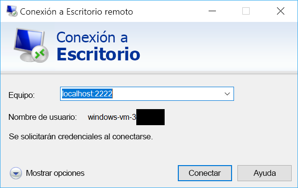

# <a name="quickstart-sshrdp-over-iot-hub-device-streams-using-nodejs-proxy-application-preview"></a>Inicio rápido: SSH/RDP mediante flujos de dispositivos de IoT Hub con aplicaciones proxy de Node.js (versión preliminar)

[!INCLUDE [iot-hub-quickstarts-4-selector](../../includes/iot-hub-quickstarts-4-selector.md)]

Microsoft Azure IoT Hub actualmente admite flujos de dispositivos como [Característica en vista previa (GB)](https://azure.microsoft.com/support/legal/preview-supplemental-terms/).

[Los flujos de dispositivo de IoT Hub](./iot-hub-device-streams-overview.md) permiten que las aplicaciones de servicio y de dispositivo se comuniquen de forma segura y apta para el firewall. En esta guía de inicio rápido se describe cómo ejecutar una aplicación de proxy de Node.js en el lado del servicio para permitir el envío de tráfico SSH y RDP al dispositivo mediante un flujo de dispositivo. Consulte [aquí](./iot-hub-device-streams-overview.md#local-proxy-sample-for-ssh-or-rdp) para obtener información general de la configuración. Durante la versión preliminar pública, el SDK para Node.js solo admite flujos de dispositivo en el lado del servicio. Como resultado, esta guía de inicio rápido solo abarca las instrucciones para ejecutar el proxy local del servicio. Debe ejecutar un proxy local del dispositivo complementario que esté disponible en las guías de [inicio rápido de C#](./quickstart-device-streams-proxy-c.md) o de [inicio rápido de C](./quickstart-device-streams-proxy-csharp.md).

Primero describiremos la configuración de SSH (con el puerto 22). A continuación, describiremos cómo modificar la configuración de RDP (que usa el puerto 3389). Puesto que los flujos de dispositivo son independientes del protocolo y de la aplicación, se puede modificar el mismo ejemplo para dar cabida a otros tipos de tráfico de la aplicación cliente/servidor (normalmente mediante la modificación del puerto de comunicación).


[!INCLUDE [cloud-shell-try-it.md](../../includes/cloud-shell-try-it.md)]

Si no tiene una suscripción a Azure, cree una [cuenta gratuita](https://azure.microsoft.com/free/?WT.mc_id=A261C142F) antes de empezar.


## <a name="prerequisites"></a>Requisitos previos

La versión preliminar de los flujos de dispositivos solo se admite en este momento en instancias de IoT Hub creadas en las siguientes regiones:

  - **Centro de EE. UU.**
  - **EUAP de centro de EE. UU.**

Para ejecutar la aplicación local del servicio en este inicio rápido se necesita la versión 4.x.x de Node.js o posterior en la máquina de desarrollo.

Puede descargar Node.js para varias plataformas desde [nodejs.org](https://nodejs.org).

Puede verificar la versión actual de Node.js en el equipo de desarrollo con el comando siguiente:

```
node --version
```

Si aún no lo ha hecho, descargue el proyecto de Node.js de muestra desde https://github.com/Azure-Samples/azure-iot-samples-node/archive/streams-preview.zip y extraiga el archivo ZIP.


## <a name="create-an-iot-hub"></a>Crear un centro de IoT

Si ha completado la anterior [Guía de inicio rápido: Envío de telemetría desde un dispositivo a un centro de IoT](quickstart-send-telemetry-node.md) puede omitir este paso.

[!INCLUDE [iot-hub-include-create-hub](../../includes/iot-hub-include-create-hub-device-streams.md)]


## <a name="register-a-device"></a>Registrar un dispositivo

Si ha completado la anterior [Guía de inicio rápido: Envío de telemetría desde un dispositivo a un centro de IoT](quickstart-send-telemetry-node.md) puede omitir este paso.

Debe registrar un dispositivo con IoT Hub antes de poder conectarlo. En esta guía de inicio rápido, usará Azure Cloud Shell para registrar un dispositivo simulado.

1. Ejecute los siguientes comandos en Azure Cloud Shell para agregar la extensión de la CLI de IoT Hub y para crear la identidad del dispositivo. 

   **YourIoTHubName**: reemplace este marcador de posición por el nombre elegido para el centro de IoT.

   **MyDevice**: nombre que se da al dispositivo registrado. Use MyCDevice tal como se muestra. Si elige otro nombre para el dispositivo, tendrá que usarlo en todo el artículo y actualizar el nombre del dispositivo en las aplicaciones de ejemplo antes de ejecutarlas.

    ```azurecli-interactive
    az extension add --name azure-cli-iot-ext
    az iot hub device-identity create --hub-name YourIoTHubName --device-id MyDevice
    ```

2. También necesita una _cadena de conexión de servicio_ para permitir que la aplicación back-end se conecte a IoT Hub y recupere los mensajes. El comando siguiente recupera la cadena de conexión del servicio de su instancia de IoT Hub:

    **YourIoTHubName**: reemplace este marcador de posición por el nombre elegido para el centro de IoT.

    ```azurecli-interactive
    az iot hub show-connection-string --policy-name service --name YourIoTHubName
    ```

    Tome nota del valor devuelto, que es similar a este:

   `"HostName={YourIoTHubName}.azure-devices.net;SharedAccessKeyName=service;SharedAccessKey={YourSharedAccessKey}"`


## <a name="ssh-to-a-device-via-device-streams"></a>Conexión mediante SSH a un dispositivo mediante flujos de dispositivo

### <a name="run-the-device-local-proxy"></a>Ejecución del proxy de dispositivo local

Como ya se ha mencionado, el SDK de IoT Hub para Node.js solo admite flujos de dispositivo en el lado del servicio. Para la aplicación local del dispositivo, use los programas de proxy de dispositivo complementarios disponibles en las guías de [inicio rápido de C](./quickstart-device-streams-proxy-c.md) o de [inicio rápido de C#](./quickstart-device-streams-proxy-csharp.md). Asegúrese de que el proxy local del dispositivo se está ejecutando antes de continuar con el paso siguiente.


### <a name="run-the-service-local-proxy"></a>Ejecución del proxy local de servicio

Si se supone que el [proxy local del dispositivo](#run-the-device-local-proxy) se está ejecutando, siga los pasos que se indican a continuación para ejecutar el proxy local del servicio escrito en Node.js.

- Proporcione las credenciales del servicio, el identificador de dispositivo de destino donde se ejecuta el demonio de SSH y el número de puerto del proxy que se ejecuta en el dispositivo como variables del entorno.
  ```
  # In Linux
  export IOTHUB_CONNECTION_STRING="<provide_your_service_connection_string>"
  export STREAMING_TARGET_DEVICE="MyDevice"
  export PROXY_PORT=2222

  # In Windows
  SET IOTHUB_CONNECTION_STRING=<provide_your_service_connection_string>
  SET STREAMING_TARGET_DEVICE=MyDevice
  SET PROXY_PORT=2222
  ```
  Cambie los valores indicados anteriormente para que coincidan con la cadena de conexión y el identificador de dispositivo.

- Vaya a `Quickstarts/device-streams-service` en la carpeta del proyecto descomprimido y ejecute el proxy local de servicio.
  ```
  cd azure-iot-samples-node-streams-preview/iot-hub/Quickstarts/device-streams-service

  # Install the preview service SDK, and other dependencies
  npm install azure-iothub@streams-preview
  npm install

  # Run the service-local proxy application
  node proxy.js
  ```

### <a name="ssh-to-your-device-via-device-streams"></a>Conexión mediante SSH al dispositivo mediante flujos de dispositivo
En Linux, ejecute SSH mediante `ssh $USER@localhost -p 2222` en un terminal. En Windows, use el cliente SSH favorito (por ejemplo, PuTTY).

Salida de la consola en el servicio local una vez establecida la sesión SSH (el proxy local de servicio escucha en el puerto 2222): 


Salida de la consola del programa cliente de SSH (el cliente de SSH se comunica con el demonio de SSH mediante la conexión al puerto 22 en el que escucha el proxy local de servicio): 


### <a name="rdp-to-your-device-via-device-streams"></a>Conexión mediante RDP al dispositivo mediante flujos de dispositivo

Ahora utilice el programa cliente de RDP y conéctese al proxy de servicio en el puerto 2222 (el puerto cualquiera disponible que eligió antes).

> [!NOTE]
> Asegúrese de que el proxy de dispositivo está configurado correctamente para RDP y con el puerto 3389 de RDP.




## <a name="clean-up-resources"></a>Limpieza de recursos

[!INCLUDE [iot-hub-quickstarts-clean-up-resources](../../includes/iot-hub-quickstarts-clean-up-resources-device-streams.md)]

## <a name="next-steps"></a>Pasos siguientes

En este artículo de inicio rápido se ha configurado un centro de IoT, se ha registrado un dispositivo y se ha implementado un programa de proxy de servicio para habilitar RDP y SSH en un dispositivo IoT. El tráfico RDP y SSH se canalizará mediante un flujo de dispositivo a IoT Hub. Esto elimina la necesidad de conectividad directa al dispositivo.

Use los siguientes vínculos para más información sobre los flujos de dispositivo:

> [!div class="nextstepaction"]
> [Introducción a los flujos de dispositivo](./iot-hub-device-streams-overview.md)
