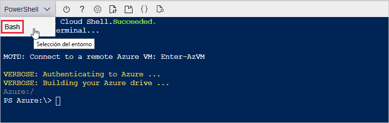
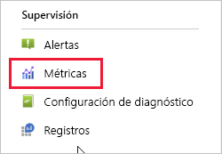
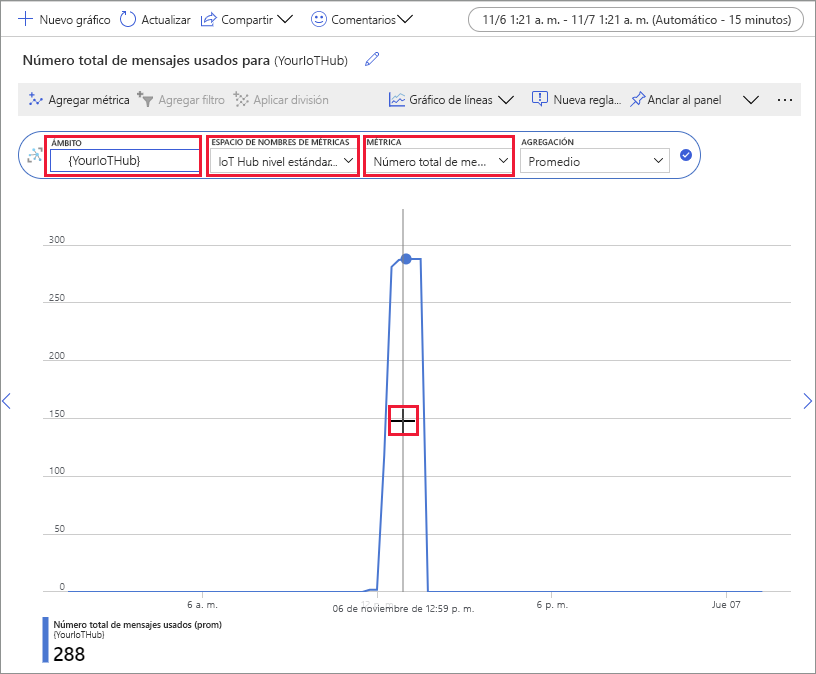

# <a name="quickstart-send-telemetry-from-a-device-to-an-iot-hub-and-monitor-it-with-the-azure-cli"></a>Inicio rápido: Enviar telemetría desde un dispositivo a IoT Hub y supervisarlo con la CLI de Azure

[!INCLUDE [iot-hub-quickstarts-1-selector](../../includes/iot-hub-quickstarts-1-selector.md)]

IoT Hub es un servicio de Azure que le permite ingerir grandes volúmenes de datos de telemetría desde los dispositivos IoT en la nube para su almacenamiento o procesamiento. En esta guía de inicio rápido, usará la CLI de Azure para crear un IoT Hub y un dispositivo simulado, enviar telemetría de dispositivo al centro y enviar un mensaje de nube a dispositivo. También puede usar el Azure Portal para visualizar las métricas del dispositivo. Se trata de un flujo de trabajo básico para desarrolladores que usan la CLI para interactuar con una aplicación IoT Hub.

## <a name="prerequisites"></a>Prerrequisitos
- Si no tiene una suscripción de Azure, [cree una gratuita](https://azure.microsoft.com/free/?WT.mc_id=A261C142F) antes de comenzar.
- CLI de Azure. Puede ejecutar todos los comandos de esta guía de inicio rápido mediante el Azure Cloud Shell, un shell interactivo de la CLI que se ejecuta en el explorador. Si usa el Cloud Shell, no necesita instalar nada. Si prefiere usar la CLI de forma local, esta guía de inicio rápido requiere CLI de Azure versión 2.0.76 o posterior. Para saber qué versión tiene, ejecute el comando az --version. Para la instalación o la actualización, consulte [Instalación de la CLI de Azure]( /cli/azure/install-azure-cli).

## <a name="sign-in-to-the-azure-portal"></a>Inicio de sesión en Azure Portal
Inicie sesión en Azure Portal en https://portal.azure.com.

Independientemente de si ejecuta la CLI localmente o en el Cloud Shell, mantenga el portal abierto en el explorador.  Lo usará más adelante en esta guía de inicio rápido.

## <a name="launch-the-cloud-shell"></a>Inicie el Cloud Shell
En esta sección, se inicia una instancia de la Azure Cloud Shell. Si usa la CLI localmente, vaya a la sección [Preparar dos sesiones de la CLI](#prepare-two-cli-sessions).

Para iniciar el Cloud Shell:

1. Seleccione el botón **Cloud Shell** en la barra de menú de la parte superior derecha del Azure Portal. 

    

    > [!NOTE]
    > Si es la primera vez que usa el Cloud Shell, le pedirá que cree el almacenamiento, que es necesario para usar el Cloud Shell.  Seleccione una suscripción para crear una cuenta de almacenamiento y un recurso compartido de Microsoft Azure Files. 

2. Seleccione el entorno de CLI preferido en la lista desplegable **Seleccionar entorno**. Esta guía de inicio rápido usa el entorno de **Bash**. Todos los siguientes comandos de la CLI funcionan también en el entorno de PowerShell. 

    

## <a name="prepare-two-cli-sessions"></a>Preparación de dos sesiones de la CLI

En esta sección, va a preparar dos sesiones CLI de Azure. Si utiliza el Cloud Shell, ejecutará las dos sesiones en pestañas del explorador independientes. Si usa un cliente de la CLI local, ejecutará dos instancias independientes de la CLI. Usará la primera sesión como un dispositivo simulado y la segunda sesión para supervisar y enviar mensajes. Para ejecutar un comando, seleccione **Copiar** para copiar un bloque de código en esta guía de inicio rápido, péguelo en la sesión de shell y ejecútelo.

CLI de Azure requiere que haya iniciado sesión en su cuenta de Azure. Todas las comunicaciones entre la sesión de Shell de CLI de Azure y el centro de IoT se autentican y cifran. Como resultado, esta guía de inicio rápido no necesita autenticación adicional que se usaría con un dispositivo real, como una cadena de conexión.

*  Ejecute el comando [az extension add](https://docs.microsoft.com/cli/azure/extension?view=azure-cli-latest#az-extension-add) para agregar la extensión Microsoft Azure IoT para CLI de Azure al shell de la CLI. La extensión IOT agrega comandos específicos de IoT Hub, IoT Edge e IoT Device Provisioning Service (DPS) a la CLI de Azure.

   ```azurecli
   az extension add --name azure-iot
   ```
   
   Después de instalar la extensión de Azure IOT, no es necesario volver a instalarla en ninguna sesión Cloud Shell. 

   [!INCLUDE [iot-hub-cli-version-info](../../includes/iot-hub-cli-version-info.md)]

*  Abra una segunda sesión de CLI.  Si utiliza el Cloud Shell, seleccione **Abrir nueva sesión**. Si usa la CLI localmente, abra una segunda instancia. 

    >[!div class="mx-imgBorder"]
    >

## <a name="create-an-iot-hub"></a>Creación de un IoT Hub
En esta sección, usará la CLI de Azure para crear un grupo de recursos y un IoT Hub.  Un grupo de recursos de Azure es un contenedor lógico en el que se implementan y se administran los recursos de Azure. Una IoT Hub actúa como centro de mensajes central para la comunicación bidireccional entre la aplicación de IoT y los dispositivos. 

> [!TIP]
> Si lo desea, puede crear un grupo de recursos de Azure, un IoT Hub y otros recursos mediante el [Azure Portal](iot-hub-create-through-portal.md), [Visual Studio Code](iot-hub-create-use-iot-toolkit.md) u otros métodos de programación.  

1. Ejecute el comando [az group create](https://docs.microsoft.com/cli/azure/group?view=azure-cli-latest#az-group-create) para crear un grupo de recursos. El siguiente comando crea un grupo de recursos denominado *MyResourceGroup* en la ubicación *eastus*. 

    ```azurecli
    az group create --name MyResourceGroup --location eastus
    ```

1. Ejecute el comando [az iot hub create](https://docs.microsoft.com/cli/azure/iot/hub?view=azure-cli-latest#az-iot-hub-create) para crear una instancia de IoT Hub. La creación de una instancia de IoT Hub puede tardar unos minutos. 

    *YourIotHubName*. reemplace este marcador de posición por el nombre elegido para el centro de IoT. Un nombre de centro de IoT debe ser único globalmente en Azure. Este marcador de posición se usa en el resto de esta guía de inicio rápido para representar el nombre de IoT Hub.

    ```azurecli
    az iot hub create --resource-group MyResourceGroup --name {YourIoTHubName}
    ```

## <a name="create-and-monitor-a-device"></a>Crear y supervisar un dispositivo
En esta sección, creará un dispositivo simulado en la primera sesión de la CLI. El dispositivo simulado envía la telemetría del dispositivo a su centro de IoT. En la segunda sesión de la CLI, se supervisan los eventos y la telemetría, y se envía un mensaje de la nube al dispositivo simulado.

Para crear e iniciar un dispositivo simulado:
1. Ejecute el comando [az iot hub device-identity create](https://docs.microsoft.com/cli/azure/ext/azure-cli-iot-ext/iot/hub/device-identity?view=azure-cli-latest#ext-azure-cli-iot-ext-az-iot-hub-device-identity-create) en la primera sesión de la CLI. Esto crea la identidad del dispositivo simulado. 

    *YourIotHubName*. reemplace este marcador de posición por el nombre elegido para el centro de IoT. 

    *simDevice*. Puede usar este nombre directamente para el dispositivo simulado en el resto de esta guía de inicio rápido. Si lo desea, use otro nombre. 

    ```azurecli
    az iot hub device-identity create --device-id simDevice --hub-name {YourIoTHubName} 
    ```

1. Ejecute el comando [az iot device simulate](https://docs.microsoft.com/cli/azure/ext/azure-cli-iot-ext/iot/device?view=azure-cli-latest#ext-azure-cli-iot-ext-az-iot-device-simulate) en la primera sesión de la CLI.  Esto inicia el dispositivo simulado. El dispositivo envía la telemetría a IoT Hub y recibe mensajes de ella.  

    *YourIotHubName*. reemplace este marcador de posición por el nombre elegido para el centro de IoT. 

    ```azurecli
    az iot device simulate -d simDevice -n {YourIoTHubName}
    ```

Para supervisar un dispositivo:
1. En la segunda sesión de la CLI, ejecute el comando [az iot hub monitor-events](https://docs.microsoft.com/cli/azure/ext/azure-cli-iot-ext/iot/hub?view=azure-cli-latest#ext-azure-cli-iot-ext-az-iot-hub-monitor-events). Esto inicia la supervisión del dispositivo simulado. La salida muestra la telemetría que el dispositivo simulado envía a la instancia de IoT Hub.

    *YourIotHubName*. reemplace este marcador de posición por el nombre elegido para el centro de IoT. 

    ```azurecli
    az iot hub monitor-events --output table --hub-name {YourIoTHubName}
    ```

    

1. Después de supervisar el dispositivo simulado en la segunda sesión de la CLI, presione Ctrl + C para detener la supervisión. 

## <a name="use-the-cli-to-send-a-message"></a>Uso de la CLI para enviar un mensaje
En esta sección, usará la segunda sesión de la CLI para enviar un mensaje al dispositivo simulado.

1. En la primera sesión de la CLI, confirme que el dispositivo simulado se está ejecutando. Si el dispositivo se ha detenido, ejecute el siguiente comando para iniciarlo:

    *YourIotHubName*. reemplace este marcador de posición por el nombre elegido para el centro de IoT. 

    ```azurecli
    az iot device simulate -d simDevice -n {YourIoTHubName}
    ```

1. En la segunda sesión de la CLI, ejecute el comando [az iot device c2d-message send](https://docs.microsoft.com/cli/azure/ext/azure-cli-iot-ext/iot/device/c2d-message?view=azure-cli-latest#ext-azure-cli-iot-ext-az-iot-device-c2d-message-send). Esto envía un mensaje de nube a dispositivo desde su instancia de IoT Hub al dispositivo simulado. El mensaje incluye una cadena y dos pares clave-valor.  

    *YourIotHubName*. reemplace este marcador de posición por el nombre elegido para el centro de IoT. 

    ```azurecli
    az iot device c2d-message send -d simDevice --data "Hello World" --props "key0=value0;key1=value1" -n {YourIoTHubName}
    ```
    Opcionalmente, puede enviar mensajes de nube a dispositivo mediante el Azure Portal. Para ello, navegue a la página de información general de la IoT Hub, seleccione **Dispositivo IoT**, seleccione el dispositivo simulado y seleccione **Mensaje al dispositivo**. 

1. En la primera sesión de la CLI, confirme que el dispositivo simulado ha recibido el mensaje. 

    

1. Después de ver el mensaje, cierre la segunda sesión de la CLI. Mantenga abierta la primera sesión de la CLI. Se usa para limpiar los recursos en un paso posterior.

## <a name="view-messaging-metrics-in-the-portal"></a>Visualización de las métricas de mensajería en el portal
El Azure Portal le permite administrar todos los aspectos de los IoT Hub y los dispositivos. En una aplicación IoT Hub típica que ingiere la telemetría de los dispositivos, es posible que quiera supervisar los dispositivos o ver las métricas en la telemetría del dispositivo. 

Para visualizar las métricas de mensajería en el Azure Portal:
1. En el menú de navegación izquierdo del portal, seleccione **Todos los recursos**. Aquí se enumeran todos los recursos de la suscripción, incluido el centro de IoT que ha creado. 

1. Seleccione el vínculo en el centro de IoT que ha creado. El portal muestra la página de información general del centro.

1. Seleccione **Métricas** en el panel izquierdo de la IoT Hub. 

    

1. Escriba el nombre del centro de IoT en **Ámbito**.

2. Seleccione *Métricas estándar de IOT Hub* en **Espacio de nombres de métricas**.

3. Seleccione *Número total de mensajes usados* en **Métrica**. 

4. Mantenga el puntero del mouse sobre el área de la escala de tiempo en la que el dispositivo envió los mensajes. El número total de mensajes en un momento dado aparece en la esquina inferior izquierda de la escala de tiempo.

    

5. Opcionalmente, use la lista desplegable **Métrica** para mostrar otras métricas en el dispositivo simulado. Por ejemplo, *entregas de mensajes C2d completadas* o *Dispositivos totales (versión preliminar)* . 

## <a name="clean-up-resources"></a>Limpieza de recursos
Si ya no necesita los recursos de Azure creados en esta guía de inicio rápido, puede usar la CLI de Azure para eliminarlos.

Si continúa con el siguiente artículo recomendado, puede mantener los recursos que ya ha creado y volver a usarlos. 

> [!IMPORTANT]
> La eliminación de un grupo de recursos es irreversible. El grupo de recursos y todos los recursos contenidos en él se eliminan permanentemente. Asegúrese de no eliminar por accidente el grupo de recursos o los recursos equivocados. 

Para eliminar un grupo de recursos por el nombre:
1. Ejecute el comando [az group delete](https://docs.microsoft.com/cli/azure/group?view=azure-cli-latest#az-group-delete). Esto quita el grupo de recursos, el IoT Hub y el registro de dispositivos que ha creado.

    ```azurecli
    az group delete --name MyResourceGroup
    ```
1. Ejecute el comando [az group list](https://docs.microsoft.com/cli/azure/group?view=azure-cli-latest#az-group-list) para confirmar que se ha eliminado el grupo de recursos.  

    ```azurecli
    az group list
    ```

## <a name="next-steps"></a>Pasos siguientes
En esta guía de inicio rápido, ha usado la CLI de Azure para crear una instancia de IoT Hub, crear un dispositivo simulado, enviar telemetría, supervisar la telemetría, enviar un mensaje de nube a dispositivo y limpiar los recursos. Usó el Azure Portal para visualizar las métricas de mensajería en el dispositivo.

Si es un desarrollador de dispositivos, el siguiente paso sugerido es ver el inicio rápido de telemetría que usa el SDK de dispositivo IoT de Azure para C. Si lo desea, consulte uno de los artículos de inicio rápido de telemetría de Azure IoT Hub disponibles en su lenguaje o SDK preferidos.

> [!div class="nextstepaction"]
> [Inicio rápido: Envío de telemetría desde un dispositivo a IoT Hub (C)](quickstart-send-telemetry-c.md)
