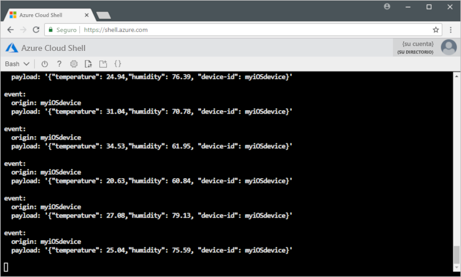

# <a name="quickstart-send-telemetry-from-a-device-to-an-iot-hub-ios"></a>Inicio rápido: Envío de telemetría desde un dispositivo a un centro de IoT (iOS)

[!INCLUDE [iot-hub-quickstarts-1-selector](../../includes/iot-hub-quickstarts-1-selector.md)]

IoT Hub es un servicio de Azure que le permite ingerir grandes volúmenes de datos de telemetría desde los dispositivos IoT en la nube para su almacenamiento o procesamiento. En este artículo, va a enviar datos de telemetría desde una aplicación de dispositivo simulado a IoT Hub. A continuación, podrá ver los datos desde una aplicación de back-end.

En este artículo se usa una aplicación Swift escrita previamente para enviar los datos de telemetría y una utilidad de la CLI para leer los datos procedentes de IoT Hub.

[!INCLUDE [cloud-shell-try-it.md](../../includes/cloud-shell-try-it.md)]

Si no tiene una suscripción a Azure, cree una [cuenta gratuita](https://azure.microsoft.com/free/?WT.mc_id=A261C142F) antes de empezar.

## <a name="prerequisites"></a>Prerrequisitos

- Descargue el código de ejemplo desde [Ejemplos de Azure](https://github.com/Azure-Samples/azure-iot-samples-ios/archive/master.zip)
- La versión más reciente de [XCode](https://developer.apple.com/xcode/) que, a su vez, ejecute la última versión del SDK de iOS. Este inicio rápido se probó con XCode 10.2 e iOS 12.2.
- La versión más reciente de [CocoaPods](https://guides.cocoapods.org/using/getting-started.html).
- Ejecute el siguiente comando para agregar la extensión IoT de Microsoft Azure para la CLI de Azure a la instancia de Cloud Shell. La extensión IOT agrega comandos específicos de IoT Hub, IoT Edge e IoT Device Provisioning Service (DPS) a la CLI de Azure.

   ```azurecli-interactive
   az extension add --name azure-cli-iot-ext
   ```

- Asegúrese de que está abierto el puerto 8883 del firewall. En el dispositivo de ejemplo de este inicio rápido se usa el protocolo MQTT, que se comunica mediante el puerto 8883. Este puerto puede estar bloqueado en algunos entornos de red corporativos y educativos. Para más información y para saber cómo solucionar este problema, consulte el artículo sobre la [conexión a IoT Hub (MQTT)](iot-hub-mqtt-support.md#connecting-to-iot-hub).

## <a name="create-an-iot-hub"></a>Crear un centro de IoT

[!INCLUDE [iot-hub-include-create-hub](../../includes/iot-hub-include-create-hub.md)]

## <a name="register-a-device"></a>Registrar un dispositivo

Debe registrar un dispositivo con IoT Hub antes de poder conectarlo. En esta guía de inicio rápido, usará Azure Cloud Shell para registrar un dispositivo simulado.

1. Ejecute los siguientes comandos en Azure Cloud Shell para crear la identidad del dispositivo.

   **YourIoTHubName**: reemplace este marcador de posición por el nombre elegido para el centro de IoT.

   **myiOSdevice**: es el nombre del dispositivo que se va a registrar. Se recomienda usar **myiOSdevice** como se muestra. Si elige un nombre distinto para el dispositivo, tendrá que usarlo en todo el artículo y actualizar el nombre del dispositivo en las aplicaciones de ejemplo antes de ejecutarlas.

   ```azurecli-interactive
   az iot hub device-identity create --hub-name {YourIoTHubName} --device-id myiOSdevice
   ```

1. Ejecute el siguiente comandos en Azure Cloud Shell para obtener la _cadena de conexión_ del dispositivo que acaba de registrar:

   **YourIoTHubName**: reemplace este marcador de posición por el nombre elegido para el centro de IoT.

   ```azurecli-interactive
   az iot hub device-identity show-connection-string --hub-name {YourIoTHubName} --device-id myiOSdevice --output table
   ```

   Anote la cadena de conexión del dispositivo, que se parecerá a esta:

   `HostName={YourIoTHubName}.azure-devices.net;DeviceId=myiOSdevice;SharedAccessKey={YourSharedAccessKey}`

    Este valor lo usará más adelante en este inicio rápido.

## <a name="send-simulated-telemetry"></a>Envío de datos de telemetría simulados

La aplicación de ejemplo se ejecuta en un dispositivo iOS, que se conecta a un punto de conexión específico del dispositivo en IoT Hub y envía datos de telemetría simulados sobre temperatura y humedad. 

### <a name="install-cocoapods"></a>Instalación de CocoaPods

CocoaPods administra las dependencias de los proyectos de iOS que utilizan bibliotecas de terceros.

En una ventana del terminal local, vaya a la carpeta Azure-IoT-Samples-iOS que descargó en los requisitos previos. Después, vaya a la carpeta del proyecto de ejemplo:

```sh
cd quickstart/sample-device
```

Asegúrese de que XCode está cerrado y ejecute el comando siguiente para instalar los pods de CocoaPods que se declararon en el archivo **podfile**:

```sh
pod install
```

Junto con la instalación de los pods necesarios para el proyecto, el comando de instalación también creó un archivo de área de trabajo de XCode que ya está configurado para usar los pods para las dependencias. 

### <a name="run-the-sample-application"></a>Ejecutar la aplicación de ejemplo 

1. Abra el área de trabajo de ejemplo en XCode.

   ```sh
   open "MQTT Client Sample.xcworkspace"
   ```

2. Expanda el proyecto **MQTT Client Sample** (Ejemplo de cliente MQTT) y, a continuación, expanda la carpeta del mismo nombre.  
3. Abra **ViewController.swift** para editar en XCode. 
4. Busque la variable **connectionString** y actualice su valor con la cadena de conexión del dispositivo que anotó anteriormente.
5. Guarde los cambios. 
6. Ejecute el proyecto en el emulador de dispositivos con el botón **Build and run** (Compilar y ejecutar) o la combinación de teclas **comando + r**. 

   

7. Cuando se inicie el emulador, seleccione **Start** (Iniciar) en la aplicación de ejemplo.

La siguiente captura de pantalla muestra una salida de ejemplo en la que la aplicación envía datos de telemetría simulados a IoT Hub:

   

## <a name="read-the-telemetry-from-your-hub"></a>Lectura de los datos de telemetría procedentes de su instancia de IoT Hub

La aplicación de ejemplo que se ejecutó en el emulador de XCode muestra datos acerca de los mensajes enviados desde el dispositivo. También puede ver los datos a través de IoT Hub cuando estos se reciben. La extensión de la CLI de IoT Hub se puede conectar al punto de conexión **Eventos** del lado servicio en su instancia de IoT Hub. La extensión recibe los mensajes del dispositivo a la nube enviados desde el dispositivo simulado. Normalmente, una aplicación back-end de IoT Hub se ejecuta en la nube para recibir y procesar los mensajes del dispositivo a la nube.

Ejecute los siguientes comandos en Azure Cloud Shell y reemplace `YourIoTHubName` por el nombre del centro de IoT:

```azurecli-interactive
az iot hub monitor-events --device-id myiOSdevice --hub-name {YourIoTHubName}
```

En la siguiente captura de pantalla se muestra la salida en la que la extensión recibe los datos de telemetría que el dispositivo simulado ha enviado al centro:

La captura de pantalla siguiente muestra el tipo de telemetría que se ve en la ventana del terminal local:



## <a name="clean-up-resources"></a>Limpieza de recursos

[!INCLUDE [iot-hub-quickstarts-clean-up-resources](../../includes/iot-hub-quickstarts-clean-up-resources.md)]

## <a name="next-steps"></a>Pasos siguientes

En este inicio rápido, ha configurado una instancia de IoT Hub, registrado un dispositivo, enviado datos de telemetría simulados a esta instancia desde un dispositivo iOS y leído esos datos desde IoT Hub. 

Para aprender a controlar el dispositivo simulado desde una aplicación back-end, vaya al siguiente inicio rápido.

> [!div class="nextstepaction"]
> [Inicio rápido: Control de un dispositivo conectado a IoT Hub](quickstart-control-device-node.md)
