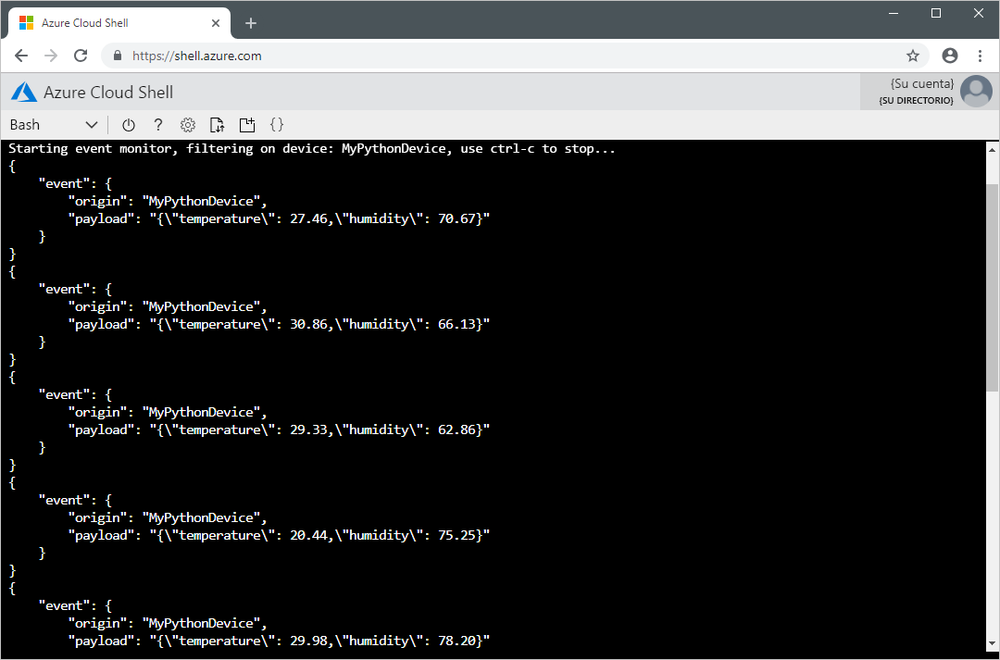

# <a name="quickstart-send-telemetry-from-a-device-to-an-iot-hub-and-read-it-with-a-back-end-application-python"></a>Inicio rápido: Envío de telemetría desde un dispositivo a un centro de IoT y su lectura con una aplicación de back-end (Python)

[!INCLUDE [iot-hub-quickstarts-1-selector](../../includes/iot-hub-quickstarts-1-selector.md)]

En este inicio rápido, se envían a través de Azure IoT Hub datos de telemetría desde una aplicación de dispositivo simulado a una aplicación de back-end para su procesamiento. IoT Hub es un servicio de Azure que le permite ingerir grandes volúmenes de datos de telemetría desde los dispositivos IoT en la nube para su almacenamiento o procesamiento. En este inicio rápido se usa una aplicación de Python escrita previamente para enviar los datos de telemetría y una utilidad CLI para leer los datos de telemetría procedentes del centro. Antes de ejecutar estas dos aplicaciones, creará un centro de IoT Hub y registrará un dispositivo con el centro.

## <a name="prerequisites"></a>Prerrequisitos

* Una cuenta de Azure con una suscripción activa. [cree una de forma gratuita](https://azure.microsoft.com/free/?ref=microsoft.com&utm_source=microsoft.com&utm_medium=docs&utm_campaign=visualstudio).

* [Python 3.7+](https://www.python.org/downloads/). Para obtener información acerca de otras versiones de Python compatibles, consulte el tema acerca de las [características de los dispositivos IoT de Azure](https://github.com/Azure/azure-iot-sdk-python/tree/master/azure-iot-device#azure-iot-device-features).

* [Un proyecto de Python de ejemplo](https://github.com/Azure-Samples/azure-iot-samples-python/archive/master.zip).

* El puerto 8883 abierto en el firewall. En el dispositivo de ejemplo de este inicio rápido se usa el protocolo MQTT, que se comunica mediante el puerto 8883. Este puerto puede estar bloqueado en algunos entornos de red corporativos y educativos. Para más información y para saber cómo solucionar este problema, consulte el artículo sobre la [conexión a IoT Hub (MQTT)](iot-hub-mqtt-support.md#connecting-to-iot-hub).

[!INCLUDE [cloud-shell-try-it.md](../../includes/cloud-shell-try-it.md)]

### <a name="add-azure-iot-extension"></a>Adición de la extensión IoT de Azure

Ejecute el siguiente comando para agregar la extensión IoT de Microsoft Azure para la CLI de Azure a la instancia de Cloud Shell. La extensión IoT agrega comandos específicos de IoT Hub, IoT Edge e IoT Device Provisioning Service (DPS) a la CLI de Azure.

```azurecli-interactive
az extension add --name azure-cli-iot-ext
```

## <a name="create-an-iot-hub"></a>Crear un centro de IoT

[!INCLUDE [iot-hub-include-create-hub](../../includes/iot-hub-include-create-hub.md)]

## <a name="register-a-device"></a>Registrar un dispositivo

Debe registrar un dispositivo con IoT Hub antes de poder conectarlo. En esta guía de inicio rápido, usará Azure Cloud Shell para registrar un dispositivo simulado.

1. Ejecute los siguientes comandos en Azure Cloud Shell para crear la identidad del dispositivo.

    **YourIoTHubName**: reemplace este marcador de posición por el nombre elegido para el centro de IoT.

    **MyPythonDevice**: es el nombre del dispositivo que se va a registrar. Se recomienda usar **MyPythonDevice** como se muestra. Si elige un nombre distinto para el dispositivo, tendrá que usarlo en todo el artículo y actualizar el nombre del dispositivo en las aplicaciones de ejemplo antes de ejecutarlas.

    ```azurecli-interactive
    az iot hub device-identity create --hub-name {YourIoTHubName} --device-id MyPythonDevice
    ```

1. Ejecute el siguiente comando en Azure Cloud Shell para obtener la _cadena de conexión del dispositivo_ que registró:

    **YourIoTHubName**: reemplace este marcador de posición por el nombre elegido para el centro de IoT.

    ```azurecli-interactive
    az iot hub device-identity show-connection-string --hub-name {YourIoTHubName} --device-id MyPythonDevice --output table
    ```

    Anote la cadena de conexión del dispositivo, que se parecerá a esta:

   `HostName={YourIoTHubName}.azure-devices.net;DeviceId=MyPythonDevice;SharedAccessKey={YourSharedAccessKey}`

    Este valor lo usará más adelante en este inicio rápido.

## <a name="send-simulated-telemetry"></a>Envío de datos de telemetría simulados

La aplicación de dispositivo simulado se conecta a un punto de conexión específico del dispositivo en IoT Hub y envía datos de telemetría simulados sobre temperatura y humedad.

1. En una ventana de terminal local, vaya a la carpeta raíz del proyecto de Python de muestra. A continuación, vaya a la carpeta **iot-hub\Quickstarts\simulated-device**.

1. Abra el archivo **SimulatedDevice.py** en el editor de texto de su elección.

    Reemplace el valor de la variable `CONNECTION_STRING` por la cadena de conexión del dispositivo que anotó anteriormente. Luego, guarde los cambios realizados en **SimulatedDevice.py**.

1. En la ventana de terminal local, ejecute los comandos siguientes para instalar las bibliotecas necesarias para la aplicación de dispositivo simulado:

    ```cmd/sh
    pip install azure-iot-device
    ```

1. En la ventana de terminal local, ejecute los comandos siguientes para ejecutar la aplicación de dispositivo simulado:

    ```cmd/sh
    python SimulatedDevice.py
    ```

    La siguiente captura de pantalla muestra la salida en la que la aplicación de dispositivo simulado envía datos de telemetría a IoT Hub:

    


## <a name="read-the-telemetry-from-your-hub"></a>Lectura de los datos de telemetría procedentes de su instancia de IoT Hub

La extensión de la CLI de IoT Hub se puede conectar al punto de conexión **Eventos** del lado servicio en su instancia de IoT Hub. La extensión recibe los mensajes del dispositivo a la nube enviados desde el dispositivo simulado. Normalmente, una aplicación back-end de IoT Hub se ejecuta en la nube para recibir y procesar los mensajes del dispositivo a la nube.

Ejecute los siguientes comandos en Azure Cloud Shell y reemplace `YourIoTHubName` por el nombre del centro de IoT:

```azurecli-interactive
az iot hub monitor-events --hub-name {YourIoTHubName} --device-id MyPythonDevice 
```

En la siguiente captura de pantalla se muestra la salida en la que la extensión recibe los datos de telemetría que el dispositivo simulado ha enviado al centro:



## <a name="clean-up-resources"></a>Limpieza de recursos

[!INCLUDE [iot-hub-quickstarts-clean-up-resources](../../includes/iot-hub-quickstarts-clean-up-resources.md)]

## <a name="next-steps"></a>Pasos siguientes

En este inicio rápido, ha configurado IoT Hub, registrado un dispositivo, enviado datos de telemetría simulados al centro con una aplicación Python y leído datos de telemetría desde el centro de conectividad mediante una sencilla aplicación de back-end.

Para aprender a controlar el dispositivo simulado desde una aplicación back-end, vaya al siguiente inicio rápido.

> [!div class="nextstepaction"]
> [Inicio rápido: Control de un dispositivo conectado a IoT Hub](quickstart-control-device-python.md)
