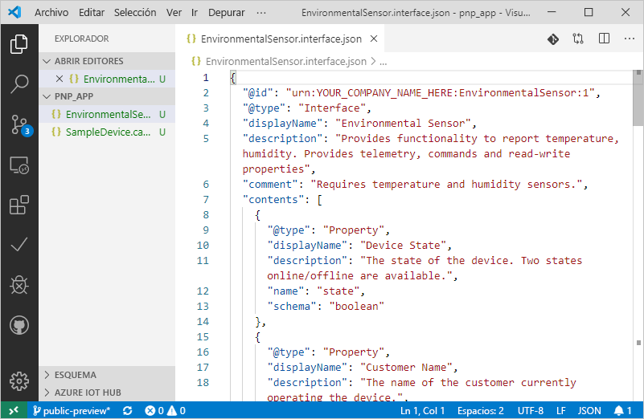
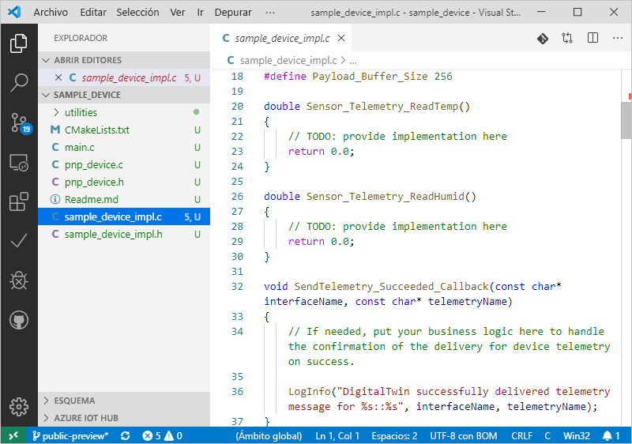

# <a name="quickstart-use-a-device-capability-model-to-create-an-iot-plug-and-play-preview-device-linux"></a>Inicio rápido: Uso de un modelo de funcionalidad de dispositivo para crear un dispositivo de versión preliminar de IoT Plug and Play (Linux)

Un _modelo de funcionalidad de dispositivo_ (DCM) describe las funcionalidades de un dispositivo IoT Plug and Play. Un DCM suele estar asociado a una SKU del producto. Las funcionalidades definidas en el DCM se organizan en interfaces reutilizables. Desde un DCM se puede generar el código de un dispositivo básico. En este inicio rápido se muestra cómo usar VS Code en Ubuntu Linux para crear un dispositivo IoT Plug and Play mediante un DCM.

## <a name="prerequisites"></a>Requisitos previos

En este inicio rápido se asume que usa Ubuntu Linux con un entorno de escritorio. Los pasos de este tutorial se han probado con Ubuntu 18.04.

Para completar este inicio rápido, es preciso instalar el siguiente software en la máquina Linux local:

* Instale **GCC**, **GIT**, **cmake** y todas las dependencias con el comando `apt-get`:

    ```sh
    sudo apt-get update
    sudo apt-get install -y git cmake build-essential curl libcurl4-openssl-dev libssl-dev uuid-dev
    ```

    Compruebe que la versión de `cmake` es posterior a **2.8.12** y que la versión de **GCC** es posterior a **4.4.7**.

    ```sh
    cmake --version
    gcc --version
    ```

* [Visual Studio Code](https://code.visualstudio.com/)

### <a name="install-azure-iot-tools"></a>Instalación de Azure IoT Tools

Siga estos pasos para instalar el paquete de extensiones [Azure IoT Tools para VS Code](https://marketplace.visualstudio.com/items?itemName=vsciot-vscode.azure-iot-tools):

1. En VS Code, seleccione la pestaña **Extensions** (Extensiones).
1. Busque **Azure IoT Tools**.
1. Seleccione **Instalar**.

### <a name="get-the-connection-string-for-your-company-model-repository"></a>Obtención de la cadena de conexión para el repositorio de modelos de su empresa

Puede encontrar la _cadena de conexión para el repositorio de modelos de su empresa_ en el [ portal de Azure Certified for IoT ](https://preview.catalog.azureiotsolutions.com) cuando inicia sesión con una cuenta profesional o educativa de Microsoft o con su identificador de asociado de Microsoft, en caso de que tenga. Después de iniciar sesión, seleccione **Company repository** (Repositorio de la empresa) y, después, **Connection strings** (Cadenas de conexión).

[!INCLUDE [cloud-shell-try-it.md](../../includes/cloud-shell-try-it.md)]

## <a name="prepare-an-iot-hub"></a>Preparación de un centro de IoT

Necesitará un centro de IoT de Azure en la suscripción de Azure para completar este inicio rápido. Si no tiene una suscripción a Azure, cree una [cuenta gratuita](https://azure.microsoft.com/free/?WT.mc_id=A261C142F) antes de empezar.

Si usa la CLI de Azure localmente, la versión de `az` debe ser la **2.0.75** o posterior. Azure Cloud Shell usa la versión más reciente. Use el comando `az --version` para comprobar la versión instalada en la máquina.

Agregue la extensión Microsoft Azure IoT para la CLI de Azure:

```azurecli-interactive
az extension add --name azure-cli-iot-ext
```

En los pasos de este de inicio rápido se requiere la versión **0.8.5** o posterior de la extensión. Use el comando `az extension list` para comprobar la versión que tiene instalada, y el comando `az extension update` para actualizar si es necesario.

Si no tiene ninguna instancia de IoT Hub, cree una con los comandos siguientes: reemplace `{YourIoTHubName}` por un nombre único de su elección. Si ejecuta estos comandos de forma local, inicie sesión primero en la suscripción de Azure mediante `az login`. Si está ejecutando estos comandos en Azure Cloud Shell, su sesión se iniciará automáticamente:

  ```azurecli-interactive
  az group create --name pnpquickstarts_rg --location centralus
  az iot hub create --name {YourIoTHubName} \
    --resource-group pnpquickstarts_rg --sku S1
  ```

Los comandos anteriores crean un grupo de recursos denominado `pnpquickstarts_rg` y un centro de IoT en la región centro de EE. UU.

> [!IMPORTANT]
> Durante la versión preliminar pública, las características de IoT Plug and Play solo están disponibles en los centros de IoT creados en las regiones **Centro de EE. UU.** , **Norte de Europa** y **Este de Japón**.

Ejecute el siguiente comando para crear una identidad de dispositivo para un dispositivo denominado `mypnpdevice` en su instancia de IoT Hub. Sustituya el marcador de posición `{YourIoTHubName}` por el nombre de su instancia de IoT Hub:

```azurecli-interactive
az iot hub device-identity create --hub-name {YourIoTHubName} --device-id mypnpdevice
```

Ejecute los siguientes comandos para obtener la _cadena de conexión del dispositivo_ que acaba de registrar. Necesitará esta cadena de conexión más adelante en este inicio rápido:

```azurecli-interactive
az iot hub device-identity show-connection-string --hub-name {YourIoTHubName} --device-id mypnpdevice --output table
```

## <a name="author-your-model"></a>Creación de un modelo

En este inicio rápido, se usa un modelo de funcionalidad del dispositivo de ejemplo existente y las interfaces asociadas.

1. Cree un directorio `pnp_app` en el directorio principal. Use esta carpeta para los archivos del modelo de dispositivo y el código auxiliar del código de dispositivo.

    ```bash
    cd ~
    mkdir pnp_app
    ```

1. Descargue el modelo de funcionalidad del dispositivo y los archivos de ejemplo de interfaz en la carpeta `pnp_app`.

    ```bash
    cd pnp_app
    curl -O -L https://raw.githubusercontent.com/Azure/IoTPlugandPlay/master/samples/SampleDevice.capabilitymodel.json
    curl -O -L https://raw.githubusercontent.com/Azure/IoTPlugandPlay/master/samples/EnvironmentalSensor.interface.json
    ```

1. Abra la carpeta `pnp_app` con VS Code. Los archivos se pueden ver con Intellisense:

    

1. En los archivos descargados, reemplace `<YOUR_COMPANY_NAME_HERE>` en los campos `@id` y `schema` por un valor único. Use solo los caracteres a-z, A-Z, 0-9 y el carácter de subrayado. Para más información, consulte [Formato de identificador de gemelo digital](https://github.com/Azure/IoTPlugandPlay/tree/master/DTDL#digital-twin-identifier-format).

## <a name="generate-the-c-code-stub"></a>Generación de código auxiliar de C

Ahora que ya tiene un DCM y sus interfaces asociadas, puede generar el código del dispositivo que implementa el modelo. Para generar el código auxiliar de C en VS Code:

1. Con la carpeta `pnp_app` abierta en VS Code, use **Ctrl+Mayús+P** para abrir la paleta de comandos, escriba **IoT Plug and Play** y seleccione **Generate Device Code Stub** (Generar código auxiliar de dispositivo).

    > [!NOTE]
    > La primera vez que use la utilidad de generación de código de IoT Plug and Play, tardará unos segundos en descargarse.

1. Elija el archivo **SampleDevice.capabilitymodel.json** para usarlo para generar el código auxiliar del dispositivo.

1. Escriba el nombre del proyecto, **sample_device**. Será el nombre de la aplicación del dispositivo.

1. Elija **ANSI C** como lenguaje.

1. Elija **Via IoT Hub device connection string** (Mediante la cadena de conexión del dispositivo de IoT Hub) como método de conexión.

1. Elija **CMake Project on Linux** (Proyecto de CMake en Linux) como plantilla de proyecto.

1. Elija **A través del código fuente** como la manera de incluir el SDK.

1. VS Code abre una nueva ventana con los archivos del código auxiliar del dispositivo generados.
    

## <a name="build-and-run-the-code"></a>Compilación y ejecución del código

El código fuente del SDK del dispositivo se usa para compilar el código auxiliar del dispositivo generado. La aplicación que se compila simula un dispositivo que se conecta a un centro de IoT. La aplicación envía datos de telemetría y propiedades, y recibe comandos.

1. Ejecute los siguientes comandos para descargar el código fuente del SDK de dispositivo:

    ```bash
    cd ~/pnp_app/sample_device
    git clone https://github.com/Azure/azure-iot-sdk-c --recursive -b public-preview
    ```

1. Cree una carpeta de compilación de **CMake** para la aplicación **sample_device**:

    ```bash
    cd ~/pnp_app/sample_device
    mkdir cmake
    cd cmake
    ```

1. Ejecute CMake para compilar la aplicación con el SDK:

    ```bash
    cmake .. -Duse_prov_client=ON -Dhsm_type_symm_key:BOOL=ON -Dskip_samples:BOOL=ON
    cmake --build .
    ```

1. Una vez que la compilación se complete correctamente, ejecute la aplicación y use la cadena de conexión del dispositivo al centro de IoT como parámetro.

    ```sh
    cd ~/pnp_app/sample_device/cmake
    ./sample_device "{IoT Hub device connection string}"
    ```

1. La aplicación del dispositivo comienza a enviar datos a IoT Hub.

    

## <a name="validate-the-code"></a>Validación del código

### <a name="publish-device-model-files-to-model-repository"></a>Publicación de los archivos del modelo del dispositivo en el repositorio de modelos

Para validar el código del dispositivo con la CLI de **az**, es preciso publicar los archivos en el repositorio de modelos.

1. Con la carpeta `pnp_app` abierta en VS Code, use **Ctrl+Mayús+P** para abrir la paleta de comandos y, a continuación, escriba y seleccione **IoT Plug & Play: Submit files to Model Repository** (IoT Plug and Play: Enviar archivos al repositorio de modelos).

1. Seleccione los archivos `SampleDevice.capabilitymodel.json` y `EnvironmentalSensor.interface.json`.

1. Escriba la cadena de conexión del repositorio de modelos de su empresa.

    > [!NOTE]
    > La cadena de conexión solo es necesaria la primera vez que se conecta al repositorio.

1. Tanto en la ventana de salida de VS Code como en la notificación, puede comprobar que los archivos se han publicado correctamente.

    > [!NOTE]
    > Si aparecen errores al publicar los archivos del modelo de dispositivo, puede probar a usar el comando **IoT Plug and Play: Sign out Model Repository** (IoT Plug and Play: Cerrar sesión del repositorio de modelos) para cerrar la sesión y repasar los pasos realizados.

### <a name="use-the-azure-iot-cli-to-validate-the-code"></a>Uso de la CLI de IoT de Azure para validar el código

Una vez iniciado el ejemplo de cliente de dispositivo, puede comprobar que funciona con la CLI de Azure.

Use el siguiente comando para ver la telemetría que envía el dispositivo de ejemplo. Es posible que tenga que esperar un minuto o dos antes de ver la telemetría en la salida:

```azurecli-interactive
az iot dt monitor-events --hub-name {your IoT hub} --device-id mypnpdevice
```

Use el siguiente comando para ver todas las propiedades que envía el dispositivo:

```azurecli-interactive
az iot dt list-properties --device-id mypnpdevice --hub-name {Your IoT hub name} --source private --repo-login "{Your company model repository connection string}"
```

## <a name="next-steps"></a>Pasos siguientes

En este inicio rápido ha aprendido a crear un dispositivo IoT Plug and Play mediante un DCM.

Para más información sobre los DCM y cómo crear sus propios modelos, continúe con el tutorial:

> [!div class="nextstepaction"]
> [Tutorial: Creación y prueba de un modelo de funcionalidad del dispositivo mediante Visual Studio Code](tutorial-pnp-visual-studio-code.md)
