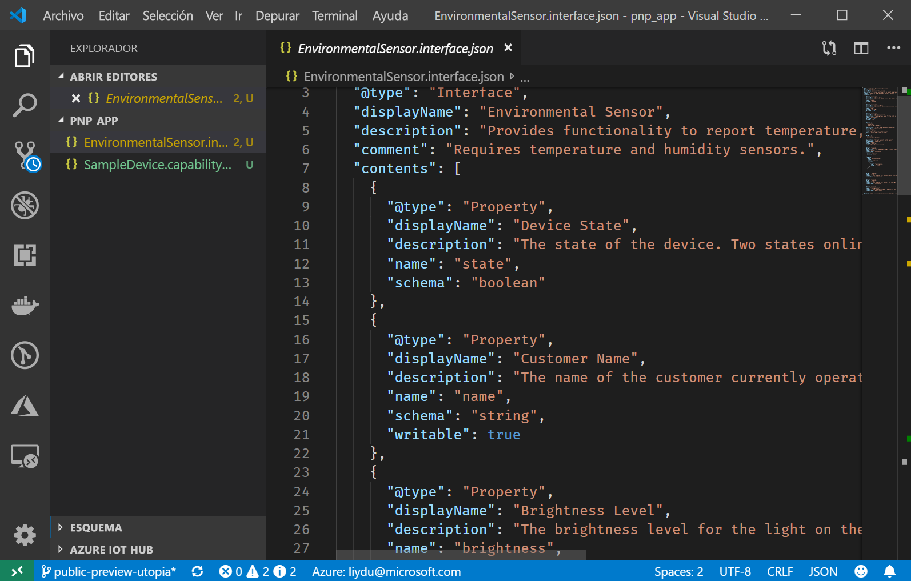
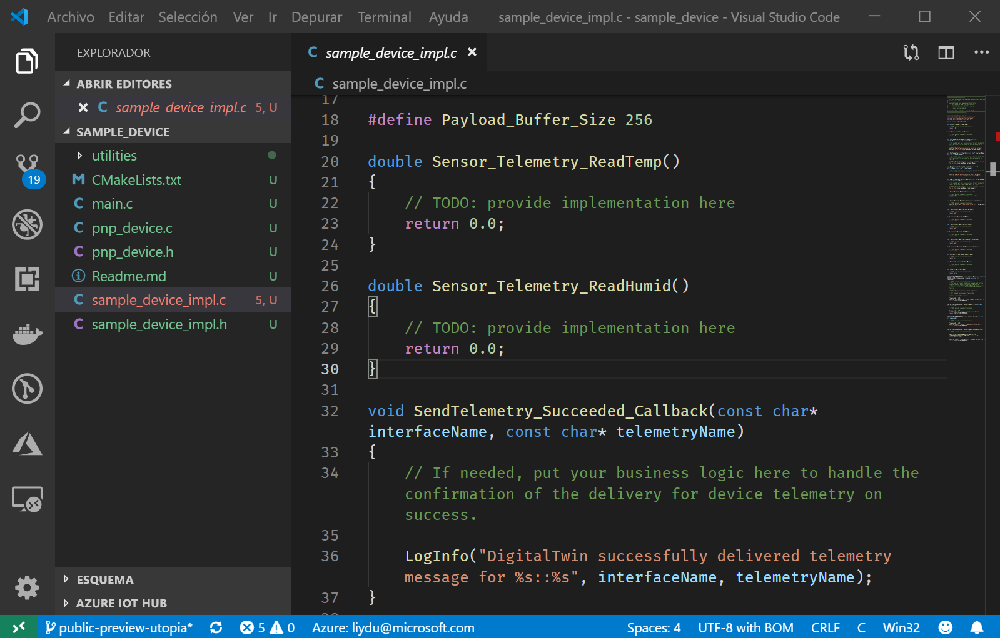

# <a name="quickstart-use-a-device-capability-model-to-create-an-iot-plug-and-play-preview-device-windows"></a>Inicio rápido: Uso de un modelo de funcionalidad de dispositivo para crear un dispositivo de versión preliminar de IoT Plug and Play (Windows)

[!INCLUDE [iot-pnp-quickstarts-1-selector.md](../../includes/iot-pnp-quickstarts-1-selector.md)]

Un _modelo de funcionalidad de dispositivo_ (DCM) describe las funcionalidades de un dispositivo IoT Plug and Play. Un DCM suele estar asociado a una SKU del producto. Las funcionalidades definidas en el DCM se organizan en interfaces reutilizables. Desde un DCM se puede generar el código de un dispositivo básico. En este inicio rápido se muestra cómo usar VS Code en Windows para crear un dispositivo IoT Plug and Play mediante un DCM.

## <a name="prerequisites"></a>Prerequisites

Para completar este inicio rápido, es preciso instalar el siguiente software en el equipo local:

* [Herramientas de compilación para Visual Studio](https://visualstudio.microsoft.com/thank-you-downloading-visual-studio/?sku=BuildTools&rel=16) con las cargas de trabajo de **herramientas de compilación de C++** y el **componente Administrador de paquetes NuGet**. O si ya tiene [Visual Studio (Community, Professional o Enterprise)](https://visualstudio.microsoft.com/downloads/) 2019, 2017 o 2015 con las mismas cargas de trabajo instaladas.
* [Git](https://git-scm.com/download/).
* [CMake](https://cmake.org/download/).
* [Visual Studio Code](https://code.visualstudio.com/).

### <a name="install-azure-iot-tools"></a>Instalación de Azure IoT Tools

Siga estos pasos para instalar el paquete de extensiones [Azure IoT Tools para VS Code](https://marketplace.visualstudio.com/items?itemName=vsciot-vscode.azure-iot-tools):

1. En VS Code, seleccione la pestaña **Extensions** (Extensiones).
1. Busque **Azure IoT Tools**.
1. Seleccione **Instalar**.

### <a name="install-the-azure-iot-explorer"></a>Instalación de Azure IoT Explorer

Descargue e instale la versión más reciente de **Azure IoT Explorer** desde la página [Repositorio](https://github.com/Azure/azure-iot-explorer/releases) de la herramienta, seleccionando el archivo .msi en "Recursos" para la actualización más reciente.

### <a name="get-the-connection-string-for-your-company-model-repository"></a>Obtención de la cadena de conexión para el repositorio de modelos de su empresa

Puede encontrar la _cadena de conexión para el repositorio de modelos de su empresa_ en el [ portal de Azure Certified for IoT ](https://preview.catalog.azureiotsolutions.com) cuando inicia sesión con una cuenta profesional o educativa de Microsoft o con su identificador de asociado de Microsoft, en caso de que tenga. Después de iniciar sesión, seleccione **Company repository** (Repositorio de la empresa) y, después, **Connection strings** (Cadenas de conexión).

[!INCLUDE [cloud-shell-try-it.md](../../includes/cloud-shell-try-it.md)]

[!INCLUDE [iot-pnp-prepare-iot-hub.md](../../includes/iot-pnp-prepare-iot-hub.md)]

Ejecute el siguiente comando para obtener la _cadena de conexión de IoT Hub_ para el centro (anótela para usarla más adelante):

```azurecli-interactive
az iot hub show-connection-string --hub-name <YourIoTHubName> --output table
```

## <a name="prepare-the-development-environment"></a>Preparación del entorno de desarrollo

En este inicio rápido, utilizará el administrador de bibliotecas [Vcpkg](https://github.com/microsoft/vcpkg) para instalar el SDK para dispositivos C de Azure IoT en el entorno de desarrollo.

1. Abra un símbolo del sistema. Ejecute el comando siguiente para instalar Vcpkg:

    ```cmd
    git clone https://github.com/Microsoft/vcpkg.git
    cd vcpkg

    .\bootstrap-vcpkg.bat
    ```

    A continuación, a fin de enlazar la [integración](https://github.com/microsoft/vcpkg/blob/master/docs/users/integration.md) de los usuarios, ejecute lo siguiente (nota: requiere un administrador durante el primer uso):

    ```cmd
    .\vcpkg.exe integrate install
    ```

1. Instale el Vcpkg del SDK de dispositivo IoT de Azure para C:

    ```cmd
    .\vcpkg.exe install azure-iot-sdk-c[public-preview,use_prov_client]
    ```

## <a name="author-your-model"></a>Creación de un modelo

En este inicio rápido, se usa un modelo de funcionalidad del dispositivo de ejemplo existente y las interfaces asociadas.

1. Cree un directorio `pnp_app` en su unidad local. Use esta carpeta para los archivos del modelo de dispositivo y el código auxiliar del código de dispositivo.

1. Descargue el [modelo de capacidad del dispositivo y los archivos de muestra de interfaz](https://github.com/Azure/IoTPlugandPlay/blob/master/samples/SampleDevice.capabilitymodel.json) y [ muestra de interfaz ](https://github.com/Azure/IoTPlugandPlay/blob/master/samples/EnvironmentalSensor.interface.json) y guarde los archivos en la carpeta `pnp_app`.

    > [!TIP]
    > Para descargar un archivo de GitHub, vaya hasta el archivo, haga clic con el botón derecho en **Sin procesar** y seleccione **Guardar vínculo como**.

1. Abra la carpeta `pnp_app` con VS Code. Los archivos se pueden ver con IntelliSense:

    

1. En los archivos descargados, reemplace `<YOUR_COMPANY_NAME_HERE>` en los campos `@id` y `schema` por un valor único. Use solo los caracteres a-z, A-Z, 0-9 y el carácter de subrayado. Para más información, consulte [Formato de identificador de gemelo digital](https://github.com/Azure/IoTPlugandPlay/tree/master/DTDL#digital-twin-identifier-format).

## <a name="generate-the-c-code-stub"></a>Generación de código auxiliar de C

Ahora que ya tiene un DCM y sus interfaces asociadas, puede generar el código del dispositivo que implementa el modelo. Para generar el código auxiliar de C en VS Code:

1. Con la `pnp_app`carpeta abierta en VS Code, use **Ctrl+Shift+P** para abrir la paleta de comandos, escriba **IoT Plug and Play** y seleccione **Generar código auxiliar de dispositivo**.

    > [!NOTE]
    > La primera vez que use la CLI de CodeGen de IoT Plug and Play, tardará unos segundos en descargarse e instalarse automáticamente.

1. Elija el archivo de **SampleDevice.capabilitymodel.json** que se usará para generar el código auxiliar del dispositivo.

1. Escriba el nombre del proyecto **sample_device**. Este será el nombre de la aplicación de su dispositivo.

1. Elija **ANSI C** como lenguaje.

1. Elija **Via IoT Hub device connection string** (Mediante la cadena de conexión del dispositivo de IoT Hub) como método de conexión.

1. Elija **proyecto CMake en Windows** como plantilla de proyecto.

1. Elija **Via Vcpkg** (Mediante Vcpkg) como forma de incluir el SDK del dispositivo.

1. Una nueva carpeta llamada **sample_device** se crea en la misma ubicación que el archivo DCM y en ella se encuentran los archivos de código auxiliar de código de dispositivo generados. VS Code abre una nueva ventana para mostrarlos.
    

## <a name="build-and-run-the-code"></a>Compilación y ejecución del código

El código fuente del SDK del dispositivo se usa para compilar el código auxiliar del dispositivo generado. La aplicación que se compila simula un dispositivo que se conecta a un centro de IoT. La aplicación envía datos de telemetría y propiedades, y recibe comandos.

1. Cree un subdirectorio `cmake` en la carpeta `sample_device` y vaya a esa carpeta:

    ```cmd
    mkdir cmake
    cd cmake
    ```

1. Ejecute los siguientes comandos para crear el código auxiliar de código generado (reemplazando el marcador de posición por el directorio de su repositorio Vcpkg):

    ```cmd
    cmake .. -G "Visual Studio 16 2019" -A Win32 -Duse_prov_client=ON -Dhsm_type_symm_key:BOOL=ON -DCMAKE_TOOLCHAIN_FILE="<directory of your Vcpkg repo>\scripts\buildsystems\vcpkg.cmake"

    cmake --build .
    ```
    
    > [!NOTE]
    > Si usa Visual Studio 2017 o 2015, deberá especificar el generador de CMake en función de las herramientas de compilación que esté utilizando:
    >```cmd
    ># Either
    >cmake .. -G "Visual Studio 15 2017" -Duse_prov_client=ON -Dhsm_type_symm_key:BOOL=ON -DCMAKE_TOOLCHAIN_FILE="{directory of your Vcpkg repo}\scripts\buildsystems\vcpkg.cmake"
    ># or
    >cmake .. -G "Visual Studio 14 2015" -Duse_prov_client=ON -Dhsm_type_symm_key:BOOL=ON -DCMAKE_TOOLCHAIN_FILE="{directory of your Vcpkg repo}\scripts\buildsystems\vcpkg.cmake"
    >```

    > [!NOTE]
    > Si cmake no encuentra el compilador de C++, aparecerán errores de compilación al ejecutar el comando anterior. En ese caso, pruebe a ejecutar el comando en el [símbolo del sistema de Visual Studio](https://docs.microsoft.com/dotnet/framework/tools/developer-command-prompt-for-vs).

1. Una vez que la compilación se complete correctamente, ejecute la aplicación y use la cadena de conexión del dispositivo al centro de IoT como parámetro.

    ```cmd\sh
    .\Debug\sample_device.exe "<YourDeviceConnectionString>"
    ```

1. La aplicación del dispositivo comienza a enviar datos a IoT Hub.

    

## <a name="validate-the-code"></a>Validación del código

### <a name="publish-device-model-files-to-model-repository"></a>Publicación de los archivos del modelo del dispositivo en el repositorio de modelos

Para validar el código del con dispositivo con **Azure IoT Explorer**, es preciso publicar los archivos en el repositorio de modelos.

1. Con la `pnp_app`carpeta abierta en VS Code, use **Ctrl+Shift+P** para abrir la paleta de comandos y, luego, escriba y seleccione **IoT Plug & Play: Submit files to Model Repository** (IoT Plug and Play: Enviar archivos al repositorio de modelos).

1. Seleccione los archivos `SampleDevice.capabilitymodel.json` y `EnvironmentalSensor.interface.json`.

1. Escriba la cadena de conexión del repositorio de modelos de su empresa.

    > [!NOTE]
    > La cadena de conexión solo es necesaria la primera vez que se conecta al repositorio.

1. Tanto en la ventana de salida de VS Code como en la notificación, puede comprobar que los archivos se han publicado correctamente.

    > [!NOTE]
    > Si aparecen errores al publicar los archivos del modelo de dispositivo, puede probar a usar el comando **IoT Plug and Play: Sign out Model Repository** (IoT Plug and Play: Cerrar sesión del repositorio de modelos) para cerrar la sesión y repasar los pasos realizados.

### <a name="use-the-azure-iot-explorer-to-validate-the-code"></a>Uso de Azure IoT Explorer para validar el código

[!INCLUDE [iot-pnp-iot-explorer-1.md](../../includes/iot-pnp-iot-explorer-1.md)]

4. Para agregar el repositorio de la empresa, seleccione **Configuración**, después, **+ Nuevo** y, después, **Repositorio de la empresa**. Agregue la cadena de conexión del repositorio de modelos de su empresa y seleccione **Guardar y conectar**.

1. En la página de información general **Dispositivos**, busque la identidad del dispositivo que creó anteriormente y selecciónela para ver más detalles. Con la aplicación de dispositivo todavía en ejecución en el símbolo del sistema, compruebe que el **estado de conexión** del dispositivo en Azure IoT Explorer se muestra como _Conectado_ (de lo contrario, presione **Actualizar** hasta que lo sea). Seleccione el dispositivo para ver más detalles.

1. Expanda la interfaz con el identificador **urn:<YOUR_INTERFACE_NAME>:EnvironmentalSensor:1** para ver las primitivas de IoT Plug and Play (propiedades, comandos y telemetría). El nombre de la interfaz que aparecerá es el nombre que pone al crear su modelo.

[!INCLUDE [iot-pnp-iot-explorer-2.md](../../includes/iot-pnp-iot-explorer-2.md)]

[!INCLUDE [iot-pnp-clean-resources.md](../../includes/iot-pnp-clean-resources.md)]

## <a name="next-steps"></a>Pasos siguientes

En este inicio rápido ha aprendido a crear un dispositivo IoT Plug and Play mediante un DCM.

Para más información sobre los DCM y cómo crear sus propios modelos, continúe con el tutorial:

> [!div class="nextstepaction"]
> [Tutorial: Creación y prueba de un modelo de funcionalidad del dispositivo mediante Visual Studio Code](tutorial-pnp-visual-studio-code.md)
