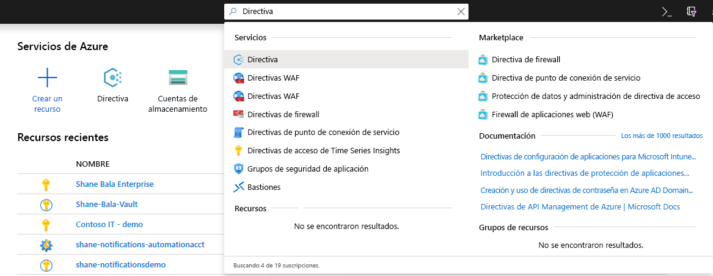
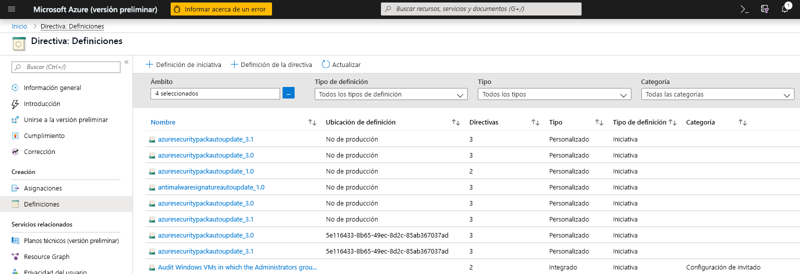
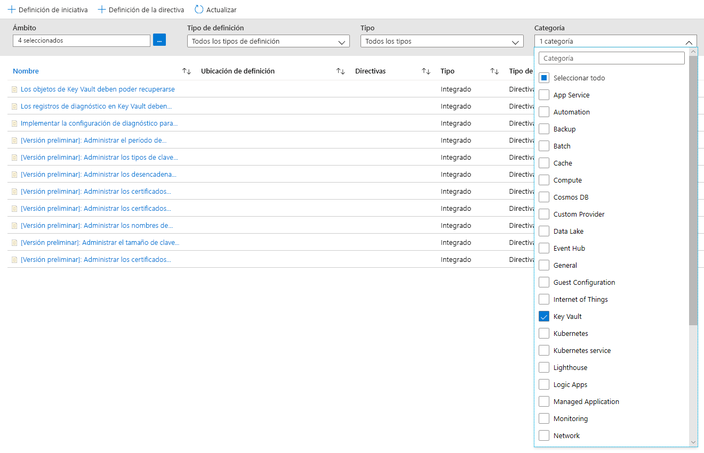
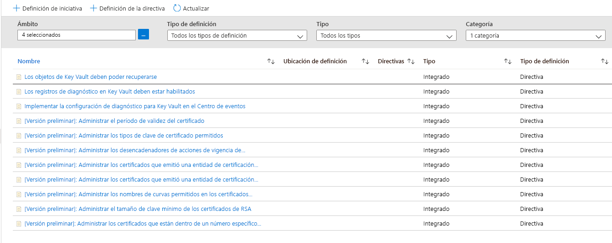
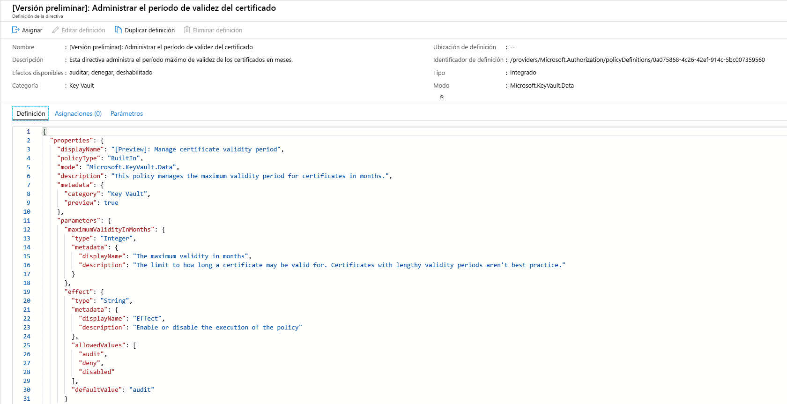
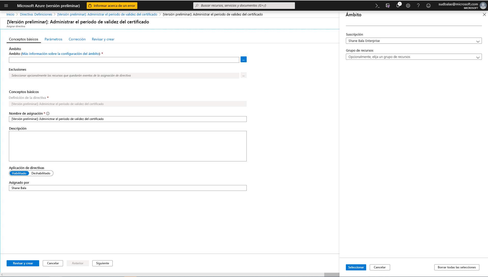
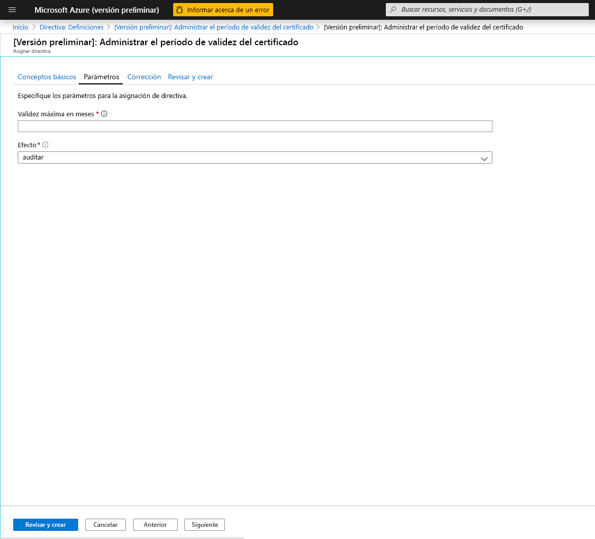
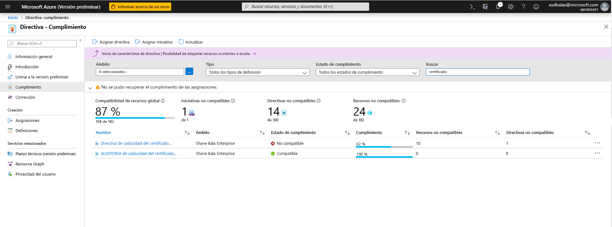
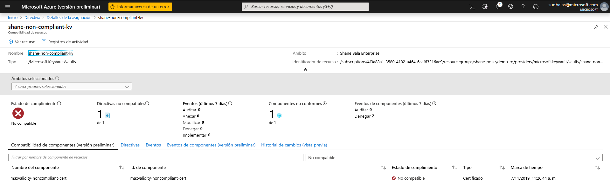
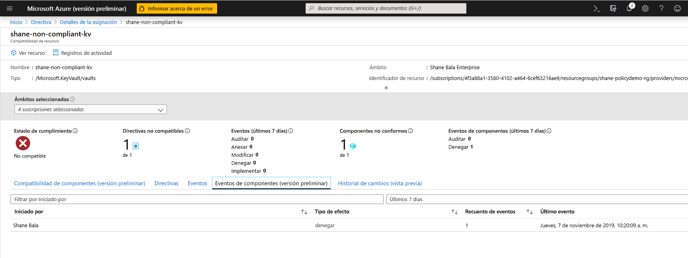

# Integrar Azure Key Vault con Azure Policy

[Azure Policy](../governance/policy/index.yml) es una herramienta de gobierno que ofrece a los usuarios la capacidad de auditar y administrar su entorno de Azure a escala. Azure Policy proporciona la capacidad de colocar barreras en los recursos de Azure para asegurarse de que son compatibles con las reglas de directivas asignadas. Permite a los usuarios realizar tareas de auditoría, aplicación en tiempo real y corrección de su entorno de Azure. Los resultados de las auditorías realizadas por la directiva estarán disponibles para los usuarios en un panel de cumplimiento, donde podrán ver una exploración en profundidad de qué recursos y componentes son compatibles y cuáles no.  Para más información, consulte la [Información general del servicio Azure Policy](../governance/policy/overview.md).

Escenarios de uso de ejemplo:

- Quiere mejorar la postura de seguridad de su empresa mediante la implementación de requisitos en torno a los tamaños de clave mínimos y los períodos de validez máximos de los certificados de los almacenes de claves de su empresa, pero no sabe qué equipos serán compatibles y cuáles no. 
- Actualmente no tiene una solución para realizar una auditoría en toda la organización o lleva a cabo auditorías manuales de su entorno pidiendo a los equipos individuales de su organización que informen de su cumplimiento. Busca una manera de automatizar esta tarea, realizar auditorías en tiempo real y garantizar la precisión de la auditoría.
- Quiere aplicar las directivas de seguridad de la empresa y evitar que los usuarios creen certificados autofirmados, pero no dispone de una forma automatizada de bloquear su creación. 
- Quiere relajar algunos requisitos para los equipos de pruebas, pero desea mantener controles estrechos en el entorno de producción. Necesita una manera automatizada y sencilla de separar la aplicación de los recursos. 
- Quiere asegurarse de que puede revertir la aplicación de nuevas directivas en caso de que se produzca un problema en el sitio activo. Necesita una solución de un solo clic para desactivar la aplicación de la directiva. 
- Se basa en una solución de terceros para la auditoría de su entorno y desea usar una oferta interna de Microsoft. 

## Tipos de instrucciones y efectos de directivas

**Auditoría**: Cuando el efecto de una directiva se establece en auditoría, la directiva no producirá ningún cambio importante en el entorno. Solo le avisará de los componentes, como los certificados que no cumplan las definiciones de directiva dentro de un ámbito especificado, marcando estos componentes como no compatibles en el panel de cumplimiento de directivas. La auditoría es predeterminada si no se selecciona ningún efecto de directiva. 

**Denegar**: Cuando el efecto de una directiva se establece en denegar, la directiva bloqueará la creación de nuevos componentes, como los certificados, así como el bloqueo de nuevas versiones de componentes existentes que no cumplen con la definición de la directiva. Los recursos existentes no compatibles dentro de un almacén de claves no se ven afectados. Las capacidades de ' auditoría ' seguirán funcionando.

## Definiciones de Directiva "Integradas" disponibles

Key Vault ha creado un conjunto de directivas, que puede asignar para escenarios comunes para administrar certificados. Estas directivas están "Integradas", lo que significa que no requieren que se escriba ningún JSON personalizado para habilitarlas y están disponibles en el Azure Portal que se va a asignar. Todavía puede personalizar determinados parámetros para ajustarse a las necesidades de su organización. 

Las ocho directivas de versión preliminar son las siguientes.

### Administrar el período de validez del certificado (versión preliminar)

Esta directiva permite administrar el período de validez máximo de los certificados almacenados en el almacén de claves. Es una buena práctica de seguridad limitar el período de validez máximo de los certificados. Si una clave privada del certificado va a estar en peligro sin detección, el uso de certificados de corta duración reduce el período de tiempo para los daños en curso y reduce el valor del certificado a un atacante. 

### Administrar tipos de clave de certificado permitidos (versión preliminar)
Esta directiva le permite restringir el tipo de certificados que pueden encontrarse en el almacén de claves. Puede usar esta directiva para asegurarse de que las claves privadas del certificado son RSA, ECC o están respaldadas por HSM. Puede elegir en la siguiente lista los tipos de certificados que se permiten.
- RSA
- RSA - HSM
- ECC 
- ECC - HSM 

### Administrar desencadenadores de acción de duración de certificado (versión preliminar)

Esta directiva permite administrar la acción de duración especificada para los certificados que están dentro de un número determinado de días de expiración o que han alcanzado un porcentaje determinado de su vida útil. 

### Administrar los certificados que emitió una entidad de certificación integrada (versión preliminar)

Si usa una Key Vault entidad de certificación integrada (DigiCert o GlobalSign) y quiere que los usuarios usen uno de estos proveedores o cualquiera de ellos, puede usar esta directiva para auditar o aplicar la selección. Esta directiva también se puede utilizar para auditar o denegar la creación de certificados autofirmados en el almacén de claves. 

### Administrar los certificados que emitió una entidad de certificación integrada (versión preliminar)

Si usa una entidad de certificación interna o una entidad de certificación que no está integrada con el almacén de claves y quiere que los usuarios usen una entidad de certificación de la lista que proporcione, puede usar esta directiva para crear una lista de entidades de certificación permitidas por nombre de emisor. Esta directiva también se puede utilizar para auditar o denegar la creación de certificados autofirmados en el almacén de claves. 

### Administrar nombres de curva permitidos para certificados de criptografía de curva elíptica (versión preliminar)
Si usa criptografía de curva elíptica o certificados ECC, puede personalizar una lista de nombres de curva permitidos en la siguiente lista. La opción predeterminada permite los siguientes nombres de curva. 
- P-256
- P-256K
- P-384
- P-521

### Administrar el tamaño mínimo de clave para los certificados RSA (versión preliminar)
Si usa certificados RSA, puede elegir un tamaño de clave mínimo que los certificados deben tener. Puede seleccionar una opción de la lista siguiente. 
- bit 2048
- bit 3072
- bit 4096

### Administrar certificados que estén dentro de un número especificado de días de expiración (versión preliminar)
El servicio puede experimentar una interrupción si un certificado que no se está supervisando adecuadamente no se gira antes de la expiración. Esta directiva es fundamental para asegurarse de que los certificados almacenados en el almacén de claves se están supervisando. Se recomienda aplicar esta directiva varias veces con umbrales de expiración diferentes, por ejemplo, en los umbrales 180, 90, 60 y 30 días. Esta directiva se puede usar para supervisar y evaluar la expiración de certificados en la organización. 

## Escenario de ejemplo

Puede administrar un almacén de claves usado por varios equipos que contengan 100 certificados y desea asegurarse de que ninguno de los certificados del almacén de claves sea válido durante más de 2 años.

1. Asigne la directiva [Administrar período de validez del certificado ](#manage-certificate-validity-period-preview), especifique que el período de validez máximo de un certificado es de 24 meses y establezca el efecto de la directiva en "auditoría". 
1. Puede ver el [informe de cumplimiento en el Azure Portal](#view-compliance-results) y detectar que 20 certificados son no compatibles y válidos durante > 2 años, y que los certificados restantes son conformes. 
1. Se pone en contacto con los propietarios de estos certificados y comunican el nuevo requisito de seguridad que los certificados no pueden ser válidos durante más de 2 años. Algunos equipos responden y 15 de los certificados se renovaron con un período de validez máximo de 2 años o menos. Otros equipos no responden y todavía tiene 5 certificados no compatibles en el almacén de claves.
1. Cambia el efecto de la directiva asignada a "denegar". Los 5 certificados no compatibles no se revocan y continúan funcionando. Sin embargo, no se pueden renovar con un período de validez superior a 2 años. 

## Habilitación y administración de una directiva de Key Vault a través del Azure Portal

### Seleccione una definición de Directiva

1. Inicie sesión en el Portal de Azure. 
1. Busque "Directiva" en la barra de búsqueda y seleccione **Directiva**.

    

1. En la ventana Directiva, seleccione **Definiciones**.

    

1. En el Filtro de categoría, anule la selección de **Seleccionar todos** y seleccione **Almacén de claves**. 

    

1. Ahora debería poder ver todas las directivas disponibles para la Versión preliminar pública, por Azure Key Vault. Asegúrese de leer y comprender la sección de instrucciones de directiva anterior y seleccionar una directiva que desee asignar a un ámbito.  

    

### Asignar una Directiva a un Ámbito 

1. Seleccione la directiva que quiere aplicar en este ejemplo, se muestra la directiva **Administrar el período de validez del certificado**. Haga clic en el botón asignar situado en la esquina superior izquierda.

    
  
1. Seleccione la suscripción en la que desea que se aplique la directiva. Puede optar por restringir el ámbito a un solo grupo de recursos dentro de una suscripción. Si desea aplicar la directiva a toda la suscripción y excluir algunos grupos de recursos, también puede configurar una lista de exclusión. Establezca el selector de cumplimiento de directivas en **Habilitado** si quiere que se produzca el efecto de la directiva (auditoría o denegación) o  **Deshabilitado** para desactivar el efecto (auditoría o denegación). 

    

1. Haga clic en la pestaña parámetros en la parte superior de la pantalla para especificar el período de validez máximo en meses que desee. Seleccione **auditoría** o **denegar** para el efecto de la directiva siguiendo las instrucciones de las secciones anteriores. Después, seleccione el botón revisar y crear. 

    

### Ver Resultados de Cumplimiento

1. Vuelva a la hoja Directiva y seleccione la pestaña cumplimiento. Haga clic en la asignación de directiva para la que quiere ver los resultados de cumplimiento.

    

1. En esta página puede filtrar los resultados por almacenes compatibles o no compatibles. Aquí puede ver una lista de almacenes de claves no compatibles dentro del ámbito de la asignación de directiva. Un almacén se considera no compatible si alguno de los componentes (certificados) del almacén no es compatible. Puede seleccionar un almacén individual para ver los componentes individuales no compatibles (certificados). 

    

1. Ver el nombre de los componentes de un almacén que no son compatibles

    

1. Si tiene que comprobar si se deniega a los usuarios la posibilidad de crear recursos en el almacén de claves, puede hacer clic en la pestaña **Eventos de componentes (versión preliminar)** para ver un resumen de las operaciones de certificado denegado con el solicitante y las marcas de tiempo de las solicitudes. 

    

## Limitaciones de característica

Asignar una directiva con un efecto de "denegación" puede tardar hasta 30 minutos (caso promedio) y 1 hora (peor de los casos) para empezar a denegar la creación de recursos no compatibles. La evaluación de la directiva de los componentes existentes en un almacén puede tardar hasta 1 hora (caso promedio) y 2 horas (peor de los casos) antes de que se puedan ver los resultados de cumplimiento en la interfaz de usuario del portal. Si los resultados de cumplimiento se muestran como "No iniciado", puede deberse a los siguientes motivos:
- La valoración de la directiva no se ha completado todavía. La latencia de evaluación inicial puede tardar hasta 2 horas en el peor de los casos. 
- No hay almacén de claves en el ámbito de la asignación de directiva.
- No hay almacén de claves con certificados dentro del ámbito de la asignación de directivas. 

## Pasos siguientes

- Para más información sobre el [servicio de Azure Policy](../governance/policy/overview.md)
- Vea ejemplos de Key Vault: [Definiciones de directivas integradas en Key Vault](../governance/policy/samples/built-in-policies.md#key-vault)