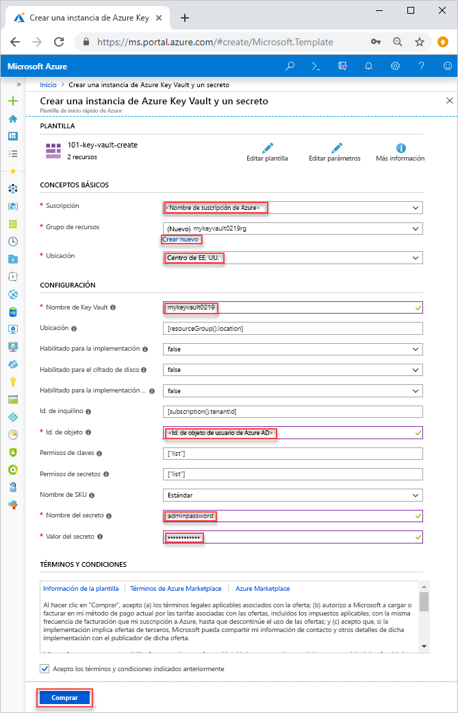
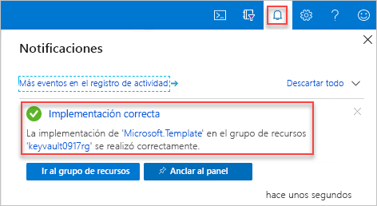

# <a name="quickstart-set-and-retrieve-a-secret-from-azure-key-vault-using-resource-manager-template"></a>Inicio rápido: Establecimiento y recuperación de un secreto de Azure Key Vault mediante una plantilla de Resource Manager

[Azure Key Vault](./key-vault-overview.md) es un servicio en la nube que proporciona un almacén seguro para secretos, como claves, contraseñas y certificados, entre otros. Este inicio rápido se centra en el proceso de implementación de una plantilla de Resource Manager para crear un almacén de claves y un secreto.

[!INCLUDE [About Azure Resource Manager](../../includes/resource-manager-quickstart-introduction.md)]

Si no tiene una suscripción a Azure, cree una [cuenta gratuita](https://azure.microsoft.com/free/?WT.mc_id=A261C142F) antes de empezar.

## <a name="prerequisites"></a>Prerrequisitos

Para completar este artículo, necesitará lo siguiente:

* La plantilla necesita el identificador de objeto de usuario de Azure AD para configurar los permisos. El procedimiento siguiente permite obtener el identificador de objeto (GUID).

    1. Ejecute el siguiente comando de Azure PowerShell o la CLI de Azure, para lo que debe seleccionar **Pruébelo** y, a continuación, pegar el script en el panel de shell. Para pegar el script, haga clic con el botón derecho en el shell y, a continuación, seleccione **Pegar**.

        # <a name="cli"></a>[CLI](#tab/CLI)
        ```azurecli-interactive
        echo "Enter your email address that is used to sign in to Azure:" &&
        read upn &&
        az ad user show --id $upn --query "objectId" &&
        echo "Press [ENTER] to continue ..."
        ```

        # <a name="powershell"></a>[PowerShell](#tab/PowerShell)
        ```azurepowershell-interactive
        $upn = Read-Host -Prompt "Enter your email address used to sign in to Azure"
        (Get-AzADUser -UserPrincipalName $upn).Id
        Write-Host "Press [ENTER] to continue..."
        ```

        ---

    2. Anote el identificador de objeto. Lo necesitará en la sección siguiente de este inicio rápido.

## <a name="create-a-vault-and-a-secret"></a>Creación de un almacén y un secreto

### <a name="review-the-template"></a>Revisión de la plantilla

La plantilla usada en este inicio rápido forma parte de las [plantillas de inicio rápido de Azure](https://azure.microsoft.com/resources/templates/101-key-vault-create/).

:::code language="json" source="~/quickstart-templates/101-key-vault-create/azuredeploy.json" range="1-150" highlight="107-148":::

En la plantilla se definen dos recursos de Azure:

* [Microsoft.KeyVault/vaults **: se crea un almacén de claves de Azure**](/azure/templates/microsoft.keyvault/vaults).
* [**Microsoft.KeyVault/vaults/secrets**](/azure/templates/microsoft.keyvault/vaults/secrets): se crea un secreto del almacén de claves.

Puede encontrar más ejemplos de plantillas de Azure Key Vault [aquí](https://azure.microsoft.com/resources/templates/?resourceType=Microsoft.Keyvault).

### <a name="deploy-the-template"></a>Implementación de la plantilla

1. Seleccione la imagen siguiente para iniciar sesión en Azure y abrir una plantilla. La plantilla crea un almacén de claves y un secreto.

    [](https://portal.azure.com/#create/Microsoft.Template/uri/https%3A%2F%2Fraw.githubusercontent.com%2FAzure%2Fazure-quickstart-templates%2Fmaster%2F101-key-vault-create%2Fazuredeploy.json)

2. Seleccione o escriba los siguientes valores.

    

    A menos que se especifique, utilice el valor predeterminado para crear el almacén de claves y un secreto.

    * **Suscripción**: seleccione una suscripción de Azure.
    * **Grupo de recursos**: seleccione **Crear nuevo**, escriba un nombre único para el grupo de recursos y, a continuación, haga clic en **Aceptar**.
    * **Ubicación**: seleccione una ubicación.  Por ejemplo, **Centro de EE. UU**.
    * **Nombre del almacén de claves**: escriba un nombre para el almacén de claves que sea globalmente único dentro del espacio de nombres .vault.azure.net. Necesitará el nombre en la sección siguiente cuando valide la implementación.
    * **Id. de inquilino**: la función de la plantilla recupera automáticamente el identificador del inquilino.  No cambie el valor predeterminado.
    * **Id. de usuario de AD**: escriba el identificador del objeto de usuario de Azure AD que recuperó de [Requisitos previos](#prerequisites).
    * **Nombre del secreto**: escriba un nombre para el secreto que almacenará en el almacén de claves.  Por ejemplo, **adminpassword**.
    * **Valor del secreto**: escriba el valor del secreto.  Si almacena una contraseña, se recomienda usar la contraseña generada que creó en Requisitos previos.
    * **Acepto los términos y condiciones anteriores**: Seleccionar.
3. Seleccione **Comprar**. Una vez que el almacén de claves se haya implementado correctamente, recibirá una notificación:

    

Azure Portal se usa para implementar la plantilla. Además de Azure Portal, también puede usar Azure PowerShell, la CLI de Azure y API REST. Para obtener información sobre otros métodos de implementación, consulte [Implementación de plantillas](../azure-resource-manager/templates/deploy-powershell.md).

## <a name="review-deployed-resources"></a>Revisión de los recursos implementados

Puede usar Azure Portal para comprobar el almacén de claves y el secreto o usar el siguiente script de la CLI de Azure o Azure PowerShell para enumerar el secreto que ha creado.

# <a name="cli"></a>[CLI](#tab/CLI)

```azurecli-interactive
echo "Enter your key vault name:" &&
read keyVaultName &&
az keyvault secret list --vault-name $keyVaultName &&
echo "Press [ENTER] to continue ..."
```

# <a name="powershell"></a>[PowerShell](#tab/PowerShell)

```azurepowershell-interactive
$keyVaultName = Read-Host -Prompt "Enter your key vault name"
Get-AzKeyVaultSecret -vaultName $keyVaultName
Write-Host "Press [ENTER] to continue..."
```

---

La salida es similar a esta:

# <a name="cli"></a>[CLI](#tab/CLI)


# <a name="powershell"></a>[PowerShell](#tab/PowerShell)


---
## <a name="clean-up-resources"></a>Limpieza de recursos

Otras guías de inicio rápido y tutoriales de Key Vault se basan en esta. Si tiene pensado seguir trabajando en otras guías de inicio rápido y tutoriales, considere la posibilidad de dejar estos recursos activos.
Cuando ya no lo necesite, elimine el grupo de recursos; de este modo se eliminarán también Key Vault y los recursos relacionados. Para eliminar el grupo de recursos mediante la CLI de Azure o Azure PowerShell:

# <a name="cli"></a>[CLI](#tab/CLI)

```azurecli-interactive
echo "Enter the Resource Group name:" &&
read resourceGroupName &&
az group delete --name $resourceGroupName &&
echo "Press [ENTER] to continue ..."
```

# <a name="powershell"></a>[PowerShell](#tab/PowerShell)

```azurepowershell-interactive
$resourceGroupName = Read-Host -Prompt "Enter the Resource Group name"
Remove-AzResourceGroup -Name $resourceGroupName
Write-Host "Press [ENTER] to continue..."
```

---

## <a name="next-steps"></a>Pasos siguientes

En este inicio rápido, ha creado un almacén de claves y un secreto mediante una plantilla de Azure Resource Manager y ha validado la implementación. Para más información sobre Key Vault y Azure Resource Manager, continúe con los artículos siguientes.

- Lea una [introducción a Azure Key Vault](key-vault-overview.md).
- Obtenga más información sobre [Azure Resource Manager](../azure-resource-manager/management/overview.md).
- Obtenga más información sobre [claves, secretos y certificados](about-keys-secrets-and-certificates.md).
- Consulte los [procedimientos recomendados de Azure Key Vault](key-vault-best-practices.md).
