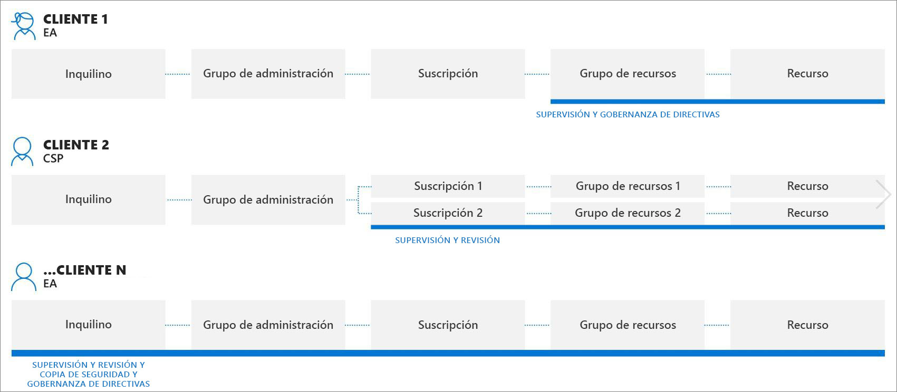
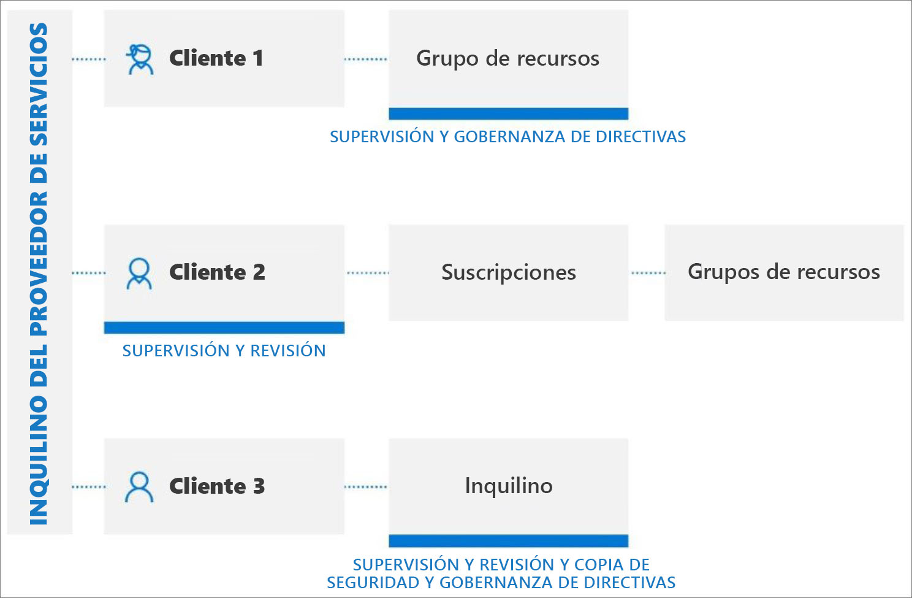

# Experiencias de administración entre inquilinos

Como proveedor de servicios, puede usar la [administración de recursos delegados de Azure](../concepts/azure-delegated-resource-management.md) para administrar los recursos de Azure para varios clientes desde su propio inquilino en [Azure Portal](https://portal.azure.com). La mayoría de las tareas y servicios se pueden realizar en recursos delegados de Azure a través de inquilinos administrados. En este artículo se describen algunos de los escenarios mejorados en los que la administración de recursos delegados de Azure puede ser eficaz.

> [!NOTE]
> La administración de recursos delegados de Azure también se puede usar [en una empresa que tenga varios inquilinos Azure AD propios](enterprise.md) para simplificar la administración entre inquilinos.

## Descripción de los inquilinos de cliente

Un inquilino de Azure Active Directory (Azure AD) es una representación de una organización. Se trata de una instancia dedicada de Azure AD que una organización recibe cuando crea una relación con Microsoft al registrarse en Azure, Microsoft 365 u otros servicios. Cada inquilino de Azure AD es distinto e independiente de los demás inquilinos de Azure AD y tiene su propio identificador de inquilino (un GUID). Para más información, consulte [¿Qué es Azure Active Directory?](../../active-directory/fundamentals/active-directory-whatis.md)

Normalmente, para administrar los recursos de Azure para un cliente, los proveedores de servicios tendrían que iniciar sesión en Azure Portal mediante una cuenta asociada al inquilino de ese cliente, lo que obliga a que un administrador del inquilino del cliente cree y administre cuentas de usuario. para el proveedor de servicios.

Con la administración de recursos delegados de Azure, el proceso de incorporación especifica los usuarios del inquilino del proveedor de servicios que podrán acceder a las suscripciones, los grupos de recursos y los recursos del inquilino del cliente y administrarlos. A continuación, estos usuarios pueden iniciar sesión en Azure Portal con sus propias credenciales. En Azure Portal, pueden administrar los recursos que pertenecen a todos los clientes a los que tienen acceso. Puede hacerse desde la página [Mis clientes](../how-to/view-manage-customers.md) de Azure Portal o trabajando directamente en el contexto de la suscripción de ese cliente, ya sea en Azure Portal o a través de las API.

La administración de recursos delegados de Azure permite una mayor flexibilidad para administrar los recursos de varios clientes sin tener que iniciar sesión en diferentes cuentas en distintos inquilinos. Por ejemplo, un proveedor de servicios puede tener tres clientes con diferentes responsabilidades y niveles de acceso, como se muestra aquí:

Con la administración de recursos delegados de Azure, los usuarios autorizados pueden iniciar sesión en el inquilino del proveedor de servicios para acceder a estos recursos, como se muestra aquí:

## Compatibilidad de las API y herramientas de administración

Puede realizar tareas de administración en recursos delegados directamente en el portal o mediante las API y herramientas de administración (como la CLI de Azure y Azure PowerShell). Todas las API existentes se pueden usar al trabajar con recursos delegados, siempre y cuando la funcionalidad sea compatible con la administración entre inquilinos y el usuario tenga los permisos adecuados.

El [cmdlet Get-AzSubscription](https://docs.microsoft.com/powershell/module/Az.Accounts/Get-AzSubscription?view=azps-3.5.0) de Azure PowerShell muestra el atributo **tenantID** de cada suscripción, lo que le permite identificar si una suscripción devuelta pertenece al inquilino de su proveedor de servicios o al inquilino de un cliente administrado.

Del mismo modo, los comandos de la CLI de Azure como [az account list](https://docs.microsoft.com/cli/azure/account?view=azure-cli-latest#az-account-list) muestran los atributos **homeTenantId** y **managedByTenants**.

> [!TIP]
> Si no ve estos valores al usar la CLI de Azure, intente borrar la memoria caché ejecutando `az account clear` seguido de `az login --identity`.

También se proporcionan API específicas para realizar tareas de administración de recursos delegados de Azure. Para obtener más información, consulte la sección **Referencia**.

## Servicios y escenarios mejorados

La mayoría de las tareas y servicios se pueden realizar en recursos delegados a través de inquilinos administrados. A continuación se muestran algunos de los escenarios clave en los que la administración entre inquilinos puede ser eficaz.

[Azure Arc para servidores (versión preliminar)](../../azure-arc/servers/overview.md):

- [Conecte máquinas con Windows Server o Linux fuera de Azure](../../azure-arc/servers/quickstart-onboard-portal.md) a suscripciones o grupos de recursos delegados en Azure
- Administre las máquinas conectadas mediante construcciones de Azure, como Azure Policy y etiquetado

[Azure Automation](../../automation/index.yml):

- use cuentas de Automation para tener acceso a recursos de clientes delegados y trabajar con ellos

[Azure Backup](../../backup/index.yml):

- haga una copia de seguridad y restaure los datos de los inquilinos de clientes
- Use el [Explorador de copia de seguridad](../../backup/monitor-azure-backup-with-backup-explorer.md) para ayudar a ver la información operativa de los elementos de copia de seguridad (incluidos los recursos de Azure que todavía no están configurados para la copia de seguridad) y la información de supervisión (trabajos y alertas) de las suscripciones delegadas. El Explorador de Backup solo está disponible actualmente para los datos de máquinas virtuales de Azure.

[Azure Kubernetes Service (AKS)](../../aks/index.yml):

- administre los entornos de Kubernetes hospedados e implemente y administre aplicaciones en contenedores en inquilinos de clientes

[Azure Monitor](../../azure-monitor/index.yml):

- Ver las alertas de las suscripciones delegadas, con la capacidad de ver alertas en todas las suscripciones
- Ver los detalles del registro de actividad para las suscripciones delegadas
- Log analytics: consulte datos de áreas de trabajo de clientes remotos en varios inquilinos
- Cree alertas en inquilinos de cliente que desencadenen la automatización, como los runbooks de Azure Automation o Azure Functions, en el inquilino de proveedor de servicios a través de webhooks

[Azure Policy](../../governance/policy/index.yml):

- las instantáneas de cumplimiento muestran detalles para las directivas asignadas en las suscripciones delegadas
- Crear y editar definiciones de directivas en una suscripción delegada
- Asignar definiciones de directivas definidas por el cliente en una suscripción delegada
- Los clientes ven las directivas creadas por el proveedor de servicios junto con las directivas que hayan creado ellos mismos.
- Puede [corregir deployIfNotExists o modificar asignaciones en el inquilino del cliente](../how-to/deploy-policy-remediation.md)

[Azure Resource Graph](../../governance/resource-graph/index.yml)

- Ahora incluye el identificador de inquilino en los resultados de la consulta devueltos, lo que le permite identificar si una suscripción pertenece al inquilino del cliente o del proveedor de servicios.

[Azure Security Center](../../security-center/index.yml):

- Visibilidad entre inquilinos
  - Supervise el cumplimiento de las directivas de seguridad y garantice la cobertura de seguridad en todos los recursos de los inquilinos.
  - Supervisión continua del cumplimiento normativo en varios clientes en una sola vista
  - Supervisión, evaluación de prioridades y priorización de recomendaciones de seguridad procesables con el cálculo de puntuaciones seguras
- Administración de posiciones de seguridad entre inquilinos
  - Administrar directivas de seguridad
  - Acciones sobre los recursos que no cumplen las recomendaciones de seguridad procesables
  - Recopilación y almacenamiento de datos relacionados con la seguridad
- Detección y protección de amenazas entre inquilinos
  - Detección de amenazas entre los recursos de los inquilinos
  - Aplicación de controles de protección contra amenazas avanzados, como el acceso a VM Just-in-Time (JIT)
  - Protección de la configuración de grupos de seguridad de red con refuerzo de redes adaptable
  - Comprobación de que los servidores ejecutan solo las aplicaciones y los procesos que deben con controles de aplicaciones adaptables
  - Supervisar los cambios en archivos importantes y entradas del registro con la supervisión de la integridad de los archivos (FIM)

[Azure Sentinel](../../sentinel/multiple-tenants-service-providers.md):

- Administración de recursos de Azure Sentinel [en inquilinos de clientes](../../sentinel/multiple-tenants-service-providers.md)
- [Seguimiento de ataques y visualización de alertas de seguridad en varios inquilinos de clientes](https://techcommunity.microsoft.com/t5/azure-sentinel/using-azure-lighthouse-and-azure-sentinel-to-monitor-across/ba-p/1043899)

[Azure Service Health](../../service-health/index.yml):

- Supervisar el estado de los recursos del cliente con Azure Resource Health
- Hacer un seguimiento del estado de los servicios de Azure que usan los clientes

[Azure Site Recovery](../../site-recovery/index.yml):

- Administrar opciones de recuperación ante desastres para máquinas virtuales de Azure en inquilinos de clientes (tenga en cuenta que no puede usar cuentas de ejecución para copiar extensiones de VM)

[Azure Virtual Machines](../../virtual-machines/index.yml):

- Usar extensiones de máquina virtual para la configuración posterior a la implementación y las tareas de automatización en VM de Azure en los inquilinos del cliente
- Uso de diagnósticos de arranque para solucionar problemas de VM de Azure en inquilinos de clientes
- Acceso a VM con la consola serie en inquilinos de clientes
- Tenga en cuenta que no puede usar Azure Active Directory para el inicio de sesión remoto en una VM y no puede integrar una VM con una instancia de Key Vault para contraseñas, secretos o claves criptográficas para el cifrado de discos.

[Azure Virtual Network](../../virtual-network/index.yml):

- Implementación y administración de redes virtuales y tarjetas de interfaz de red virtual (VNIC) en inquilinos de cliente

Solicitudes de soporte técnico:

- Abra solicitudes de soporte técnico para los recursos delegados en la hoja **Ayuda y soporte técnico** de Azure Portal (selección del plan de soporte técnico disponible para el ámbito delegado)

## Limitaciones actuales
Con todos los escenarios, tenga en cuenta las siguientes limitaciones actuales:

- Las solicitudes controladas por Azure Resource Manager pueden realizarse mediante la administración de recursos delegados de Azure. Los URI de operación de estas solicitudes comienzan por `https://management.azure.com`. Sin embargo, las solicitudes que se administran mediante una instancia de un tipo de recurso (por ejemplo, acceso a los secretos de KeyVault o acceso a datos de almacenamiento) no son compatibles con la administración de recursos delegados de Azure. Los URI de la operación para estas solicitudes suelen empezar con una dirección que es única para la instancia, como `https://myaccount.blob.core.windows.net` o `https://mykeyvault.vault.azure.net/`. Esta última también suelen ser operaciones de datos, en lugar de operaciones de administración. 
- Las asignaciones de roles deben usar [roles integrados](../../role-based-access-control/built-in-roles.md) de control de acceso basado en rol (RBAC). Actualmente, todos los roles integrados se admiten con la administración de recursos delegados de Azure, excepto el rol Propietario o los roles integrados con el permiso [DataActions](../../role-based-access-control/role-definitions.md#dataactions). El rol administrador de acceso de usuario solo se admite para uso limitado en la [asignación de roles a identidades administradas](../how-to/deploy-policy-remediation.md#create-a-user-who-can-assign-roles-to-a-managed-identity-in-the-customer-tenant).  No se admiten los roles personalizados ni [los roles de administrador de suscripciones clásicas](../../role-based-access-control/classic-administrators.md).
- Aunque puede incorporar suscripciones que usan Azure Databricks, los usuarios del inquilino de administración no pueden iniciar áreas de trabajo de Azure Databricks en una suscripción delegada en este momento.
- Aunque puede incorporar suscripciones y grupos de recursos para la administración de recursos delegados de Azure que tengas bloqueos de recursos, dichos bloqueos no impedirán que los usuarios realicen acciones en el inquilino de administración. Las [asignaciones de denegación](../../role-based-access-control/deny-assignments.md) que protegen los recursos administrados por el sistema, como los que crean Azure Managed Applications o Azure Blueprints (asignaciones de denegación asignadas por el sistema), impiden que los usuarios del inquilino de administración actúen en esos recursos; sin embargo, actualmente, los usuarios del inquilino del cliente no pueden crear sus propias asignaciones de denegación (asignaciones de denegación asignadas por el usuario).

## Pasos siguientes

- Incorpore los clientes a la administración de recursos delegados de Azure, ya sea [mediante plantillas de Azure Resource Manager](../how-to/onboard-customer.md) o [publicando una oferta de servicios administrados privada o pública en Azure Marketplace](../how-to/publish-managed-services-offers.md).
- Puede [ver y administrar clientes](../how-to/view-manage-customers.md) desde **Mis clientes**, en Azure Portal.
