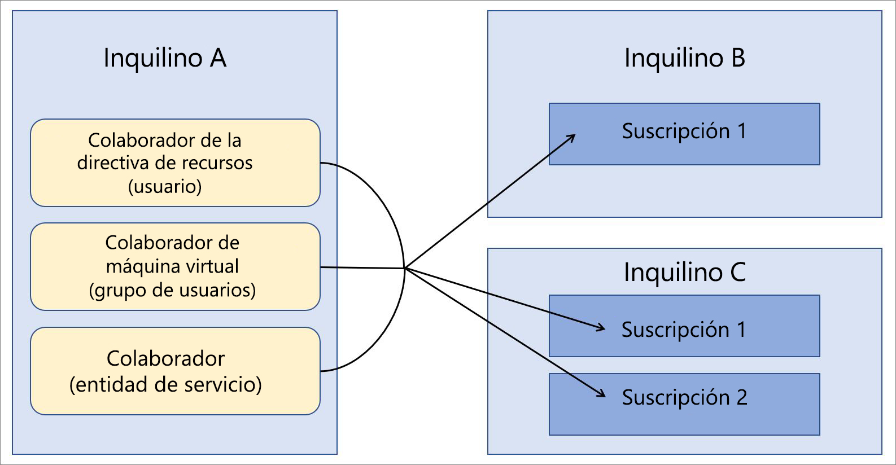

# Azure Lighthouse en escenarios empresariales

El escenario más común de [Azure Lighthouse](../overview.md) es un proveedor de servicios que administra recursos en los inquilinos de Azure Active Directory (Azure AD) de sus clientes. Sin embargo, las funcionalidades de Azure Lighthouse también se pueden usar para simplificar la administración entre inquilinos en empresas que usan varios inquilinos de Azure AD.

## Un solo inquilino frente a varios inquilinos

En la mayoría de las organizaciones, la administración es más fácil cuando hay un solo inquilino de Azure AD. Si todos los recursos se encuentran en un solo inquilino, tanto los usuarios designados, como los grupos de usuarios o las entidades de servicio del inquilino pueden centralizar las tareas de administración. Siempre que sea posible, se recomienda usar un inquilino en cada organización.

No obstante, hay situaciones en las que puede ser necesario que una organización mantenga varios inquilinos de Azure AD. En algunos casos, puede tratarse de una situación temporal, como por ejemplo si se han realizado adquisiciones y va a pasar un tiempo hasta que se defina una estrategia de consolidación de inquilinos a largo plazo. También se puede dar el caso de que una organización necesite mantener varios inquilinos de forma continuada (debido a subsidiarias totalmente independientes, requisitos geográficos o legales, etc.). En los casos en que se requiera una arquitectura de multiinquilino, se puede usar la administración de recursos delegados de Azure para centralizar y simplificar las operaciones de administración. Se pueden incorporar suscripciones de varios inquilinos para la [administración de recursos delegados de Azure](azure-delegated-resource-management.md), lo que permite a los usuarios designados de un inquilino de administración realizar [funciones de administración que afectan a varios inquilinos](cross-tenant-management-experience.md) de forma centralizada y escalable.

## Arquitectura de administración de inquilinos

Si se centralizan las operaciones de administración que afectan a varios inquilinos, es preciso determinar qué inquilino incluirá a los usuarios que realizan operaciones de administración para los restantes inquilinos. En otras palabras, es preciso determinar qué inquilino será el que administre los otros inquilinos.

Por ejemplo, suponga que su organización tiene un solo inquilino, al que denominaremos *Inquilino A*. Posteriormente, la organización adquiere dos inquilinos adicionales, *Inquilino B* e *Inquilino C* y, por motivos empresariales, ambos deben mantenerse como inquilinos independientes.

Su organización quiere usar las mismas definiciones de directiva, prácticas de copia de seguridad y procesos de seguridad en todos los inquilinos. Dado que ya tiene usuarios (incluidos los grupos de usuarios y las entidades de servicio) que son responsables de realizar estas tareas en el Inquilino A, puede incorporar todas las suscripciones en el Inquilino B y el Inquilino C, con el fin de que los mismos usuarios del Inquilino A puedan realizar esas tareas.

## Consideraciones acerca de la seguridad y del acceso

En la mayoría de los escenarios empresariales, lo deseable es delegar una suscripción completa para la administración de recursos delegados de Azure, aunque también es posible delegar solo grupos de recursos específicos de una suscripción.

En cualquier caso, asegúrese de [seguir el principio de privilegios mínimos al definir qué usuarios tendrán acceso a los recursos](recommended-security-practices.md#assign-permissions-to-groups-using-the-principle-of-least-privilege). Esto ayuda a garantizar que los usuarios solo tienen los permisos necesarios para realizar las tareas necesarias y reduce la posibilidad de errores involuntarios.

Azure Lighthouse y la administración de recursos delegados de Azure solo proporcionan vínculos lógicos entre el inquilino que realiza la administración y los inquilinos administrados, en lugar de mover físicamente los datos o los recursos. Además, el acceso siempre se realiza en la misma dirección, del inquilino encargado de la administración a los inquilinos administrados.  Los usuarios y grupos del encargado de la administración deben seguir usando la autenticación multifactor al realizar operaciones de administración en recursos de inquilinos administrados.

Las empresas con protecciones internas o externas de gobernanza y cumplimiento pueden usar los [registros de actividad de Azure](https://docs.microsoft.com/azure/azure-monitor/platform/activity-logs-overview) para cumplir sus requisitos de transparencia. Cuando los inquilinos empresariales han establecido relaciones entre el inquilino que realiza la administración y los inquilinos administrados, los usuarios de cada inquilino pueden supervisar y obtener visibilidad sobre las acciones realizadas por los usuarios en el otro inquilino mediante la visualización de la actividad registrada.

## Consideraciones acerca del proceso de incorporación

Las suscripciones (o los grupos de recursos de una suscripción) se pueden incorporar a la administración de recursos delegados de Azure mediante la implementación de plantillas de Azure Resource Manager o mediante las ofertas de servicios administrados publicadas en Azure Marketplace, de forma privada o pública.

Dado que lo habitual es que los usuarios empresariales puedan obtener acceso directo a los inquilinos de la empresa y que no es preciso comercializar ni promocionar una oferta de administración, por lo general es más rápido y sencillo realizar la implementación directamente con plantillas de Azure Resource Manager. Aunque hacemos referencia a los proveedores de servicios y a los clientes en la [guía para la incorporación de clientes](../how-to/onboard-customer.md), las empresas pueden usar los mismos procesos.

Si lo prefiere, en una empresa, los inquilinos se pueden incorporar mediante la [publicación de una oferta de servicios administrados en Azure Marketplace](../how-to/publish-managed-services-offers.md). Para asegurarse de que la oferta solo está disponible para los inquilinos adecuados, asegúrese de que los planes están marcados como privados. Con un plan privado, puede especificar los identificadores de suscripción de todos los inquilinos que planee incorporar y nadie más podrá obtener su oferta.

## Notas terminológicas

En el caso de la administración entre inquilinos dentro de la empresa, se puede entender que las referencias a los proveedores de servicios en la documentación de Azure Lighthouse se aplican al inquilino que realiza la administración dentro de una empresa, es decir, al inquilino que incluye los usuarios que van a administrar los recursos en otros inquilinos mediante la administración de recursos delegados de Azure. Del mismo modo, se pueden entender que las referencias a los clientes se aplican a los inquilinos que delegan los recursos que se van a administrar mediante los usuarios del inquilino que realiza la administración.

Por ejemplo, en el ejemplo descrito anteriormente, el Inquilino A se puede considerar el inquilino del proveedor de servicios (el inquilino que realiza la administración), mientras que tanto el Inquilino B como el Inquilino C se pueden considerar inquilinos del cliente.

En ese ejemplo, los usuarios del Inquilino A con los permisos adecuados pueden [ver y administrar los recursos delegados](../how-to/view-manage-customers.md) en la página **Mis clientes** de Azure Portal. Del mismo modo, los usuarios del Inquilino B y del Inquilino C con los permisos adecuados pueden [ver y administrar los recursos que se han delegado](../how-to/view-manage-service-providers.md) al Inquilino A en la página **Proveedores de servicios** de Azure Portal.

## Pasos siguientes

- Más información sobre las [experiencias de administración entre inquilinos](cross-tenant-management-experience.md).
- Más información sobre la [administración de recursos delegados de Azure](azure-delegated-resource-management.md).