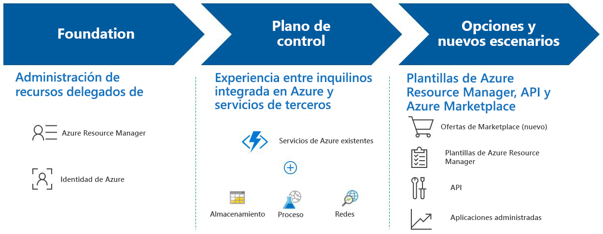

# ¿Qué es Azure Lighthouse?

Azure Lighthouse ofrece a los proveedores de servicios un plano de control único para ver y administrar Azure a través de todos sus clientes con una mayor automatización, escalado y gobernanza mejorada. Con Azure Lighthouse, los proveedores de servicios pueden ofrecer servicios administrados mediante herramientas de administración completas y sólidas integradas en la plataforma Azure. Esta oferta también puede ayudar a las organizaciones de TI empresariales a administrar recursos en varios inquilinos.

## Ventajas

Azure Lighthouse le ayuda a compilar y ofrecer servicios administrados de forma rentable y eficaz para sus clientes. Entre las ventajas se incluye lo siguiente:

- **Administración a escala**: la involucración del cliente y las operaciones de ciclo de vida para administrar los recursos del cliente son más fáciles y escalables.
- **Mayor visibilidad y precisión para los clientes**: los clientes cuyos recursos está administrando tendrán mayor visibilidad de sus acciones y un control preciso sobre el ámbito que delegan para la administración, mientras que la dirección IP se conserva.
- **Herramientas de plataforma completas y unificadas**: nuestra experiencia de herramientas aborda los escenarios clave del proveedor de servicios, incluidos varios modelos de licencia como EA, CSP y pago por uso. Las nuevas funcionalidades funcionan con herramientas y API, modelos de licencias y programas de asociados existentes, como el [Programa Cloud Solution Provider](https://docs.microsoft.com/partner-center/csp-overview). Las opciones de Azure Lighthouse que elija se pueden integrar en sus flujos de trabajo y aplicaciones existentes, y puede realizar un seguimiento de su impacto sobre la involucración del cliente [vinculando su identificador de asociado](https://docs.microsoft.com/azure/billing/billing-partner-admin-link-started).

No hay costos adicionales asociados con el uso de Azure Lighthouse para administrar los recursos de Azure de los clientes.

## Capacidades

Azure Lighthouse incluye varias maneras de ayudar a simplificar la administración y la involucración de los clientes:

- **Administración de recursos delegados de Azure**: Administre los recursos de Azure de sus clientes de forma segura desde su propio inquilino sin tener que cambiar los planos de contexto y control. Para obtener más información, consulte la [administración de recursos delegados de Azure](./concepts/azure-delegated-resource-management.md).
- **Nuevas experiencias de Azure Portal**: vea la información de distintos inquilinos en la nueva página **Mis clientes** de [Azure Portal](https://portal.azure.com). Una hoja de **proveedores de servicios** correspondiente permite a los clientes ver y administrar el acceso del proveedor de servicios. Para obtener más información, consulte [Ver y administrar clientes](./how-to/view-manage-customers.md) y [View and manage service providers](./how-to/view-manage-service-providers.md) (Ver y administrar proveedores de servicios).
- **Plantillas de Azure Resource Manager**: realice tareas de administración más fácilmente, incluida la incorporación de clientes para la administración de recursos delegados de Azure. Para obtener más información, consulte nuestro [repositorio de ejemplos](https://github.com/Azure/Azure-Lighthouse-samples/tree/master/Azure-Delegated-Resource-Management/templates) y [Onboard a customer to Azure delegated resource management](how-to/onboard-customer.md) (Incorporar a un cliente en la administración de recursos delegados de Azure).
- **Ofertas de servicios administrados en Azure Marketplace**: ofrezca sus servicios a los clientes mediante ofertas privadas o públicas, y pídales que se incorporen automáticamente a la administración de recursos delegados de Azure, como alternativa a la incorporación mediante plantillas de Azure Resource Manager. Para obtener más información, consulte [Managed services offers in Azure Marketplace](./concepts/managed-services-offers.md) (Ofertas de servicios administrados en Azure Marketplace).
- **Azure Managed Applications** Empaquete y envíe aplicaciones que resulten fáciles de implementar y usar para los clientes en sus propias suscripciones. La aplicación se implementa en un grupo de recursos al que se tiene acceso desde el inquilino, lo que le permite administrar el servicio como parte de la experiencia general de Azure Lighthouse. Para obtener más información, consulte [Introducción a las aplicaciones administradas de Azure](https://docs.microsoft.com/azure/managed-applications/overview).

> [!NOTE]
> Las funcionalidades descritas más arriba están disponibles actualmente en nubes públicas. Para más información sobre la disponibilidad regional de servicios individuales, consulte [Productos disponibles por región](https://azure.microsoft.com/global-infrastructure/services/).

## Pasos siguientes

- Más información sobre la [administración de recursos delegados de Azure](concepts/azure-delegated-resource-management.md).
- Más información sobre las [experiencias de administración entre inquilinos](concepts/cross-tenant-management-experience.md).
