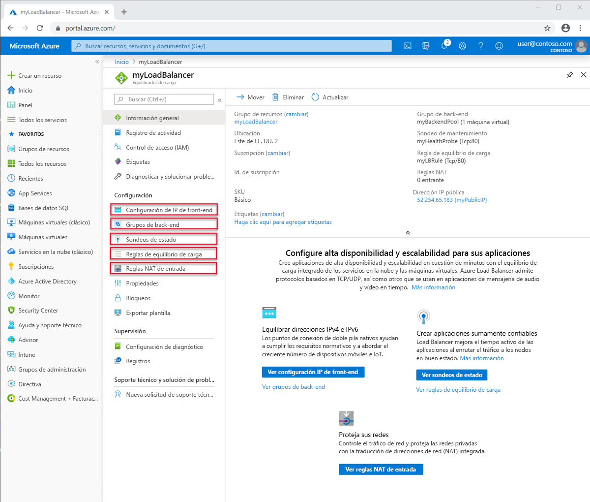
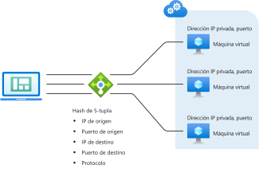
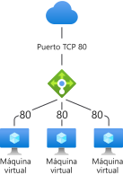
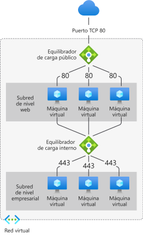

# Componentes y limitaciones de Load Balancer
Azure Load Balancer contiene varios componentes clave para su funcionamiento.  Estos componentes se pueden configurar en la suscripción mediante Azure Portal, la CLI de Azure o Azure PowerShell.  

## Componentes de Load Balancer

* **Configuraciones de direcciones IP de front-end**: la dirección IP del equilibrador de carga. Es el punto de contacto de los clientes. Estas direcciones pueden ser: 

    - **[Dirección IP pública](https://docs.microsoft.com/azure/virtual-network/virtual-network-public-ip-address)**
    - **[Dirección IP privada](https://docs.microsoft.com/azure/virtual-network/virtual-network-ip-addresses-overview-arm#private-ip-addresses)**

* **Grupo de back-end**: el grupo de máquinas virtuales o instancias del conjunto de escalado de máquinas virtuales que van a atender la solicitud entrante. Para escalar de forma rentable, con el fin de satisfacer grandes volúmenes de instrucciones para el procesamiento de tráfico entrante, generalmente se recomienda agregar más instancias al grupo de back-end. Load Balancer se reconfigura al instante de forma automática mediante el escalado o la reducción vertical de instancias. Al agregar o quitar máquinas virtuales del grupo de servidores back-end, el equilibrador de carga se vuelve a configurar sin operaciones adicionales. El ámbito del grupo de back-end es cualquier máquina virtual de la red virtual. Un grupo de back-end puede tener hasta 1000 instancias de back-end o configuraciones de IP.
Las instancias de Load Balancer Básico tienen un ámbito limitado (conjunto de disponibilidad) que solo se puede escalar a configuraciones de hasta 300 direcciones IP. Para más información, consulte la sección [Límites del equilibrador de carga](https://docs.microsoft.com/azure/azure-resource-manager/management/azure-subscription-service-limits#load-balancer). A la hora de considerar cómo diseñar el grupo de back-end, puede diseñar el menor número de recursos individuales del grupo de back-end para optimizar aún más la duración de las operaciones de administración. No hay ninguna diferencia en el rendimiento o la escala en el plano de los datos.
* **Sondeos de estado**: los **[sondeos de estado](https://docs.microsoft.com/azure/load-balancer/load-balancer-custom-probe-overview)** se usan para determinar el estado de las instancias del grupo de back-end. Puede definir el umbral incorrecto de los sondeos de estado. Cuando un sondeo no responde, el equilibrador de carga deja de enviar nuevas conexiones a las instancias incorrectas. Un error de sondeo no afecta a las conexiones existentes. 
    
    La conexión continúa hasta que la aplicación: 
    - Finaliza el flujo.
    - Se produce el tiempo de espera de inactividad.
    - La máquina virtual se apaga.

    Load Balancer proporciona diferentes tipos de sondeo de estado para los puntos de conexión:
    - TCP
    - HTTP
    - HTTPS (sondeo HTTP con el contenedor de seguridad de la capa de transporte [TLS])
     
     La instancia de Load Balancer Básico no es compatible con sondeos HTTPS. Además, la instancia de Load Balancer Básico finalizará todas las conexiones TCP (incluidas las conexiones establecidas). 
    Para más información, consulte [Tipos de sondeo](load-balancer-custom-probe-overview.md#types).

* **Reglas de equilibrio de carga**: las reglas de equilibrio de carga son las que indican a Load Balancer lo que se debe hacer en cada momento. 
* **Reglas NAT de entrada**: las reglas NAT de entrada reenvían el tráfico desde un puerto específico de una dirección IP de front-end específica a un puerto específico de una instancia de back-end específica dentro de la red virtual. El **[reenvío de puertos](https://docs.microsoft.com/azure/load-balancer/tutorial-load-balancer-port-forwarding-portal)** se realiza mediante la misma distribución basada en hash que el equilibrio de carga. Los escenarios comunes para esta funcionalidad son las sesiones Protocolo de escritorio remoto (RDP) o Secure Shell (SSH) en las instancias de máquina virtual individuales dentro de una red virtual de Azure. Puede asignar varios puntos de conexión internos a puertos en la misma dirección IP de front-end. Puede usar las direcciones IP de front-end para administrar de forma remota las máquinas virtuales sin un cuadro de salto adicional.
* **Reglas de salida**: una **[regla de salida](https://docs.microsoft.com/azure/load-balancer/load-balancer-outbound-rules-overview)** configura una traducción de direcciones de red (NAT) de salida para todas las máquinas virtuales o instancias identificadas por el grupo de back-end de la instancia de Standard Load Balancer que se van a traducir para el front-end.
Load Balancer Básico no es admite reglas de salida.

## Conceptos de Load Balancer

Load Balancer proporciona las siguientes funcionalidades básicas para las aplicaciones TCP y UDP:

* **Algoritmo de equilibrio de carga**: con Azure Load Balancer puede crear una regla de equilibrio de carga para distribuir el tráfico que llega al front-end a las instancias del grupo de back-end. Load Balancer usa un algoritmo hash para la distribución de los flujos de entrada (no bytes) y reescribe los encabezados de los flujos en las instancias del grupo de back-end. Un servidor está disponible para recibir nuevos flujos cuando el sondeo de estado indica un punto de conexión de back-end correcto.
De forma predeterminada, Load Balancer usa un hash de tupla 5. 

   El hash incluye: 

   - **Dirección IP de origen**
   - **Puerto de origen**
   - **Dirección IP de destino**
   - **Puerto de destino**
   - **Número de protocolo IP para asignar flujos a servidores disponibles** 

Puede crear afinidad en una dirección IP de origen mediante un hash de tupla 2 o 3 para una regla determinada. Todos los paquetes del mismo flujo de paquetes llegan a la misma instancia subyacente al servidor front-end con equilibrio de carga. Cuando el cliente inicia un nuevo flujo desde la misma IP de origen, se cambia el puerto de origen. En consecuencia, el hash 5-tupla puede hacer que el tráfico vaya a otro punto de conexión de back-end.
Para más información, consulte [Configurar el modo de distribución para Azure Load Balancer](./load-balancer-distribution-mode.md). 

En la siguiente imagen se muestra la distribución basada en hash:

  

  *Ilustración: distribución basada en hash*

* **Independencia y transparencia de aplicaciones**: Load Balancer no interactúa directamente con TCP o UDP ni con la capa de aplicación. Se puede admitir cualquier escenario de aplicación TCP o UDP. Load Balancer no finaliza ni se originan flujos, interactúe con la carga del flujo o proporcione cualquier función de puerta de enlace de capa de aplicación. Los protocolos de enlace de protocolo siempre se producen directamente entre el cliente y la instancia del grupo de back-end. Una respuesta a un flujo de entrada siempre es una respuesta de una máquina virtual. Cuando llega el flujo a la máquina virtual, también se conserva la dirección IP de origen original.
  * A cada punto de conexión solo le responde una máquina virtual. Por ejemplo, un protocolo de enlace TCP se realiza siempre entre el cliente y la máquina virtual de back-end seleccionada. Una respuesta a una solicitud a un front-end es una respuesta generada por una máquina virtual de back-end. Cuando se valida correctamente la conectividad con un front-end, se valida la conectividad de un extremo a otro con al menos una máquina virtual de back-end.
  * Las cargas de la aplicación son transparentes para Load Balancer. Se puede admitir cualquier aplicación UDP o TCP.
  * Dado que Load Balancer no interactúa con la carga TCP y proporciona descarga TLS, puede crear escenarios cifrados de un extremo a otro. El uso de Load Balancer aumenta la escalabilidad horizontal de las aplicaciones TLS al finalizar la conexión TLS en la propia máquina virtual. Por ejemplo, la capacidad para claves de sesión TLS solo está limitada por el tipo y número de máquinas virtuales que se agregan al grupo de servidores back-end.

* **Conexiones de salida** Todos los flujos de salida desde direcciones IP privadas dentro de la red virtual hasta direcciones IP públicas en Internet se pueden traducir a una dirección IP de front-end del equilibrador de carga. Cuando un front-end público está asociado a una máquina virtual de back-end mediante una regla de equilibrio de carga, Azure traduce las conexiones salientes a la dirección IP de front-end pública. Esta configuración tiene las siguientes ventajas:
  * Actualización sencilla y recuperación ante desastres de servicios, ya que el front-end se puede asignar dinámicamente a otra instancia del servicio.
  * Facilita la administración de la lista de control de acceso (ACL). Las ACL que se expresan como direcciones IP de front-end no cambian a medida que los servicios se escalan o bajan horizontalmente o se vuelve a implementar. La traducción de las conexiones salientes a un número menor de direcciones IP que las máquinas reduce la carga de la implementación de listas de destinatarios seguras.

  Standard Load Balancer emplea un [algoritmo de SNAT sólido, escalable y predecible](load-balancer-outbound-connections.md#snat). Estos son los principios clave que se deben recordar al trabajar con Standard Load Balancer:

    - Las reglas de equilibrio de carga deducen cómo se programa SNAT. Las reglas de equilibrio de carga son específicas del protocolo. SNAT es específica del protocolo y la configuración debe reflejarlo en lugar de crear un efecto secundario.

    - **Varios servidores front-end** Cuando hay varios servidores front-end disponibles, se utilizan todos ellos y cada servidor front-end multiplica el número de puertos SNAT disponibles. Si desea más puertos SNAT porque espera tener o ya tiene una gran demanda de conexiones de salida, puede agregar más puertos SNAT. Para ello, configure más front-ends, reglas y grupos de back-end en los mismos recursos de máquina virtual.

    - **Controlar qué front-end se usa para la salida** Puede elegir y controlar si no desea que un servidor front-end específico se use para las conexiones de salida. Si quiere restringir las conexiones de salida para que se originen únicamente desde una dirección IP de front-end específica, puede deshabilitar la SNAT de salida en la regla que expresa la asignación de salida.

    - **Control de la conectividad de salida** Los escenarios de salida son explícitos y la conectividad de salida no existe hasta que se especifique. Load Balancer Estándar existe en el contexto de la red virtual.  Una red virtual es una red privada aislada.  A menos que exista una asociación con una dirección IP pública, no se permite la conectividad pública.  Puede acceder a los [puntos de conexión de servicio de la red virtual](../virtual-network/virtual-network-service-endpoints-overview.md) porque están dentro de la red virtual y son locales a ella.  Si desea establecer la conectividad de salida a un destino fuera de la red virtual, tiene dos opciones:
        - Asignar una dirección IP pública de la SKU Estándar como una dirección IP pública de nivel de instancia al recurso de máquina virtual.
        - Colocar el recurso de máquina virtual en el grupo de back-end de un equilibrador de carga estándar público.

        Ambos permitirán la conectividad de salida desde la red virtual hacia afuera. 

        Si _solo_ tiene un equilibrador de carga estándar interno asociado con el grupo de back-end en el que se encuentra el recurso de máquina virtual, la máquina virtual solo puede acceder a los recursos de red virtual y los [puntos de conexión de servicio de la red virtual](../virtual-network/virtual-network-service-endpoints-overview.md).  Para crear una conexión de salida, siga los pasos descritos en el párrafo anterior.

        La conectividad de salida de un recurso de máquina virtual no se asocia a las SKU Estándar, permanece como antes.

        Consulte la [explicación detallada sobre las conexiones de salida](load-balancer-outbound-connections.md).

* **Zonas de disponibilidad** Load Balancer Estándar admite otras funcionalidades en las regiones donde las zonas de disponibilidad están disponibles. Estas características se agregan a las que Load Balancer Estándar ya proporciona.  Las configuraciones de las zonas de disponibilidad están disponibles para ambos tipos de instancias de Standard Load Balancer, públicas e internas.
 Un front-end con redundancia de zona sobrevive a los errores de la zona y cuenta con infraestructura dedicada en todas las zonas al mismo tiempo. 
Además, puede garantizar un front-end en una zona específica. Un front-end zonal comparte el destino de su zona correspondiente y solo cuenta con infraestructura dedicada en una sola zona.
El equilibrio de carga entre zonas está disponible para el grupo de back-end y cualquier recurso de máquina virtual en una red virtual puede formar parte de un grupo de back-end.
Load Balancer Básico no admite zonas.
Revise la [explicación detallada de las capacidades relacionadas con las zonas de disponibilidad](load-balancer-standard-availability-zones.md) y la [introducción a las zonas de seguridad](../availability-zones/az-overview.md) para más información.

* **Puertos de alta disponibilidad**: Puede configurar reglas de equilibrio de carga para que la aplicación sea escalable y de gran confiabilidad. Cuando se usa una regla de equilibrio de carga para puertos de alta disponibilidad, Standard Load Balancer ofrece equilibrio de carga por flujo en cada puerto efímero de la dirección IP de front-end de Standard Load Balancer.  La característica es útil para otros escenarios donde no es práctico o no deseable especificar los puertos individuales. Una regla de equilibrio de carga para puertos de alta disponibilidad permite crear escenarios activo-pasivo o activo-activo n+1 para dispositivos de red virtual y aplicaciones que requieran grandes intervalos de puertos de entrada.  Se puede usar un sondeo de mantenimiento para determinar qué back-ends deberían recibir nuevos flujos.  Puede usar un grupo de seguridad de red para emular un escenario de intervalo de puertos. Load Balancer Básico no admite los puertos de alta disponibilidad.
Consulte la [explicación detallada sobre los puertos de alta disponibilidad](load-balancer-ha-ports-overview.md).
>[!IMPORTANT]
> Si va a usar un dispositivo virtual de red, póngase en contacto con su proveedor para consultar si su producto se ha probado con puertos HA, y siga sus instrucciones específicas para la implementación. 

* **Varios servidores front-end**: Load Balancer admite varias reglas con varios front-ends.  Load Balancer Estándar incluye también los escenarios de salida.  Los escenarios de salida son básicamente lo contrario de una regla de equilibrio de carga de entrada.  La regla de equilibrio de carga de entrada también crea a una asociación para las conexiones de salida. Standard Load Balancer usa todos los front-ends asociados a un recurso de máquina virtual mediante una regla de equilibrio de carga.  Además, un parámetro en la red de equilibrio de carga permite suprimir una red de equilibrio de carga para la conectividad de salida, lo que permite elegir front-ends específicos o, incluso, ninguno.

Para la comparación, Load Balancer Básico selecciona un único front-end de forma aleatoria y no se puede controlar cuál se selecciona.
## Tipos de Load Balancer

### Equilibrador de carga público

Una Load Balancer pública asigna la dirección IP pública y el puerto del tráfico entrante a la dirección IP privada y al puerto de la máquina virtual. Load Balancer asigna el tráfico de la otra manera en torno al tráfico de respuesta de la máquina virtual. Puede distribuir determinados tipos de tráfico entre varias máquinas virtuales o servicios aplicando reglas de equilibrio de carga. Por ejemplo, puede distribuir la carga del tráfico de solicitudes web entre varios servidores web.

>[!NOTE]
>Solo puede implementar un Load Balancer público y un Load Balancer interno por conjunto de disponibilidad.

En la ilustración siguiente se muestra un punto de conexión con equilibrio de carga para el tráfico web que se comparte entre tres máquinas virtuales para el puerto público y TCP 80. Estas tres máquinas virtuales se encuentran en un conjunto con equilibrio de carga.

  

*Ilustración: Equilibrio del tráfico web mediante un equilibrador de carga público*

Los clientes de Internet envían solicitudes de páginas web a la dirección IP pública de una aplicación web en el puerto TCP 80. Azure Load Balancer distribuye las solicitudes entre las tres máquinas virtuales del conjunto de carga equilibrada. Para más información sobre los algoritmos de Load Balancer, consulte [Conceptos de Load Balancer](concepts-limitations.md#load-balancer-concepts).

Azure Load Balancer distribuye el tráfico de red equitativamente entre varias instancias de máquina virtual de forma predeterminada. También puede configurar la afinidad de la sesión. Para más información, consulte [Configurar el modo de distribución para Azure Load Balancer](load-balancer-distribution-mode.md).

### Equilibrador de carga interno

Un equilibrador de carga interno solo dirige el tráfico a los recursos que están dentro de una red virtual o que usan una VPN para acceder a la infraestructura de Azure, a diferencia de un equilibrador de carga público. La infraestructura de Azure restringe el acceso a las direcciones IP de front-end con equilibrio de carga de una red virtual. Las direcciones IP de front-end y las redes virtuales no se exponen nunca directamente a un punto de conexión de Internet. Las aplicaciones de línea de negocio internas se ejecutan en Azure y se accede a ellas desde Azure o desde recursos locales.

Un equilibrador de carga interno permite los siguientes tipos de equilibrio de carga:

* **Dentro de una red virtual**: Equilibrio de carga de las máquinas virtuales de la red virtual a un conjunto de máquinas virtuales que se encuentran en la misma red virtual.
* **En una red virtual entre entornos locales**: Equilibrio de carga desde equipos locales a un conjunto de máquinas virtuales que se encuentran en la misma red virtual.
* **En aplicaciones de niveles múltiples**: Equilibrio de carga para aplicaciones de niveles múltiples accesibles desde Internet en las que los niveles de back-end no son accesibles desde Internet. Los niveles de back-end requieren un equilibrio de carga de tráfico en el nivel accesible desde Internet. Consulte la ilustración siguiente.
* **En aplicaciones de línea de negocio**: equilibrio de carga para las aplicaciones de línea de negocio hospedadas en Azure sin requerir hardware ni software adicional de equilibrador de carga. Este escenario incluye servidores locales que se encuentran en el conjunto de equipos cuyo tráfico tiene equilibrio de carga.

  

*Ilustración: Equilibrar las aplicaciones de niveles múltiples mediante Load Balancer público e interno*

##  Comparación de las SKU de Load Balancer

El equilibrador de carga admite las SKU básica y estándar. Estas SKU difieren en la escala, las características y los precios del escenario. Cualquier escenario que sea posible con el Load Balancer Básico se puede crear con Standard Load Balancer. Las API de ambas SKU son similares y se invocan a través de la especificación de una SKU. La API que admite SKU para el equilibrador de carga y la dirección IP pública está disponible a partir de la API `2017-08-01`. Ambas SKU comparten la misma estructura y API generales.

La configuración completa del escenario podría diferir ligeramente en función de la SKU. La documentación del equilibrador de carga indica si un artículo se aplica únicamente a una SKU específica. Para comparar y comprender las diferencias, consulte la siguiente tabla. Para más información, consulte [Información general sobre Standard Load Balancer de Azure](load-balancer-standard-overview.md).

>[!NOTE]
> Microsoft recomienda Standard Load Balancer.
Las máquinas virtuales independientes, los conjuntos de disponibilidad y los conjuntos de escalado de máquinas virtuales solo se pueden conectar a una SKU, nunca a ambas. Load Balancer y la SKU de la dirección IP pública deben coincidir cuando se usan con direcciones IP públicas. Load Balancer y las SKU de IP públicas no son mutables.

[!INCLUDE [comparison table](../../includes/load-balancer-comparison-table.md)]

Para más información, consulte [Límites del equilibrador de carga](https://docs.microsoft.com/azure/azure-resource-manager/management/azure-subscription-service-limits#load-balancer). Para más información de Load Balancer Estándar, consulte los artículos de [introducción](load-balancer-standard-overview.md), [precios](https://aka.ms/lbpricing) y [Acuerdo de Nivel de Servicio](https://aka.ms/lbsla).

## Limitaciones

- Las SKU no son mutables. No se puede cambiar la SKU de un recurso existente.
- Un recurso de máquina virtual independiente, un recurso de conjunto de disponibilidad o un recurso de conjunto de escalado de máquinas virtuales puede hacer referencia únicamente a una SKU, nunca a ambas.
- Una regla de equilibrador de carga no puede abarcar dos redes virtuales.  Los front-ends y sus instancias de back-end relacionadas deben estar ubicados en la misma red virtual.  
- No se admite [mover las operaciones de suscripción](../azure-resource-manager/management/move-resource-group-and-subscription.md) para los recursos de direcciones IP públicas y Standard Load Balancer.
- Se puede acceder a los roles de trabajo web sin una red virtual y otros servicios de plataforma de Microsoft desde solo una instancia de Standard Load Balancer. No debe depender de esto, porque el servicio mismo o la plataforma subyacente puede cambiar sin previo aviso. Siempre debe pensar que necesita crear [conectividad de salida](load-balancer-outbound-connections.md) de manera explícita si lo desea al usar solo un equilibrador de carga estándar interno.

- Load Balancer proporciona equilibrio de carga y reenvío de puertos para protocolos TCP o UDP específicos. Las reglas de equilibrio de carga y las reglas NAT de entrada admiten TCP y UDP, pero no otros protocolos IP, incluido ICMP.

  Load Balancer no finaliza, responde o interactúa de otro modo con la carga de un flujo UDP o TCP. No es un proxy. La validación correcta de la conectividad con un front-end debe realizarse en banda con el mismo protocolo que se usa en una regla NAT de entrada o de equilibrio de carga. Al menos una de las máquinas virtuales debe generar una respuesta para que un cliente vea una respuesta de un front-end.

  No recibir una respuesta en banda del Load Balancer front-end indica que ninguna máquina virtual podría responder. Nada puede interactuar con un front-end Load Balancer sin que una máquina virtual pueda responder. Este principio se aplica también a las conexiones salientes donde el puerto de enmascaramiento SNAT solo se admite para TCP y UDP. Cualquier otro protocolo IP, incluido ICMP, produce un error. Asigne una dirección IP pública de nivel de instancia para mitigar este problema. Para más información, consulte [Descripción de SNAT y PAT](load-balancer-outbound-connections.md#snat).

- Los equilibradores de carga internos no convierten las conexiones salientes originadas en el front-end de una Load Balancer interna porque ambos están en un espacio de direcciones IP privado. Los equilibradores de carga públicos proporcionan [conexiones salientes](load-balancer-outbound-connections.md) desde direcciones IP privadas dentro de la red virtual a direcciones IP públicas. En el caso de los equilibradores de carga internos, este enfoque evita el agotamiento del puerto SNAT potencial en un espacio de direcciones IP interno único, donde no se requiere traducción.

  Un efecto secundario es que si un flujo de salida de una máquina virtual del grupo de servidores back-end intenta un flujo hacia el front-end del Load Balancer interno en su grupo _y_ se asigna a sí mismo, las dos piernas del flujo no coinciden. Dado que no coinciden, se produce un error en el flujo. El flujo se realiza correctamente si el flujo no se ha asignado a la misma máquina virtual del grupo de servidores back-end que creó el flujo al front-end.

  Cuando el flujo se vuelve a asignar a sí mismo, el flujo de salida parece originarse desde la máquina virtual hasta el front-end y el flujo de entrada correspondiente parece provenir de la máquina virtual. Desde el punto de vista del sistema operativo invitado, las partes entrantes y salientes del mismo flujo no coinciden dentro de la máquina virtual. La pila TCP no reconocerá estas mitades del mismo flujo como parte del mismo flujo. El origen y el destino no coinciden. Cuando el flujo se asigna a cualquier otra máquina virtual del grupo de back-end, las mitades del flujo coinciden y la máquina virtual puede responder al flujo.

  El síntoma de este escenario es el tiempo de espera de conexión intermitente cuando el flujo vuelve al mismo back-end que originó el flujo. Las soluciones alternativas comunes incluyen la inserción de una capa de proxy detrás del Load Balancer interno y el uso de reglas de estilo de Direct Server Return (DSR). Para más información, consulte [Varios front-ends para Azure Load Balancer](load-balancer-multivip-overview.md).

  Puede combinar una Load Balancer interna con cualquier proxy de terceros o usar el [Application Gateway](../application-gateway/application-gateway-introduction.md) interno para escenarios de proxy con HTTP/HTTPS. Aunque podría usar un Load Balancer público para mitigar este problema, el escenario resultante es propenso a [agotamiento de SNAT](load-balancer-outbound-connections.md#snat). Evite este segundo enfoque a menos que se administre con cuidado.

- En general, no se admite el reenvío de fragmentos IP en reglas de equilibrio de carga. No se admite la fragmentación IP de paquetes UDP y TCP en reglas de equilibrio de carga. Las reglas de equilibrio de carga de puertos de alta disponibilidad se pueden usar para reenviar fragmentos IP existentes. Para más información, consulte [Información general sobre los puertos de alta disponibilidad](load-balancer-ha-ports-overview.md).

## Pasos siguientes

- Consulte [Creación de una instancia de Standard Load Balancer](quickstart-load-balancer-standard-public-portal.md) para empezar a usar una instancia de Load Balancer: crear una, crear máquinas virtuales con una extensión de IIS personalizada instalada y equilibrar la carga de la aplicación web entre las máquinas virtuales.
- Más información sobre [Azure Load Balancer](load-balancer-overview.md).
- Más información en [Standard Load Balancer y Availability Zones](load-balancer-standard-availability-zones.md).
- Más información sobre [sondeos de mantenimiento](load-balancer-custom-probe-overview.md).
- Más información acerca de los [diagnósticos de Load Balancer Estándar](load-balancer-standard-diagnostics.md).
- Más información acerca de cómo usar [Load Balancer para conexiones salientes](load-balancer-outbound-connections.md).
- Obtenga información sobre las [reglas de salida](load-balancer-outbound-rules-overview.md).
- Obtenga información sobre el [restablecimiento de TCP en estado inactivo](load-balancer-tcp-reset.md).
- Más información acerca de [Standard Load Balancer con reglas de equilibrio de carga para puertos HA](load-balancer-ha-ports-overview.md).
- Más información acerca de cómo usar [Load Balancer con varios front-ends](load-balancer-multivip-overview.md).
- Más información sobre los [grupos de seguridad de red](../virtual-network/security-overview.md).
