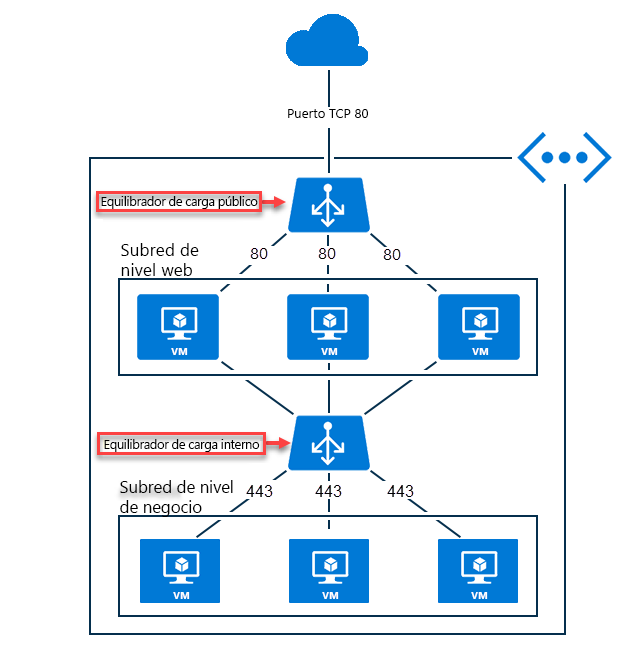

# ¿Qué es Azure Load Balancer?

El *equilibrio de carga* hace referencia a la distribución uniforme de la carga (el tráfico de red entrante) en un grupo de recursos o servidores de back-end. 

Azure Load Balancer opera en la capa cuatro del modelo de interconexión de sistema abierto (OSI). Es el único punto de contacto de los clientes. Load Balancer distribuye flujos de entrada que llegan al front-end del equilibrador de carga a las instancias del grupo de servidores back-end. Estos flujos están de acuerdo con las reglas de equilibrio de carga y los sondeos de estado configurados. Las instancias del grupo de back-end pueden ser instancias de Azure Virtual Machines o de un conjunto de escalado de máquinas virtuales.

Un **[equilibrador de carga público](./concepts-limitations.md#publicloadbalancer)** puede proporcionar conexiones de salida para máquinas virtuales dentro de la red virtual. Estas conexiones se realizan mediante la traducción de sus direcciones IP privadas a direcciones IP públicas. Las instancias públicas de Load Balancer se usan para equilibrar la carga del tráfico de Internet en las máquinas virtuales.

Un **[equilibrador de carga interno (o privado)](./concepts-limitations.md#internalloadbalancer)** se usa cuando se necesitan direcciones IP privadas solo en el front-end. Los equilibradores de carga internos se usan para equilibrar la carga del tráfico dentro de una red virtual. También se puede acceder a un servidor front-end del equilibrador de carga desde una red local en un escenario híbrido.

  

*Ilustración: Equilibrar las aplicaciones de niveles múltiples mediante Load Balancer público e interno*

Para más información sobre los componentes individuales del equilibrador de carga, consulte [Componentes y limitaciones de Azure Load Balancer](./concepts-limitations.md).

>[!NOTE]
> Azure ofrece un conjunto de soluciones de equilibrio de carga completamente administradas para sus escenarios. Si necesita un equilibrio de carga de la capa 4 de alto rendimiento y baja latencia, consulte [¿Qué es Azure Load Balancer?](../load-balancer/load-balancer-overview.md) Si busca el equilibrio de carga de DNS global, consulte [¿Qué es Traffic Manager?](../traffic-manager/traffic-manager-overview.md) Los escenarios de un extremo a otro pueden beneficiarse de la combinación de estas soluciones.
>
> Si desea ver una comparación de las distintas opciones de equilibrio de carga de Azure, consulte [Información general sobre las opciones de equilibrio de carga en Azure](https://docs.microsoft.com/azure/architecture/guide/technology-choices/load-balancing-overview).

## Uso de Azure Load Balancer
Con Standard Load Balancer, puede escalar las aplicaciones y crear servicios con alta disponibilidad. Load Balancer admite escenarios de entrada y salida. Una instancia de Load Balancer proporciona baja latencia y alto rendimiento, y puede escalar hasta millones de flujos para todas las aplicaciones TCP y UDP.

Entre los escenarios clave que puede realizar con Standard Load Balancer se incluyen:

- Equilibrio de carga del tráfico **[interno](https://docs.microsoft.com/azure/load-balancer/tutorial-load-balancer-standard-manage-portal)** y **[externo](https://docs.microsoft.com/azure/load-balancer/tutorial-load-balancer-standard-internal-portal)** a las máquinas virtuales de Azure.

- Aumento de la disponibilidad mediante la distribución de recursos **[en zonas](https://docs.microsoft.com/azure/load-balancer/tutorial-load-balancer-standard-public-zonal-portal)** y **[a través de ellas](https://docs.microsoft.com/azure/load-balancer/tutorial-load-balancer-standard-public-zone-redundant-portal)** .

- Configuración de la **[conectividad de salida ](https://docs.microsoft.com/azure/load-balancer/load-balancer-outbound-connections)** para máquinas virtuales de Azure.

- Uso de **[sondeos de estado](https://docs.microsoft.com/azure/load-balancer/load-balancer-custom-probe-overview)** para supervisar los recursos con equilibrio de carga.

- Empleo del **[desvío de puertos](https://docs.microsoft.com/azure/load-balancer/tutorial-load-balancer-port-forwarding-portal)** para acceder a las máquinas virtuales de una red virtual mediante la dirección IP pública y el puerto.

- Habilitación de la compatibilidad con el **[equilibrio de carga](https://docs.microsoft.com/azure/virtual-network/virtual-network-ipv4-ipv6-dual-stack-standard-load-balancer-powershell)** de **[IPv6](https://docs.microsoft.com/azure/virtual-network/ipv6-overview)** .

- Standard Load Balancer proporciona métricas multidimensionales mediante [Azure Monitor](https://docs.microsoft.com/azure/azure-monitor/overview).  Estas métricas se pueden filtrar, agrupar y desglosar para una dimensión determinada.  Proporcionan una perspectiva actual e histórica del rendimiento y el mantenimiento del servicio.  También se admite Resource Health. Consulte **[Diagnósticos de Standard Load Balancer](load-balancer-standard-diagnostics.md)** para más información.

- Servicios de equilibrio de carga en **[varios puertos, varias direcciones IP, o en ambos](https://docs.microsoft.com/azure/load-balancer/load-balancer-multivip-overview)** .

- Desplazamiento de los recursos **[internos](https://docs.microsoft.com/azure/load-balancer/move-across-regions-internal-load-balancer-portal)** y **[externos](https://docs.microsoft.com/azure/load-balancer/move-across-regions-external-load-balancer-portal)** del equilibrador de carga por las regiones de Azure.

- Equilibrio de carga del flujo de TCP y UDP en todos los puertos simultáneamente mediante los **[puertos de alta disponibilidad](https://docs.microsoft.com/azure/load-balancer/load-balancer-ha-ports-overview)** .

### Seguro de forma predeterminada

Standard Load Balancer se basa en el modelo de seguridad de red de confianza cero en su núcleo. Standard Load Balancer es seguro de forma predeterminada y forma parte de la red virtual. La red virtual es una red privada y aislada.  Esto significa que las instancias de Standard Load Balancer y las direcciones IP públicas estándar se cierran en los flujos de entrada a menos que los abran los grupos de seguridad de red. Los grupos de seguridad de red se usan para permitir explícitamente el tráfico e incluirlo en una lista de permitidos.  Si no tiene ningún grupo de seguridad de red en una subred o NIC del recurso de máquina virtual, no se permitirá que el tráfico llegue a este recurso. Para aprender más sobre los NSG y cómo aplicarlos en su caso, vea [Grupos de seguridad de red](../virtual-network/security-overview.md).
Load Balancer Básico está abierto a Internet de forma predeterminada.

## Precios y contrato de nivel de servicio

Para más información sobre los precios de Standard Load Balancer, consulte [Precios de Load Balancer](https://azure.microsoft.com/pricing/details/load-balancer/).
Load Balancer Básico se ofrece sin cargo.
Consulte [Acuerdo de Nivel de Servicio para Load Balancer](https://aka.ms/lbsla). Load Balancer Básico no tiene Acuerdo de Nivel de Servicio.

## Pasos siguientes

Consulte el artículo sobre cómo [crear una instancia de Standard Load Balancer pública](quickstart-load-balancer-standard-public-portal.md) para empezar a usar un equilibrador de carga.

Para más información acerca de las limitaciones y los componentes de Azure Load Balancer, consulte [Conceptos y limitaciones de Azure Load Balancer](./concepts-limitations.md).
