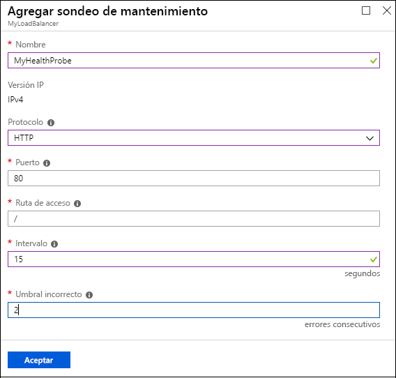
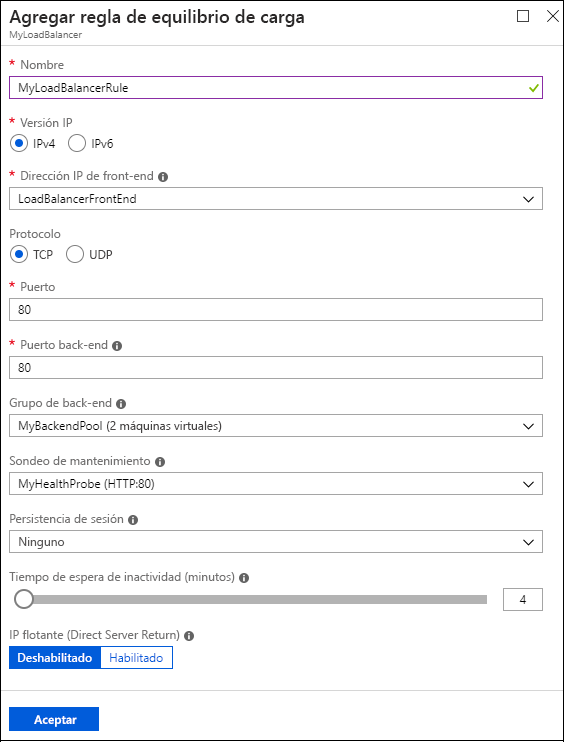

# Guía de inicio rápido: Creación de un equilibrador de carga básico público mediante Azure Portal

El equilibrio de carga proporciona un mayor nivel de disponibilidad y escala, ya que distribuye las solicitudes entrantes entre varias máquinas virtuales (VM). Puede usar Azure Portal para crear un equilibrador de carga y equilibrar el tráfico entre las máquinas virtuales. Esta guía de inicio rápido muestra cómo crear y configurar un equilibrador de carga, los servidores de back-end y los recursos de red en el plan de tarifa Básico.

Si no tiene una suscripción a Azure, cree una [cuenta gratuita](https://azure.microsoft.com/free/?WT.mc_id=A261C142F) antes de empezar. 

Para realizar las tareas de esta guía de inicio rápido, inicie sesión en [Azure Portal](http://portal.azure.com).

## Creación de una instancia de Load Balancer Básico

En primer lugar, cree un equilibrador de carga básico público mediante el portal. El nombre y la dirección IP que crea se configuran automáticamente como el front-end del equilibrador de carga.

1. En el lado superior izquierdo del portal, seleccione **Crear un recurso** > **Redes** > **Load Balancer**.
   
1. En el panel **Crear equilibrador de carga**, escriba o seleccione estos valores:
   
   - **Nombre**: escriba *MyLoadBalancer*.
   - **Tipo**: Seleccione **Público**. 
   - **SKU**: Seleccione **Básica**.
   - **Dirección IP pública**: Seleccione **Crear nuevo**. 
     - Campo **Dirección IP pública**: escriba *MyPublicIP*.
     - **Configurar la dirección IP pública** > **Asignación**: seleccione **Dinámico**.
   - **ResourceGroup**: seleccione **Crear nuevo**, a continuación, escriba *MyResourceGroupLB* y seleccione **Aceptar**. 
   
1. Seleccione **Crear**.
   

## Creación de los servidores de back-end

A continuación, cree una red virtual y dos máquinas virtuales para el grupo de back-end del equilibrador de carga Básico. 

### Creación de una red virtual

1. En la parte superior izquierda del portal, seleccione **Crear un recurso** > **Redes** > **Red virtual**.
   
1. En el panel **Crear red virtual**, escriba o seleccione estos valores:
   
   - **Nombre**: escriba *MyVnet*.
   - **ResourceGroup**: despliegue las opciones de **Seleccionar existente** y seleccione **MyResourceGroupLB**. 
   - **Subred** > **Nombre**: escriba *MyBackendSubnet*.
   
1. Seleccione **Crear**.

   

### Creación de máquinas virtuales

1. En la parte superior izquierda del portal, seleccione **Crear un recurso** > **Proceso** > **Windows Server 2016 Datacenter**. 
   
1. En **Crear una máquina virtual**, escriba o seleccione los valores siguientes en la pestaña **Básico**:
   - **Suscripción** > **Grupo de recursos**: despliegue y seleccione **MyResourceGroupLB**.
   - **Detalles de instancia** > **Nombre de máquina virtual**: escriba *MyVM1*.
   - **Detalles de instancia** > **Opciones de disponibilidad**: 
     1. En la lista desplegable seleccione **Conjunto de disponibilidad**. 
     2. Seleccione **Crear nuevo**, escriba *MyAvailabilitySet* y seleccione **Aceptar**.
  
1. Seleccione la pestaña **Redes** o seleccione **Siguiente: Discos** y, después, **Siguiente: Redes**. 
   
   Asegúrese de que está seleccionado lo siguiente:
   - **Red virtual**: **MyVNet**
   - **Subred**: **MyBackendSubnet**
   - **Dirección IP pública**: **MyVM1-ip**
   
   Para crear un nuevo grupo de seguridad de red (NSG), un tipo de firewall, en **Grupo de seguridad de red**, seleccione **Avanzado**. 
   1. En el campo **Configurar grupo de seguridad de red**, seleccione **Crear nuevo**. 
   1. Escriba *MyNetworkSecurityGroup* y seleccione **Aceptar**. 
   
1. Seleccione la pestaña **Administración** o seleccione **Siguiente** > **Administración**. En **Supervisión**, establezca **Diagnósticos de arranque** en **Desactivado**.
   
1. Seleccione **Revisar + crear**.
   
1. Revise la configuración y, a continuación, seleccione **Crear**. 

1. Siga los pasos para crear una segunda máquina virtual llamada *MyVM2*, con una dirección **IP pública** establecida en *MyVM2-ip* y todos los demás valores iguales a MyVM1. 

### Creación de reglas de NSG para las máquinas virtuales

En esta sección, creará reglas del grupo de seguridad de red (NSG) para las máquinas virtuales, para permitir conexiones entrantes de Internet (HTTP) y escritorio remoto (RDP).

1. Seleccione **Todos los recursos** en el menú izquierdo. En la lista de recursos, seleccione **MyNetworkSecurityGroup** en el grupo de recursos **MyResourceGroupLB**.
   
1. En **Configuración**, seleccione **Reglas de seguridad de entrada** y, a continuación, seleccione **Agregar**.
   
1. En el cuadro de diálogo **Agregar regla de seguridad de entrada**, escriba o seleccione lo siguiente para la regla HTTP:
   
   - **Origen**: Seleccione **Service Tag** (Etiqueta de servicio).  
   - **Etiqueta de servicio de origen**: seleccione **Internet**. 
   - **Intervalos de puertos de destino**: escriba *80*.
   - **Protocolo**: seleccione **TCP**. 
   - **Acción**: seleccione **Permitir**.  
   - **Prioridad**: escriba *100*. 
   - **Nombre**: escriba *MyHTTPRule*. 
   - **Descripción**: escriba *Permitir HTTP*. 
   
1. Seleccione **Agregar**. 
   
   
   
1. Repita los pasos para la regla de RDP entrante, con los siguientes valores diferentes:
   - **Intervalos de puertos de destino**: escriba *3389*.
   - **Prioridad**: escriba *200*. 
   - **Nombre**: escriba *MyRDPRule*. 
   - **Descripción**: escriba *Permitir RDP*. 

## Creación de recursos para el equilibrador de carga

En esta sección se configura el equilibrador de carga para un grupo de direcciones de back-end, un sondeo de mantenimiento y una regla del equilibrador de carga.

### Creación de un grupo de direcciones de back-end

Para distribuir el tráfico a las máquinas virtuales, el equilibrador de carga utiliza un grupo de direcciones de back-end. El grupo de direcciones de back-end contiene las direcciones IP de las tarjetas de interfaz de red (NIC) virtuales conectadas al equilibrador de carga. 

**Para crear un grupo de direcciones de back-end que incluya VM1 y VM2:**

1. Seleccione **Todos los recursos** en el menú de la izquierda y, a continuación, en la lista de recursos seleccione **MyLoadBalancer**.
   
1. En **Configuración**, seleccione **Grupos de back-end** y, a continuación, seleccione **Agregar**.
   
1. En la página **Agregar un grupo back-end**, escriba o seleccione los siguientes valores:
   
   - **Nombre**: escriba *MyBackEndPool*.
   - **Asociado a**: En la lista desplegable seleccione **Conjunto de disponibilidad**.
   - **Conjunto de disponibilidad**: seleccione **MyAvailabilitySet**.
   
1. Seleccione **Agregar una configuración IP de red de destino**. 
   1. Agregue cada máquina virtual (**MyVM1** y **MyVM2**) que creó al grupo de back-end.
   2. Después de agregar cada máquina, despliegue las opciones y seleccione su **Configuración IP de red**. 
   
1. Seleccione **Aceptar**.
   
   
   
1. En la página **Grupos back-end**, expanda **MyBackendPool** y asegúrese de que aparecen ambas máquinas **VM1** y **VM2**.

### Creación de un sondeo de estado

Para permitir que el equilibrador de carga supervise el mantenimiento de la máquina virtual, utilice un sondeo de mantenimiento. El sondeo de estado agrega o quita de forma dinámica las máquinas virtuales de la rotación del equilibrador de carga en base a su respuesta a las comprobaciones de estado. 

**Para crear un sondeo de mantenimiento para supervisar el mantenimiento de las máquinas virtuales:**

1. Seleccione **Todos los recursos** en el menú de la izquierda y, a continuación, en la lista de recursos seleccione **MyLoadBalancer**.
   
1. En **Configuración**, seleccione **Sondeos de mantenimiento** y, a continuación, seleccione **Agregar**.
   
1. En la página **Agregar sondeo de mantenimiento**, escriba o seleccione los siguientes valores:
   
   - **Nombre**: escriba *MyHealthProbe*.
   - **Protocolo**: en la lista desplegable, seleccione **HTTP**. 
   - **Puerto**: escriba *80*. 
   - **Ruta de acceso**: acepte */* para el identificador URI predeterminado. Puede reemplazar este valor por cualquier otro identificador URI. 
   - **Intervalo**: escriba *15*. El valor Intervalo es el número de segundos entre los intentos de sondeo.
   - **Umbral incorrecto**: escriba *2*. Este valor es el número de errores de sondeo consecutivos que tienen que producirse para que se considere que una máquina virtual no funciona correctamente.
   
1. Seleccione **Aceptar**.
   
   

### Creación de una regla de equilibrador de carga

Una regla del equilibrador de carga define cómo se distribuye el tráfico a las máquinas virtuales. La regla define la configuración IP de front-end para el tráfico entrante y el grupo de direcciones IP de back-end para recibir el tráfico y los puertos de origen y destino requeridos. 

La regla del equilibrador de carga llamada **MyLoadBalancerRule** escucha en el puerto 80 en el front-end **LoadBalancerFrontEnd**. La regla envía el tráfico de red al grupo de direcciones de back-end **MyBackEndPool**, también a través del puerto 80. 

**Para crear la regla del equilibrador de carga:**

1. Seleccione **Todos los recursos** en el menú de la izquierda y, a continuación, en la lista de recursos seleccione **MyLoadBalancer**.
   
1. En **Configuración**, seleccione **Reglas de equilibrio de carga** y, a continuación, seleccione **Agregar**.
   
1. En la página **Agregar regla de equilibrio de carga**, escriba o seleccione los valores siguientes:
   
   - **Nombre**: escriba *MyLoadBalancerRule*.
   - **Dirección IP de front-end**: escriba *LoadBalancerFrontend*.
   - **Protocolo**: seleccione **TCP**.
   - **Puerto**: escriba *80*.
   - **Puerto back-end**: escriba *80*.
   - **Grupo de back-end**: seleccione **MyBackendPool**.
   - **Sondeo de mantenimiento**: seleccione **MyHealthProbe**. 
   
1. Seleccione **Aceptar**.
   
  

## Prueba del equilibrador de carga

Usará la dirección IP pública para probar el equilibrador de carga en las máquinas virtuales. 

En el portal, en la página **Información general** de **MyLoadBalancer**, encuentre su dirección IP pública en **Dirección IP pública**. Mantenga el puntero sobre la dirección y seleccione el icono **Copiar** para copiarlo. 

### Instalación de IIS en las máquinas virtuales

Instale Internet Information Services (IIS) en las máquinas virtuales para ayudar a probar el equilibrador de carga.

**Para acceder mediante escritorio remoto (RDP) a la máquina virtual:**

1. En el portal, seleccione **Todos los recursos** en el menú izquierdo. En la lista de recursos, seleccione **MyVM1** en el grupo de recursos **MyResourceGroupLB**.
   
1. En la página **Información general**, seleccione **Conectar** y, a continuación, seleccione **Descargar archivo RDP**. 
   
1. Abra el archivo RDP que descargó y seleccione **Conectar**.
   
1. En la pantalla Seguridad de Windows, seleccione **Más opciones** y, después, **Usar otra cuenta**. 
   
   Escriba el nombre de usuario y la contraseña y seleccione **Aceptar**.
   
1. Responda **Sí** a cualquier solicitud de certificado. 
   
   El escritorio de la máquina virtual se abre en una nueva ventana. 
   
**Para instalar IIS en la máquina virtual:**

1. Si **Administrador del servidor** no está abierto en el escritorio del servidor, vaya a **Herramientas administrativas de Windows** > **Administrador del servidor**.
   
1. En **Administrador del servidor**, seleccione **Agregar roles y características**.
   
   
   
1. En el **Asistente para agregar roles y características**:
   1. En la página **Seleccionar tipo de instalación**, seleccione **Instalación basada en características o en roles**.
   1. En la página **Seleccionar servidor de destino**, seleccione **MyVM1**.
   1. En la página **Seleccionar rol de servidor**, seleccione **Servidor web (IIS)**. 
   1. Cuando se le pida instalar las herramientas necesarias, seleccione **Agregar características**. 
   1. Acepte los valores predeterminados y seleccione **Instalar**. 
   1. Cuando finalice la instalación de las características, seleccione **Cerrar**. 
   
1. Repita los pasos para la máquina virtual **MyVM2**, excepto establecer el servidor de destino en **MyVM2**.

### Prueba del equilibrador de carga

Abra el explorador y pegue la dirección IP pública del equilibrador de carga en la barra de direcciones del explorador. La página predeterminada del servidor web IIS debe aparecer en el explorador.

## Limpieza de recursos

Para eliminar el equilibrador de carga y todos los recursos relacionados cuando ya no los necesite, abra el grupo de recursos **MyResourceGroupLB** y seleccione **Eliminar grupo de recursos**.

## Pasos siguientes

En esta guía de inicio rápido, ha creado un equilibrador de carga del plan de tarifa Básico. Ha creado y configurado un grupo de recursos, recursos de red, servidores de back-end, un sondeo de mantenimiento y las reglas para usar con el equilibrador de carga. Ha instalado IIS en las máquinas virtuales y lo ha usado para probar el equilibrador de carga. 

Para más información acerca de Azure Load Balancer, continúe con los tutoriales.

> [!div class="nextstepaction"]
> [Tutoriales de Azure Load Balancer](tutorial-load-balancer-basic-internal-portal.md)
