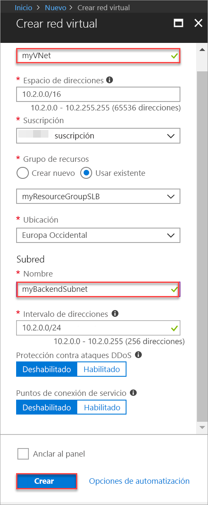
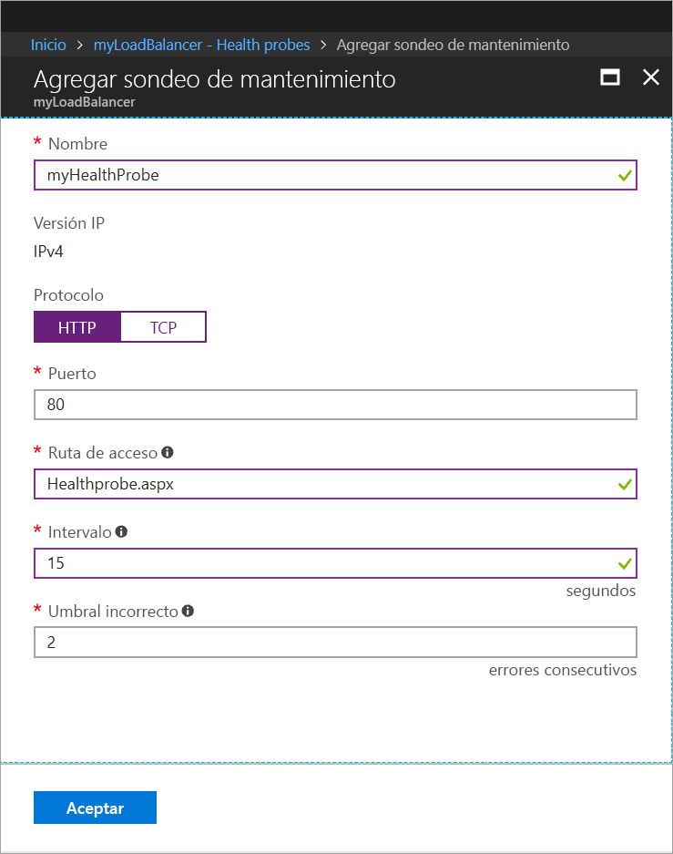
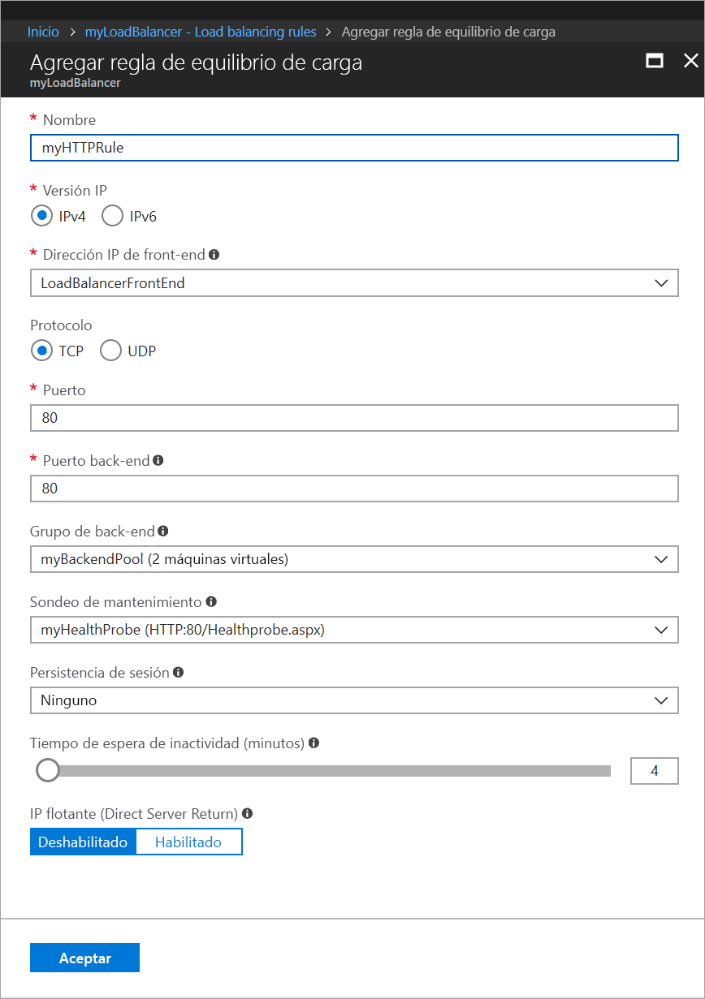
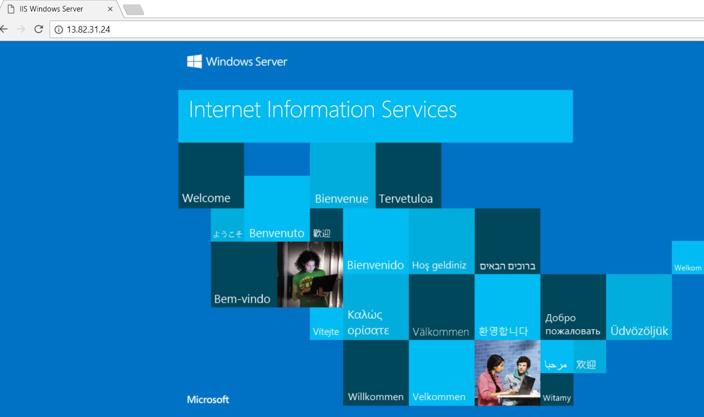

# Inicio rápido: Cree mediante Azure Portal una instancia de Load Balancer Estándar para equilibrar la carga de máquinas virtuales

El equilibrio de carga proporciona un mayor nivel de disponibilidad y escala, ya que distribuye las solicitudes entrantes entre varias máquinas virtuales. Puede usar Azure Portal para crear un equilibrador de carga para las máquinas virtuales (VM). En este tutorial rápido se muestra cómo equilibrar la carga de máquinas virtuales mediante Load Balancer Estándar.

Si no tiene una suscripción a Azure, cree una [cuenta gratuita](https://azure.microsoft.com/free/?WT.mc_id=A261C142F) antes de empezar. 

## Inicio de sesión en Azure

Inicie sesión en Azure Portal en [http://portal.azure.com](http://portal.azure.com).

## Creación de un equilibrador de carga público

En esta sección, se crea un equilibrador de carga público que ayuda a equilibrar la carga de las máquinas virtuales. La versión Estándar de Load Balancer solo admite direcciones IP públicas estándar. Cuando se crea una instancia de Load Balancer Estándar, también se debe crear una nueva dirección IP pública estándar que se configura como front-end (denominado *LoadBalancerFrontend* de forma predeterminada) para dicha instancia. 

1. En la parte superior izquierda de la pantalla, haga clic en **Crear un recurso** > **Redes** > **Azure Load Balancer**.
2. En la pestaña **Datos básicos** de la página **Crear equilibrador de carga**, escriba o seleccione la siguiente información, acepte los valores predeterminados del resto de la configuración y, luego, seleccione **Revisar y crear**:

    | Configuración                 | Valor                                              |
    | ---                     | ---                                                |
    | Subscription               | Seleccione su suscripción.    |    
    | Grupos de recursos         | Seleccione **Crear nuevo** y escriba *MyResourceGroupSLB* en el cuadro de texto.|
    | NOMBRE                   | *myLoadBalancer*                                   |
    | Region         | Seleccione **Europa Occidental**.                                        |
    | Type          | Seleccione **Público**.                                        |
    | SKU           | Seleccione **Estándar**.                          |
    | Dirección IP pública | Seleccione **Crear nuevo**. |
    | Nombre de la dirección IP pública              | Escriba *myPublicIP* en el cuadro de texto.   |
    |Zona de disponibilidad| Seleccione **Redundancia de zona**.    |
3. En la pestaña **Revisar y crear**, haga clic en **Crear**.   

## Creación de servidores back-end

En esta sección, se crea una red virtual, luego dos máquinas virtuales para el grupo de back-end de la instancia de Load Balancer y, finalmente, se instala IIS en las máquinas virtuales para ayudar a probar el equilibrador de carga.

### Creación de una red virtual
1. En la parte superior izquierda de la pantalla, haga clic en **Nuevo** > **Redes** > **Red virtual** y especifique estos valores para la red virtual:
    - *myVNet*: como nombre de la red virtual.
    - *myResourceGroupSLB*: como nombre del grupo de recursos existente.
    - *myAGSubnet*: como nombre de la subred.
2. Haga clic en **Crear** para crear la red virtual.

    

### Creación de máquinas virtuales

1. En la parte superior izquierda de la pantalla, haga clic en **Nuevo** > **Proceso** > **Windows Server 2016 Datacenter** y especifique estos valores para la máquina virtual:
    - *myVM1*: como el nombre de la máquina virtual.        
    - *myResourceGroupSLB*: como **grupo de recursos**. Seleccione **Usar existente** y, después, seleccione *myResourceGroupSLB*.
2. Haga clic en **OK**.
3. Seleccione **DS1_V2** como tamaño de la máquina virtual y haga clic en **Seleccionar**.
4. Especifique estos valores para la configuración de la máquina virtual:
    1. Asegúrese de que *myVNet* está seleccionada como red virtual y que se selecciona *myBackendSubnet* como la subred.
    2. Como **Dirección IP pública**, en el panel **Crear dirección IP pública**, seleccione **Estándar** y, finalmente, seleccione **Aceptar**.
    3. Como **Grupo de seguridad de red**, seleccione **Avanzado**, y, a continuación, haga lo siguiente:
        1. Seleccione *Grupo de seguridad de red (firewall) y en la página **Elegir grupo de seguridad de red**, seleccione **Crear nuevo**. 
        2. En la página **Crear grupo de seguridad de red**, en **Nombre**, escriba *myNetworkSecurityGroup* y, a continuación, seleccione **Aceptar**.
5. Haga clic en **Deshabilitado** para deshabilitar los diagnósticos de arranque.
6. Haga clic en **Aceptar**, revise la configuración en la página de resumen y haga clic en **Crear**.
7. Siga los pasos 1 a 6 para crear otra máquina virtual llamada *VM2* con *myVnet* como red virtual, *myBackendSubnet* como su subred y **myNetworkSecurityGroup* como su grupo de seguridad de red. 

### Creación de la regla de grupo de seguridad de red

En esta sección, va a crear una regla de grupo de seguridad de red para permitir conexiones entrantes que usen HTTP.

1. Haga clic en **Todos los recursos** en el menú de la izquierda y, después, en la lista de recursos haga clic en **myNetworkSecurityGroup**, que se encuentra en el grupo de recursos **myResourceGroupSLB**.
2. En **Configuración**, haga clic en **Reglas de seguridad de entrada** y, después, en **Agregar**.
3. Especifique estos valores para la regla de seguridad de entrada llamada *myHTTPRule* para permitir que las conexiones HTTP entrantes usen el puerto 80:
    - *Etiqueta de servicio*: en **Origen**.
    - *Internet*: en **Etiqueta de servicio de origen**
    - *80*: en **Intervalos de puerto de destino**
    - *TCP*: en **Protocolo**
    - *Permitir*: en **Acción**
    - *100* en **Prioridad**
    - *myHTTPRule* como nombre
    - *Permitir HTTP*: como descripción
4. Haga clic en **OK**.
 
### Instalación de IIS

1. Haga clic en **Todos los recursos** en el menú de la izquierda y, después, en la lista de recursos haga clic en **myVM1**, que se encuentra en el grupo de recursos *myResourceGroupLB*.
2. En la página **Información general**, haga clic en **Conectar** a RDP en la máquina virtual.
3. Inicie sesión en la máquina virtual con el nombre de usuario *azureuser*.
4. En el escritorio del servidor, vaya a **Herramientas administrativas de Windows**>**Administrador del servidor** .
5. En Administrador del servidor, haga clic en **Agregar roles y características**.
6. En el **Asistente para agregar roles y características**, use los siguientes valores:
    - En la página **Tipo de instalación**, haga clic en **Instalación basada en características o en roles**.
    - En la página **Seleccionar servidor de destino **, haga clic en** myVM1**.
    - En la página **Seleccionar rol de servidor**, haga clic en **Servidor web (IIS)**.
    - Siga las instrucciones para completar el resto del asistente 
7. Repita los pasos 1 a 6 para la máquina virtual *myVM2*.

## Creación de recursos del equilibrador de carga

En esta sección, va a configurar el equilibrador de carga para un grupo de direcciones de back-end y un sondeo de mantenimiento, y a especificar una regla de un equilibrador de carga.

### Creación de un grupo de direcciones de back-end

Para distribuir el tráfico a las máquinas virtuales, un grupo de direcciones de back-end contiene las direcciones IP de las tarjetas de interfaz de red (NIC) virtuales conectadas al equilibrador de carga. Cree el grupo de direcciones de back-end *myBackendPool* para incluir *VM1* y *VM2*.

1. Haga clic en **Todos los recursos** en el menú de la izquierda y, después, haga clic en **myLoadBalancer** en la lista de recursos.
2. En **Configuración**, haga clic en **Grupos de back-end** y luego en **Agregar**.
3. En la página **Agregar grupo back-end**, realice lo siguiente:
   - En el nombre, escriba *myBackEndPool* como nombre del grupo de servidores back-end.
   - Como **Red virtual**, seleccione *myVNet*.
   - Agregue *myVM1* y *myVM2* en **Máquina virtual** junto con sus direcciones IP correspondientes y, a continuación, seleccione **Agregar**.
    - Haga clic en **OK**.

3. Asegúrese de que la configuración de grupo back-end del equilibrador de carga muestra las dos máquinas virtuales, **VM1** y **VM2**.

### Creación de un sondeo de estado

Para permitir que el equilibrador de carga supervise el estado de la aplicación, utilice un sondeo de estado. El sondeo de estado agrega o quita de forma dinámica las máquinas virtuales de la rotación del equilibrador de carga en base a su respuesta a las comprobaciones de estado. Cree un sondeo de estado, *myHealthProbe*, para supervisar el estado de las máquinas virtuales.

1. Haga clic en **Todos los recursos** en el menú de la izquierda y, después, haga clic en **myLoadBalancer** en la lista de recursos.
2. En **Configuración**, haga clic en **Sondeos de estado** y luego en **Agregar**.
3. Use estos valores para crear el sondeo de estado:
    - *myHealthProbe*: como nombre del sondeo de estado.
    - **HTTP**: en tipo de protocolo.
    - *80*: en número de puerto.
    - *Healthprobe.aspx* para la ruta de acceso del URI. Puede reemplazar este valor por cualquier otro identificador URI o mantener el valor de ruta de acceso predeterminado de **"\\"** para obtener el URI predeterminado.
    - *15*: como número de **Intervalo**, en segundos, entre los intentos de sondeo.
    - *2*: como número de **Umbral incorrecto** o errores de sondeo consecutivos que deben producirse para que una máquina virtual se considere que no funciona de manera incorrecta.
4. Haga clic en **Aceptar**.

   

### Creación de una regla de equilibrador de carga

Las reglas de equilibrador de carga se utilizan para definir cómo se distribuye el tráfico a las máquinas virtuales. Defina la configuración de la IP de front-end para el tráfico entrante y el grupo de IP de back-end para el tráfico entrante, junto con los puertos de origen y destino requeridos. Cree una regla de Load Balancer *myLoadBalancerRuleWeb* para escuchar el puerto 80 en el front-end *FrontendLoadBalancer* y enviar tráfico de red con equilibrio de carga al conjunto de direcciones back-end, *myBackEndPool*, que también usan el puerto 80. 

1. Haga clic en **Todos los recursos** en el menú de la izquierda y, después, haga clic en **myLoadBalancer** en la lista de recursos.
2. En **Configuración**, haga clic en **Reglas de equilibrio de carga** y luego en **Agregar**.
3. Use estos valores para configurar la regla de equilibrio de carga:
    - *myHTTPRule*: como nombre de la regla de equilibrio de carga.
    - **TCP**: en tipo de protocolo.
    - *80*: en número de puerto.
    - *80*: como puerto de back-end.
    - *myBackendPool*: como nombre del grupo back-end.
    - *myHealthProbe*: como nombre del sondeo de estado.
4. Haga clic en **Aceptar**.
    
    

## Prueba del equilibrador de carga
1. Busque la dirección IP pública de Load Balancer en la pantalla **Información general**. Haga clic en **Todos los recursos** y, después, en **myPublicIP**.

2. Copie la dirección IP pública y péguela en la barra de direcciones del explorador. La página predeterminada del servidor web de IIS se muestra en el explorador.

      

## Limpieza de recursos

Cuando no los necesite, elimine el grupo de recursos, el equilibrador de carga y todos los recursos relacionados. Para ello, seleccione el grupo de recursos que contiene el equilibrador de carga y haga clic en **Eliminar**.

## Pasos siguientes

En esta guía de inicio rápido, ha creado un equilibrador de carga estándar, le ha asociado máquinas virtuales, ha configurado la regla de tráfico del equilibrador de carga y el sondeo de estado y, después, ha probado el equilibrador de carga. Para más información acerca de Azure Load Balancer, diríjase a los tutoriales de Azure Load Balancer.

> [!div class="nextstepaction"]
> [Tutoriales de Azure Load Balancer](tutorial-load-balancer-standard-public-zone-redundant-portal.md)
