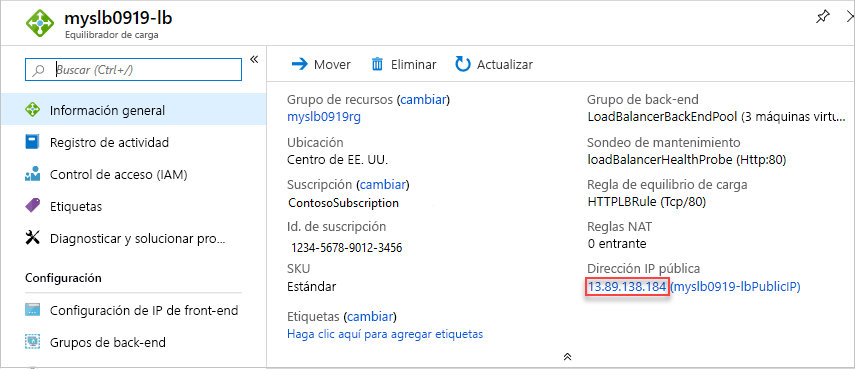

# <a name="quickstart-create-a-load-balancer-to-load-balance-vms-by-using-azure-resource-manager-template"></a>Inicio rápido: Creación de una instancia de Load Balancer para equilibrar la carga de máquinas virtuales mediante una plantilla de Azure Resource Manager

El equilibrio de carga proporciona un mayor nivel de disponibilidad y escala, ya que distribuye las solicitudes entrantes entre varias máquinas virtuales. En esta guía de inicio rápido se le muestra cómo implementar una plantilla de Azure Resource Manager que crea una instancia de Standard Load Balancer para cargar máquinas virtuales de equilibrio de carga. El uso de una plantilla de Resource Manager requiere menos pasos que otros métodos de implementación.

La [plantilla de Resource Manager](../azure-resource-manager/templates/overview.md) es un archivo JSON (notación de objetos JavaScript) que contiene la infraestructura y la configuración del proyecto. La plantilla usa sintaxis declarativa, lo que permite establecer lo que pretende implementar sin tener que escribir la secuencia de comandos de programación para crearla. Si desea más información sobre el desarrollo de plantillas de Resource Manager, consulte la [documentación de Resource Manager](/azure/azure-resource-manager/) y la [referencia de la plantilla](/azure/templates/microsoft.network/loadbalancers).

Si no tiene una suscripción a Azure, cree una [cuenta gratuita](https://azure.microsoft.com/free/?WT.mc_id=A261C142F) antes de empezar.

## <a name="create-a-load-balancer"></a>Creación de una instancia de Load Balancer

Load Balancer y las SKU de IP públicas deben coincidir. Cuando se crea una instancia de Standard Load Balancer, también se debe crear una nueva dirección IP pública estándar que se configura como front-end para dicha instancia. Si desea crear una instancia de Load Balancer Básico, use [esta plantilla](https://azure.microsoft.com/resources/templates/201-2-vms-loadbalancer-natrules/). Microsoft recomienda usar la SKU estándar para cargas de trabajo de producción.

La plantilla que se usa en este inicio rápido es una [plantilla de inicio rápido](https://raw.githubusercontent.com/Azure/azure-quickstart-templates/master/101-load-balancer-standard-create/azuredeploy.json).

[!code-json[<Azure Resource Manager template create standard load balancer>](~/quickstart-templates/101-load-balancer-standard-create/azuredeploy.json)]

En la plantilla se han definido varios recursos de Azure:

- **Microsoft.Network/loadBalancers**
- **Microsoft.Network/publicIPAddresses**: para el equilibrador de carga.
- **Microsoft.Network/networkSecurityGroups**
- **Microsoft.Network/virtualNetworks**
- **Microsoft.Compute/virtualMachines** (3 de ellas)
- **Microsoft.Network/publicIPAddresses** (3 de ellas): para cada una de las tres máquinas virtuales.
- **Microsoft.Network/networkInterfaces** (3 de ellas)
- **Microsoft.Compute/virtualMachine/extensions** (3 de ellas): se usa para configurar IIS y las páginas web

Para encontrar más plantillas relacionadas con Azure Load Balancer, consulte [Plantillas de inicio rápido de Azure](https://azure.microsoft.com/resources/templates/?resourceType=Microsoft.Network&pageNumber=1&sort=Popular).

1. Seleccione **Try It** (Probarlo) en el bloque de código siguiente para abrir Azure Cloud Shell y siga las instrucciones para iniciar sesión en Azure.

   ```azurepowershell-interactive
   $projectName = Read-Host -Prompt "Enter a project name with 12 or less letters or numbers that is used to generate Azure resource names"
   $location = Read-Host -Prompt "Enter the location (i.e. centralus)"
   $adminUserName = Read-Host -Prompt "Enter the virtual machine administrator account name"
   $adminPassword = Read-Host -Prompt "Enter the virtual machine administrator password" -AsSecureString

   $resourceGroupName = "${projectName}rg"
   $templateUri = "https://raw.githubusercontent.com/Azure/azure-quickstart-templates/master/101-load-balancer-standard-create/azuredeploy.json"

   New-AzResourceGroup -Name $resourceGroupName -Location $location
   New-AzResourceGroupDeployment -ResourceGroupName $resourceGroupName -TemplateUri $templateUri -projectName $projectName -location $location -adminUsername $adminUsername -adminPassword $adminPassword

   Write-Host "Press [ENTER] to continue."
   ```

   Espere hasta que vea el aviso de la consola.

1. Seleccione **Copiar** en el bloque de código anterior para copiar el script de PowerShell.

1. Haga clic con el botón derecho en el panel de consola del shell y, a continuación, seleccione **Pegar**.

1. Escriba los valores.

   La implementación de plantilla crea tres zonas de disponibilidad. Las zonas de disponibilidad se admiten solo en [determinadas regiones](../availability-zones/az-overview.md). Use alguna de las regiones admitidas. Si no está seguro, escriba **centralus**.

   El nombre del grupo de recursos es el nombre del proyecto con **rg** anexado. Necesitará el nombre del grupo de recursos en la sección siguiente.

Tardará unos 10 minutos en implementar la plantilla. Al finalizar, la salida es parecida a esta:


Azure PowerShell se usa para implementar la plantilla. Además de Azure PowerShell, también puede usar Azure Portal, la CLI de Azure y API REST. Para obtener información sobre otros métodos de implementación, consulte [Implementación de plantillas](../azure-resource-manager/templates/deploy-portal.md).

## <a name="test-the-load-balancer"></a>Prueba del equilibrador de carga

1. Inicie sesión en [Azure Portal](https://portal.azure.com).

1. Seleccione **Grupos de recursos** en el panel izquierdo.

1. Seleccione el grupo de recursos que creó en la sección anterior. El nombre del grupo de recursos predeterminado es el nombre del proyecto con **rg** anexado.

1. Seleccione el equilibrador de carga. Su nombre predeterminado es el nombre del proyecto con **-lb** anexado.

1. Copie solo la parte de la dirección IP pública y, luego, péguela en la barra de direcciones del explorador.

   

    El explorador muestra la página predeterminada del servidor web de Internet Information Services (IIS).

   

Para ver cómo Load Balancer distribuye el tráfico entre las tres máquinas virtuales, puede forzar una actualización del explorador web desde la máquina cliente.

## <a name="clean-up-resources"></a>Limpieza de recursos

Cuando no los necesite, elimine el grupo de recursos, el equilibrador de carga y todos los recursos relacionados. Para ello, vaya a Azure Portal, seleccione el grupo de recursos que contiene el equilibrador de carga y, luego, seleccione **Eliminar grupo de recursos**.

## <a name="next-steps"></a>Pasos siguientes

En esta guía de inicio rápido, ha creado una instancia de Standard Load Balancer, le ha asociado máquinas virtuales, ha configurado la regla de tráfico de Load Balancer, ha realizado un sondeo de estado y, después, ha probado la instancia de Load Balancer.

Para más información, continúe con los tutoriales para Load Balancer.

> [!div class="nextstepaction"]
> [Tutoriales de Azure Load Balancer](tutorial-load-balancer-standard-public-zone-redundant-portal.md)
