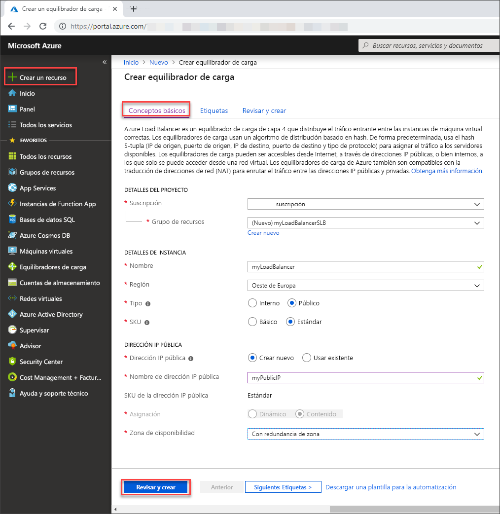

# <a name="tutorial-load-balance-internet-traffic-to-vms-using-the-azure-portal"></a>Tutorial: Equilibrio de carga del tráfico de Internet en máquinas virtuales mediante Azure Portal

El equilibrio de carga proporciona un mayor nivel de disponibilidad y escala, ya que distribuye las solicitudes entrantes entre varias máquinas virtuales. En este tutorial, conocerá los distintos componentes de Azure Standard Load Balancer que distribuyen el tráfico de Internet a máquinas virtuales y proporcionan una alta disponibilidad. Aprenderá a:


> [!div class="checklist"]
> * Crear una instancia de Azure Load Balancer
> * Crear recursos de Load Balancer
> * Crear máquinas virtuales e instalar el servidor IIS
> * Visualizar una instancia de Load Balancer en acción
> * Agregar y quitar máquinas virtuales de una instancia de Load Balancer

Si no tiene una suscripción a Azure, cree una [cuenta gratuita](https://azure.microsoft.com/free/?WT.mc_id=A261C142F) antes de empezar. 

## <a name="sign-in-to-the-azure-portal"></a>Inicio de sesión en Azure Portal

Inicie sesión en Azure Portal en [https://portal.azure.com](https://portal.azure.com).

## <a name="create-a-standard-load-balancer"></a>Crear un equilibrador de carga estándar

En esta sección, se crea una instancia de Standard Load Balancer que ayuda a equilibrar la carga de las máquinas virtuales. La versión Estándar de Load Balancer solo admite direcciones IP públicas estándar. Cuando se crea una instancia de Standard Load Balancer, también se debe crear una nueva dirección IP pública estándar que se configura como front-end (denominado *LoadBalancerFrontend* de forma predeterminada) para dicha instancia. 

1. En la parte superior izquierda de la pantalla, haga clic en **Crear un recurso** > **Redes** > **Azure Load Balancer**.
2. En la pestaña **Datos básicos** de la página **Crear equilibrador de carga**, escriba o seleccione la siguiente información, acepte los valores predeterminados del resto de la configuración y, luego, seleccione **Revisar y crear**:

    | Configuración                 | Value                                              |
    | ---                     | ---                                                |
    | Subscription               | Seleccione su suscripción.    |    
    | Resource group         | Seleccione **Crear nuevo** y escriba *MyResourceGroupSLB* en el cuadro de texto.|
    | Nombre                   | *myLoadBalancer*                                   |
    | Region         | Seleccione **Oeste de Europa**.                                        |
    | Tipo          | Seleccione **Público**.                                        |
    | SKU           | Seleccione **Estándar**.                          |
    | Dirección IP pública | Seleccione **Crear nuevo**. |
    | Nombre de la dirección IP pública              | Escriba *myPublicIP* en el cuadro de texto.   |
    |Zona de disponibilidad| Seleccione **Redundancia de zona**.    |

3. En la pestaña **Revisar y crear**, haga clic en **Crear**.

   

## <a name="create-load-balancer-resources"></a>Crear recursos de Load Balancer

En esta sección se configura Load Balancer para un grupo de direcciones de back-end y un sondeo de estado, y se especifica una regla del equilibrador de carga.

### <a name="create-a-backend-address-pool"></a>Creación de un grupo de direcciones de back-end

Para distribuir el tráfico a las máquinas virtuales, un grupo de direcciones de back-end contiene las direcciones IP de las tarjetas de interfaz de red (NIC) virtuales conectadas a Load Balancer. Cree el grupo de direcciones de back-end *myBackendPool* para incluir máquinas virtuales para el tráfico de Internet de equilibrio de carga.

1. Seleccione **Todos los servicios** en el menú de la izquierda, **Todos los recursos** y, después, en la lista de recursos, **myLoadBalancer**.
2. En **Configuración**, haga clic en **Grupos de back-end** y luego en **Agregar**.
3. En la página **Agregar un grupo back-end**, en nombre, escriba *myBackEndPool*, como el nombre del grupo de back-end y, a continuación, seleccione **Aceptar**.

### <a name="create-a-health-probe"></a>Creación de un sondeo de estado

Para permitir que Load Balancer supervise el estado de la aplicación, utilice un sondeo de estado. El sondeo de estado agrega o quita de forma dinámica las máquinas virtuales de la rotación de Load Balancer en base a su respuesta a las comprobaciones de estado. Cree un sondeo de estado, *myHealthProbe*, para supervisar el estado de las máquinas virtuales.

1. Seleccione **Todos los servicios** en el menú de la izquierda, **Todos los recursos** y, después, en la lista de recursos, **myLoadBalancer**.
2. En **Configuración**, haga clic en **Sondeos de estado** y luego en **Agregar**.
3. Use estos valores para crear el sondeo de estado:
     
    | Configuración | Value |
    | ------- | ----- |
    | Nombre | Escriba *myHealthProbe*. |
    | Protocolo | Seleccione **HTTP**. |
    | Port | Escriba *80*.|
    | Intervalo | Escriba *15* como número de **Intervalo**, en segundos, entre los intentos de sondeo. |
    | Umbral incorrecto | Seleccione *2* como número de **Umbral incorrecto** o errores de sondeo consecutivos que deben producirse para que una máquina virtual se considere que no funciona de manera correcta.|
    
4. Seleccione **Aceptar**.

### <a name="create-a-load-balancer-rule"></a>Creación de una regla de Load Balancer

Las reglas de Load Balancer se utilizan para definir cómo se distribuye el tráfico a las máquinas virtuales. Defina la configuración de la IP de front-end para el tráfico entrante y el grupo de IP de back-end para el tráfico entrante, junto con los puertos de origen y destino requeridos. Cree una regla de Load Balancer *myLoadBalancerRuleWeb* para escuchar el puerto 80 en el front-end *FrontendLoadBalancer* y enviar tráfico de red con equilibrio de carga al conjunto de direcciones back-end, *myBackEndPool*, que también usan el puerto 80.

1. Seleccione **Todos los servicios** en el menú de la izquierda, **Todos los recursos** y, después, en la lista de recursos, **myLoadBalancer**.
2. En **Configuración**, haga clic en **Reglas de equilibrio de carga** y luego en **Agregar**.
3. Use estos valores para configurar la regla de equilibrio de carga:

    | Configuración | Value |
    | ------- | ----- |
    | Nombre | Escriba *myHTTPRule*. |
    | Protocolo | seleccione **TCP**. |
    | Port | Escriba *80*.|
    | Puerto back-end | Escriba *80*. |
    | Grupo back-end | Seleccione *MyBackendPool*.|
    | Sondeo de mantenimiento | Seleccione *myHealthProbe*. |
    
4. Deje el resto de valores predeterminados y seleccione **Aceptar**.

## <a name="create-backend-servers"></a>Creación de servidores back-end

En esta sección, se crea una red virtual, luego tres máquinas virtuales para el grupo de back-end de la instancia de Load Balancer y, finalmente, se instala IIS en las máquinas virtuales para ayudar a probar el equilibrador de carga.

## <a name="virtual-network-and-parameters"></a>Red virtual y parámetros

En los pasos de esta sección, tendrá que reemplazar los siguientes parámetros por la siguiente información:

| Parámetro                   | Value                |
|-----------------------------|----------------------|
| **\<nombre-de-grupo-recursos>**  | myResourceGroupSLB (seleccione el grupo de recursos existente) |
| **\<nombre-de-red-virtual>** | myVNet          |
| **\<nombre-de-región>**          | Oeste de Europa      |
| **\<espacio-de-direcciones-IPv4>**   | 10.1.0.0\16          |
| **\<nombre-de-subred>**          | mySubnet        |
| **\<intervalo-de-direcciones-de-subred>** | 10.1.0.0\24          |

[!INCLUDE [virtual-networks-create-new](../../includes/virtual-networks-create-new.md)]

### <a name="create-virtual-machines"></a>Creación de máquinas virtuales

La instancia de Standard Load Balancer solo admite las máquinas virtuales con direcciones IP estándar en el grupo de back-end. En esta sección, creará tres máquinas virtuales (*myVM1*, *myVM2* y *myVM3*) con una dirección IP pública estándar en tres zonas diferentes (*Zona 1*, *Zona 2* y *Zona 3*) que se agregan al grupo de back-end de la instancia de Standard Load Balancer que se creó anteriormente.

1. En la parte superior izquierda del portal, seleccione **Crear un recurso** > **Proceso** > **Windows Server 2016 Datacenter**. 
   
1. En **Crear una máquina virtual**, escriba o seleccione los valores siguientes en la pestaña **Básico**:
   - **Suscripción** > **Grupo de recursos**: Seleccione **myResourceGroupSLB**.
   - **Detalles de instancia** > **Nombre de máquina virtual**: Escriba *myVM1*.
   - **Detalles de instancia** > **Región** > seleccione **Oeste de Europa**.
   - **Detalles de instancia** > **Opciones de disponibilidad** > seleccione **Zonas de disponibilidad**. 
   - **Detalles de instancia** > **Zona de disponibilidad** > seleccione **1**.
  
1. Seleccione la pestaña **Redes** o seleccione **Siguiente: Discos** y, después, **Siguiente: Redes**. 
   
   - Asegúrese de que está seleccionado lo siguiente:
       - **Red virtual**: **myVnet**
       - **Subred**: **MyBackendSubnet**
       - **Dirección IP** > seleccione **Crear nuevo** y en la ventana **Crer dirección IP pública**; para **SKU**, seleccione **Estándar** y para **Zona de disponibilidad**, seleccione **Con redundancia de zona**.
      
   - Para crear un nuevo grupo de seguridad de red (NSG), un tipo de firewall, en **Grupo de seguridad de red**, seleccione **Avanzado**. 
       1. En el campo **Configurar grupo de seguridad de red**, seleccione **Crear nuevo**. 
       1. Escriba *MyNetworkSecurityGroup* y seleccione **Aceptar**.

   - Para que la máquina virtual forme parte del grupo de back-end de Load Balancer, complete los siguientes pasos:
        - En **Equilibrio de carga**, en **Place this virtual machine behind an existing load balancing solution?** (¿Colocar esta máquina virtual detrás de una solución de equilibrio de carga existente?), seleccione **Sí**.
        - En **Configuración de equilibrio de carga**, en **Opciones de equilibrio de carga**, seleccione **Azure Load Balancer**.
        - En **Seleccionar un equilibrador de carga**, *myLoadBalancer*. 
1. Seleccione la pestaña **Administración** o seleccione **Siguiente** > **Administración**. En **Supervisión**, establezca **Diagnósticos de arranque** en **Desactivado**. 
1. Seleccione **Revisar + crear**.   
1. Revise la configuración y, a continuación, seleccione **Crear**.
1. Siga los pasos para crear dos máquinas virtuales adicionales, *myVM2* y *myVM3*, con una dirección IP pública de SKU estándar en **zona de disponibilidad** de **2** y **3**, respectivamente, y todos los demás valores iguales que *myVM1*.  

### <a name="create-network-security-group-rule"></a>Creación de una regla de grupo de seguridad de red

En esta sección, va a crear una regla de grupo de seguridad de red para permitir conexiones entrantes que usen HTTP.

1. Seleccione **Todos los servicios** en el menú de la izquierda, seleccione **Todos los recursos** y, después, en la lista de recursos, haga clic en **myNetworkSecurityGroup**, que se encuentra en el grupo de recursos **myResourceGroupSLB**.
2. En **Configuración**, haga clic en **Reglas de seguridad de entrada** y, después, en **Agregar**.
3. Especifique estos valores para la regla de seguridad de entrada llamada *myHTTPRule* para permitir que las conexiones HTTP entrantes usen el puerto 80:
    - *Etiqueta de servicio*: en **Origen**.
    - *Internet*: en **Etiqueta de servicio de origen**
    - *80*: en **Intervalos de puerto de destino**
    - *TCP*: en **Protocolo**
    - *Permitir*: en **Acción**
    - *100* en **Prioridad**
    - *myHTTPRule* como nombre
    - *Permitir HTTP*: como descripción
4. Seleccione **Agregar**.

### <a name="install-iis-on-vms"></a>Instalación de IIS en las máquinas virtuales

1. Seleccione **Todos los servicios** en el menú de la izquierda, seleccione **Todos los recursos** y, después, en la lista de recursos, haga clic en **myVM1**, que se encuentra en el grupo de recursos *myResourceGroupSLB*.
2. En la página **Información general**, haga clic en **Conectar** a RDP en la máquina virtual.
3. En la ventana emergente **Conectarse a una máquina virtual**, seleccione **Descargar archivo RDP** y, a continuación, abra el archivo RDP descargado.
4. En la ventana **Conexión a Escritorio remoto**, haga clic en **Conectar**.
5. Inicie sesión en la máquina virtual con las credenciales que proporcionó durante la creación de esta máquina virtual. Esto inicia una sesión de escritorio remoto con la máquina virtual *myVM1*.
6. En el escritorio del servidor, vaya a **Herramientas administrativas de Windows**>**Windows PowerShell**.
7. En la ventana de PowerShell, ejecute los comandos siguientes para instalar el servidor IIS, eliminar el archivo iisstart.htm predeterminado y agregar uno nuevo que muestre el nombre de la máquina virtual:

   ```azurepowershell-interactive
    
    # install IIS server role
    Install-WindowsFeature -name Web-Server -IncludeManagementTools
    
    # remove default htm file
     remove-item  C:\inetpub\wwwroot\iisstart.htm
    
    # Add a new htm file that displays server name
     Add-Content -Path "C:\inetpub\wwwroot\iisstart.htm" -Value $("Hello World from " + $env:computername)
   ```
6. Cierre la sesión de RDP con *myVM1*.
7. Repita los pasos 1 a 6 para instalar IIS y el archivo iisstart.htm actualizado en *myVM2* y *myVM3*.

## <a name="test-the-load-balancer"></a>Prueba de la instancia de Load Balancer
1. Busque la dirección IP pública de Load Balancer en la pantalla **Información general**. Seleccione **Todos los servicios** en el menú de la izquierda, seleccione **Todos los recursos** y, después, haga clic en **myPublicIP**.

2. Copie la dirección IP pública y péguela en la barra de direcciones del explorador. La página predeterminada del servidor web de IIS se muestra en el explorador.

      

Para ver cómo distribuye la instancia de Load Balancer el tráfico entre las tres máquinas virtuales que ejecutan la aplicación, puede realizar una actualización forzada del explorador web.

## <a name="remove-or-add-vms-from-the-backend-pool"></a>Eliminación o incorporación de máquinas virtuales del grupo de back-end
Puede que tenga que realizar labores de mantenimiento de las máquinas virtuales que ejecutan la aplicación, como la instalación de actualizaciones del sistema operativo. Para gestionar un aumento de tráfico a la aplicación, tiene que agregar más máquinas virtuales. Esta sección le muestra cómo quitar o agregar una máquina virtual (*myVM1*) desde Load Balancer.

### <a name="remove-vm-from-a-backend-pool"></a>Retirada de máquina virtual de un grupo de back-end
Para quitar *myVM1* del grupo de back-end, realice los pasos siguientes:

1. Seleccione **Todos los servicios** en el menú de la izquierda, **Todos los recursos** y, después, en la lista de recursos, **myLoadBalancer**.
2. En **Configuración**, haga clic en **Grupos de back-end** y, a continuación, en la lista del grupo de back-end, haga clic en **myBackendPool**.
3. En la página **myBackendPool**, para quitar *VM1*, seleccione el icono de eliminación al final de la fila que muestra *myVM1* y, luego, haga clic en **Guardar**.

Una vez quitada *myVM1* del grupo de direcciones de back-end, puede realizar cualquier tarea de mantenimiento en *myVM1* como, por ejemplo, la instalación de actualizaciones de software. En ausencia de *VM1*, la carga se equilibra ahora entre *myVM2* y *myVM3*. 

### <a name="add-vm-to-a-backend-pool"></a>Adición de VM a un grupo de back-end
Para agregar *myVM1* al grupo de back-end, realice los pasos siguientes:

1. Seleccione **Todos los servicios** en el menú de la izquierda, **Todos los recursos** y, después, en la lista de recursos, **myVM1**.
2. En la página **VM1**, en **Configuración**, seleccione **Redes**.
3. En la página **Redes**, seleccione la pestaña **Equilibrio de carga** y, a continuación, seleccione **Agregar equilibrio de carga**.
4. En la página **Agregar equilibrio de carga**, realice lo siguiente:
   1. En **Opciones de equilibrio de carga**, seleccione **Azure Load Balancer**.
   2. En **Seleccionar un equilibrador de carga**, seleccione *myLoadBalancer*.
   3. Para **Select a backend pool** (Seleccionar un grupo de back-end), seleccione *MyBackendPool*. 

## <a name="clean-up-resources"></a>Limpieza de recursos

Cuando ya no los necesite, elimine el grupo de recursos, el equilibrador de carga y todos los recursos relacionados. Para ello, seleccione el grupo de recursos *myResouceGroupSLB* que contiene la instancia de Load Balancer y, a continuación, seleccione **Eliminar**.

## <a name="next-steps"></a>Pasos siguientes

En este tutorial, ha creado una instancia de Standard Load Balancer, le ha asociado máquinas virtuales, ha configurado la regla de tráfico de Load Balancer y el sondeo de mantenimiento y, después, ha probado la instancia de Load Balancer. Además, ha quitado una máquina virtual del conjunto de carga equilibrada y la ha agregado de vuelta al grupo de direcciones back-end. Para más información acerca de Azure Load Balancer, diríjase a los tutoriales correspondientes.

> [!div class="nextstepaction"]
> [Tutoriales de Azure Load Balancer](tutorial-load-balancer-standard-public-zone-redundant-portal.md)
