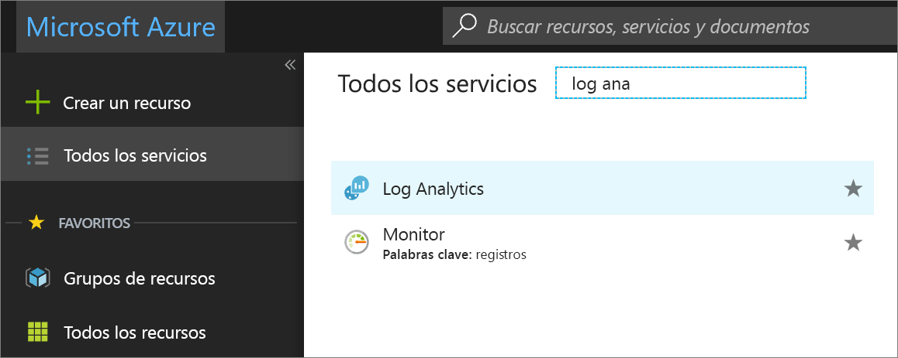

# Creación de un área de trabajo de Log Analytics en Azure Portal
En Azure Portal se puede configurar un área de trabajo de Log Analytics, que es un entorno de Log Analytics único con su propio repositorio de datos, sus propios orígenes de datos y sus propias soluciones.  Los pasos que se describen en este artículo son necesarios si se tiene intención de recopilar datos de los siguientes orígenes:

* Recursos de Azure de la suscripción
* Equipos locales supervisados por System Center Operations Manager
* Colecciones de dispositivos de System Center Configuration Manager 
* Datos de diagnóstico o registro de Azure Storage

Para otros orígenes, como las máquinas virtuales de Azure y la máquinas virtuales Windows o Linux del entorno, consulte los temas siguientes:

*  [Recopilación de datos de máquinas virtuales de Azure](log-analytics-quick-collect-azurevm.md) 
*  [Recopilación de datos de un equipo Linux híbrido](log-analytics-quick-collect-linux-computer.md)
*  [Recopilación de datos de un equipo Windows híbrido](log-analytics-quick-collect-windows-computer.md)

Si no tiene una suscripción a Azure, cree una [cuenta gratuita](https://azure.microsoft.com/free/?WT.mc_id=A261C142F) antes de empezar.

## Inicio de sesión en Azure Portal
Inicie sesión en Azure Portal en [https://portal.azure.com](https://portal.azure.com). 

## Crear un área de trabajo
1. En Azure Portal, haga clic en **Todos los servicios**. En la lista de recursos, escriba **Log Analytics**. Cuando comience a escribir, la lista se filtrará en función de la entrada. Seleccione **Log Analytics**.

    
  
2. Haga clic en **Crear** y, a continuación, seleccione opciones para los elementos siguientes:

  * Proporcione un nombre para la nueva **Área de trabajo de OMS**, como *DefaultLAWorkspace*. 
  * Seleccione una **suscripción** a la que vincularlo en la lista desplegable si la opción predeterminada seleccionada no es adecuada.
  * Como **Grupo de recursos** puede usar un grupo de recursos existente que ya esté configurado, o crear uno nuevo.  
  * Seleccione una **ubicación** disponible.  Para más información, consulte en qué [regiones está disponible Log Analytics](https://azure.microsoft.com/regions/services/).
  * Si va a crear un área de trabajo en una nueva suscripción creada después del 2 de abril de 2018, esta utilizará automáticamente el plan de precios *Por GB* y la opción para seleccionar un plan de tarifas no estará disponible.  Si va a crear un área de trabajo para una suscripción existente creada antes del 2 de abril o para una suscripción asociada a una inscripción de Contrato Enterprise (EA) existente, seleccione el plan de tarifa que prefiera.  Para más información sobre planes concretos, consulte los [detalles de precios de Log Analytics](https://azure.microsoft.com/pricing/details/log-analytics/).

          

3. Después de proporcionar la información necesaria en el panel **Área de trabajo de OMS**, haga clic en **Aceptar**.  

Mientras se comprueba la información y se crea el espacio de trabajo, puede realizar un seguimiento de su progreso en **Notificaciones** en el menú. 

## Pasos siguientes
Ahora que tiene un área de trabajo disponible, puede configurar la recopilación de datos de telemetría de supervisión, realizar búsquedas en el registro para analizar dichos datos y agregar una solución de administración que proporcione datos adicionales e información de los análisis. 

* Para habilitar la recopilación de datos de recursos de Azure con Azure Diagnostics o Azure Storage, consulte [Recopilación de registros y métricas de Azure para servicios de Log Analytics](log-analytics-azure-storage.md).  
* [Agregue System Center Operations Manager como origen de datos](log-analytics-om-agents.md) para recopilar datos de agentes que informan a su grupo de administración de Operations Manager y almacenarlos en el repositorio del área de trabajo de Log Analytics. 
* Conecte [Configuration Manager](log-analytics-sccm.md) para importar equipos que son miembros de colecciones en la jerarquía.  
* Revise las [soluciones de administración](log-analytics-add-solutions.md) disponibles y cómo agregar o quitar una solución del área de trabajo.
