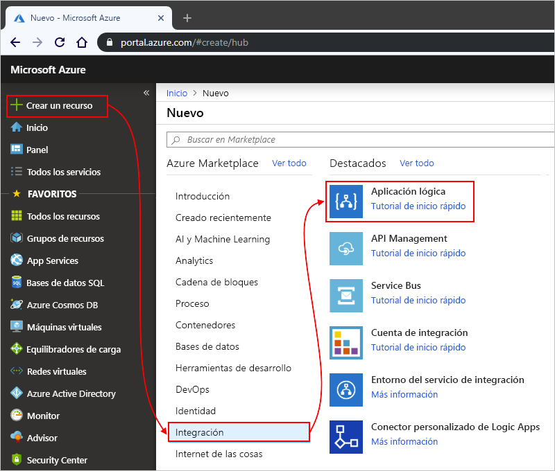
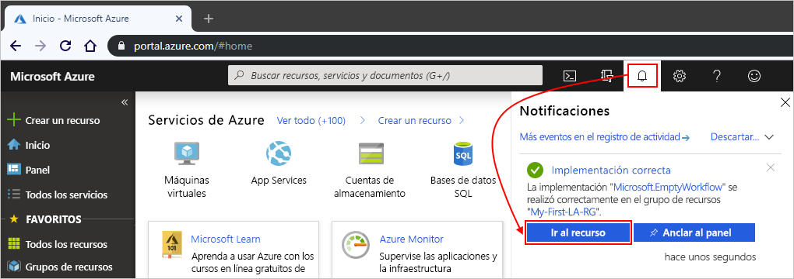
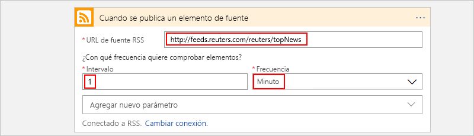
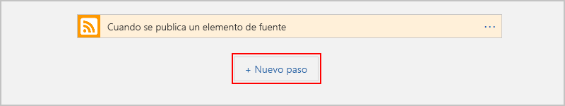

# <a name="quickstart-create-your-first-automated-workflow-with-azure-logic-apps---azure-portal"></a>Inicio rápido: Creación del primer flujo de trabajo automatizado con Azure Logic Apps: Azure Portal

En esta guía de inicio rápido se muestra cómo crear su primer flujo de trabajo automatizado con [Azure Logic Apps](../logic-apps/logic-apps-overview.md). En este artículo, creará una aplicación lógica que comprobará periódicamente la fuente RSS de un sitio web para detectar si se ha publicado nuevo contenido. Si existe algún elemento nuevo, la aplicación lógica envía un correo electrónico por cada elemento. Cuando haya terminado, la aplicación lógica se parecerá a este flujo de trabajo, en un alto nivel:


Para seguir esta guía de inicio rápido, necesita una cuenta de correo electrónico de un proveedor compatible con Logic Apps, como Office 365 Outlook, Outlook.com o Gmail. En el caso de otros proveedores, [consulte la lista de conectores que se muestra aquí](https://docs.microsoft.com/connectors/). Esta aplicación lógica usa una cuenta de Office 365 Outlook. Si usa otra cuenta de correo electrónico, los pasos generales serán los mismos, pero su interfaz de usuario puede ser ligeramente distinta.

Asimismo, si no tiene una suscripción de Azure, [regístrese para obtener una cuenta gratuita de Azure](https://azure.microsoft.com/free/).

## <a name="sign-in-to-the-azure-portal"></a>Inicio de sesión en Azure Portal

Inicie sesión en [Azure Portal](https://portal.azure.com) con sus credenciales de su cuenta de Azure.

## <a name="create-your-logic-app"></a>Creación de una aplicación lógica

1. En el menú principal de Azure, seleccione **Crear un recurso** > **Integración** > **Aplicación lógica**.

   

1. En **Crear aplicación lógica**, proporcione información sobre la aplicación lógica, como se muestra a continuación. Seleccione **Crear** cuando haya terminado.

   

   | Propiedad | Valor | DESCRIPCIÓN |
   |----------|-------|-------------|
   | **Nombre** | <*nombre-de-la-aplicación-lógica*> | El nombre de la aplicación lógica, que solo puede contener letras, números,guiones (`-`), caracteres de subrayado (`_`), paréntesis (`(`,`)`) y puntos (`.`). En este ejemplo se usa "My-First-Logic-App". |
   | **Suscripción** | <*Azure-subscription-name*> | El nombre de la suscripción de Azure |
   | **Grupos de recursos** | <*nombre del grupo de recursos de Azure*> | Nombre del [grupo de recursos de Azure](../azure-resource-manager/resource-group-overview.md) que se utiliza para organizar recursos relacionados. En este ejemplo se usa "My-First-LA-RG". |
   | **Ubicación** | <*Azure-region*> | La región en la que desea almacenar la información de la aplicación lógica. En este ejemplo se utiliza "West US". |
   | **Log Analytics** | Off | Mantenga el valor **Off** para el registro de diagnóstico. |
   ||||

1. Una vez que Azure implemente la aplicación, en la barra de herramientas de Azure, seleccione **Notificaciones** > **Ir al recurso** para la aplicación lógica implementada.

   

   O también puede buscar y seleccionar la aplicación lógica escribiendo el nombre en el cuadro de búsqueda.

   El Diseñador de aplicación lógica se abre y muestra una página con un vídeo de introducción y desencadenadores utilizados frecuentemente. En **Plantillas**, elija **Blank Logic App**.

   

A continuación, añada un [desencadenador](../logic-apps/logic-apps-overview.md#logic-app-concepts) que se active cuando aparezca un nuevo elemento en la fuente RSS. Cada aplicación lógica debe comenzar con un desencadenador, que se activa cuando sucede un evento específico o cuando se cumple una condición determinada. Cada vez que el desencadenador se activa, el motor de Logic Apps crea una instancia de aplicación lógica que inicia y ejecuta el flujo de trabajo.

<a name="add-rss-trigger"></a>

## <a name="check-rss-feed-with-a-trigger"></a>Comprobación de la fuente RSS con un desencadenador

1. En el cuadro de búsqueda del Diseñador de aplicación lógica, seleccione **Todo**.

1. En el cuadro de búsqueda, escriba "rss". En la lista de desencadenadores, seleccione este desencadenador: **Cuando se publica un elemento de fuente (RSS)**

   

1. Proporcione esta información para el desencadenador, como se describe a continuación:

   

   | Propiedad | Valor | DESCRIPCIÓN |
   |----------|-------|-------------|
   | **URL de fuente RSS** | ```http://feeds.reuters.com/reuters/topNews``` | Vínculo de la fuente RSS que desea supervisar |
   | **Intervalo** | 1 | Número de intervalos que se espera entre comprobaciones |
   | **Frecuencia** | Minuto | La unidad de tiempo de cada intervalo entre comprobaciones  |
   ||||

   Juntos, el intervalo y la frecuencia definen la programación para el desencadenador de la aplicación lógica. Esta aplicación lógica comprueba la fuente cada minuto.

1. Para ocultar por ahora los detalles del desencadenador, haga clic dentro de la barra de título del desencadenador.

   

1. Guarde la aplicación lógica. En la barra de herramientas del diseñador, seleccione **Save** (Guardar).

La aplicación lógica estará activa, pero no hace más que comprobar la fuente RSS. Por lo tanto, agregue una acción que responda cuando se active el desencadenador.

## <a name="send-email-with-an-action"></a>Envío de correo electrónico con una acción

Ahora, añada una [acción](../logic-apps/logic-apps-overview.md#logic-app-concepts) para enviar un correo electrónico cuando aparezca un nuevo elemento en la fuente RSS.

1. En el desencadenador **Cuando se publica un elemento de fuente**, elija **Nuevo paso**.

   

1. En **Elegir una acción** y en el cuadro de búsqueda, seleccione **Todas**.

1. En el cuadro de búsqueda, escriba "Enviar un correo electrónico". En la lista de acciones, seleccione la acción "enviar un correo electrónico" del proveedor de correo electrónico que desee.

   

   Para filtrar la lista de acciones de una aplicación o un servicio específicos, puede seleccionar la aplicación o servicio primero:

   * Para las cuentas profesionales o educativas de Azure, seleccione Office 365 Outlook.
   * Para las cuentas de Microsoft personales, seleccione Outlook.com.

1. Si se le piden credenciales, inicie sesión en su cuenta de correo electrónico para que Logic Apps cree una conexión a su cuenta de correo electrónico.

1. En la acción **Enviar correo electrónico**, especifique los datos que desea que el correo electrónico incluya.

   1. En el cuadro **Para**, escriba la dirección de correo electrónico del destinatario. Para realizar pruebas, puede usar su propia dirección de correo electrónico.

      Por ahora, ignore la lista **Agregar contenido dinámico** que aparece. Al hacer clic en algunos cuadros de edición, esta lista aparece y muestra los parámetros disponibles del paso anterior que se pueden incluir como entradas en el flujo de trabajo.

   1. En el cuadro **Asunto**, escriba este texto con un espacio en blanco final: ```New RSS item:```

      

   1. En la lista **Agregar contenido dinámico**, seleccione **Título de fuente** para incluir el título del elemento RSS.

      

      Cuando haya terminado, el asunto del correo electrónico será similar a este ejemplo:

      

      Si un bucle "Para cada uno" aparece en el diseñador, habrá seleccionado un token de una matriz, como el token **categorías-elemento**. Para este tipo de token, el diseñador añade automáticamente este bucle alrededor de la acción que hace referencia a ese token. De este modo, la aplicación lógica realiza la misma acción en cada elemento de la matriz. Para quitar el bucle, elija el botón de  **puntos suspensivos** ( **...** ) de la barra de título del bucle y luego **Eliminar**.

   1. En el cuadro **Cuerpo**, escriba este texto y seleccione estos tokens para el cuerpo del correo electrónico. Para agregar líneas en blanco en el cuadro de edición, presione Mayús + Entrar.

      

      | Propiedad | DESCRIPCIÓN |
      |----------|-------------|
      | **Título de fuente** | Título del elemento |
      | **Fuente publicada el** | Fecha y hora de publicación del elemento |
      | **Vínculo de fuente principal** | Dirección URL del elemento |
      |||

1. Guarde la aplicación lógica.

A continuación, pruebe la aplicación lógica.

## <a name="run-your-logic-app"></a>Ejecución de la aplicación lógica

Para iniciar manualmente la aplicación lógica, en la barra de herramientas del diseñador, elija **Ejecutar**. También puede esperar a que la aplicación lógica compruebe la fuente RSS basada en la programación especificada (cada minuto). Si la fuente RSS tiene nuevos elementos, la aplicación lógica envía un correo electrónico para cada uno de ellos. En caso contrario, la aplicación lógica espera hasta el siguiente intervalo antes de volver a comprobar. Si no obtiene los mensajes de correo electrónico, compruebe la carpeta de correo electrónico no deseado.

Por ejemplo, este es un correo electrónico de ejemplo que envía esta aplicación lógica.


Técnicamente, cuando el desencadenador comprueba la fuente RSS y encuentra nuevos elementos, el desencadenador se activa y el motor de Logic Apps crea una instancia de flujo de trabajo de la aplicación lógica que ejecuta las acciones en el flujo de trabajo. Si el desencadenador no encuentra nuevos elementos, no se activa y "omite" crear instancias de flujo de trabajo.

Enhorabuena, acaba de compilar y ejecutar correctamente su primera aplicación lógica con Azure Portal.

## <a name="clean-up-resources"></a>Limpieza de recursos

Cuando ya no necesite este ejemplo, elimine el grupo de recursos que contiene la aplicación lógica y los recursos relacionados.

1. En el menú principal de Azure, seleccione **Grupos de recursos** y después el grupo de recursos de la aplicación lógica. En el panel **Información general**, elija **Eliminar grupo de recursos**.

   

1. Escriba el nombre del grupo de recursos como confirmación y seleccione **Eliminar**.

   

> [!NOTE]
> Cuando se elimina una aplicación lógica, no se crean instancias de nuevas ejecuciones. Todas las ejecuciones nuevas y pendientes se cancelan. Si tiene miles de ejecuciones, la cancelación puede tardar bastante tiempo en completarse.

## <a name="get-support"></a>Obtención de soporte técnico

Si tiene alguna duda, visite el [foro de Azure Logic Apps](https://social.msdn.microsoft.com/Forums/home?forum=azurelogicapps).

## <a name="next-steps"></a>Pasos siguientes

En esta guía de inicio rápido, ha creado su primera aplicación lógica que comprueba si hay actualizaciones de RSS según la programación especificada (cada minuto) y realiza una acción (envía un correo electrónico) cuando hay actualizaciones. Para más información, continúe con este tutorial para crear flujos de trabajo basados en programación más avanzados:

> [!div class="nextstepaction"]
> [Comprobación del tráfico con una aplicación lógica basada en una programación](../logic-apps/tutorial-build-schedule-recurring-logic-app-workflow.md)
