# <a name="quickstart-create-and-manage-logic-app-workflow-definitions-by-using-visual-studio-code"></a>Inicio rápido: Creación y administración de definiciones de flujo de trabajo de aplicaciones lógicas mediante Visual Studio Code

Con [Azure Logic Apps](../logic-apps/logic-apps-overview.md) y Visual Studio Code, puede crear y administrar aplicaciones lógicas que le ayuden a automatizar tareas, flujos de trabajo y procesos para integrar aplicaciones, datos, sistemas y servicios entre organizaciones y empresas. En este inicio rápido se muestra cómo crear y editar las definiciones de los flujos de subyacentes, que usan la notación de objetos JavaScript (JSON), para aplicaciones lógicas mediante código. También puede trabajar en aplicaciones lógicas existentes ya implementadas en Azure.

Aunque puede realizar estas mismas tareas en [Azure Portal](https://portal.azure.com) y en Visual Studio, puede empezar a trabajar con mayor rapidez en Visual Studio Code si ya tiene familiaridad con la aplicación lógica y desea trabajar directamente en el código. Por ejemplo, puede deshabilitar, habilitar, eliminar y actualizar las aplicaciones lógicas ya creadas. Además, puede trabajar en Logic Apps y las cuentas de integración desde cualquier plataforma de desarrollo donde se ejecute Visual Studio Code, como Linux, Windows y Mac.

En este artículo, puede crear la misma aplicación lógica desde este [inicio rápido](../logic-apps/quickstart-create-first-logic-app-workflow.md), que se centra más en los conceptos básicos. En Visual Studio Code, la aplicación lógica se parece a este ejemplo:

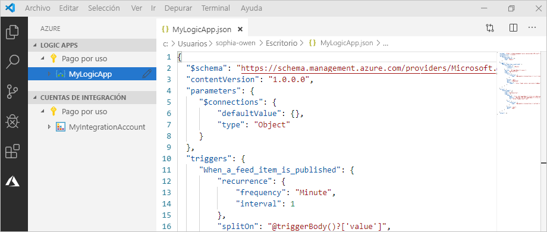

Antes de empezar, asegúrese de que dispone de estos elementos:

* Si no tiene una cuenta de Azure y una suscripción, [regístrese para obtener una cuenta gratuita de Azure](https://azure.microsoft.com/free/).

* Conocimientos básicos acerca de las [definiciones de flujos de trabajo de aplicaciones lógicas](../logic-apps/logic-apps-workflow-definition-language.md) y su estructura, que se describe con JSON

  Si nunca ha usado Logic Apps, pruebe este [inicio rápido](../logic-apps/quickstart-create-first-logic-app-workflow.md), que crea las primeras aplicaciones lógicas en Azure Portal y se centra más en los conceptos básicos.

* Acceso a la web para iniciar sesión en Azure y en su suscripción

* Descargue e instale estas herramientas si no las tiene aún:

  * [Visual Studio Code versión 1.25.1 o posterior](https://code.visualstudio.com/), que es gratis

  * La extensión de Visual Studio Code para Azure Logic Apps

    Puede descargar e instalar esta extensión desde [Visual Studio Marketplace](https://marketplace.visualstudio.com/items?itemName=ms-azuretools.vscode-logicapps) o directamente desde Visual Studio Code. Asegúrese de volver a cargar Visual Studio Code después de la instalación.

    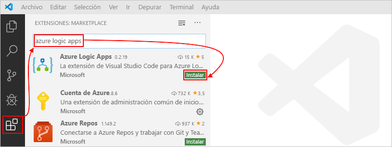

    Para comprobar que la extensión se ha instalado correctamente, seleccione el icono de Azure que aparecer en la barra de herramientas de Visual Studio Code.

    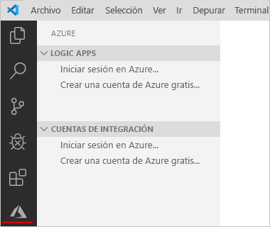

    Para más información, consulte [Extension Marketplace](https://code.visualstudio.com/docs/editor/extension-gallery) (Marketplace de extensiones). Para contribuir a la versión de código abierto de esta extensión; vaya a [Extensión de Azure Logic Apps para Visual Studio Code en GitHub](https://github.com/Microsoft/vscode-azurelogicapps).

<a name="sign-in-azure"></a>

## <a name="sign-in-to-azure"></a>Inicio de sesión en Azure

1. Abra Visual Studio Code. En la barra de herramientas de Visual Studio Code, seleccione el icono de Azure.

   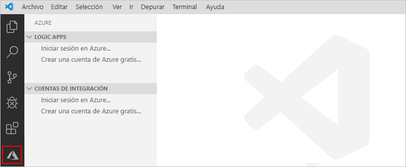

1. En la ventana de Azure, en **Logic Apps**, seleccione **Iniciar sesión en Azure**. Cuando la página de inicio de sesión de Microsoft se lo solicite, inicie sesión con su cuenta de Azure.

   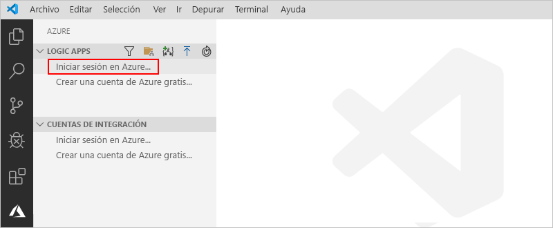

   1. Si el inicio de sesión tarda más de lo habitual, Visual Studio Code le pedirá que inicie sesión a través de un sitio web de autenticación de Microsoft. Para ello, le proporcionará un código de dispositivo. Para iniciar sesión con el código en su lugar, seleccione **Use Device Code** (Usar el código de dispositivo).

      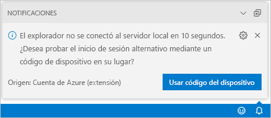

   1. Para copiar el código, seleccione **Copy & Open** (Copiar y abrir).

      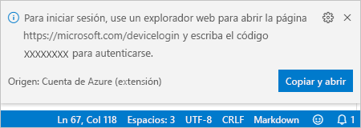

   1. Para abrir una nueva ventana del explorador y continuar con el sitio web de autenticación, seleccione **Abrir vínculo**.

      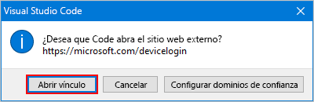

   1. En la página **Iniciar sesión en tu cuenta**, escriba el código de autenticación y seleccione **Siguiente**.

      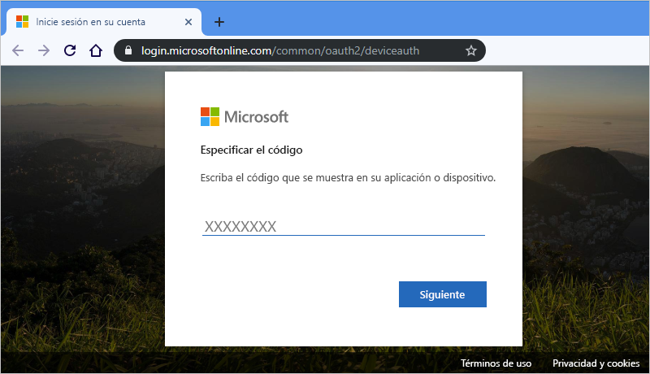

1. Seleccione su cuenta de Azure. Después de iniciar sesión, puede cerrar el explorador y volver a Visual Studio Code.

   En el panel de Azure, las secciones **Logic Apps** y **Cuentas de integración** muestran las suscripciones a Azure asociadas con su cuenta. Sin embargo, si no ve las suscripciones que espera, o si las secciones muestran demasiadas suscripciones, siga estos pasos:

   1. Mueva el puntero sobre la etiqueta **Logic Apps**. Cuando aparezca la barra de herramientas, seleccione **Seleccionar suscripciones** (icono de filtro).

      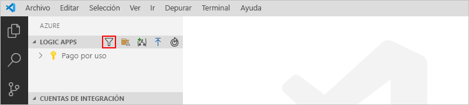

   1. En la lista que aparece, seleccione las suscripciones que quiere que aparezcan.

1. En **Logic Apps**, seleccione la suscripción que quiera. El nodo de la suscripción se expande y muestra las aplicaciones lógicas que existen en esa suscripción.

   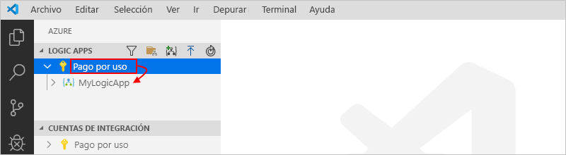

   > [!TIP]
   > En **Cuentas de integración**, al seleccionar su suscripción, se muestran todas las cuentas de integración que existen en esa suscripción.

<a name="create-logic-app"></a>

## <a name="create-new-logic-app"></a>Creación de una nueva aplicación lógica

1. Si aún no ha iniciado sesión en su cuenta y suscripción de Azure desde dentro de Visual Studio Code, siga los [pasos anteriores para iniciar sesión ahora](#sign-in-azure).

1. En Visual Studio Code, en **Logic Apps**, abra el menú contextual de la suscripción y seleccione **Crear aplicación lógica**.

   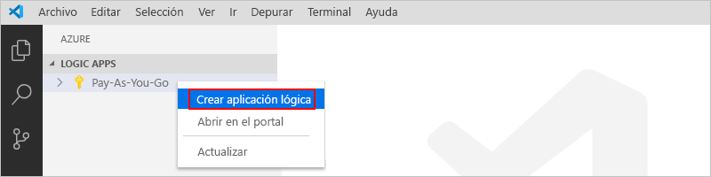

   Aparece una lista que muestra los grupos de recursos de Azure de su suscripción.

1. En la lista del grupo de recursos, seleccione **Crear un nuevo grupo de recursos** o un grupo de recursos existente. Para este ejemplo, cree un nuevo grupo de recursos:

   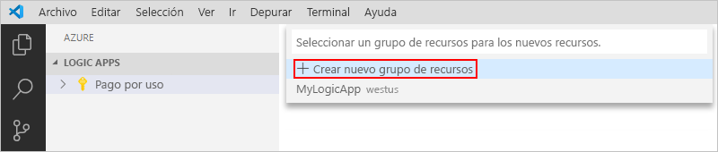

1. Proporcione un nombre para el grupo de recursos de Azure y presione ENTRAR.

   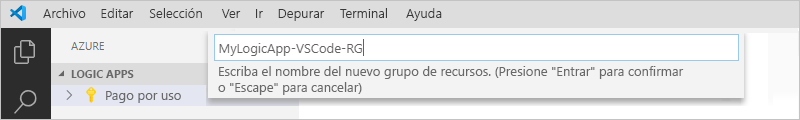

1. Seleccione la región de Azure en la que quiera guardar los metadatos de la aplicación lógica.

   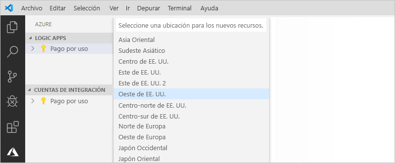

1. Proporcione un nombre para la aplicación lógica y presione Entrar.

   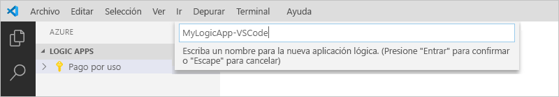

   En la ventana de Azure, en su suscripción, se mostrará la nueva aplicación lógica en blanco. Visual Studio Code también abre un archivo JSON (.logicapp.json), que incluye una definición de flujo de trabajo de esqueleto para la aplicación lógica. Ahora puede empezar a crear manualmente la definición de flujo de trabajo de la aplicación lógica en este archivo JSON. Para obtener información técnica sobre la estructura y la sintaxis de una definición de flujo de trabajo, consulte la [Guía de referencia del esquema del lenguaje de definición de flujo de trabajo en Azure Logic Apps](../logic-apps/logic-apps-workflow-definition-language.md).

   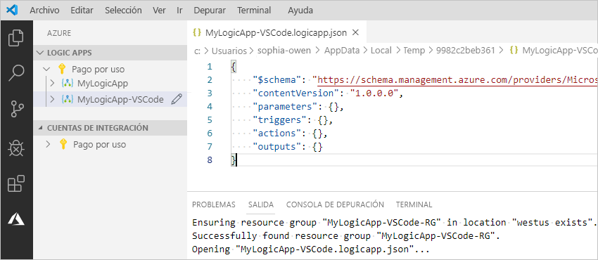

   Por ejemplo, a continuación se muestra una definición de flujo de trabajo de aplicación lógica de muestra que comienza con un desencadenador RSS y una acción de Office 365 Outlook. Normalmente, los elementos JSON aparecen en orden alfabético en cada sección. Sin embargo, en este ejemplo se muestran aproximadamente en el orden en que aparecen los pasos de la aplicación lógica en el diseñador.

   > [!IMPORTANT]
   > Si quiere volver a usar esta definición de aplicación lógica de muestra, necesita una cuenta profesional de Office 365; por ejemplo, @fabrikam.com. Asegúrese de reemplazar la dirección de correo electrónico ficticia por su propia dirección de correo electrónico. Para usar un conector de correo electrónico diferente, como Outlook.com o Gmail, reemplace la acción `Send_an_email_action` por una acción similar disponible en un [conector de correo electrónico compatible con Azure Logic Apps](../connectors/apis-list.md).

   ```json
   {
      "$schema": "https://schema.management.azure.com/providers/Microsoft.Logic/schemas/2016-06-01/workflowdefinition.json#",
      "contentVersion": "1.0.0.0",
      "parameters": {
         "$connections": {
            "defaultValue": {},
            "type": "Object"
         }
      },
      "triggers": {
         "When_a_feed_item_is_published": {
            "recurrence": {
               "frequency": "Minute",
               "interval": 1
            },
            "splitOn": "@triggerBody()?['value']",
            "type": "ApiConnection",
            "inputs": {
               "host": {
                  "connection": {
                     "name": "@parameters('$connections')['rss']['connectionId']"
                  }
               },
               "method": "get",
               "path": "/OnNewFeed",
               "queries": {
                  "feedUrl": "http://feeds.reuters.com/reuters/topNews"
               }
            }
         }
      },
      "actions": {
         "Send_an_email_(V2)": {
            "runAfter": {},
            "type": "ApiConnection",
            "inputs": {
               "body": {
                  "Body": "<p>Title: @{triggerBody()?['title']}<br>\n<br>\nDate published: @{triggerBody()?['updatedOn']}<br>\n<br>\nLink: @{triggerBody()?['primaryLink']}</p>",
                  "Subject": "RSS item: @{triggerBody()?['title']}",
                  "To": "sophia-owen@fabrikam.com"
               },
               "host": {
                  "connection": {
                     "name": "@parameters('$connections')['office365']['connectionId']"
                  }
               },
               "method": "post",
               "path": "/v2/Mail"
            }
         }
      },
      "outputs": {}
   }
   ```

1. Cuando haya terminado, guarde la definición de flujo de trabajo de la aplicación lógica. (Menú Archivo > Guardar o presione Ctrl + S)

1. Cuando se le pida que cargue la aplicación lógica en su suscripción a Azure, seleccione **Cargar**.

   Este paso publica la aplicación lógica en [Azure Portal](https://portal.azure.com) y hace que la lógica se ejecute en Azure.

   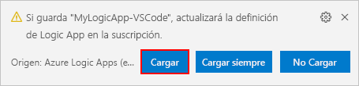

## <a name="view-logic-app-in-designer"></a>Ver la aplicación lógica en el diseñador

En Visual Studio Code, puede abrir la aplicación lógica en una vista de diseño de solo lectura. Aunque no puede editar la aplicación lógica en el diseñador, puede comprobar visualmente el flujo de trabajo de la aplicación lógica mediante la vista del diseñador.

En la ventana de Azure, en **Logic Apps**, abra el menú contextual de la aplicación lógica y seleccione **Abrir en el diseñador**.

El diseñador de solo lectura se abre en una ventana independiente y muestra el flujo de trabajo de la aplicación lógica, por ejemplo:

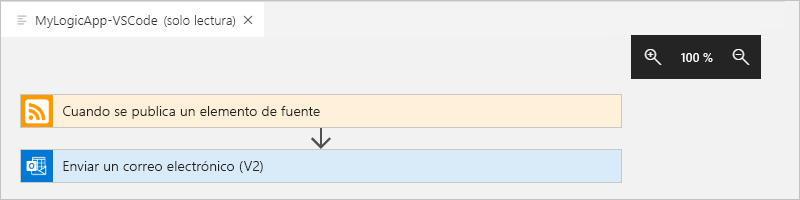

## <a name="view-in-azure-portal"></a>Ver en Azure Portal

Para revisar la aplicación lógica en Azure Portal, siga estos pasos:

1. Inicie sesión en [Azure Portal](https://portal.azure.com) con la misma cuenta de Azure y la misma suscripción asociadas con la aplicación lógica.

1. En el cuadro de búsqueda de Azure Portal, escriba el nombre de la aplicación lógica. En la lista de resultados, seleccione la aplicación lógica.

   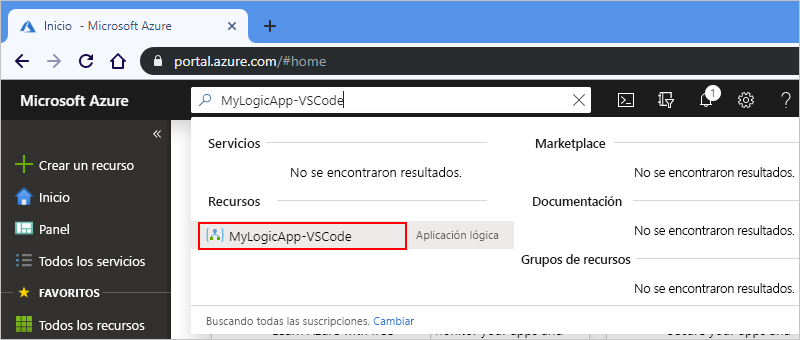

<a name="disable-enable-logic-app"></a>

## <a name="disable-or-enable-logic-app"></a>Deshabilitación o habilitación de la aplicación lógica

En Visual Studio Code, si edita una aplicación lógica publicada y guarda los cambios, *sobrescribe* la aplicación ya implementada. Para evitar interrumpir la aplicación lógica en producción y minimizar la interrupción, desactive primero la aplicación lógica. A continuación, puede reactivar la aplicación lógica después de haber confirmado que todavía funciona.

1. Si aún no ha iniciado sesión en su cuenta y suscripción de Azure desde dentro de Visual Studio Code, siga los [pasos anteriores para iniciar sesión ahora](#sign-in-azure).

1. En la ventana de Azure, en **Logic Apps**, expanda su suscripción a Azure para poder ver todas las aplicaciones lógicas de la suscripción.

   1. Para deshabilitar la aplicación lógica que quiera, abra el menú de la aplicación lógica y seleccione **Deshabilitar**.

      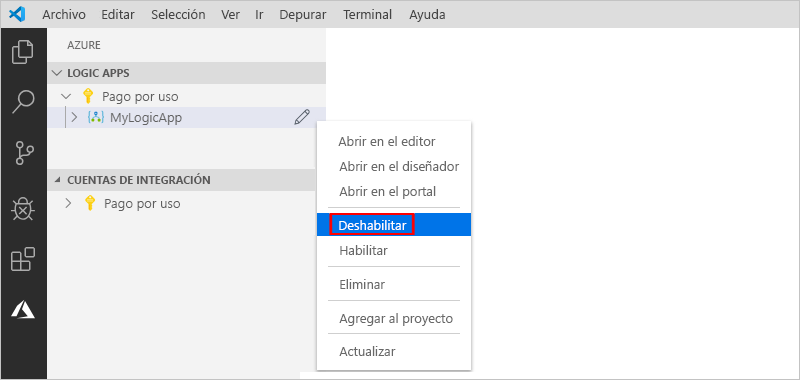

   1. Cuando esté listo para volver a activar la aplicación lógica, abra el menú de la aplicación lógica y seleccione **Habilitar**.

      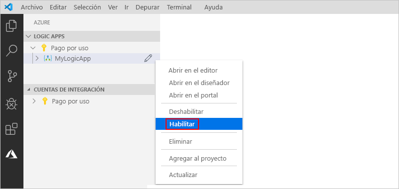

<a name="edit-logic-app"></a>

## <a name="edit-deployed-logic-app"></a>Edición de la aplicación lógica implementada

En Visual Studio Code, puede abrir y editar la definición de flujo de trabajo de una aplicación lógica ya implementada en Azure.

> [!IMPORTANT] 
> Antes de editar una aplicación lógica que se ejecuta activamente en producción, evite el riesgo de interrumpir esa aplicación lógica y minimice la interrupción mediante la [deshabilitación de la aplicación lógica en primer lugar](#disable-enable-logic-app).

1. Si aún no ha iniciado sesión en su cuenta y suscripción de Azure desde dentro de Visual Studio Code, siga los [pasos anteriores para iniciar sesión ahora](#sign-in-azure).

1. En la ventana de Azure, en **Logic Apps**, expanda su suscripción de Azure y seleccione la aplicación lógica que quiera.

1. En el menú de la aplicación lógica, seleccione **Abrir en el editor**. O bien, junto al nombre de la aplicación lógica, seleccione el icono de edición.

   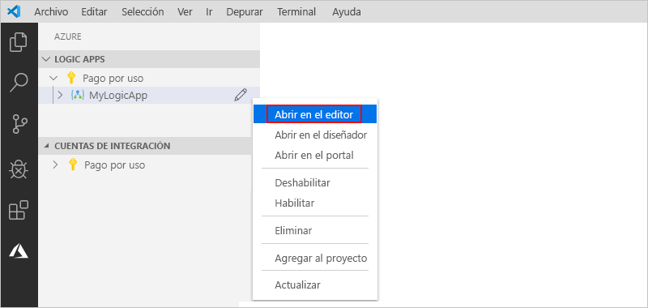

   Visual Studio Code abre el archivo .logicapp.json en una carpeta temporal local para que pueda ver la definición del flujo de trabajo de la aplicación lógica.

   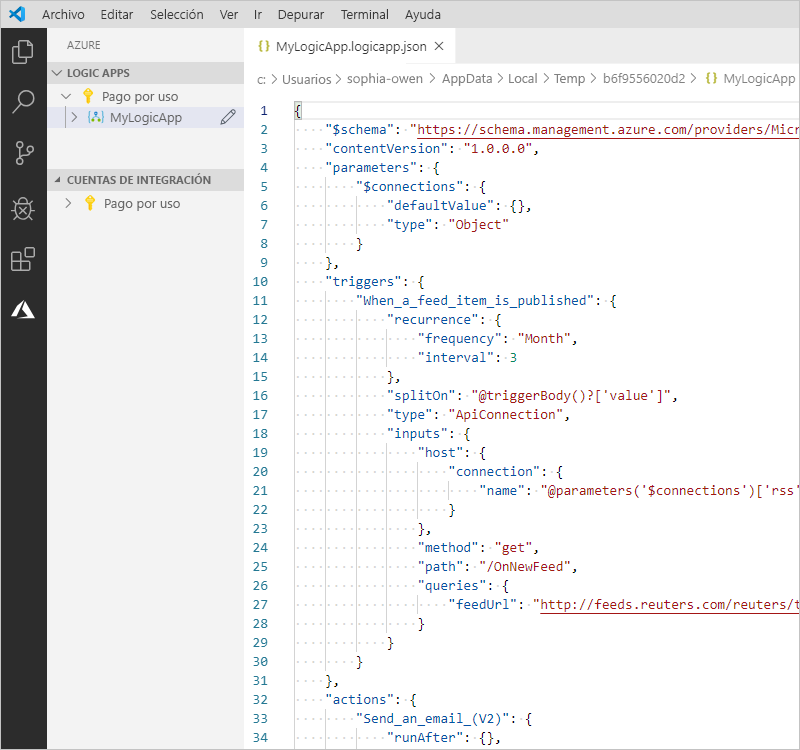

1. Aplique los cambios en la definición del flujo de trabajo de la aplicación lógica.

1. Cuando haya terminado, guarde los cambios. (Menú Archivo > Guardar o presione Ctrl + S)

1. Cuando se le pida que cargue los cambios y *sobrescriba* la aplicación lógica existente en Azure Portal, seleccione **Cargar**.

   Este paso publica las actualizaciones de la aplicación lógica en [Azure Portal](https://portal.azure.com).

   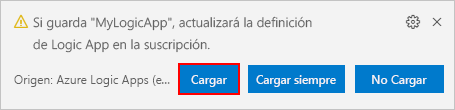

## <a name="view-or-promote-other-versions"></a>Ver o promover otras versiones

En Visual Studio Code, puede abrir y revisar las versiones anteriores de la aplicación lógica. También puede promover una versión anterior a la versión actual.

> [!IMPORTANT] 
> Antes de modificar una aplicación lógica que se ejecuta activamente en producción, evite el riesgo de interrumpir esa aplicación lógica y minimice la interrupción mediante la [deshabilitación de la aplicación lógica en primer lugar](#disable-enable-logic-app).

1. En la ventana de Azure, en **Logic Apps**, expanda su suscripción a Azure para poder ver todas las aplicaciones lógicas de la suscripción.

1. En su suscripción, expanda la aplicación lógica y, a continuación, **Versiones**.

   La lista **Versiones** muestra las versiones anteriores de la aplicación lógica, si existe alguna.

   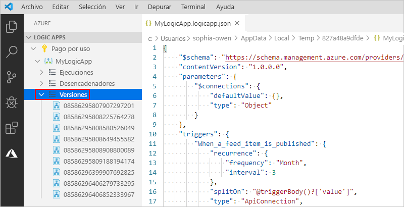

1. Para ver una versión anterior, seleccione uno de estos pasos:

   * Para ver la definición de JSON, en **Versiones**, seleccione el número de versión de esa definición. O bien, abra el menú contextual de la versión y seleccione **Abrir en el editor**.

     Se abre un nuevo archivo en el equipo local y se muestra la definición de JSON de la versión.

   * Para ver la versión en la vista del diseñador de solo lectura, abra el menú contextual de esa versión y seleccione **Abrir en el diseñador**.

1. Para promover una versión anterior a la versión actual, siga estos pasos:

   1. En **Versiones**, abra el menú contextual de la versión anterior y seleccione **Promover**.

      

   1. Para continuar después de que Visual Studio Code le pida confirmación, seleccione **Sí**.

      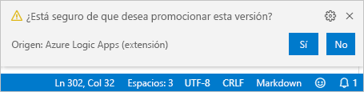

      Visual Studio Code promueve la versión seleccionada a la versión actual y asigna un nuevo número a la versión promovida. La versión actual anterior aparece ahora bajo la versión promovida.

## <a name="next-steps"></a>Pasos siguientes

> [!div class="nextstepaction"]
> [Creación de aplicaciones lógicas con Visual Studio](../logic-apps/quickstart-create-logic-apps-with-visual-studio.md)