# Inicio rápido: Creación y automatización de tareas, procesos y flujos de trabajo con Azure Logic Apps en Visual Studio

Con [Azure Logic Apps](../logic-apps/logic-apps-overview.md) y Visual Studio, puede crear flujos de trabajo que automaticen las tareas y los procesos de integración de aplicaciones, datos, sistemas y servicios a través de empresas y organizaciones. En este inicio rápido se muestra cómo puede diseñar y compilar estos flujos de trabajo mediante la creación de aplicaciones lógicas en Visual Studio y la implementación de esas aplicaciones en Azure. Aunque puede realizar estas tareas en Azure Portal, Visual Studio le permite agregar aplicaciones lógicas para el control de código fuente, publicar versiones diferentes y crear plantillas de Azure Resource Manager para distintos entornos de implementación.

Si no está familiarizado con Azure Logic Apps y solo desea conocer los conceptos básicos, pruebe en su lugar con el [inicio rápido para crear una aplicación lógica en Azure Portal](../logic-apps/quickstart-create-first-logic-app-workflow.md). El Diseñador de aplicación lógica, tanto en Azure Portal como en Visual Studio, funciona de forma similar.

En este inicio rápido, crea la misma aplicación lógica que en el inicio rápido de Azure Portal, pero con Visual Studio. Esta aplicación lógica supervisa la fuente RSS de un sitio web y envía un correo electrónico para cada nuevo elemento de dicha fuente. La aplicación lógica finalizada se parecerá a este flujo de trabajo general:

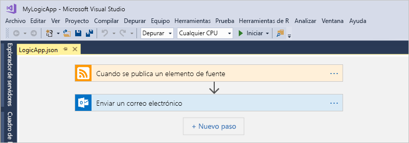

## Prerequisites

* Suscripción a Azure. Si aún no tiene una, [regístrese para obtener una cuenta de Azure gratuita](https://azure.microsoft.com/free/).

* Descargue e instale estas herramientas si no las tiene aún:

  * [Visual Studio 2019, 2017 o 2015 Community Edition o superior](https://aka.ms/download-visual-studio). Este inicio rápido usa Visual Studio Community 2017.

    > [!IMPORTANT]
    > Al instalar Visual Studio de 2019 o 2017, asegúrese de que selecciona la carga de trabajo **desarrollo de Azure**.

  * [Microsoft Azure SDK para .NET (2.9.1 o una versión posterior)](https://azure.microsoft.com/downloads/). Más información sobre [Azure SDK for .NET](https://docs.microsoft.com/dotnet/azure/dotnet-tools?view=azure-dotnet).

  * [Azure PowerShell](https://github.com/Azure/azure-powershell#installation)

  * Las últimas herramientas de Azure Logic Apps para la extensión de Visual Studio para la versión que necesita:

    * [Visual Studio 2019](https://aka.ms/download-azure-logic-apps-tools-visual-studio-2019)

    * [Visual Studio 2017](https://aka.ms/download-azure-logic-apps-tools-visual-studio-2017)

    * [Visual Studio 2015](https://aka.ms/download-azure-logic-apps-tools-visual-studio-2015)
  
    Puede descargar e instalar Herramientas de Azure Logic Apps directamente desde Visual Studio Marketplace o aprender [a instalar esta extensión desde Visual Studio](https://docs.microsoft.com/visualstudio/ide/finding-and-using-visual-studio-extensions). Asegúrese de reiniciar Visual Studio después de finalizar la instalación.

* Acceso a la web al usar el Diseñador de aplicaciones lógicas integrado

  El diseñador requiere una conexión a Internet para crear recursos en Azure y leer las propiedades y los datos de los conectores de la aplicación lógica. Por ejemplo, para las conexiones de CRM, el diseñador comprueba si hay propiedades predeterminadas y personalizadas en la instancia de CRM.

* Una cuenta de correo electrónico que sea compatible con Logic Apps, como Office 365 Outlook, Outlook.com o Gmail. En el caso de otros proveedores, consulte la [lista de conectores que se muestra aquí](https://docs.microsoft.com/connectors/). En este ejemplo se utiliza Office 365 Outlook. Si usa otro proveedor distinto, los pasos generales serán los mismos pero su interfaz de usuario puede ser ligeramente distinta.

## Creación de un proyecto de grupo de recursos de Azure

Para empezar, cree un [proyecto de grupo de recursos de Azure](../azure-resource-manager/vs-azure-tools-resource-groups-deployment-projects-create-deploy.md). Más información sobre [grupos de recursos y recursos de Azure](../azure-resource-manager/management/overview.md).

1. Inicie Visual Studio. Inicie sesión con su cuenta de Azure.

1. En el menú **Archivo**, seleccione **Nuevo** > **Proyecto**. (Teclado: CTRL + Mayús + N)

   

1. En **Instalado**, seleccione **Visual C#** o **Visual Basic**. Seleccione **Nube** > **Grupo de recursos de Azure**. Asigne un nombre al proyecto, por ejemplo:

   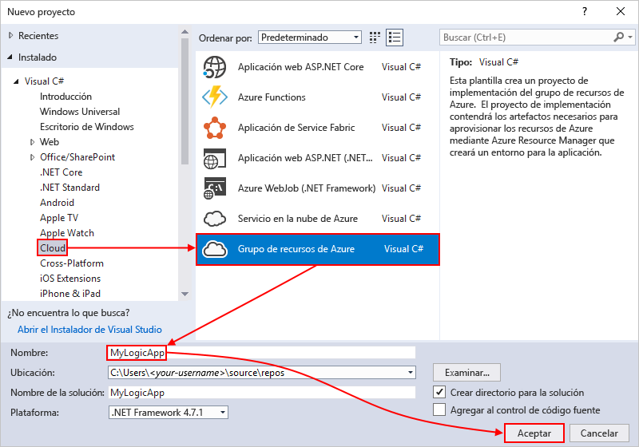

   > [!NOTE]
   > Los nombres de los grupos de recursos pueden contener solo letras,números, puntos (`.`),caracteres de subrayado (`_`), guiones (`-`) y paréntesis (`(`, `)`), pero no pueden *acabar* con puntos (`.`).
   >
   > Si **Nube** o **Grupo de recursos de Azure** no aparecen, asegúrese de que ha instalado el SDK de Azure para Visual Studio.

   Si usa Visual Studio 2019, siga estos pasos:

   1. En el cuadro **Crear un proyecto**, seleccione el proyecto **Grupo de recursos de Azure** para Visual C# o Visual Basic. Seleccione **Next** (Siguiente).

   1. Proporcione el nombre del grupo de recursos de Azure que desea usar y otra información adicional sobre el proyecto. Seleccione **Crear**.

1. En la lista de plantillas, seleccione la plantilla **Logic App**. Seleccione **Aceptar**.

   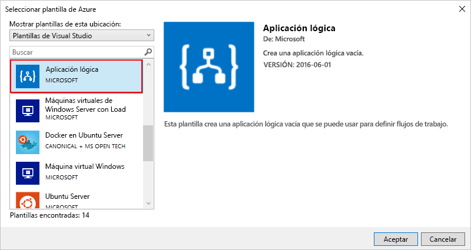

   Después de que Visual Studio cree el proyecto, el Explorador de soluciones se abre y muestra la solución. En la solución, el archivo**LogicApp.json** no solo almacena la definición de la aplicación lógica, sino que también es una plantilla de Azure Resource Manager que puede configurar para la implementación.

   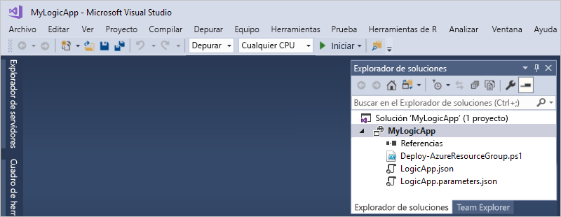

## Creación de una aplicación lógica en blanco

Cuando tenga el proyecto del grupo de recursos de Azure, cree la aplicación lógica a partir de la plantilla **Blank Logic App**.

1. En el Explorador de soluciones, abra el menú contextual del archivo **LogicApp.json**. Seleccione **Open with Logic App Designer** (Abrir con Diseñador de aplicación lógica). (Teclado: CTRL + L)

   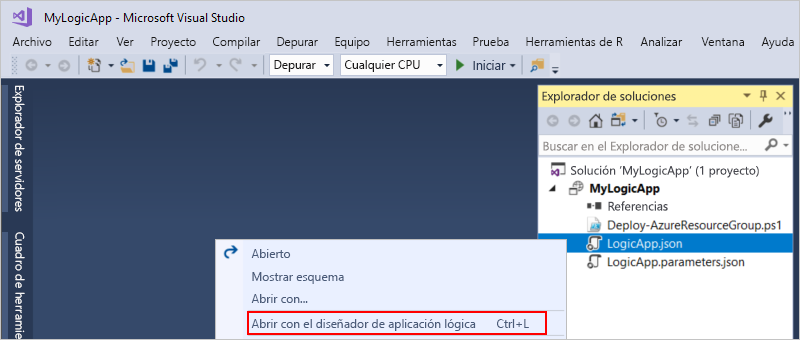

   > [!TIP]
   > Si no tiene este comando en Visual Studio 2019, compruebe que tiene las actualizaciones más recientes de Visual Studio.

   Visual Studio necesita su suscripción de Azure y un grupo de recursos para crear e implementar recursos de la aplicación lógica y las conexiones.

1. En **Suscripción**, seleccione su suscripción de Azure. En **Grupo de recursos**, seleccione **Crear nuevo** para generar otro grupo de recursos de Azure.

   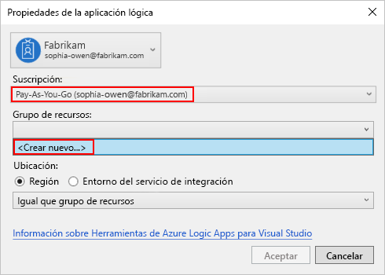

   | Configuración | Valor de ejemplo | Descripción |
   | ------- | ------------- | ----------- |
   | Cuenta de usuario | Fabrikam   sophia-owen@fabrikam.com | Cuenta que usó al iniciar sesión en Visual Studio |
   | **Suscripción** | Pay-As-You-Go   (sophia-owen@fabrikam.com) | Nombre de la suscripción de Azure y cuenta asociada |
   | **Grupo de recursos** | MyLogicApp-RG   (Oeste de EE. UU.) | Grupo de recursos de Azure y ubicación para almacenar e implementar recursos de la aplicación lógica |
   | **Ubicación** | **Same as Resource Group** (Igual que el grupo de recursos) | El tipo de ubicación y la ubicación específica para implementar la aplicación lógica. El tipo de ubicación puede ser una región de Azure o un [entorno del servicio de integración (ISE)](connect-virtual-network-vnet-isolated-environment.md) existente. 
En esta guía de inicio rápido, mantenga el tipo de ubicación establecido en **Región** y la ubicación establecida en **Same as Resource Group** (Igual que el grupo de recursos). 
**Nota**: Después de crear el proyecto del grupo de recursos, puede [cambiar el tipo de ubicación y la ubicación](manage-logic-apps-with-visual-studio.md#change-location), pero un tipo de ubicación diferente afecta a la aplicación lógica de varias maneras. |
   ||||

1. El Diseñador de aplicación lógica se abre y muestra un vídeo de introducción y desencadenadores utilizados frecuentemente. Desplácese hacia abajo más allá del vídeo y de los desencadenadores hasta **Plantillas**y seleccione **Blank Logic App**.

   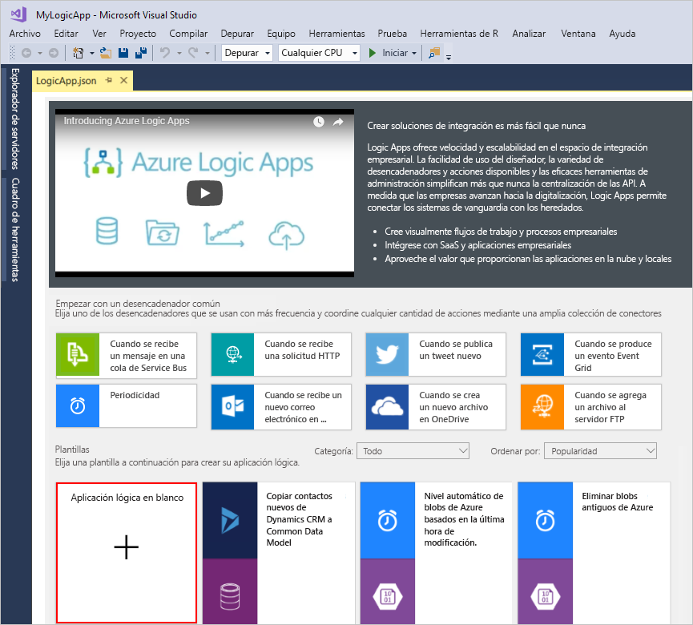

## Creación de un flujo de trabajo de aplicación lógica

A continuación, añada un [desencadenador](../logic-apps/logic-apps-overview.md#logic-app-concepts) RSS que se active cuando aparezca un nuevo elemento en la fuente. Cada aplicación lógica se inicia con un desencadenador, que se desencadena cuando se cumplen criterios específicos. Cada vez que el desencadenador se activa, el motor de Logic Apps crea una instancia de aplicación lógica que ejecuta el flujo de trabajo.

1. En el cuadro de búsqueda del Diseñador de aplicación lógica, seleccione **Todo**. En el cuadro de búsqueda, escriba "rss". En la lista de desencadenadores, seleccione este desencadenador: **Cuando se publica un elemento de fuente**

   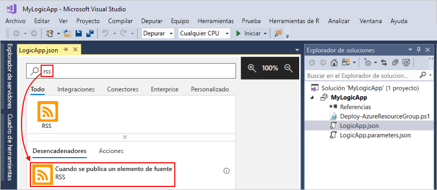

1. Cuando el desencadenador se muestra en el diseñador, termine de crear la aplicación lógica, siga los pasos del flujo de trabajo en el [Inicio rápido de Azure Portal](../logic-apps/quickstart-create-first-logic-app-workflow.md#add-rss-trigger) y, después, vuelva a este artículo. Cuando haya terminado, la aplicación lógica se parecerá a este ejemplo:

   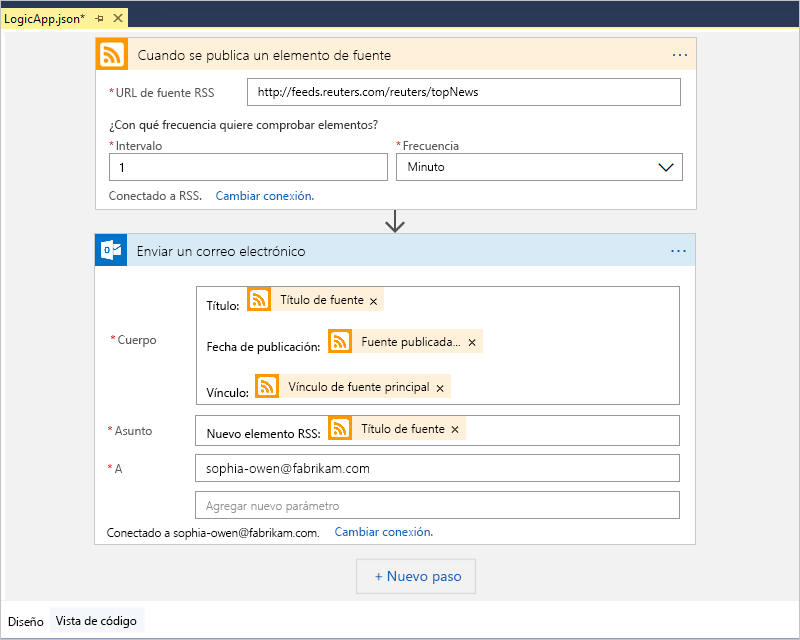

1. Guarde la solución de Visual Studio. (Teclado: Ctrl + S)

## Implementación de la aplicación lógica en Azure

Antes de poder ejecutar y probar la aplicación lógica, implemente la aplicación desde Visual Studio en Azure.

1. En el Explorador de soluciones, en el menú contextual del proyecto, seleccione **Implementar** > **Nuevo**. Si se le pide, inicie sesión en su cuenta de Azure.

   

1. Para esta implementación, mantenga la suscripción de Azure, el grupo de recursos y otras configuraciones predeterminadas. Seleccione **Implementar**.

   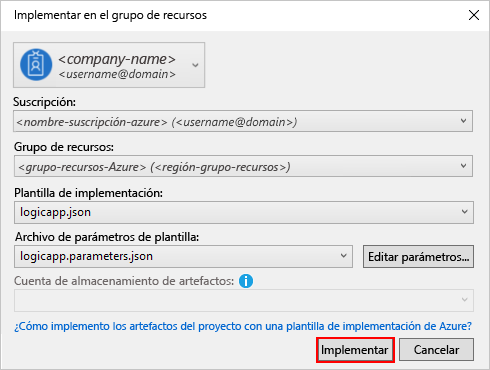

1. Si el cuadro **Editar parámetros** aparece, proporcione un nombre al recurso de la aplicación lógica. Guarde la configuración.

   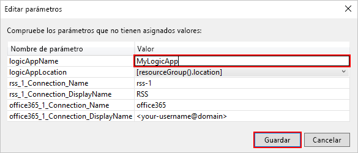

   Cuando se inicia la implementación, aparece el estado de la implementación de la aplicación en la ventana **Salida** de Visual Studio. Si no aparece el estado, abra la lista **Mostrar salida de** y seleccione el grupo de recursos de Azure.

   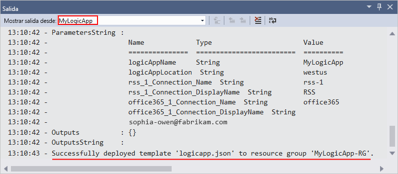

   Si los conectores seleccionados necesitan que el usuario escriba datos, se abre una ventana de PowerShell en segundo plano y le solicita las contraseñas o claves secretas necesarias. Después de escribir esta información, la implementación continúa.

   

   Una vez finalizada la implementación, la aplicación lógica está activa en Azure Portal y se ejecuta en función de la programación especificada (cada minuto). Si el desencadenador encuentra nuevos elementos de fuente, el desencadenador se activa, que crea una instancia de flujo de trabajo que ejecuta las acciones de la aplicación lógica. La aplicación lógica envía un correo electrónico por cada nuevo elemento. Si el desencadenador no encuentra nuevos elementos, no se activa y "omite" crear instancias del flujo de trabajo. La aplicación lógica espera hasta el siguiente intervalo antes de volver a realizar la comprobación.

   Estos son correos electrónicos de ejemplo que envía esta aplicación lógica. Si no obtiene los mensajes de correo electrónico, compruebe la carpeta de correo electrónico no deseado.

   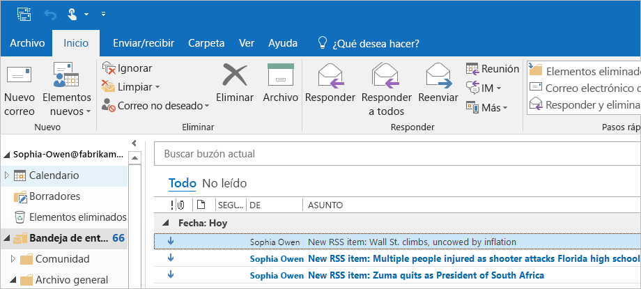

Ya ha creado e implementado correctamente la aplicación lógica con Visual Studio. Para administrar la aplicación lógica y revisar su historial de ejecución, consulte [Administración de aplicaciones lógicas con Visual Studio](../logic-apps/manage-logic-apps-with-visual-studio.md).

## Incorporación de una nueva aplicación lógica

Si tiene un proyecto de grupo de recursos de Azure existente, puede agregar una nueva aplicación lógica mediante la ventana Esquema JSON.

1. En el Explorador de soluciones, abra el archivo `<logic-app-name>.json`.

1. En el menú **Vista**, seleccione **Otras ventanas** > **Esquema JSON**.

1. Para agregar un recurso al archivo de plantilla, seleccione **Agregar recurso** en la parte superior de la ventana Esquema JSON. O, en la ventana Esquema de JSON, abra el menú contextual **recursos** y seleccione **Agregar nuevo recurso**.

   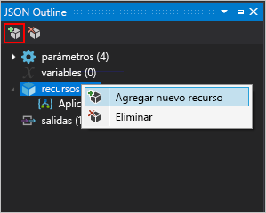

1. En el cuadro de diálogo **Agregar recurso**, en el cuadro de búsqueda, busque `logic app` y seleccione **Aplicación lógica**. Asigne un nombre a la aplicación lógica y seleccione **Agregar**.

   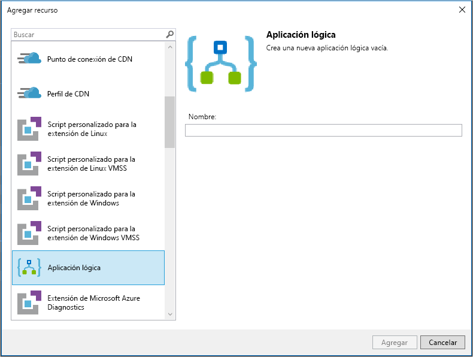

## Limpieza de recursos

Cuando ya no necesite la aplicación lógica, elimine el grupo de recursos que contiene la aplicación lógica y los recursos relacionados.

1. Inicie sesión en [Azure Portal](https://portal.azure.com) con la misma cuenta utilizada para crear la aplicación lógica.

1. En el menú de Azure Portal, seleccione **Grupos de recursos** o busque y seleccione **Grupos de recursos** en cualquier página. Seleccione el grupo de recursos de la aplicación lógica.

1. En la página **Información general**, elija **Eliminar grupo de recursos**. Escriba el nombre del grupo de recursos como confirmación y seleccione **Eliminar**.

   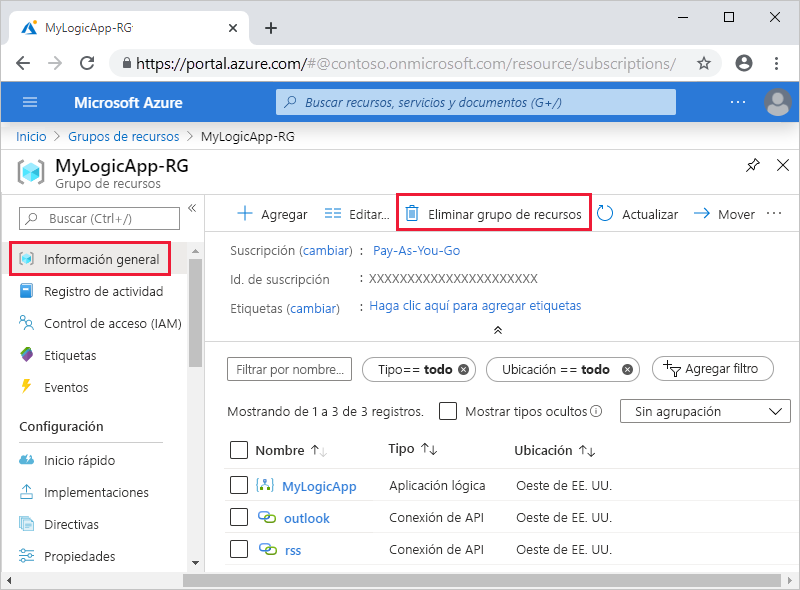

1. Elimine la solución de Visual Studio del equipo local.

## Pasos siguientes

En este artículo, se compila, implementa y ejecuta la aplicación lógica con Visual Studio. Para obtener más información sobre cómo administrar y realizar la implementación avanzada de aplicaciones lógicas con Visual Studio, consulte estos artículos:

> [!div class="nextstepaction"]
> [Administración de aplicaciones lógicas con Visual Studio](../logic-apps/manage-logic-apps-with-visual-studio.md)
