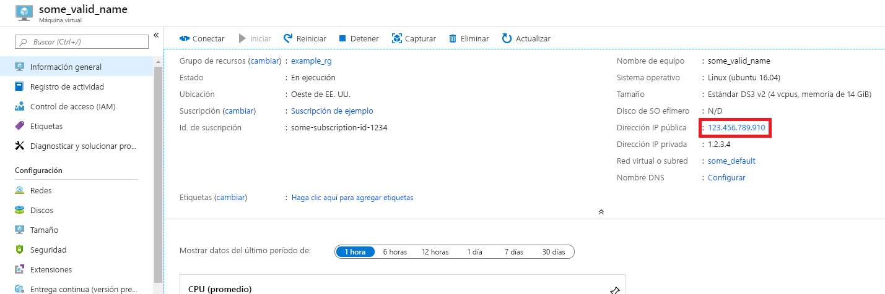
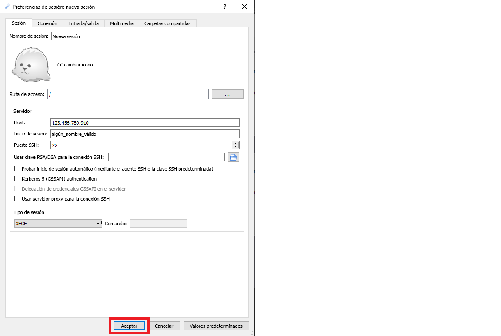

# <a name="quickstart-set-up-the-data-science-virtual-machine-for-linux-ubuntu"></a>Inicio rápido: Configuración de Data Science Virtual Machine para Linux (Ubuntu)

Empiece a trabajar con la instancia de Data Science Virtual Machine para Ubuntu 18.04.

## <a name="prerequisites"></a>Prerrequisitos

Para crear una instancia de Data Science Virtual Machine para Ubuntu 18.04, debe tener una suscripción a Azure. [Pruebe Azure gratis](https://azure.com/free).
Tenga en cuenta que las cuentas gratuitas de Azure no admiten los SKU de máquinas virtuales habilitadas para GPU.

## <a name="create-your-data-science-virtual-machine-for-linux"></a>Creación de la instancia de Data Science Virtual Machine para Linux

A continuación le indicamos los pasos para crear una instancia de Data Science Virtual Machine para Ubuntu 18.04:

1. Vaya a [Azure Portal](https://portal.azure.com). Es posible que se le pida que inicie sesión en su cuenta de Azure, si todavía no lo ha hecho.
1. Busque la lista de máquinas virtuales. Para ello, escriba "data science virtual machine" y seleccione "Data Science Virtual Machine - Ubuntu 18.04 Preview".

1. En la ventana siguiente, seleccione **Crear**.

1. Debería ser redirigido a la hoja "Crear una máquina virtual".
   
1. Escriba la siguiente información para configurar cada paso del asistente:

    1. **Aspectos básicos**:
    
       * **Suscripción**: si tiene más de una suscripción, seleccione aquella en la que se creará y facturará la máquina. Debe tener privilegios de creación de recursos en esta suscripción.
       * **Grupo de recursos**: cree un grupo o use uno existente.
       * **Nombre de la máquina virtual**: escriba el nombre de la máquina virtual. Así es como aparecerá en Azure Portal.
       * **Región**: seleccione el centro de datos más adecuado. Para disfrutar de un acceso más rápido a la red, elija el centro de datos que tenga la mayoría de los datos o el que esté más cerca de su ubicación física. Más información sobre las [regiones de Azure](https://azure.microsoft.com/global-infrastructure/regions/).
       * **Imagen**: Deje el valor predeterminado.
       * **Size**: debería rellenarse automáticamente con un tamaño adecuado para cargas de trabajo generales. Obtenga más información sobre los [tamaños de las máquinas virtuales Linux en Azure](../../virtual-machines/linux/sizes.md).
       * **Tipo de autenticación**: para que la configuración sea más rápida, seleccione "Contraseña". 
         
         > [!NOTE]
         > Si tiene previsto usar JupyterHub, asegúrese de seleccionar "Contraseña", ya que JupyterHub *no* está configurado para usar las claves públicas de SSH.

       * **Nombre de usuario**: escriba el nombre de usuario del administrador. Es el nombre de usuario que usará para iniciar sesión en la máquina virtual y no necesariamente debe ser el mismo que el nombre de usuario de Azure. *No* use mayúsculas.
         
         > [!NOTE]
         > Si usa mayúsculas en el nombre de usuario, JupyterHub no funcionará y se producirá un error interno del servidor 500.

       * **Contraseña**: escriba la contraseña que utilizará para iniciar sesión en la máquina virtual.    
    
   1. Seleccione **Revisar + crear**.
   1. **Revisar y crear**
      * Compruebe que toda la información que ha especificado es correcta. 
      * Seleccione **Crear**.
    
    El aprovisionamiento tardará alrededor de 5 minutos. El estado se muestra en Azure Portal.

## <a name="how-to-access-the-ubuntu-data-science-virtual-machine"></a>Acceso a una instancia de Data Science Virtual Machine para Ubuntu

Puede acceder a la instancia de Data Science Virtual Machine para Ubuntu de una de estas tres maneras:

  * SSH para sesiones de terminal
  * X2Go para sesiones de gráficas
  * JupyterHub y JupyterLab para instancias de Jupyter Notebook

También puede conectar una instancia de Data Science Virtual Machine a Azure Notebooks para ejecutar cuadernos de Jupyter en la máquina virtual y omitir las limitaciones del nivel de servicio gratuito. Para más información, consulte [Administración y configuración de proyectos de Azure Notebooks](../../notebooks/configure-manage-azure-notebooks-projects.md#compute-tier).

### <a name="ssh"></a>SSH

Una vez que se ha creado la máquina virtual, si se configuró con acceso a SSH, se puede iniciar sesión en ella mediante SSH. Utilice las credenciales de la cuenta que haya creado en la sección **Aspectos básicos** del paso 3 para la interfaz de shell de texto. En Windows, puede descargar una herramienta de cliente SSH como [PuTTY](https://www.putty.org). Si prefiere un escritorio gráfico (sistema X Window), puede usar el reenvío de X11 en PuTTY.

> [!NOTE]
> El cliente X2Go ha tenido un mejor rendimiento que el reenvío de X11 durante las pruebas. Por lo tanto, se recomienda usar el cliente X2Go para la interfaz gráfica de escritorio.

### <a name="x2go"></a>X2Go

La máquina virtual de Linux ya está provista del servidor X2Go y está preparada para aceptar conexiones de cliente. Para conectarse al escritorio gráfico de la máquina virtual Linux, lleve a cabo el siguiente procedimiento en el cliente:

1. Descargue e instale el cliente X2Go para su plataforma cliente desde [aquí](https://wiki.x2go.org/doku.php/doc:installation:x2goclient).
1. Anote la dirección IP pública de la máquina virtual, que puede encontrar en Azure Portal abriendo la máquina virtual que acaba de crear.

   

1. Ejecute el cliente X2Go. Si la ventana "Nueva sesión" no aparece automáticamente, vaya a Sesión-> Nueva sesión.

1. En la ventana de configuración resultante, escriba los parámetros de configuración siguientes:
   * **Pestaña Sesión**:
     * **Host**: Escriba la dirección IP de la máquina virtual, la que anotó anteriormente.
     * **Inicio de sesión**: escriba el nombre de usuario de la máquina virtual de Linux.
     * **Puerto SSH**: déjelo en 22, el valor predeterminado.
     * **Tipo de sesión**: cambie el valor a **XFCE**. Actualmente, la máquina virtual de Linux solo admite el escritorio XFCE.
   * **Pestaña Multimedia**: puede desactivar la compatibilidad de sonido y la impresión en el cliente si no necesita usarlas.
   * **Carpetas compartidas**: si quiere que los directorios de las máquinas cliente se monten en la VM Linux, agregue en esta pestaña los directorios de máquina cliente que quiere compartir con la VM.

   
1. Seleccione **Aceptar**.
1. Haga clic en el cuadro del panel derecho de la ventana de X2Go para que aparezca la pantalla de inicio de sesión de la máquina virtual.
1. Escriba la contraseña de la máquina virtual.
1. Seleccione **Aceptar**.
1. Para finalizar la conexión, es posible que tenga que conceder a X2Go permiso para omitir el firewall.
1. Ahora debería ver la interfaz gráfica de su la instancia de Data Science Virtual Machine para Ubuntu. 


### <a name="jupyterhub-and-jupyterlab"></a>JupyterHub y JupyterLab

La instancia de DSVM de Ubuntu ejecuta [JupyterHub](https://github.com/jupyterhub/jupyterhub), un servidor de Jupyter multiusuario. Para establecer la conexión, siga estos pasos:

   1. Tome nota de la dirección IP pública de la máquina virtual; para ello, busque y seleccione la máquina virtual en Azure Portal.
      

   1. En el equipo local, abra un explorador web y vaya a https:\//ip-de-su-máquina-virtual:8000 y sustituya "ip-de-su-máquina-virtual" por la dirección IP que anotó anteriormente.
   1. Escriba el nombre de usuario y la contraseña que usó para crear la máquina virtual e inicie sesión. 

      

   1. Examine los numerosos cuadernos de ejemplo que están disponibles.

JupyterLab, la siguiente generación de los cuadernos de Jupyter y JupyterHub, también está disponible. Para acceder a él, inicie sesión en JupyterHub y, después, vaya a la dirección URL https: \//ip-de-su-máquina-virtual: 8000/user/su-nombre-de-usuario/lab y reemplace "su-nombre-de-usuario" por el nombre de usuario que eligió al configurar la máquina virtual.

Puede establecer JupyterLab como el servidor de bloc de notas predeterminado agregando esta línea a `/etc/jupyterhub/jupyterhub_config.py`:

```python
c.Spawner.default_url = '/lab'
```

## <a name="next-steps"></a>Pasos siguientes

A continuación, mostramos cómo puede continuar con las tareas de aprendizaje y exploración:

* En el tutorial [Ciencia de datos con una instancia de Data Science Virtual Machine de Linux](linux-dsvm-walkthrough.md) se muestra cómo llevar a cabo varias tareas comunes de ciencia de datos con la instancia de DSVM de Linux aprovisionada aquí. 
* Pruebe las herramientas descritas en este artículo para conocer las distintas herramientas de ciencia de datos de la instancia de DSVM. También puede ejecutar `dsvm-more-info` en el shell de la máquina virtual para obtener un introducción básica y referencias que le permitirán consultar más información sobre las herramientas instaladas en la máquina virtual.  
* Aprenda a crear soluciones analíticas completas mediante el uso sistemático del [proceso de ciencia de datos en equipo](https://aka.ms/tdsp).
* Visite la [Azure AI Gallery](https://gallery.azure.ai/) para ver ejemplos de aprendizaje automático y análisis de datos donde se usan los servicios de Azure AI.
* Consulte la [documentación de referencia](./reference-ubuntu-vm.md) adecuada para esta máquina virtual.
