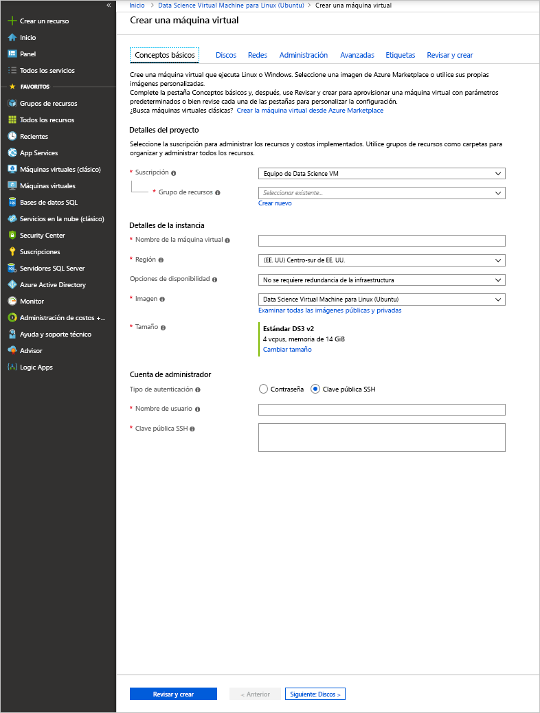

# <a name="provision-the-data-science-virtual-machine-for-linux-ubuntu"></a>Aprovisionamiento de Data Science Virtual Machine para Linux (Ubuntu)

Data Science Virtual Machine (DSVM) para Linux es una imagen de máquina virtual basada en Ubuntu que facilita comenzar a trabajar con el aprendizaje automático, incluido el aprendizaje profundo, en Azure. Las herramientas de aprendizaje profundo incluyen las siguientes:

* [Caffe](https://caffe.berkeleyvision.org/): entorno de aprendizaje profundo diseñado para lograr velocidad, expresividad y modularidad.
* [Caffe2](https://github.com/caffe2/caffe2): versión multiplataforma de Caffe.
* [Microsoft Cognitive Toolkit](https://github.com/Microsoft/CNTK): kit de herramientas de software de Deep Learning de Microsoft Research.
* [H2O](https://www.h2o.ai/): plataforma de macrodatos de código abierto e interfaz gráfica de usuario.
* [Keras](https://keras.io/): API de red neuronal de alto nivel en Python para TensorFlow, Microsoft Cognitive Toolkit y Theano.
* [MXNet](https://mxnet.io/): biblioteca de aprendizaje profundo flexible y eficaz con muchos enlaces de lenguaje.
* [NVIDIA DIGITS](https://developer.nvidia.com/digits): sistema gráfico que simplifica las tareas comunes de aprendizaje profundo.
* [PyTorch](https://pytorch.org/): una biblioteca de Python de alto nivel con compatibilidad para redes dinámicas.
* [TensorFlow](https://www.tensorflow.org/): biblioteca de código abierto para inteligencia automática de Google.
* [Theano](http://deeplearning.net/software/theano/): biblioteca de Python para definir, optimizar y evaluar de manera eficaz expresiones matemáticas que implican matrices multidimensionales.
* [Torch](http://torch.ch/): entorno informático científico con amplia compatibilidad con algoritmos de aprendizaje automático.
* CUDA, cuDNN y el controlador NVIDIA.
* Muchos cuadernos de Jupyter Notebook de ejemplo.

Todas las bibliotecas son las versiones GPU, aunque también se ejecutan en la CPU.

Data Science Virtual Machine para Linux también contiene herramientas conocidas para actividades de desarrollo y ciencia de datos, entre las que se incluyen:

* Microsoft Machine Learning Server con Microsoft R Open.
* Distribución de Anaconda Python (versiones 2.7 y 3.5), incluidas las bibliotecas de análisis de datos más conocidas.
* JuliaPro, una distribución protegida del lenguaje Julia con bibliotecas populares científicas y de análisis de datos.
* Instancia independiente de Spark y Hadoop de un solo nodo (HDFS, Yarn).
* JupyterHub, un servidor de Jupyter Notebook multiusuario compatible con kernels de R, Python, PySpark y Julia.
* Explorador de Azure Storage
* CLI de Azure para administrar los recursos de Azure.
* Herramientas de aprendizaje automático:
  * [Vowpal Wabbit](https://github.com/JohnLangford/vowpal_wabbit): sistema de aprendizaje automático rápido que admite varias técnicas, como el aprendizaje en línea, el uso de hash, la clase AllReduce, las reducciones, learning2search y los aprendizajes activo e interactivo.
  * [XGBoost](https://xgboost.readthedocs.org/en/latest/): Una herramienta que proporciona una implementación de árbol ampliada rápida y precisa.
  * [Rattle](https://togaware.com/rattle/): herramienta gráfica que facilita comenzar a trabajar con análisis de datos y aprendizaje automático en R.
  * [LightGBM](https://github.com/Microsoft/LightGBM): entorno de potenciación del gradiente rápido, distribuido y de alto rendimiento.
* SDK de Azure en Java, Python, Node.js, Ruby y PHP.
* Bibliotecas en R y Python para usarlas en Azure Machine Learning y en otros servicios de Azure.
* Editores y herramientas de desarrollo (RStudio, PyCharm, IntelliJ, Emacs, vim).

La ciencia de datos implica la iteración de una secuencia de tareas:

1. Buscar, cargar y preprocesar datos
1. Compilar y probar modelos
1. Implementar los modelos para consumirse en aplicaciones inteligentes

Los científicos de datos usan varias herramientas para realizar estas tareas. Puede llevar un tiempo encontrar las versiones del software adecuadas y, después, descargarlas, compilarlas e instalarlas.

Data Science Virtual Machine para Linux puede facilitar considerablemente esta carga. Úsela para comenzar de inmediato su proyecto de análisis. Le permite trabajar en tareas en varios lenguajes, incluidos R, Python, SQL, Java y C++. El Azure SDK incluido en la máquina virtual permite compilar aplicaciones con varios servicios en Linux para la plataforma en la nube de Microsoft. Además, tiene acceso a otros lenguajes como Ruby, Perl, PHP y Node.js, que también están ya instalados.

No hay cargos de software por esta imagen de DSVM. Solo se pagan las cuotas de uso del hardware de Azure, que se calculan en función del tamaño de la máquina virtual que aprovisiona. Para más información sobre los honorarios de proceso, consulte la [página con el listado de máquinas virtuales en Azure Marketplace](https://azure.microsoft.com/marketplace/partners/microsoft-ads/linux-data-science-vm/).

## <a name="other-versions-of-the-data-science-virtual-machine"></a>Otras versiones de Data Science Virtual Machine

También hay una imagen de [CentOS](linux-dsvm-intro.md) disponible, con la mayoría de las mismas herramientas que la imagen de Ubuntu. Hay asimismo una imagen de [Windows](provision-vm.md) disponible.

## <a name="prerequisites"></a>Requisitos previos

Antes de que pueda crear una instancia de Data Science Virtual Machine para Linux, debe tener una suscripción a Azure. Puede [obtener una evaluación gratuita de Azure](https://azure.microsoft.com/free/).

## <a name="create-your-data-science-virtual-machine-for-linux"></a>Creación de la instancia de Data Science Virtual Machine para Linux

A continuación le indicamos los pasos para crear una instancia de Data Science Virtual Machine para Linux:

1. Vaya al listado de máquinas virtuales en [Azure Portal](https://portal.azure.com/#create/microsoft-dsvm.linux-data-science-vm-ubuntulinuxdsvmubuntu). Es posible que se le pida que inicie sesión en su cuenta de Azure, si todavía no lo ha hecho. 
1. Seleccione **Crear** para abrir el asistente.
    
1. Escriba la siguiente información para configurar cada paso del asistente:

    1. **Aspectos básicos**:
    
       * **Suscripción**: si tiene más de una suscripción, seleccione aquella en la que se creará y facturará la máquina. Debe tener privilegios de creación de recursos en esta suscripción.
       * **Grupo de recursos**: Puede crear uno nuevo o utilizar un grupo ya existente.
       * **Nombre de la máquina virtual**: escriba el nombre del servidor de ciencia de datos que está creando.
       * **Región**: seleccione el centro de datos más adecuado. Normalmente, es el centro de datos que tiene la mayoría de los datos o el que está más cerca de su ubicación física, para disfrutar de un acceso más rápido a la red.
       * **Opciones de disponibilidad**: establezca esta configuración si desea usar esta máquina virtual en conjuntos o zonas de disponibilidad. De lo contrario, deje el valor predeterminado.
       * **Imagen**: Deje el valor predeterminado.
       * **Tamaño**: seleccione el tipo de servidor que cumpla sus requisitos funcionales y las restricciones de costo. Seleccione una VM de la serie NC o ND para instancias de VM basadas en GPU. 
       * **Nombre de usuario**: escriba el nombre de usuario del administrador.
       * **Clave pública SSH**: escriba la clave pública RSA en una sola línea. Puede utilizar una contraseña en lugar de una clave SSH.
    
    1. **Discos**:
    
       * **Tipo de disco del sistema operativo**: elija **SSD Premium** si prefiere una unidad de estado sólido (SSD). De lo contrario, elija **HDD estándar**.
    
    1. Para el resto de las opciones, puede usar los valores predeterminados. Si se plantea utilizar valores no predeterminados, mueva el puntero sobre el vínculo informativo para obtener ayuda. Cuando termine, seleccione **Revisar y crear**.
    
    1. Después de que la máquina virtual supere la validación, compruebe que toda la información que ha especificado es correcta. Un vínculo le dirige a los términos de uso. No se realizarán cargos adicionales en la máquina virtual más que los aplicables por la capacidad de proceso correspondiente al tamaño de servidor elegido en la opción **Tamaño**. Para iniciar el proceso de aprovisionamiento, seleccione **Crear**.
    
    El aprovisionamiento tardará alrededor de 5 minutos. El estado se muestra en Azure Portal.

## <a name="how-to-access-the-data-science-virtual-machine-for-linux"></a>Acceso a Data Science Virtual Machine para Linux

Puede acceder a la máquina DSVM Ubuntu mediante tres métodos:

- SSH para sesiones de terminal
- X2Go para sesiones de gráficas
- JupyterHub y JupyterLab para instancias de Jupyter Notebook

También puede conectar una instancia de Data Science Virtual Machine a Azure Notebooks para ejecutar cuadernos de Jupyter en la máquina virtual y omitir las limitaciones del nivel de servicio gratuito. Para más información, consulte [Administración y configuración de proyectos de Azure Notebooks](../../notebooks/configure-manage-azure-notebooks-projects.md#compute-tier).

### <a name="ssh"></a>SSH

Después de crear la máquina virtual, puede iniciar sesión en ella mediante SSH. Utilice las credenciales de la cuenta que haya creado en la sección **Aspectos básicos** del paso 3 para la interfaz de shell de texto. En Windows, puede descargar una herramienta de cliente SSH como [PuTTY](https://www.putty.org). Si prefiere un escritorio gráfico (sistema de ventanas X), puede usar el reenvío de X11 en PuTTY o instalar el cliente X2Go.

> [!NOTE]
> El cliente X2Go ha tenido un mejor rendimiento que el reenvío de X11 durante las pruebas. Por lo tanto, se recomienda usar el cliente X2Go para la interfaz gráfica de escritorio.

### <a name="x2go"></a>X2Go

La máquina virtual de Linux ya está provista del servidor X2Go y está preparada para aceptar conexiones de cliente. Para conectarse al escritorio gráfico de la máquina virtual Linux, lleve a cabo el siguiente procedimiento en el cliente:

1. Descargue e instale el cliente X2Go para su plataforma cliente desde [aquí](https://wiki.x2go.org/doku.php/doc:installation:x2goclient).
1. Ejecute el cliente X2Go y seleccione **Nueva sesión**. Se abrirá una ventana de configuración con varias pestañas. Escriba los siguientes parámetros de configuración:
   * **Pestaña Sesión**:
     * **Host**: escriba el nombre de host o dirección IP de la instancia de Data Science Virtual Machine de Linux.
     * **Inicio de sesión**: escriba el nombre de usuario de la máquina virtual de Linux.
     * **Puerto SSH**: déjelo en 22, el valor predeterminado.
     * **Tipo de sesión**: cambie el valor a **XFCE**. Actualmente, la máquina virtual de Linux solo admite el escritorio XFCE.
   * **Pestaña Multimedia**: puede desactivar la compatibilidad de sonido y la impresión en el cliente si no necesita usarlas.
   * **Carpetas compartidas**: si quiere que los directorios de las máquinas cliente se monten en la VM Linux, agregue en esta pestaña los directorios de máquina cliente que quiere compartir con la VM.

Después de iniciar sesión en la máquina virtual mediante el cliente SSH o el escritorio gráfico XFCE por medio del cliente X2Go, ya podrá empezar a usar las herramientas que están instaladas y configuradas en ella. En XFCE, puede ver accesos directos del menú de aplicaciones e iconos de escritorio de muchas de las herramientas.

### <a name="jupyterhub-and-jupyterlab"></a>JupyterHub y JupyterLab

La instancia de DSVM de Ubuntu ejecuta [JupyterHub](https://github.com/jupyterhub/jupyterhub), un servidor de Jupyter multiusuario. Para conectarse, vaya a https:\//IP-de-su-máquina-virtual:8000 en su equipo de escritorio o portátil. Escriba el nombre de usuario y la contraseña que usó para crear la máquina virtual e inicie sesión. Puede elegir algún cuaderno de ejemplo (hay muchos disponibles) y probar.

JupyterLab, la siguiente generación de los cuadernos de Jupyter y JupyterHub, también está disponible. Para acceder, inicie sesión en JupyterHub y luego vaya a la dirección URL https:\//IP-de-su-máquina-virtual:8000/user/su-nombre-de-usuario/lab. Puede establecer JupyterLab como el servidor de bloc de notas predeterminado agregando esta línea a `/etc/jupyterhub/jupyterhub_config.py`:

```python
c.Spawner.default_url = '/lab'
```

## <a name="tools-installed-on-the-data-science-virtual-machine-for-linux"></a>Herramientas instaladas en Data Science Virtual Machine para Linux

### <a name="deep-learning-libraries"></a>Bibliotecas de aprendizaje profundo

#### <a name="cntk"></a>CNTK

Microsoft Cognitive Toolkit es un kit de herramientas de aprendizaje profundo de código abierto. Los enlaces de Python están disponibles en los entornos raíz y py35 Conda. También tiene una herramienta de línea de comandos (CNTK) que ya se encuentra en la ruta de acceso.

En JupyterHub hay disponibles cuadernos Python de ejemplo. Para ejecutar un ejemplo básico en la línea de comandos, ejecute los comandos siguientes en el shell:

```bash
cd /home/[USERNAME]/notebooks/CNTK/HelloWorld-LogisticRegression
cntk configFile=lr_bs.cntk makeMode=false command=Train
```

Para más información, consulte la sección sobre CNTK de [GitHub](https://github.com/Microsoft/CNTK) y la [wiki de CNTK](https://github.com/Microsoft/CNTK/wiki).

#### <a name="caffe"></a>Caffe

Caffe es un entorno de aprendizaje profundo de Berkeley Vision and Learning Center. Está disponible en /opt/caffe. Puede encontrar ejemplos en /opt/caffe/examples.

#### <a name="caffe2"></a>Caffe2

Caffe2 es un marco de aprendizaje profundo de Facebook basado en Caffe. Está disponible en Python 2.7 en el entorno root Conda. Para activarlo, ejecute el siguiente comando desde el shell:

```bash
source /anaconda/bin/activate root
```

En JupyterHub hay disponibles algunos cuadernos de ejemplo.

#### <a name="h2o"></a>H2O

H2O es una plataforma de análisis predictivo y aprendizaje automático rápida, distribuida y en memoria. Se instala un paquete Python en el entorno raíz y en el entorno py35 Anaconda. También se instala un paquete de R. 

Para abrir H2O desde la línea de comandos, ejecute `java -jar /dsvm/tools/h2o/current/h2o.jar`. Cuenta con varias [opciones de línea de comandos](http://docs.h2o.ai/h2o/latest-stable/h2o-docs/starting-h2o.html#from-the-command-line) que puede configurar. Puede acceder a la interfaz de usuario web de Flow desde http://localhost:54321 para empezar. En JupyterHub también hay disponibles cuadernos de ejemplo.

#### <a name="keras"></a>Keras

Keras es una API de red neuronal de alto nivel en Python. Se puede ejecutar a partir de TensorFlow, Microsoft Cognitive Toolkit o Theano. Está disponible en los entornos root y py35 Python.

#### <a name="mxnet"></a>MXNet

MXNet es un entorno de aprendizaje profundo diseñado para lograr eficiencia y flexibilidad. Tiene enlaces de R y Python incluidos en DSVM. Se incluyen cuadernos de ejemplo en JupyterHub y hay código de ejemplo disponible en /dsvm/samples/mxnet.

#### <a name="nvidia-digits"></a>NVIDIA DIGITS

El sistema de entrenamiento de GPU de aprendizaje profundo de NVIDIA, conocido como DIGITS, es un sistema que permite simplificar las tareas comunes de aprendizaje profundo. Entre estas tareas se incluyen la administración de datos, el diseño y el entrenamiento de redes neuronal en sistemas GPU, y la supervisión del rendimiento en tiempo real con visualización avanzada.

DIGITS está disponible como un servicio llamado *digits*. Inicie el servicio y vaya a http://localhost:5000 para comenzar.

DIGITS también está instalado como módulo Python en el entorno raíz Conda.

#### <a name="tensorflow"></a>TensorFlow

TensorFlow es la biblioteca de aprendizaje profundo de Google. Es una biblioteca de software de código abierto para cálculo numérico que usa gráficos de flujo de datos. TensorFlow está disponible en el entorno py35 Python y JupyterHub incluye algunos cuadernos de ejemplo.

#### <a name="theano"></a>Theano

Theano es una biblioteca Python para lograr un cálculo numérico eficaz. Está disponible en los entornos root y py35 Python. 

#### <a name="torch"></a>Torch

Torch es un entorno informático científico con amplia compatibilidad con algoritmos de aprendizaje automático. Está disponible en /dsvm/tools/torch. La sesión interactiva **th** y el administrador de paquetes LuaRocks están disponibles en la línea de comandos. Hay ejemplos disponibles en /dsvm/samples/torch.

PyTorch también está disponible en el entorno raíz Anaconda. Puede encontrar ejemplos en /dsvm/samples/pytorch.

### <a name="microsoft-machine-learning-server"></a>Servidor de Microsoft Machine Learning

R es uno de los lenguajes más conocidos para el análisis de datos y el aprendizaje automático. Si quiere usar R para los análisis, la máquina virtual incluye Microsoft Machine Learning Server con Microsoft R Open y Math Kernel Library. Math Kernel Library optimiza las operaciones matemáticas comunes de los algoritmos analíticos. Microsoft R Open es totalmente compatible con CRAN R; cualquiera de las bibliotecas de R publicadas en CRAN puede instalarse en Microsoft R Open. 

Machine Learning Server ofrece el escalado y la operacionalización de los modelos de R en servicios web. Puede editar los programas de R en uno de los editores predeterminados, como RStudio, vi o Emacs. Si prefiere usar el editor Emacs, ya está instalado. El paquete ESS (Emacs Speaks Statistics) de Emacs simplifica el trabajo con los archivos de R en el editor Emacs.

Para abrir la consola de R, escriba **R** en el shell. Este comando lo dirigirá a un entorno interactivo. Para desarrollar el programa de R, se suele usar un editor como Emacs o vi, y después se ejecutan los scripts en R. Con RStudio tendrá un entorno IDE gráfico completo para desarrollar el programa de R.

También hay un script de R para que pueda instalar los [20 paquetes principales de R](https://www.kdnuggets.com/2015/06/top-20-r-packages.html) si lo desea. Puede ejecutar este script cuando esté en la interfaz interactiva de R. Como se mencionó anteriormente, puede abrir esta interfaz escribiendo **R** en el shell.  

### <a name="python"></a>Python

Anaconda Python se instala con los entornos Python 2.7 y 3.5. El entorno 2.7 se denomina _root_, y el entorno 3.5 se denomina _py35_. Esta distribución contiene Python base, junto con aproximadamente 300 de los paquetes de matemáticas, ingeniería y análisis de datos más populares.

El entorno py35 es el predeterminado. Para activar el entorno root (2.7), use este comando:

```bash
source activate root
```

Para volver a activar el entorno py35, use este comando:

```bash
source activate py35
```

Para invocar una sesión interactiva de Python, escriba **python** en el shell. 

Instale bibliotecas de Python adicionales mediante Conda o pip. Para pip, active primero el entorno correcto si no quiere el predeterminado:

```bash
source activate root
pip install <package>
```

O bien, especifique la ruta de acceso completa a pip:

```bash
/anaconda/bin/pip install <package>
```

En el caso de Conda, siempre debe especificar el nombre del entorno (py35 o root):

```bash
conda install <package> -n py35
```

Si se encuentra en una interfaz gráfica o tiene la configuración de reenvío de X11, puede escribir **pycharm** para abrir el IDE de PyCharm Python. Puede usar los editores de texto predeterminados. Además, puede usar Spyder, un IDE de Python que se incluye con las distribuciones de Anaconda Python. Spyder necesita un escritorio gráfico o el reenvío de X11. El escritorio gráfico tiene un acceso directo a Spyder.

### <a name="jupyter-notebook"></a>Jupyter Notebook

La distribución de Anaconda también incluye un cuaderno de Jupyter Notebook, un entorno para compartir código y análisis. Se accede a Jupyter Notebook mediante JupyterHub. Inicie sesión con su nombre de usuario y contraseña de Linux local.

Se ha configurado previamente el servidor Jupyter Notebook con kernels de Python 2, Python 3 y R. Use el icono de escritorio de **Jupyter Notebook** para abrir el explorador y acceder al servidor de Jupyter Notebook. Si se encuentra en la máquina virtual a través de SSH o del cliente X2Go, también puede acceder al servidor de Jupyter Notebook en [https://localhost:8000/](https://localhost:8000/).

> [!NOTE]
> Continúe aunque aparezca una advertencia de certificado.

Puede acceder al servidor de Jupyter Notebook desde cualquier host. Escriba **https://\<Nombre DNS o dirección IP de la máquina virtual\>:8000/** .

> [!NOTE]
> El puerto 8000 se abre en el firewall de forma predeterminada cuando se aprovisiona la VM. 

Hemos empaquetado algunos cuadernos de ejemplo (uno en Python y otro en R). Puede ver el vínculo a los ejemplos en la página principal del cuaderno después de que se autentique en Jupyter Notebook con el nombre de usuario y la contraseña de Linux local. Puede crear un nuevo cuaderno seleccionando **New** (Nuevo) y, después, el kernel de lenguaje apropiado. Si no ve el botón **New** (Nuevo), seleccione el icono **Jupyter** en la parte superior izquierda para ir a la página principal del servidor de cuadernos.

### <a name="apache-spark-standalone"></a>Apache Spark independiente

En la instancia de DSVM de Linux hay instalada una instancia independiente de Apache Spark, para ayudarle a desarrollar aplicaciones de Spark localmente antes de probarlas e implementarlas en clústeres de gran tamaño. 

Puede ejecutar programas PySpark mediante el kernel de Jupyter. Al abrir Jupyter, seleccione el botón **New** (Nuevo); verá una lista de los kernels disponibles. **Spark - Python** es el kernel de PySpark que le permite compilar aplicaciones Spark mediante el lenguaje Python. También puede usar un IDE de Python, como PyCharm o Spyder, para compilar el programa Spark. 

En esta instancia independiente, la pila de Spark se ejecuta en el programa cliente que realiza la llamada. Esta característica permite simplificar y acelerar la solución de problemas en comparación con el desarrollo en un clúster de Spark.

Jupyter proporciona un cuaderno de PySpark de ejemplo. Puede encontrarlo en el directorio SparkML en el directorio principal de Jupyter ($HOME/notebooks/SparkML/pySpark). 

Si va a programar en R para Spark, puede usar Microsoft Machine Learning Server, SparkR o sparklyr. 

Antes de ejecutar en un contexto de Spark en Microsoft Machine Learning Server, debe llevar a cabo un paso de configuración una sola vez a fin de habilitar un HDFS de Hadoop de un solo nodo y una instancia de Yarn. De manera predeterminada, los servicios de Hadoop están instalados pero deshabilitados en la DSVM. Para habilitarlos, debe ejecutar los comandos siguientes como raíz la primera vez:

```bash
echo -e 'y\n' | ssh-keygen -t rsa -P '' -f ~hadoop/.ssh/id_rsa
cat ~hadoop/.ssh/id_rsa.pub >> ~hadoop/.ssh/authorized_keys
chmod 0600 ~hadoop/.ssh/authorized_keys
chown hadoop:hadoop ~hadoop/.ssh/id_rsa
chown hadoop:hadoop ~hadoop/.ssh/id_rsa.pub
chown hadoop:hadoop ~hadoop/.ssh/authorized_keys
systemctl start hadoop-namenode hadoop-datanode hadoop-yarn
```

Puede detener los servicios relacionados con Hadoop cuando no los necesite si ejecuta ```systemctl stop hadoop-namenode hadoop-datanode hadoop-yarn```.

El directorio /dsvm/samples/MRS proporciona un ejemplo que muestra cómo desarrollar y probar Microsoft Machine Learning Server en un contexto de Spark remoto (la instancia de Spark independiente en DSVM).

### <a name="ides-and-editors"></a>IDE y editores

Tiene la opción de usar varios editores de código como, por ejemplo, vi/Vim, Emacs, PyCharm, RStudio e IntelliJ. 

PyCharm, RStudio e IntelliJ son editores gráficos. Para usarlos, debe haber iniciado sesión en un escritorio gráfico. Se abren mediante accesos directos de menú de escritorio y aplicación.

Vim y Emacs son editores basados en texto. En Emacs, el paquete de complementos de ESS facilita el trabajo con R en el editor Emacs. Puede encontrar más información en el [sitio web de ESS](https://ess.r-project.org/).

LaTex se instala mediante el paquete texlive, junto con un paquete de complementos de Emacs llamado [AUCTeX](https://www.gnu.org/software/auctex/manual/auctex/auctex.html). Este paquete simplifica la creación de documentos de LaTex en Emacs.  

### <a name="databases"></a>Bases de datos

#### <a name="graphical-sql-client"></a>Cliente SQL gráfico

SQuirrel SQL, un cliente SQL gráfico, se puede conectar a diversas bases de datos (como Microsoft SQL Server y MySQL) y ejecutar consultas SQL. Puede ejecutar SQuirrel SQL desde una sesión de escritorio gráfico (a través del cliente de X2Go, por ejemplo) mediante un icono de escritorio. O bien, puede ejecutar el cliente mediante el comando siguiente en el shell:

```bash
/usr/local/squirrel-sql-3.7/squirrel-sql.sh
```

Antes de usarlo por primera vez, configure los controladores y los alias de las bases de datos. Los controladores JDBC se encuentran en /usr/share/java/jdbcdrivers.

Para obtener más información, consulte [SQuirrel SQL](http://squirrel-sql.sourceforge.net/index.php?page=screenshots).

#### <a name="command-line-tools-for-accessing-microsoft-sql-server"></a>Herramientas de línea de comandos para tener acceso a Microsoft SQL Server

El paquete de controladores ODBC para SQL Server también incluye dos herramientas de línea de comandos:

- **bcp**: la herramienta bcp copia datos de forma masiva entre una instancia de Microsoft SQL Server y un archivo de datos en un formato especificado por el usuario. Puede usarla para importar grandes cantidades de filas nuevas en tablas de SQL Server o para exportar datos de tablas a archivos de datos. Para importar datos en una tabla, debe usar un archivo de formato creado para esa tabla. O bien, debe comprender la estructura de la tabla y los tipos de datos que son válidos para sus columnas.

  Puede encontrar más información en [Conexión con bcp](https://msdn.microsoft.com/library/hh568446.aspx).

- **sqlcmd**: esta herramienta le permite escribir instrucciones Transact-SQL. También puede especificar procedimientos del sistema y archivos de script en el símbolo del sistema. Esta herramienta usa ODBC para ejecutar lotes de Transact-SQL.

  Puede encontrar más información en [Conexión con sqlcmd](https://msdn.microsoft.com/library/hh568447.aspx).

  > [!NOTE]
  > Existen algunas diferencias en esta herramienta entre las plataformas Windows y Linux. Consulte la documentación de para obtener más información.

#### <a name="database-access-libraries"></a>Bibliotecas de acceso a las bases de datos

En R y Python dispone de bibliotecas de acceso a las bases de datos:

* En R, puede usar el paquete RODBC o el paquete dplyr para consultar o ejecutar instrucciones SQL en el servidor de bases de datos.
* En Python, la biblioteca pyodbc proporciona acceso a las bases de datos con ODBC como capa subyacente.  

### <a name="azure-tools"></a>Herramientas de Azure

En la VM se instalan las siguientes herramientas de Azure:

* **CLI de Azure**: puede usar la interfaz de la línea de comandos de Azure para crear y administrar recursos de Azure mediante comandos de shell. Para abrir las herramientas de Azure, escriba **azure help**. Para obtener más información, consulte la [página de documentación de la CLI de Azure](https://docs.microsoft.com/cli/azure/get-started-with-az-cli2).
* **Explorador de Azure Storage** el Explorador de Azure Storage es una herramienta gráfica que se usa para examinar los objetos que se han almacenado en la cuenta de Azure Storage y para cargar y descargar datos con los blobs de Azure como origen y destino. Puede acceder al Explorador de Storage desde el icono de acceso directo del escritorio. También puede abrirlo desde un símbolo del sistema del shell si escribe **StorageExplorer**. Debe haber iniciado sesión desde un cliente X2Go o tener la configuración de reenvío de X11.
* **Bibliotecas de Azure**: a continuación, figuran algunas de las bibliotecas preinstaladas.
  
  * **Python**: las bibliotecas relacionadas con Azure en Python son *azure*, *azureml*, *pydocumentdb* y *pyodbc*. Las tres primeras bibliotecas permiten acceder a los servicios de Azure Storage, a Azure Machine Learning y a Azure Cosmos DB (una base de datos NoSQL en Azure). La cuarta biblioteca, pyodbc (junto con el controlador ODBC de Microsoft para SQL Server), permite el acceso a SQL Server, Azure SQL Database y Azure SQL Data Warehouse desde Python mediante una interfaz ODBC. Escriba **pip list** para ver todas las bibliotecas enumeradas. Asegúrese de ejecutar este comando en los entornos de Python 2.7 y 3.5.
  * **R**: las bibliotecas relacionadas con Azure en R son AzureML y RODBC.
  * **Java**: la lista de bibliotecas de Java para Azure se puede encontrar en el directorio /dsvm/sdk/AzureSDKJava de la máquina virtual. Las bibliotecas principales son Azure Storage y las API de administración, Azure Cosmos DB y los controladores JDBC para SQL Server.  

Puede acceder a [Azure Portal](https://portal.azure.com) desde el explorador Firefox instalado previamente. En Azure Portal, puede crear, administrar y supervisar los recursos de Azure.

### <a name="azure-machine-learning"></a>Azure Machine Learning

Azure Machine Learning es un servicio en la nube totalmente administrado que permite crear, implementar y compartir soluciones de análisis predictivo. Puede crear sus experimentos y modelos desde Azure Machine Learning Studio. Puede acceder a él desde un explorador web en la instancia de Data Science Virtual Machine si visita la página de [Microsoft Azure Machine Learning](https://studio.azureml.net).

Después de iniciar sesión en Azure Machine Learning Studio, puede usar un lienzo de experimentación para crear un flujo lógico para los algoritmos de aprendizaje automático. También tiene acceso a un cuaderno de Jupyter Notebook hospedado en Azure Machine Learning, que puede funcionar perfectamente con los experimentos de Machine Learning Studio. 

Haga que los modelos de aprendizaje automático que ha creado estén operativos encapsulándolos en una interfaz de servicio web. El funcionamiento de modelos de aprendizaje automático permite a los clientes escritos en cualquier lenguaje invocar predicciones a partir de esos modelos. Para obtener más información, consulte la [documentación sobre Machine Learning](https://azure.microsoft.com/documentation/services/machine-learning/).

También puede crear los modelos en R o en Python en la máquina virtual y, después, implementarlos en producción en Azure Machine Learning. Hemos instalado bibliotecas en R (**AzureML**) y en Python (**azureml**) para habilitar esta funcionalidad.

Para información sobre cómo implementar modelos desarrollados en R y Python en Azure Machine Learning, consulte [Diez cosas que puede hacer en Windows Data Science Virtual Machine](vm-do-ten-things.md).

> [!NOTE]
> Estas instrucciones se han escrito para la versión de Windows de Data Science Virtual Machine. Sin embargo, la información proporcionada sobre la implementación de modelos en Azure Machine Learning es aplicable a la máquina virtual Linux.

### <a name="machine-learning-tools"></a>Herramientas de aprendizaje automático

La máquina virtual incluye herramientas y algoritmos de aprendizaje automático que ya se han compilado e instalado de forma local. Entre ellas se incluyen las siguientes:

* **Vowpal Wabbit**: algoritmo de aprendizaje rápido en línea.
* **xgboost**: herramienta que proporciona los algoritmos de árbol ampliados y optimizados.
* **Rattle**: herramienta gráfica basada en R para facilitar el modelado y la exploración de datos.
* **Python**: Anaconda Python integra algoritmos de aprendizaje automático con bibliotecas como Scikit-learn. Puede instalar otras bibliotecas con el comando `pip install` .
* **LightGBM**: entorno de potenciación de gradientes rápido, distribuido y de alto rendimiento basado en algoritmos de árbol de decisión.
* **R**: una amplia biblioteca de funciones de aprendizaje automático está disponible para R. Las bibliotecas preinstaladas incluyen lm, glm, randomForest y rpart. Puede instalar otras bibliotecas mediante la ejecución de este comando:
  
        install.packages(<lib name>)

A continuación, proporcionamos información adicional sobre las tres primeras herramientas de aprendizaje automático de la lista.

#### <a name="vowpal-wabbit"></a>Vowpal Wabbit

Vowpal Wabbit es un sistema de aprendizaje automático rápido que emplea varias técnicas, como el aprendizaje en línea, el uso de hash, la clase AllReduce, las reducciones, learning2search y el aprendizaje activo e interactivo.

Para ejecutar la herramienta en un ejemplo básico, use los siguientes comandos:

```bash
cp -r /dsvm/tools/VowpalWabbit/demo vwdemo
cd vwdemo
vw house_dataset
```

Puede encontrar otras demostraciones más grandes en ese directorio. Para más información sobre Vowpal Wabbit, consulte [esta sección de GitHub](https://github.com/JohnLangford/vowpal_wabbit) y la [wiki de Vowpal Wabbit](https://github.com/JohnLangford/vowpal_wabbit/wiki).

#### <a name="xgboost"></a>XGBoost

Se trata de una biblioteca que está diseñada y optimizada para algoritmos potenciados (de árbol). El objetivo de esta biblioteca es llevar los límites de cálculo de las máquinas a los puntos de conexión necesarios para proporcionar una ampliación de árboles a gran escala que sea escalable, portátil y precisa.

Se proporciona como una línea de comandos y como una biblioteca de R. Para usar esta biblioteca en R, puede iniciar una sesión interactiva de R (escribiendo **R** en el shell) y cargar la biblioteca.

Este es un ejemplo sencillo que puede ejecutar en un símbolo del sistema de R:

```R
library(xgboost)

data(agaricus.train, package='xgboost')
data(agaricus.test, package='xgboost')
train <- agaricus.train
test <- agaricus.test
bst <- xgboost(data = train$data, label = train$label, max.depth = 2,
                eta = 1, nthread = 2, nround = 2, objective = "binary:logistic")
pred <- predict(bst, test$data)
```

Aquí se muestran los comandos que se deben ejecutar en el shell para ejecutar la línea de comandos xgboost:

```bash
cp -r /dsvm/tools/xgboost/demo/binary_classification/ xgboostdemo
cd xgboostdemo
xgboost mushroom.conf
```

En el directorio especificado se escribe un archivo .model. Puede encontrar información sobre este ejemplo de demostración [en GitHub](https://github.com/dmlc/xgboost/tree/master/demo/binary_classification).

Para más información sobre xgboost, consulte la [página de documentación de xgboost](https://xgboost.readthedocs.org/en/latest/) y su [repositorio de GitHub](https://github.com/dmlc/xgboost).

#### <a name="rattle"></a>Rattle

Rattle (siglas del inglés **R** **A**nalytical **T**ool **T**o **L**earn **E**asily, la herramienta de análisis de R para aprender fácilmente) utiliza el modelado y la exploración de datos basados en GUI. Presenta resúmenes visuales y estadísticos de datos, transforma datos que pueden modelarse fácilmente, crea modelos supervisados y no supervisados a partir de los datos, presenta el rendimiento de los modelos gráficamente y puntúa los conjuntos de datos nuevos. También genera un código R replicando las operaciones en la interfaz de usuario que pueden ejecutarse directamente en R o usarse como un punto de inicio para un análisis posterior.

Para ejecutar Rattle, debe haber iniciado sesión en un escritorio gráfico. En el terminal, escriba **R** para abrir el entorno de R. En el símbolo del sistema de R, escriba los siguientes comandos:

```R
library(rattle)
rattle()
```

Se abrirá una interfaz gráfica con un conjunto de pestañas. Siga estos pasos de inicio rápido en Rattle para usar un conjunto de datos meteorológicos de ejemplo y crear un modelo. En algunos de los pasos, se le solicitará que instale y cargue automáticamente algún paquete de R necesario que todavía no esté en el sistema.

> [!NOTE]
> Si no tiene acceso para instalar el paquete en el directorio del sistema (valor predeterminado), puede que aparezca un aviso en la ventana de la consola de R para instalar los paquetes en su biblioteca personal. Si ve estos avisos, responda **y** .

1. Seleccione **Execute**(Ejecutar).
1. Aparece un cuadro de diálogo que le pregunta si desea utilizar el conjunto de datos meteorológicos de ejemplo. Haga clic en **Yes** (Sí) para cargar el ejemplo.
1. Seleccione la pestaña **Model** (Modelo).
1. Seleccione **Execute** (Ejecutar) para crear un árbol de decisión.
1. Seleccione **Draw** (Dibujar) para mostrar el árbol de decisión.
1. Seleccione la opción **Forest** (Bosque) y, luego, seleccione **Execute** (Ejecutar) para crear un bosque aleatorio.
1. Seleccione la pestaña **Evaluate** (Evaluar).
1. Seleccione la opción **Risk** (Riesgo) y, luego, **Execute** (Ejecutar) para mostrar dos trazados de rendimiento de **Risk (Cumulative)** (Riesgo [acumulativo]).
1. Seleccione la pestaña **Log** (Registro) para mostrar el código R generado con las operaciones anteriores.
   Debido a un error de la versión actual de Rattle, debe insertar un carácter **#** delante de **Export this log** (Exportar este registro) en el texto del registro.
1. Seleccione el botón **Export** (Exportar) para guardar el archivo de script de R llamado *weather_script.R* en la carpeta principal.

Puede salir de Rattle y R. Ahora puede modificar el script de R generado. O bien, use el script tal y como está y ejecútelo en cualquier momento para repetir todo lo que se hizo en la interfaz de usuario de Rattle. Esta es una forma sencilla, especialmente para los principiantes en R, de realizar análisis y aprendizaje automático rápidamente en una interfaz gráfica sencilla, al mismo tiempo que se genera automáticamente código en R para modificar o aprender.

## <a name="next-steps"></a>Pasos siguientes

A continuación, mostramos cómo puede continuar con las tareas de aprendizaje y exploración:

* En el tutorial [Ciencia de datos con una instancia de Data Science Virtual Machine de Linux](linux-dsvm-walkthrough.md) se muestra cómo llevar a cabo varias tareas comunes de ciencia de datos con la instancia de DSVM de Linux aprovisionada aquí. 
* Pruebe las herramientas descritas en este artículo para conocer las distintas herramientas de ciencia de datos de la instancia de DSVM. También puede ejecutar `dsvm-more-info` en el shell de la máquina virtual para obtener un introducción básica y referencias que le permitirán consultar más información sobre las herramientas instaladas en la máquina virtual.  
* Aprenda a crear soluciones analíticas completas mediante el uso sistemático del [proceso de ciencia de datos en equipo](https://aka.ms/tdsp).
* Visite la [Azure AI Gallery](https://gallery.azure.ai/) para ver ejemplos de aprendizaje automático y análisis de datos donde se usan los servicios de Azure AI.
