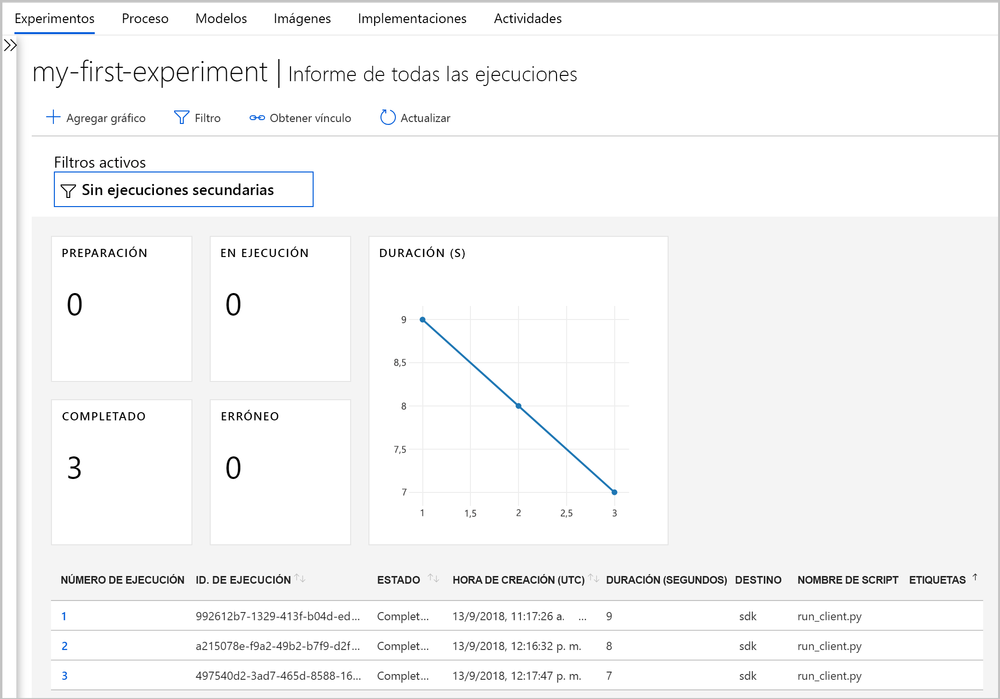

# <a name="what-happened-to-azure-machine-learning-workbench"></a>¿Qué ha ocurrido con Azure Machine Learning Workbench?

La aplicación Azure Machine Learning Workbench y algunas otras de las características iniciales han quedado en desuso y se han reemplazado en la versión de **septiembre de 2018** para dar paso a una [arquitectura](concept-azure-machine-learning-architecture.md) mejorada.

Para mejorar la experiencia, la versión contiene muchas actualizaciones importantes solicitadas por los comentarios de los clientes. La funcionalidad básica de ejecuciones de experimento hasta la implementación de modelos no ha cambiado, pero ahora puede usar el sólido<a href="https://docs.microsoft.com/python/api/overview/azure/ml/intro?view=azure-ml-py" target="_blank">SDK de Python</a>, el SDK de R y la [CLI de Azure](reference-azure-machine-learning-cli.md) para realizar sus tareas y canalizaciones de aprendizaje automático.

La mayoría de los artefactos creados en la versión anterior de Azure Machine Learning se almacenan en su propio almacenamiento local o en la nube. Estos artefactos nunca desaparecerán.

En este artículo obtendrá información sobre qué ha cambiado y cómo ello afecta al trabajo previamente existente con Azure Machine Learning Workbench y sus API.

>[!Warning]
>Este artículo no es para usuarios de Azure Machine Learning Studio. Es para clientes de Azure Machine Learning que tengan instalada la aplicación Workbench (versión preliminar) o dispongan de cuentas de la versión preliminar de experimentación o administración de modelos.


## <a name="what-changed"></a>¿Qué ha cambiado?

La versión más reciente de Azure Machine Learning incluye las características siguientes:
+ Un [modelo simplificado de los recursos de Azure](concept-azure-machine-learning-architecture.md).
+ Una [nueva interfaz de usuario del portal](how-to-track-experiments.md) para administrar sus experimentos y destinos de proceso.
+ Un <a href="https://docs.microsoft.com/python/api/overview/azure/ml/intro?view=azure-ml-py" target="_blank">SDK</a> nuevo y más completo de Python.
+ La nueva [extensión de la CLI de Azure](reference-azure-machine-learning-cli.md) expandida para el aprendizaje automático.

La [arquitectura](concept-azure-machine-learning-architecture.md) se rediseñó para facilitar el uso. En lugar de varias cuentas y recursos de Azure, solo necesita un [área de trabajo de Azure Machine Learning](concept-workspace.md). Puede crear áreas de trabajo rápidamente en [Azure Portal](how-to-manage-workspace.md). Al usar un área de trabajo, varios usuarios pueden almacenar destinos de proceso de entrenamiento e implementación, experimentos de modelos, imágenes de Docker, modelos implementados, etc.

Aunque hay nuevos clientes mejorados de CLI y SDK en la versión actual, se ha retirado la propia aplicación de escritorio Workbench. Los experimentos se pueden administrar en el [panel del área de trabajo de Azure Machine Learning Studio](how-to-track-experiments.md#view-the-experiment-in-the-web-portal). Use el panel para obtener el historial de experimentos, administrar los destinos de proceso asociados al área de trabajo, administrar los modelos e imágenes de Docker e incluso implementar servicios web.

<a name="timeline"></a>

## <a name="support-timeline"></a>Escala de tiempo del soporte técnico

El 9 de enero de 2019 finalizó la compatibilidad con las cuentas de Machine Learning Workbench, Experimentación de Azure Machine Learning y Administración de modelos, y con sus SDK y CLI asociados.

Todas las funcionalidades más recientes están disponibles si se usa el <a href="https://docs.microsoft.com/python/api/overview/azure/ml/intro?view=azure-ml-py" target="_blank">SDK</a>, la [CLI](reference-azure-machine-learning-cli.md) y el [portal](how-to-manage-workspace.md).

## <a name="what-about-run-histories"></a>¿Qué sucede con los historiales de ejecución?

Los historiales de ejecución anteriores ya no son accesibles, ¿cómo puede aún ver las ejecuciones en la última versión?

Los historiales de ejecución ahora se denominan **experimentos**. Puede recopilar los experimentos de su modelo y explorarlos mediante el SDK, la CLI o Azure Machine Learning Studio.

El panel del área de trabajo del portal solo es compatible con los exploradores Microsoft Edge, Chrome y Firefox:

[](./media/overview-what-happened-to-workbench/image001.png#lightbox)

Empiece a entrenar los modelos y a seguir los historiales de ejecución con la nueva CLI y el SDK. Para saber cómo, use el [Tutorial: Entrenamiento de modelos con Azure Machine Learning](tutorial-train-models-with-aml.md).

## <a name="will-projects-persist"></a>¿Se conservarán los proyectos?

No perderá ningún código ni trabajo. En la versión anterior, los proyectos son entidades en la nube con un directorio local. En la versión más reciente, los directorios locales se asocian al área de trabajo de Azure Machine Learning mediante un archivo de configuración local. Consulte un [diagrama de la arquitectura más reciente](concept-azure-machine-learning-architecture.md).

Gran parte del contenido del proyecto ya estaba en la máquina local, por lo tanto, solo necesita crear un archivo de configuración en ese directorio y hacer referencia a él en el código para conectarse al área de trabajo. Para continuar usando el directorio local que contiene los archivos y scripts, especifique el nombre del directorio en el comando de Python ["experiment.submit"](https://docs.microsoft.com/python/api/azureml-core/azureml.core.experiment.experiment?view=azure-ml-py) o con el comando de la CLI `az ml project attach`.  Por ejemplo:
```python
run = exp.submit(source_directory=script_folder,
                 script='train.py', run_config=run_config_system_managed)
```

[Cree un área de trabajo](how-to-manage-workspace.md) para empezar a trabajar.

## <a name="what-about-my-registered-models-and-images"></a>¿Qué sucede con mis imágenes y modelos registrados?

Debe migrar los modelos que ha registrado en el registro del modelo antiguo a la nueva área de trabajo si quiere seguir usándolos. Para migrar los modelos, descárguelos y vuelva a registrarlos en el área de trabajo nueva.

Las imágenes que ha creado en el antiguo registro de imágenes no se pueden migrar directamente al área de trabajo nueva. En la mayoría de los casos, el modelo puede implementarse sin tener que crear una imagen. Si es necesario, puede crear una imagen para el modelo en el área de trabajo nueva. Para más información, consulte [Administración, registro, implementación y supervisión de modelos de Machine Learning](concept-model-management-and-deployment.md).

## <a name="what-about-deployed-web-services"></a>¿Qué sucede con los servicios web implementados?

Ahora que ha terminado la compatibilidad con la anterior CLI, no puede ya volver a implementar los modelos ni administrar los servicios web que implementó originalmente con la cuenta de Administración de modelos. Sin embargo, dichos servicios web seguirán funcionando siempre y cuando todavía se admita Azure Container Service (ACS).

En la versión más reciente, los modelos se implementan como servicios web para clústeres de Azure Container Instances (ACI) o Azure Kubernetes Service (AKS). También puede implementar en FPGA y en Azure IoT Edge.

Para más información, consulte estos artículos:
+ [Dónde y cómo implementar modelos](how-to-deploy-and-where.md)
+ [Tutorial: Implementación de modelos con Azure Machine Learning](tutorial-deploy-models-with-aml.md)

## <a name="next-steps"></a>Pasos siguientes

Aprenda sobre la [arquitectura más reciente de Azure Machine Learning](concept-azure-machine-learning-architecture.md).

Para información general sobre el servicio, lea [¿Qué es Azure Machine Learning?](overview-what-is-azure-ml.md).

Cree el primer experimento con el método que prefiera:
  + [Uso de cuadernos de Python](tutorial-1st-experiment-sdk-setup.md)
  + [Uso de R Markdown](tutorial-1st-r-experiment.md) 
  + [Uso de Aprendizaje automático automatizado](tutorial-designer-automobile-price-train-score.md) 
  + [Usar las funciones arrastrar y colocar del diseñador](tutorial-first-experiment-automated-ml.md) 
  + [Uso de la extensión ML en la CLI](tutorial-train-deploy-model-cli.md)
